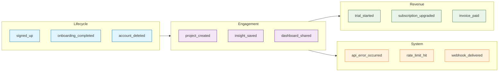
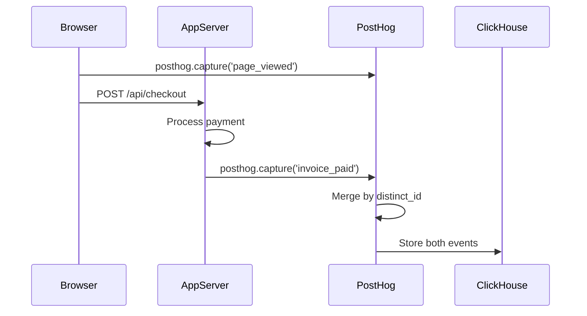
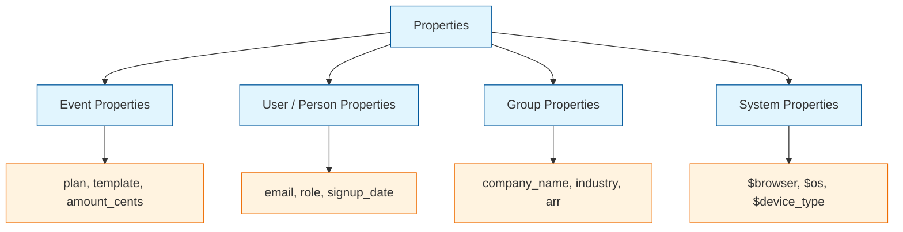
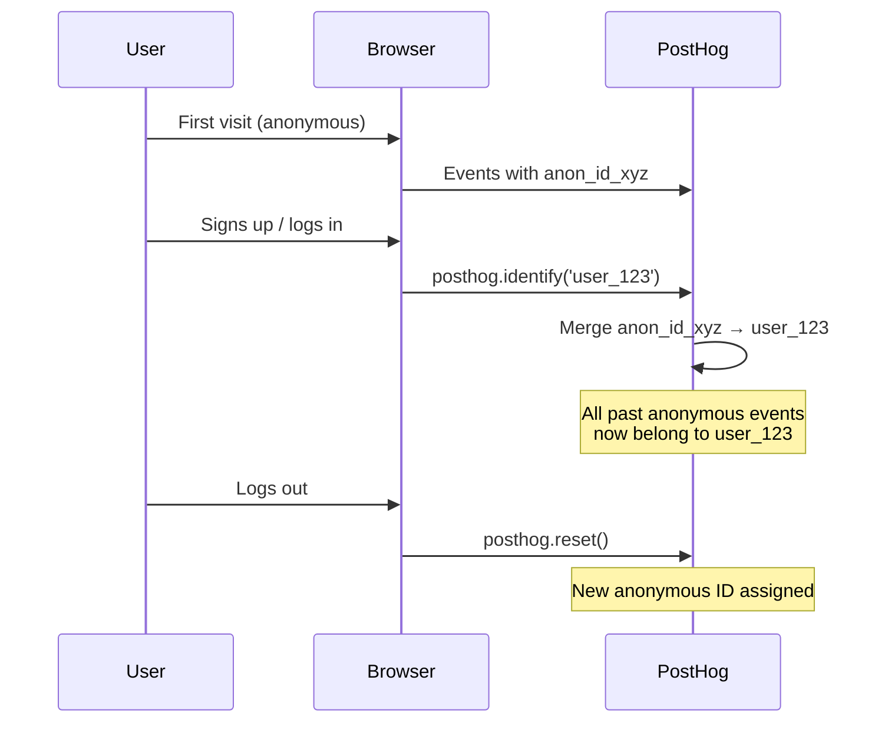

# Chapter 2: Event Tracking & Properties

Welcome to **Chapter 2: Event Tracking & Properties**. In this part of **PostHog Tutorial: Open Source Product Analytics Platform**, you will build an intuitive mental model first, then move into concrete implementation details and practical production tradeoffs.


In [Chapter 1](01-getting-started.md), you set up PostHog, sent your first event, and identified a user. Now it is time to build a production-quality event tracking layer. Good event design is the foundation of every insight, funnel, and experiment you will create later. A sloppy taxonomy leads to broken dashboards and misleading metrics; a clean one compounds value over time.

This chapter covers naming conventions, property design, autocapture, group analytics, and server-side tracking so you can instrument any surface -- web, mobile, or backend -- with confidence.

## What You Will Learn

- Design an event taxonomy that scales across teams
- Capture events from the browser, from a Node.js server, and from Python
- Use autocapture wisely and know when to turn it off
- Attach rich properties without leaking PII
- Validate events in real time with the Live Events view

## Event Taxonomy Design

A taxonomy is the shared language your team uses to describe user behavior. Before you write a single `posthog.capture()` call, agree on the rules.

### Naming Conventions

| Rule | Good | Bad |
|------|------|-----|
| Use past-tense verbs | `signed_up` | `signup`, `SignUp` |
| snake_case everywhere | `project_created` | `projectCreated` |
| Object-action pattern | `invoice_paid` | `paid` |
| Avoid generic names | `feature_flag_evaluated` | `event` |
| Prefix platform events | `ios_notification_opened` | `notification_opened` |

### Taxonomy Categories

Organize events into logical groups so dashboards remain readable as the product grows.



### Maintaining a Tracking Plan

A tracking plan is a living spreadsheet (or YAML file) that documents every event, its properties, expected types, and the team that owns it.

| Event | Category | Properties | Owner |
|-------|----------|-----------|-------|
| `signed_up` | Lifecycle | `method`, `referrer`, `plan` | Growth |
| `project_created` | Engagement | `template`, `team_size` | Product |
| `subscription_upgraded` | Revenue | `old_plan`, `new_plan`, `mrr_delta` | Billing |
| `api_error_occurred` | System | `status_code`, `endpoint`, `message` | Platform |

## Client-Side Event Tracking

### JavaScript / TypeScript (posthog-js)

The browser SDK is the most common integration. After initialization (covered in Chapter 1), capturing events is straightforward.

```typescript
import posthog from 'posthog-js'

// ---- Basic capture ----
posthog.capture('project_created', {
  template: 'blank',
  team_size: 4,
  source: 'onboarding_wizard'
})

// ---- Timed events ----
// Start a timer
const start = performance.now()

// ... user completes a flow ...

posthog.capture('onboarding_completed', {
  duration_ms: Math.round(performance.now() - start),
  steps_completed: 5
})

// ---- Capture with a timestamp override ----
posthog.capture('invoice_paid', {
  amount_cents: 9900,
  currency: 'USD',
  $timestamp: '2025-06-15T14:30:00Z'   // backfill historical event
})
```

### React Integration

For React applications, wrap PostHog in a provider so every component can track events cleanly.

```tsx
// posthog-provider.tsx
import { PostHogProvider } from 'posthog-js/react'
import posthog from 'posthog-js'

posthog.init(process.env.NEXT_PUBLIC_POSTHOG_KEY!, {
  api_host: process.env.NEXT_PUBLIC_POSTHOG_HOST,
  capture_pageview: false  // we handle this in the router
})

export function PHProvider({ children }: { children: React.ReactNode }) {
  return <PostHogProvider client={posthog}>{children}</PostHogProvider>
}

// usage in a component
import { usePostHog } from 'posthog-js/react'

function PricingCard({ plan }: { plan: string }) {
  const posthog = usePostHog()

  const handleSelect = () => {
    posthog.capture('plan_selected', { plan, page: 'pricing' })
  }

  return <button onClick={handleSelect}>Choose {plan}</button>
}
```

## Server-Side Event Tracking

Client-side tracking misses backend actions such as payment webhooks, cron jobs, and API-only flows. Server-side SDKs fill the gap.

### Data Flow: Client vs. Server



### Node.js / TypeScript

```typescript
import { PostHog } from 'posthog-node'

const client = new PostHog('YOUR_API_KEY', {
  host: 'https://app.posthog.com',
  flushAt: 20,       // send batch after 20 events
  flushInterval: 10000  // or every 10 seconds
})

// Capture a server-side event
client.capture({
  distinctId: 'user_123',
  event: 'invoice_paid',
  properties: {
    amount_cents: 9900,
    currency: 'USD',
    payment_method: 'stripe',
    invoice_id: 'inv_abc123'
  }
})

// Identify a user (merge properties)
client.identify({
  distinctId: 'user_123',
  properties: {
    plan: 'growth',
    company: 'Acme Inc',
    employee_count: 50
  }
})

// IMPORTANT: flush before process exits
await client.shutdown()
```

### Python

```python
from posthog import Posthog

posthog = Posthog(
    api_key='YOUR_API_KEY',
    host='https://app.posthog.com'
)

# Capture event
posthog.capture(
    distinct_id='user_456',
    event='subscription_upgraded',
    properties={
        'old_plan': 'free',
        'new_plan': 'growth',
        'mrr_delta': 49.00,
        'upgrade_source': 'in_app_prompt'
    }
)

# Identify user
posthog.identify(
    distinct_id='user_456',
    properties={
        'email': 'bob@example.com',
        'role': 'admin',
        'company_size': 'mid_market'
    }
)

# Flush before shutdown (e.g., in a Django signal)
posthog.flush()
```

## Autocapture

Autocapture automatically records clicks, form submissions, and page views without manual instrumentation. It is a quick win for early-stage products but can create noise at scale.

### Enabling and Configuring Autocapture

```typescript
posthog.init('YOUR_API_KEY', {
  api_host: 'https://app.posthog.com',
  autocapture: true,  // default is true
  capture_pageview: true,
  capture_pageleave: true
})
```

### When to Use Autocapture vs. Custom Events

| Scenario | Autocapture | Custom Event |
|----------|:-----------:|:------------:|
| Early exploration / discovery | Yes | -- |
| Key business metrics (signup, purchase) | -- | Yes |
| Form submissions with context | -- | Yes |
| Click heatmaps | Yes | -- |
| Backend-only actions | -- | Yes |
| High-traffic pages where noise is a concern | -- | Yes |

### Filtering Autocapture

You can exclude elements or pages to reduce noise.

```typescript
posthog.init('YOUR_API_KEY', {
  api_host: 'https://app.posthog.com',
  autocapture: {
    dom_event_allowlist: ['click', 'submit'],  // ignore change events
    url_allowlist: ['/app/.*'],                // only capture in /app
    element_allowlist: ['a', 'button', 'form'] // ignore div clicks
  }
})
```

You can also add HTML attributes to suppress capture on sensitive elements:

```html
<input type="password" data-ph-no-capture />
<div class="admin-panel" data-ph-no-capture>
  <!-- nothing inside will be autocaptured -->
</div>
```

## Properties: Best Practices

Properties turn raw events into actionable data. Poorly designed properties lead to broken filters and misleading breakdowns.

### Property Types



### Property Naming Rules

| Rule | Example | Why |
|------|---------|-----|
| snake_case | `payment_method` | Consistency across SDKs |
| Prefix booleans with `is_` or `has_` | `is_trial`, `has_invited_team` | Clarity in filters |
| Use `_cents` for money | `amount_cents: 4999` | Avoid floating-point issues |
| Avoid high-cardinality strings | `plan: 'growth'` not `plan: 'Growth Plan ($49/mo)'` | Keeps breakdowns clean |
| Bucket numeric ranges | `team_size_bucket: '11-50'` | Better for cohort analysis |

### Setting Person Properties

```typescript
// Set properties (overwrites existing)
posthog.identify('user_123', {
  plan: 'growth',
  signup_date: '2025-01-15',
  role: 'admin'
})

// Set-once properties (never overwritten)
posthog.people.set_once({
  first_seen_url: window.location.href,
  original_referrer: document.referrer
})

// Increment numeric properties
posthog.people.increment('login_count', 1)
```

## Group Analytics

Groups let you tie events to entities beyond individual users, such as companies, teams, or workspaces. This is essential for B2B analytics.

```typescript
// Associate user with a group
posthog.group('company', 'company_abc', {
  name: 'Acme Inc',
  industry: 'SaaS',
  employee_count: 120,
  plan: 'enterprise'
})

// Events automatically inherit the active group
posthog.capture('report_exported', {
  format: 'csv',
  rows: 5000
})
// This event is linked to both user_123 AND company_abc
```

```python
# Python server-side group analytics
posthog.group_identify(
    group_type='company',
    group_key='company_abc',
    properties={
        'name': 'Acme Inc',
        'arr': 120000,
        'plan': 'enterprise'
    }
)

posthog.capture(
    distinct_id='user_123',
    event='report_exported',
    properties={'format': 'csv'},
    groups={'company': 'company_abc'}
)
```

## Distinct ID Management

Getting distinct IDs right is critical. A mismanaged ID space breaks funnels, inflates user counts, and corrupts cohort analysis.

### Identity Resolution Flow



### Common ID Pitfalls

| Problem | Cause | Fix |
|---------|-------|-----|
| Inflated user count | Not calling `identify` after login | Always identify on auth |
| Merged wrong users | Shared device without `reset` | Call `reset()` on logout |
| Server events orphaned | Different distinct_id format | Use same ID space everywhere |
| Lost pre-login data | Not using alias | Use `posthog.alias()` before identify |

```typescript
// Login flow
async function handleLogin(email: string, password: string) {
  const user = await api.login(email, password)

  // Identify merges anonymous and known IDs
  posthog.identify(user.id, {
    email: user.email,
    plan: user.plan
  })

  posthog.capture('logged_in', { method: 'email' })
}

// Logout flow
function handleLogout() {
  posthog.capture('logged_out')
  posthog.reset()  // generates a new anonymous ID
}
```

## Validating Your Implementation

Never ship tracking code without verifying it end to end.

### 1. Live Events View

The Live Events tab in PostHog shows every event as it arrives. Use it during development to confirm event names, properties, and distinct IDs.

### 2. Debug Mode

```typescript
// Enable debug mode in development
posthog.init('YOUR_API_KEY', {
  api_host: 'https://app.posthog.com',
  debug: true  // logs every capture call to the console
})
```

You can also append `?__posthog_debug=true` to any page URL to enable debug output in production without changing code.

### 3. Automated Validation

```typescript
// Simple test helper for event contracts
interface EventContract {
  event: string
  requiredProperties: string[]
}

const contracts: EventContract[] = [
  { event: 'signed_up', requiredProperties: ['method', 'plan'] },
  { event: 'project_created', requiredProperties: ['template', 'team_size'] },
  { event: 'invoice_paid', requiredProperties: ['amount_cents', 'currency'] }
]

function validateCapture(event: string, properties: Record<string, unknown>) {
  const contract = contracts.find(c => c.event === event)
  if (!contract) {
    console.warn(`[PostHog] Unknown event: ${event}`)
    return
  }
  for (const prop of contract.requiredProperties) {
    if (!(prop in properties)) {
      console.error(`[PostHog] Missing required property "${prop}" on event "${event}"`)
    }
  }
}

// Wrap posthog.capture in development
function trackedCapture(event: string, properties: Record<string, unknown>) {
  if (process.env.NODE_ENV === 'development') {
    validateCapture(event, properties)
  }
  posthog.capture(event, properties)
}
```

### 4. Unit Testing with a Mock

```typescript
// __mocks__/posthog-js.ts
const captured: Array<{ event: string; properties: Record<string, unknown> }> = []

const posthog = {
  init: jest.fn(),
  capture: jest.fn((event, properties) => {
    captured.push({ event, properties })
  }),
  identify: jest.fn(),
  reset: jest.fn(),
  _captured: captured  // expose for assertions
}

export default posthog

// In your test file
import posthog from 'posthog-js'
import { handleSignup } from './auth'

test('signup emits correct event', async () => {
  await handleSignup('alice@example.com', 'password123')

  expect(posthog.capture).toHaveBeenCalledWith('signed_up', {
    method: 'email',
    plan: 'free'
  })
  expect(posthog.identify).toHaveBeenCalled()
})
```

## Troubleshooting

| Symptom | Likely Cause | Solution |
|---------|-------------|----------|
| Events missing entirely | Ad-blocker or wrong API key | Use a reverse proxy; verify key |
| Events arrive but properties are null | Property not passed in `capture` call | Check the second argument to `capture` |
| Duplicate events | Multiple SDK instances | Ensure single initialization |
| Anonymous + identified events not merged | `identify` never called | Call `identify` after authentication |
| Server events not visible | SDK not flushed before process exit | Call `shutdown()` or `flush()` |
| Timestamps wrong | Server clock drift | Use NTP; pass explicit `$timestamp` |

## Performance Considerations

- **Batching**: Both `posthog-js` and `posthog-node` batch events automatically. Adjust `flushAt` and `flushInterval` for your traffic profile.
- **Payload size**: Keep properties under 1 KB per event. Avoid attaching full request/response bodies.
- **Sampling**: For extremely high-traffic events (e.g., scroll tracking), sample client-side before sending.
- **Async loading**: Load `posthog-js` asynchronously so it never blocks the critical rendering path.

```typescript
// Sampling example: only track 10% of scroll events
window.addEventListener('scroll', () => {
  if (Math.random() < 0.1) {
    posthog.capture('page_scrolled', {
      depth_percent: Math.round(
        (window.scrollY / document.body.scrollHeight) * 100
      )
    })
  }
})
```

## Security and Privacy

- **Never send PII in event names**: Event names are visible in many reports. Keep them descriptive but generic.
- **Mask sensitive properties**: Use `property_denylist` to block fields like `ssn` or `credit_card`.
- **Respect Do Not Track**: Enable `respect_dnt: true` in the SDK config.
- **Data residency**: Choose US or EU hosting to comply with GDPR / CCPA requirements.

```typescript
posthog.init('YOUR_API_KEY', {
  api_host: 'https://app.posthog.com',
  property_denylist: ['password', 'ssn', 'credit_card_number'],
  respect_dnt: true,
  ip: false,               // do not store IP addresses
  sanitize_properties: (properties, event) => {
    // Remove any property that looks like an email
    for (const key in properties) {
      if (typeof properties[key] === 'string' && properties[key].includes('@')) {
        delete properties[key]
      }
    }
    return properties
  }
})
```

## Summary

Event tracking is the backbone of product analytics. A well-designed taxonomy, consistent naming, and careful property management will pay dividends across every feature PostHog offers -- funnels, experiments, session recordings, and dashboards.

## Key Takeaways

1. **Design your taxonomy first** -- agree on naming conventions, categories, and a tracking plan before writing code.
2. **Use both client-side and server-side SDKs** -- browser events capture UI interactions; server events capture backend actions like payments and webhooks.
3. **Manage distinct IDs carefully** -- call `identify` on login, `reset` on logout, and use the same ID space across surfaces.
4. **Autocapture is a starting point, not a strategy** -- augment it with custom events for every metric that matters.
5. **Validate continuously** -- use Live Events, debug mode, and automated tests to catch tracking regressions before they corrupt your data.

## Next Steps

With a solid event tracking foundation in place, you are ready to analyze user behavior at scale. In [Chapter 3: User Analytics & Funnels](03-user-analytics.md), we will build conversion funnels, retention tables, and user journey maps to turn raw events into product insights.

---

*Built with insights from the [PostHog](https://github.com/PostHog/posthog) project.*

## What Problem Does This Solve?

Most teams struggle here because the hard part is not writing more code, but deciding clear boundaries for `posthog`, `event`, `properties` so behavior stays predictable as complexity grows.

In practical terms, this chapter helps you avoid three common failures:

- coupling core logic too tightly to one implementation path
- missing the handoff boundaries between setup, execution, and validation
- shipping changes without clear rollback or observability strategy

After working through this chapter, you should be able to reason about `Chapter 2: Event Tracking & Properties` as an operating subsystem inside **PostHog Tutorial: Open Source Product Analytics Platform**, with explicit contracts for inputs, state transitions, and outputs.

Use the implementation notes around `capture`, `PostHog`, `plan` as your checklist when adapting these patterns to your own repository.

## How it Works Under the Hood

Under the hood, `Chapter 2: Event Tracking & Properties` usually follows a repeatable control path:

1. **Context bootstrap**: initialize runtime config and prerequisites for `posthog`.
2. **Input normalization**: shape incoming data so `event` receives stable contracts.
3. **Core execution**: run the main logic branch and propagate intermediate state through `properties`.
4. **Policy and safety checks**: enforce limits, auth scopes, and failure boundaries.
5. **Output composition**: return canonical result payloads for downstream consumers.
6. **Operational telemetry**: emit logs/metrics needed for debugging and performance tuning.

When debugging, walk this sequence in order and confirm each stage has explicit success/failure conditions.

## Source Walkthrough

Use the following upstream sources to verify implementation details while reading this chapter:

- [View Repo](https://github.com/PostHog/posthog)
  Why it matters: authoritative reference on `View Repo` (github.com).

Suggested trace strategy:
- search upstream code for `posthog` and `event` to map concrete implementation paths
- compare docs claims against actual runtime/config code before reusing patterns in production

## Chapter Connections

- [Tutorial Index](index.md)
- [Previous Chapter: Chapter 1: Getting Started with PostHog](01-getting-started.md)
- [Next Chapter: Chapter 3: User Analytics & Funnels](03-user-analytics.md)
- [Main Catalog](../../README.md#-tutorial-catalog)
- [A-Z Tutorial Directory](../../discoverability/tutorial-directory.md)
