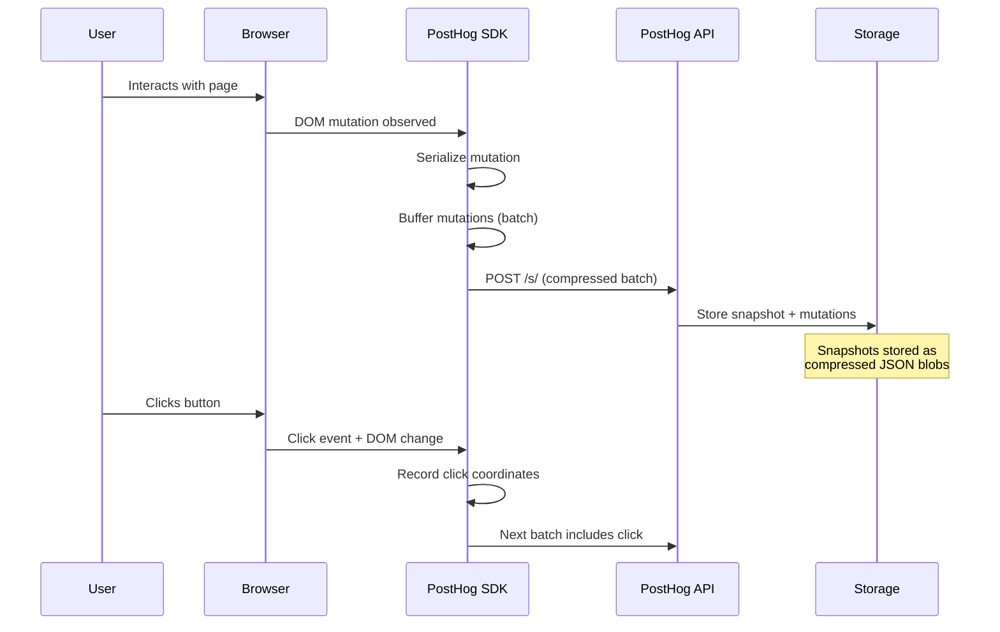
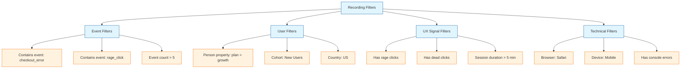
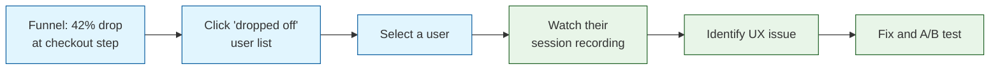
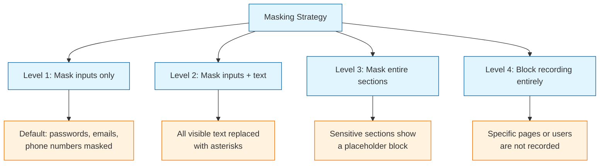

# Chapter 4: Session Recordings

Welcome to **Chapter 4: Session Recordings**. In this part of **PostHog Tutorial: Open Source Product Analytics Platform**, you will build an intuitive mental model first, then move into concrete implementation details and practical production tradeoffs.


In [Chapter 3](03-user-analytics.md), you built funnels, retention tables, and trend analyses to understand *what* users do. But quantitative data only tells half the story. When a funnel shows a 58% drop-off at the checkout step, the numbers alone cannot tell you *why* users abandoned. Session recordings bridge that gap.

PostHog's session recording feature captures a DOM-based replay of every user interaction -- clicks, scrolls, page navigations, console logs, and network requests -- so you can watch exactly what happened during a session. This chapter covers how to enable recordings, filter them effectively, connect them to your analytics insights, and handle the privacy considerations that come with watching real user behavior.

## What You Will Learn

- Enable and configure session recordings for web applications
- Filter recordings by events, user properties, and UX signals
- Connect recordings to funnels and error reports
- Mask sensitive content and comply with privacy regulations
- Optimize recording volume and storage costs

## How Session Recording Works

PostHog session recordings use a DOM-snapshotting approach rather than video capture. The SDK serializes the page structure and records incremental mutations, producing a compact representation that can be replayed in the PostHog UI.



### What Gets Recorded

| Data Type | Included by Default | Configurable |
|-----------|:-------------------:|:------------:|
| DOM structure and mutations | Yes | -- |
| Mouse movements and clicks | Yes | Can disable |
| Scroll position | Yes | -- |
| Input values (text fields) | Masked | Masking level |
| Console logs | No | Opt-in |
| Network requests | No | Opt-in |
| Page navigations | Yes | -- |
| Window resize | Yes | -- |
| CSS changes | Yes | -- |

## Enabling Session Recordings

### Basic Setup (JavaScript / TypeScript)

```typescript
import posthog from 'posthog-js'

posthog.init('YOUR_API_KEY', {
  api_host: 'https://app.posthog.com',

  // Session recording configuration
  disable_session_recording: false,       // enable recordings (default: false)
  session_recording: {
    maskAllInputs: true,                  // mask all input values
    maskInputOptions: {
      password: true,                     // always mask passwords
      color: false,
      date: false,
      email: true,                        // mask email inputs
      tel: true,                          // mask phone inputs
    },
    blockClass: 'ph-no-capture',          // CSS class to block elements
    blockSelector: '[data-ph-no-capture]', // selector to block elements
    maskTextClass: 'ph-mask',             // CSS class to mask text
    maskTextSelector: '[data-ph-mask]',   // selector to mask text
  },

  // Optional: capture console logs in recordings
  enable_recording_console_log: true,

  // Optional: capture network requests
  capture_performance: true,
})
```

### React Integration

```tsx
// app/providers.tsx
'use client'

import posthog from 'posthog-js'
import { PostHogProvider } from 'posthog-js/react'
import { useEffect } from 'react'

export function PHProvider({ children }: { children: React.ReactNode }) {
  useEffect(() => {
    posthog.init(process.env.NEXT_PUBLIC_POSTHOG_KEY!, {
      api_host: process.env.NEXT_PUBLIC_POSTHOG_HOST,
      disable_session_recording: false,
      session_recording: {
        maskAllInputs: true,
        maskTextSelector: '.sensitive-text',
      },
      enable_recording_console_log: true,
    })
  }, [])

  return <PostHogProvider client={posthog}>{children}</PostHogProvider>
}
```

### Conditional Recording

You may not want to record every session. Control recording programmatically:

```typescript
// Start recording only for specific users
posthog.init('YOUR_API_KEY', {
  api_host: 'https://app.posthog.com',
  disable_session_recording: true,  // start disabled
})

// Enable after user opts in or meets criteria
function enableRecordingForUser(user: { plan: string; hasConsented: boolean }) {
  if (user.hasConsented && user.plan !== 'free') {
    posthog.startSessionRecording()
  }
}

// Stop recording at any time
function stopRecording() {
  posthog.stopSessionRecording()
}
```

```python
# Server-side: check if a user should be recorded
# This is useful for sampling or consent-based recording

from posthog import Posthog

posthog_client = Posthog(
    api_key='YOUR_API_KEY',
    host='https://app.posthog.com'
)

def should_record_session(user_id: str) -> bool:
    """Determine if a user's session should be recorded."""
    # Check feature flag for recording rollout
    return posthog_client.feature_enabled(
        key='enable-session-recording',
        distinct_id=user_id,
        default=False
    )

# In your API response, include the recording decision
def get_session_config(user_id: str) -> dict:
    return {
        'record_session': should_record_session(user_id),
        'mask_inputs': True,
        'capture_console': False,
    }
```

## Recording Filters and Search

With thousands of recordings, finding the right one is critical. PostHog provides powerful filtering.

### Filter Categories



### UX Signal Definitions

| Signal | Definition | What It Indicates |
|--------|-----------|-------------------|
| **Rage click** | 3+ rapid clicks on the same element | Frustration -- element not responding |
| **Dead click** | Click on a non-interactive element | Confusing UI -- user expected something clickable |
| **Mouse thrashing** | Rapid, erratic mouse movement | Confusion or frustration |
| **U-turn** | User navigates to a page and immediately goes back | Wrong destination or misleading link |
| **Error** | Console error or network 4xx/5xx | Technical issue affecting experience |

### Filtering Examples

In the PostHog Recordings tab:

1. **Find frustrated users**: Filter by "Has rage clicks" + Event "checkout_started"
2. **Find mobile issues**: Filter by Device type "Mobile" + "Has console errors"
3. **Find onboarding problems**: Filter by Cohort "New Users (last 7 days)" + Session duration > 3 min
4. **Find payment failures**: Filter by Event "payment_failed" + Person property "plan = growth"

## Connecting Recordings to Analytics

The real power of session recordings emerges when you connect them to your quantitative insights.

### From Funnel Drop-Offs to Recordings



When viewing a funnel insight:

1. Click on the drop-off between two steps
2. PostHog shows a list of users who did not convert
3. Click any user to open their person page
4. Navigate to their **Recordings** tab
5. Find the session that occurred around the time of the funnel event
6. Watch the recording, paying attention to the moments before they abandoned

### From Error Tracking to Recordings

```typescript
// Tag errors so they appear in recordings
window.addEventListener('error', (event) => {
  posthog.capture('$exception', {
    $exception_message: event.message,
    $exception_source: event.filename,
    $exception_lineno: event.lineno,
    severity: 'error'
  })
})

// Capture unhandled promise rejections
window.addEventListener('unhandledrejection', (event) => {
  posthog.capture('$exception', {
    $exception_message: event.reason?.message || String(event.reason),
    severity: 'error',
    type: 'unhandled_promise_rejection'
  })
})
```

Now when you filter recordings by the `$exception` event, you can watch exactly what the user was doing when the error occurred.

### Adding Custom Events to the Recording Timeline

Custom events appear as markers on the recording timeline, making it easy to jump to the important moments.

```typescript
// These events will appear in the recording timeline
posthog.capture('checkout_started', { cart_value: 149.99 })

// ... user fills out form ...

posthog.capture('payment_method_selected', { method: 'credit_card' })

// ... payment fails ...

posthog.capture('payment_failed', {
  error: 'card_declined',
  retry_count: 1
})
```

## Playlists and Collaboration

### Creating Recording Playlists

Playlists let you curate collections of recordings around a theme for team review.

1. Navigate to **Recordings** in the sidebar
2. Apply your filters (e.g., "rage clicks on pricing page")
3. Click **Save as playlist**
4. Name it (e.g., "Pricing Page Friction - Sprint 23")
5. Share the playlist link with your team

### Common Playlist Themes

| Playlist | Filters | Audience |
|----------|---------|----------|
| "Onboarding Friction" | New users + session > 5 min + rage clicks | Product team |
| "Checkout Failures" | Event: payment_failed | Engineering team |
| "Mobile UX Issues" | Device: Mobile + dead clicks | Design team |
| "Power User Journeys" | Plan: enterprise + session > 10 min | Product strategy |
| "Support Ticket Context" | Specific user IDs from support queue | Support team |

### Annotating Recordings

While watching a recording, you can:

- **Add comments** at specific timestamps to flag issues
- **Create a notebook entry** linking the recording to a hypothesis
- **Tag recordings** for later reference (e.g., "confirmed-bug", "ux-improvement")

## Privacy and Compliance

Session recordings capture user behavior in detail, so privacy must be a first-class concern.

### Data Masking Levels



### Implementing Masking in Code

```html
<!-- Mask all text inside this div -->
<div class="ph-mask">
  <p>User's private message content appears here</p>
</div>

<!-- Block this entire element from recording -->
<div data-ph-no-capture>
  <iframe src="https://payment-provider.com/form"></iframe>
</div>

<!-- Mask specific inputs -->
<input type="text" name="ssn" data-ph-no-capture />
<input type="text" name="credit-card" class="ph-no-capture" />
```

```typescript
// Programmatic masking configuration
posthog.init('YOUR_API_KEY', {
  api_host: 'https://app.posthog.com',
  session_recording: {
    // Mask all text by default (most restrictive)
    maskTextSelector: '*',

    // But allow specific elements to be visible
    unmaskTextSelector: '.ph-visible',

    // Block entire elements from the DOM snapshot
    blockSelector: '.payment-form, .medical-records, [data-sensitive]',

    // Mask all inputs
    maskAllInputs: true,

    // Custom masking function
    maskInputFn: (text, element) => {
      // Show first/last character, mask the rest
      if (text.length <= 2) return '**'
      return text[0] + '*'.repeat(text.length - 2) + text[text.length - 1]
    }
  }
})
```

### Consent Management

```typescript
// Integration with a consent management platform
import posthog from 'posthog-js'

function initializeWithConsent() {
  posthog.init('YOUR_API_KEY', {
    api_host: 'https://app.posthog.com',
    disable_session_recording: true,  // start with recording disabled
    opt_out_capturing_by_default: true,
  })
}

// When user gives consent
function onConsentGranted(categories: string[]) {
  if (categories.includes('analytics')) {
    posthog.opt_in_capturing()
  }
  if (categories.includes('session_recording')) {
    posthog.startSessionRecording()
  }
}

// When user revokes consent
function onConsentRevoked() {
  posthog.stopSessionRecording()
  posthog.opt_out_capturing()
}
```

### Privacy Compliance Checklist

| Requirement | Implementation |
|-------------|---------------|
| GDPR consent | Collect explicit consent before recording |
| Right to deletion | Use PostHog's data deletion API |
| Data minimization | Mask all PII; only record what you need |
| Privacy policy | Document session recording in your privacy policy |
| Data residency | Choose EU or US hosting region |
| Retention limits | Set recording retention to 30-90 days |
| Employee access | Limit who can view recordings via RBAC |

## Performance and Cost Optimization

### Sampling Strategies

Recording every session generates significant data volume. Use sampling to control costs.

```typescript
posthog.init('YOUR_API_KEY', {
  api_host: 'https://app.posthog.com',
  session_recording: {
    // Record only 20% of sessions
    sampleRate: 0.2,

    // But always record sessions with errors
    // (handled via feature flags or conditional start)
  }
})

// Alternative: conditional recording based on user segment
posthog.init('YOUR_API_KEY', {
  api_host: 'https://app.posthog.com',
  disable_session_recording: true,
})

// Record 100% of paying users, 10% of free users
const user = await getCurrentUser()
if (user.plan !== 'free' || Math.random() < 0.1) {
  posthog.startSessionRecording()
}
```

### Reducing Payload Size

| Technique | Impact | How |
|-----------|--------|-----|
| Disable console log capture | 10-30% smaller payloads | `enable_recording_console_log: false` |
| Disable network capture | 5-15% smaller payloads | `capture_performance: false` |
| Block heavy DOM sections | Variable | `blockSelector` on animations, canvases |
| Limit session duration | Controls max file size | Stop recording after N minutes |

### Storage Cost Estimation

| Metric | Typical Value |
|--------|--------------|
| Average recording size | 2-5 MB per session |
| 10,000 sessions/day at 20% sampling | ~2,000 recordings/day |
| Daily storage (at 3 MB avg) | ~6 GB/day |
| Monthly storage (30 days retention) | ~180 GB |

## Troubleshooting

| Problem | Cause | Solution |
|---------|-------|----------|
| No recordings appear | Recording disabled in init config | Set `disable_session_recording: false` |
| Recordings are blank | CSP blocking PostHog's recording script | Add PostHog domains to your CSP |
| Events missing from timeline | Events fired before recording started | Initialize PostHog before other scripts |
| Input values visible (should be masked) | Masking not configured | Add `maskAllInputs: true` |
| Recording playback stutters | Very long session or heavy DOM | Increase browser memory; shorten sessions |
| Cross-origin iframes not captured | Browser security prevents access | Use `blockSelector` for third-party iframes |
| High bandwidth usage | Too many recordings or large DOM | Enable sampling; block heavy elements |
| Recordings cut off early | Session timeout or page navigation | Check `session_idle_timeout_ms` setting |

## Summary

Session recordings provide the qualitative complement to your quantitative analytics. They let you see exactly what users experience -- the confusion, the frustration, the delight -- in a way that numbers alone cannot convey. When combined with funnels, retention analysis, and error tracking, recordings complete the picture and give you the confidence to ship improvements.

## Key Takeaways

1. **Recordings answer "why"** -- use them after quantitative analysis reveals a problem to understand the root cause.
2. **Filter aggressively** -- with thousands of recordings, UX signals like rage clicks and dead clicks help you find the sessions that matter.
3. **Connect recordings to funnels** -- click on funnel drop-offs to watch the sessions of users who did not convert.
4. **Privacy is non-negotiable** -- mask PII, obtain consent, and set retention policies before enabling recordings in production.
5. **Sample to control costs** -- record 100% of paying users and a fraction of free users to balance insight quality with storage costs.

## Next Steps

Now that you can observe user behavior qualitatively, you are ready to act on your insights with controlled experiments. In [Chapter 5: Feature Flags & Experiments](05-feature-flags.md), you will learn how to roll out changes safely with feature flags and measure their impact with statistically rigorous A/B tests.

---

*Built with insights from the [PostHog](https://github.com/PostHog/posthog) project.*

## What Problem Does This Solve?

Most teams struggle here because the hard part is not writing more code, but deciding clear boundaries for `posthog`, `text`, `user` so behavior stays predictable as complexity grows.

In practical terms, this chapter helps you avoid three common failures:

- coupling core logic too tightly to one implementation path
- missing the handoff boundaries between setup, execution, and validation
- shipping changes without clear rollback or observability strategy

After working through this chapter, you should be able to reason about `Chapter 4: Session Recordings` as an operating subsystem inside **PostHog Tutorial: Open Source Product Analytics Platform**, with explicit contracts for inputs, state transitions, and outputs.

Use the implementation notes around `recording`, `capture`, `Filters` as your checklist when adapting these patterns to your own repository.

## How it Works Under the Hood

Under the hood, `Chapter 4: Session Recordings` usually follows a repeatable control path:

1. **Context bootstrap**: initialize runtime config and prerequisites for `posthog`.
2. **Input normalization**: shape incoming data so `text` receives stable contracts.
3. **Core execution**: run the main logic branch and propagate intermediate state through `user`.
4. **Policy and safety checks**: enforce limits, auth scopes, and failure boundaries.
5. **Output composition**: return canonical result payloads for downstream consumers.
6. **Operational telemetry**: emit logs/metrics needed for debugging and performance tuning.

When debugging, walk this sequence in order and confirm each stage has explicit success/failure conditions.

## Source Walkthrough

Use the following upstream sources to verify implementation details while reading this chapter:

- [View Repo](https://github.com/PostHog/posthog)
  Why it matters: authoritative reference on `View Repo` (github.com).

Suggested trace strategy:
- search upstream code for `posthog` and `text` to map concrete implementation paths
- compare docs claims against actual runtime/config code before reusing patterns in production

## Chapter Connections

- [Tutorial Index](index.md)
- [Previous Chapter: Chapter 3: User Analytics & Funnels](03-user-analytics.md)
- [Next Chapter: Chapter 5: Feature Flags & Experiments](05-feature-flags.md)
- [Main Catalog](../../README.md#-tutorial-catalog)
- [A-Z Tutorial Directory](../../discoverability/tutorial-directory.md)
