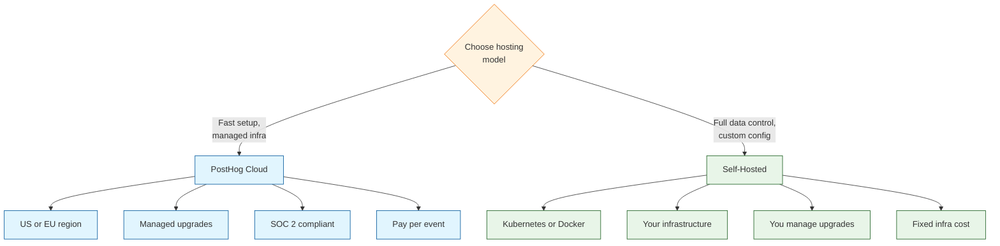
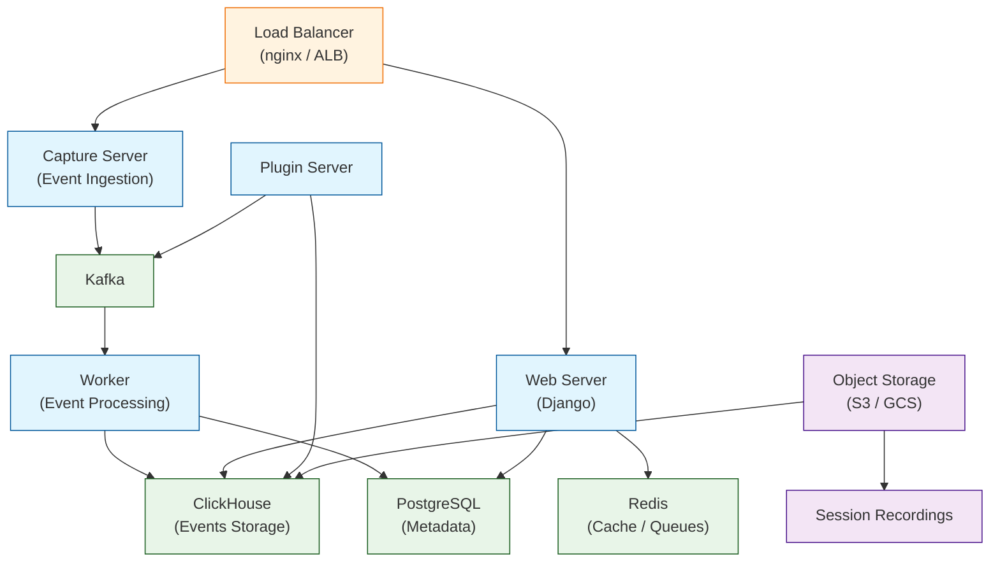
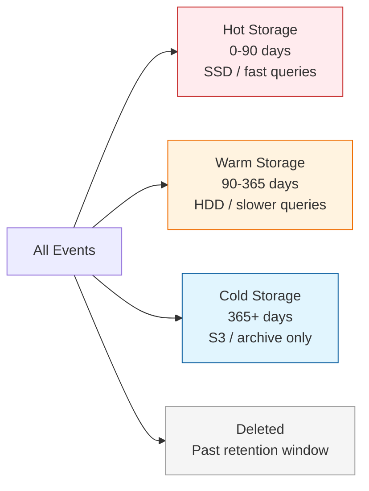
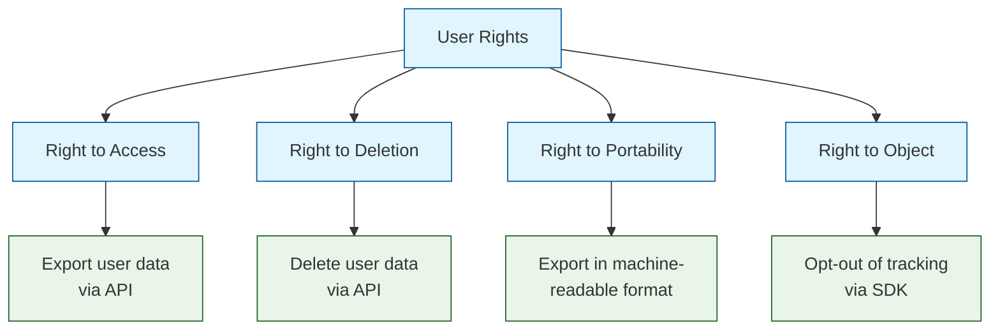
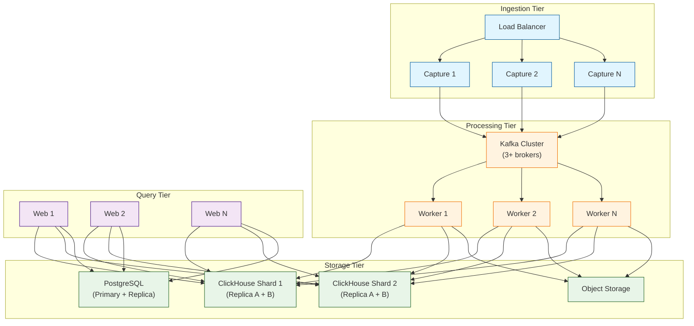

# Chapter 8: Production Deployment

Welcome to **Chapter 8: Production Deployment**. In this part of **PostHog Tutorial: Open Source Product Analytics Platform**, you will build an intuitive mental model first, then move into concrete implementation details and practical production tradeoffs.


Throughout this tutorial you built an analytics stack from the ground up: event tracking (Chapter 2), user analytics (Chapter 3), session recordings (Chapter 4), feature flags (Chapter 5), dashboards (Chapter 6), and advanced analytics (Chapter 7). All of that work is only as valuable as the infrastructure running it. A misconfigured deployment loses events, a breach exposes user data, and an unmonitored system fails silently.

This final chapter covers everything you need to run PostHog in production with confidence: choosing between cloud and self-hosted, hardening your ingestion pipeline, monitoring system health, managing costs, ensuring compliance, and planning for scale.

## What You Will Learn

- Choose the right hosting model for your organization
- Secure event ingestion and API access
- Monitor ingestion health, latency, and error rates
- Manage storage, retention, and costs
- Implement backup and disaster recovery plans
- Comply with GDPR, CCPA, and other privacy regulations
- Plan for traffic growth and scaling

## Hosting Models

### Cloud vs. Self-Hosted



| Factor | PostHog Cloud | Self-Hosted |
|--------|:------------:|:-----------:|
| Setup time | Minutes | Hours to days |
| Maintenance | Managed by PostHog | Your team |
| Data residency | US or EU | Any region |
| Upgrades | Automatic | Manual |
| Cost model | Per event | Infrastructure cost |
| SOC 2 / HIPAA | Available | Your responsibility |
| Customization | Limited | Full |
| Scale limit | Unlimited (pricing tiers) | Your infrastructure |
| Support | Included (paid plans) | Community + self-service |

### Self-Hosted Deployment Options

#### Docker Compose (Development / Small Teams)

```bash
# Clone the PostHog repository
git clone https://github.com/PostHog/posthog.git
cd posthog

# Start PostHog with Docker Compose
docker compose -f docker-compose.hobby.yml up -d

# Access PostHog at http://localhost:8000
# Complete the setup wizard in the browser
```

#### Kubernetes with Helm (Production)

```bash
# Add the PostHog Helm repository
helm repo add posthog https://posthog.github.io/charts-clickhouse/
helm repo update

# Create a values file for your deployment
cat > posthog-values.yaml << 'EOF'
cloud: aws  # or gcp, azure

ingress:
  enabled: true
  hostname: posthog.yourcompany.com
  tls:
    - secretName: posthog-tls
      hosts:
        - posthog.yourcompany.com

clickhouse:
  persistence:
    size: 200Gi
  resources:
    requests:
      memory: 8Gi
      cpu: 2
    limits:
      memory: 16Gi
      cpu: 4

kafka:
  persistence:
    size: 50Gi

postgresql:
  persistence:
    size: 20Gi

redis:
  master:
    persistence:
      size: 5Gi

web:
  replicaCount: 2
  resources:
    requests:
      memory: 1Gi
      cpu: 500m

worker:
  replicaCount: 2
  resources:
    requests:
      memory: 2Gi
      cpu: 1

plugins:
  replicaCount: 2
  resources:
    requests:
      memory: 1Gi
      cpu: 500m
EOF

# Install PostHog
helm install posthog posthog/posthog \
  --namespace posthog \
  --create-namespace \
  -f posthog-values.yaml
```

### Self-Hosted Architecture



## Securing Your Deployment

### Ingestion Security

Protect the event ingestion endpoint from abuse, data poisoning, and unauthorized access.

```typescript
// Reverse proxy configuration for PostHog ingestion
// This hides PostHog from ad-blockers and adds security headers

// Next.js rewrites (next.config.js)
const nextConfig = {
  async rewrites() {
    return [
      {
        source: '/ingest/:path*',
        destination: 'https://app.posthog.com/:path*'
      }
    ]
  }
}

// Then initialize PostHog with your proxy
import posthog from 'posthog-js'

posthog.init('YOUR_API_KEY', {
  api_host: '/ingest',  // uses your domain, bypasses ad-blockers
  ui_host: 'https://app.posthog.com'  // keep UI links working
})
```

```python
# Django middleware for server-side proxy to PostHog
import httpx
from django.http import HttpResponse, HttpResponseNotAllowed

POSTHOG_HOST = 'https://app.posthog.com'
ALLOWED_PATHS = ['/e/', '/decide/', '/engage/', '/s/']

async def posthog_proxy(request):
    """Proxy PostHog requests through your server."""
    if request.method != 'POST':
        return HttpResponseNotAllowed(['POST'])

    path = request.path.replace('/ingest', '')
    if not any(path.startswith(p) for p in ALLOWED_PATHS):
        return HttpResponse(status=404)

    async with httpx.AsyncClient() as client:
        response = await client.post(
            f'{POSTHOG_HOST}{path}',
            content=request.body,
            headers={
                'Content-Type': request.content_type,
                'X-Forwarded-For': request.META.get('REMOTE_ADDR', ''),
            },
            timeout=10.0,
        )

    return HttpResponse(
        content=response.content,
        status=response.status_code,
        content_type=response.headers.get('content-type'),
    )
```

### API Key Management

| Key Type | Scope | Use Case | Rotation |
|----------|-------|----------|----------|
| **Project API key** | Write events for one project | Client-side SDKs | Quarterly |
| **Personal API key** | Full API access for one user | Scripts, CI/CD | Monthly |
| **Service account** | Scoped API access | Automated pipelines | On personnel change |

```typescript
// Rotate API keys safely
// 1. Create new key in PostHog settings
// 2. Deploy new key to all environments
// 3. Monitor for errors (old key still active)
// 4. After 24h with no errors on old key, revoke it

// Environment-based key management
const POSTHOG_API_KEY = process.env.POSTHOG_API_KEY
if (!POSTHOG_API_KEY) {
  throw new Error('POSTHOG_API_KEY environment variable is required')
}

posthog.init(POSTHOG_API_KEY, {
  api_host: process.env.POSTHOG_HOST || 'https://app.posthog.com'
})
```

### Network Security

| Control | Implementation | Purpose |
|---------|---------------|---------|
| HTTPS everywhere | TLS 1.2+ on all endpoints | Encryption in transit |
| CORS restrictions | Limit `Access-Control-Allow-Origin` | Prevent unauthorized origins |
| Rate limiting | 100 req/s per IP on ingestion | Prevent abuse |
| WAF | CloudFlare / AWS WAF rules | Block malicious requests |
| IP allowlisting | Restrict API access to known IPs | Protect management endpoints |
| CSP headers | Allow PostHog domains in CSP | Enable SDK and recordings |

```nginx
# Nginx configuration for PostHog reverse proxy
server {
    listen 443 ssl;
    server_name posthog.yourcompany.com;

    ssl_certificate /etc/ssl/certs/posthog.crt;
    ssl_certificate_key /etc/ssl/private/posthog.key;
    ssl_protocols TLSv1.2 TLSv1.3;

    # Rate limiting
    limit_req_zone $binary_remote_addr zone=posthog:10m rate=100r/s;

    # Ingestion endpoint
    location /e/ {
        limit_req zone=posthog burst=200 nodelay;
        proxy_pass http://posthog-backend:8000;
        proxy_set_header Host $host;
        proxy_set_header X-Real-IP $remote_addr;
        proxy_set_header X-Forwarded-For $proxy_add_x_forwarded_for;
        proxy_set_header X-Forwarded-Proto $scheme;
    }

    # Decide endpoint (feature flags)
    location /decide/ {
        limit_req zone=posthog burst=50 nodelay;
        proxy_pass http://posthog-backend:8000;
        proxy_set_header Host $host;
        proxy_set_header X-Real-IP $remote_addr;
    }

    # Session recordings
    location /s/ {
        client_max_body_size 10m;
        proxy_pass http://posthog-backend:8000;
        proxy_set_header Host $host;
    }
}
```

## Monitoring and Observability

### What to Monitor

```mermaid
flowchart TD
    M["Monitoring"]
    M --> I["Ingestion Health"]
    M --> P["Performance"]
    M --> S["Storage"]
    M --> A["Application"]

    I --> I1["Events/second"]
    I --> I2["Ingestion latency"]
    I --> I3["Failed events"]
    I --> I4["Queue depth (Kafka)"]

    P --> P1["API response time"]
    P --> P2["Dashboard load time"]
    P --> P3["Query execution time"]
    P --> P4["Memory usage"]

    S --> S1["ClickHouse disk usage"]
    S --> S2["PostgreSQL size"]
    S --> S3["S3 recording volume"]
    S --> S4["Kafka log size"]

    A --> A1["Error rate (5xx)"]
    A --> A2["SDK initialization failures"]
    A --> A3["Feature flag evaluation latency"]
    A --> A4["Worker queue backlog"]

    classDef main fill:#e1f5fe,stroke:#01579b
    classDef detail fill:#fff3e0,stroke:#ef6c00

    class M main
    class I,P,S,A main
    class I1,I2,I3,I4,P1,P2,P3,P4,S1,S2,S3,S4,A1,A2,A3,A4 detail
```



### Key Metrics Dashboard

| Metric | Source | Alert Threshold | Severity |
|--------|--------|----------------|----------|
| Events ingested / minute | PostHog internal | < 50% of baseline | Critical |
| Ingestion latency (p95) | PostHog internal | > 30 seconds | Warning |
| 5xx error rate | Load balancer | > 1% of requests | Critical |
| ClickHouse disk usage | Infrastructure | > 80% capacity | Warning |
| Kafka consumer lag | Kafka metrics | > 100k messages | Warning |
| API response time (p95) | Load balancer | > 5 seconds | Warning |
| SDK initialization failures | Client-side error tracking | > 5% of page loads | Critical |
| Feature flag evaluation time | PostHog internal | > 500ms | Warning |

### Health Check Endpoints

```typescript
// Server-side health check for PostHog availability
import { PostHog } from 'posthog-node'

const client = new PostHog('YOUR_API_KEY', {
  host: 'https://app.posthog.com'
})

async function checkPostHogHealth(): Promise<{
  status: 'healthy' | 'degraded' | 'down'
  details: Record<string, unknown>
}> {
  const checks: Record<string, boolean> = {}

  // Check event capture
  try {
    client.capture({
      distinctId: 'health-check',
      event: '$health_check',
      properties: { timestamp: new Date().toISOString() }
    })
    checks.capture = true
  } catch {
    checks.capture = false
  }

  // Check feature flag evaluation
  try {
    await client.isFeatureEnabled('health-check-flag', 'health-check')
    checks.featureFlags = true
  } catch {
    checks.featureFlags = false
  }

  // Check API availability
  try {
    const response = await fetch(
      'https://app.posthog.com/api/projects/YOUR_PROJECT_ID/',
      { headers: { 'Authorization': 'Bearer YOUR_API_KEY' } }
    )
    checks.api = response.ok
  } catch {
    checks.api = false
  }

  const allHealthy = Object.values(checks).every(v => v)
  const anyHealthy = Object.values(checks).some(v => v)

  return {
    status: allHealthy ? 'healthy' : anyHealthy ? 'degraded' : 'down',
    details: checks
  }
}
```

```python
import requests
from posthog import Posthog

posthog_client = Posthog(
    api_key='YOUR_API_KEY',
    host='https://app.posthog.com'
)

def check_posthog_health() -> dict:
    """Run health checks against PostHog."""
    checks = {}

    # Check event capture
    try:
        posthog_client.capture(
            distinct_id='health-check',
            event='$health_check',
        )
        checks['capture'] = True
    except Exception:
        checks['capture'] = False

    # Check feature flags
    try:
        posthog_client.feature_enabled(
            key='health-check-flag',
            distinct_id='health-check',
        )
        checks['feature_flags'] = True
    except Exception:
        checks['feature_flags'] = False

    # Check API
    try:
        response = requests.get(
            'https://app.posthog.com/api/projects/YOUR_PROJECT_ID/',
            headers={'Authorization': 'Bearer YOUR_API_KEY'},
            timeout=5,
        )
        checks['api'] = response.ok
    except Exception:
        checks['api'] = False

    all_healthy = all(checks.values())
    any_healthy = any(checks.values())

    return {
        'status': 'healthy' if all_healthy else 'degraded' if any_healthy else 'down',
        'checks': checks,
    }
```

## Storage and Retention

### Data Categories and Retention

| Data Type | Default Retention | Configurable | Storage Impact |
|-----------|:-----------------:|:------------:|:--------------:|
| Events | Unlimited | Yes | High (primary cost driver) |
| Person profiles | Unlimited | Yes | Medium |
| Session recordings | 30 days | Yes | High |
| Feature flag data | Unlimited | No | Low |
| Dashboard / insight config | Unlimited | No | Low |

### Retention Configuration



### Storage Cost Estimation

| Component | Growth Rate | Typical Size (10k DAU) | Cost Factor |
|-----------|-----------|----------------------|-------------|
| ClickHouse (events) | ~1 GB / 1M events | 50-100 GB / month | Primary |
| PostgreSQL (metadata) | Slow growth | 1-5 GB | Low |
| Object storage (recordings) | ~3 MB / recording | 50-200 GB / month | Secondary |
| Kafka (queue) | Temporary | 5-20 GB | Low |
| Redis (cache) | Stable | 1-2 GB | Low |

### Managing Storage Costs

```python
import requests

def configure_data_retention(
    project_id: str,
    api_key: str,
    event_retention_days: int = 365,
    recording_retention_days: int = 30,
) -> None:
    """Configure data retention policies for a PostHog project."""

    # Set event retention (self-hosted only, via ClickHouse TTL)
    # For cloud, configure in project settings
    print(f"Event retention: {event_retention_days} days")
    print(f"Recording retention: {recording_retention_days} days")

    # Delete old person data
    # Use the PostHog API to handle deletion requests
    response = requests.get(
        f'https://app.posthog.com/api/projects/{project_id}/persons/',
        headers={'Authorization': f'Bearer {api_key}'},
        params={'properties': [{'key': '$last_seen', 'value': '365d', 'operator': 'is_date_before'}]},
    )

    stale_persons = response.json()
    print(f"Found {stale_persons['count']} persons older than {event_retention_days} days")
```

## Backup and Disaster Recovery

### Backup Strategy

| Component | Method | Frequency | Retention |
|-----------|--------|-----------|-----------|
| ClickHouse | Snapshot + incremental | Daily | 30 days |
| PostgreSQL | pg_dump + WAL archiving | Daily + continuous | 30 days |
| Object storage | Cross-region replication | Continuous | Matches source |
| Configuration | Helm values + secrets in vault | On every change | Unlimited |

### Backup Scripts

```bash
#!/bin/bash
# backup-posthog.sh - Run as a cron job
set -euo pipefail

BACKUP_DIR="/backups/posthog/$(date +%Y-%m-%d)"
mkdir -p "$BACKUP_DIR"

# PostgreSQL backup
echo "Backing up PostgreSQL..."
pg_dump -h posthog-postgresql \
  -U posthog \
  -d posthog \
  --format=custom \
  --compress=9 \
  -f "$BACKUP_DIR/postgresql.dump"

# ClickHouse backup (using clickhouse-backup tool)
echo "Backing up ClickHouse..."
clickhouse-backup create "posthog-$(date +%Y%m%d)"
clickhouse-backup upload "posthog-$(date +%Y%m%d)"

# Helm values backup
echo "Backing up Helm configuration..."
helm get values posthog -n posthog > "$BACKUP_DIR/helm-values.yaml"

# Upload to S3
aws s3 sync "$BACKUP_DIR" "s3://your-backup-bucket/posthog/$(date +%Y-%m-%d)/"

echo "Backup complete: $BACKUP_DIR"
```

### Disaster Recovery Plan

| Scenario | RPO | RTO | Procedure |
|----------|-----|-----|-----------|
| Single pod failure | 0 | < 5 min | Kubernetes auto-restarts pod |
| Node failure | 0 | < 15 min | Kubernetes reschedules to another node |
| AZ failure | < 1 hour | < 1 hour | Multi-AZ ClickHouse replicas take over |
| Region failure | < 24 hours | < 4 hours | Restore from cross-region backup |
| Data corruption | < 24 hours | < 2 hours | Restore ClickHouse from snapshot |
| Complete loss | < 24 hours | < 8 hours | Full restore from backup to new cluster |

### Testing Disaster Recovery

```bash
# Test PostgreSQL restore
pg_restore -h localhost \
  -U posthog \
  -d posthog_test \
  --clean \
  /backups/posthog/latest/postgresql.dump

# Verify data integrity
psql -h localhost -U posthog -d posthog_test -c "
  SELECT count(*) FROM posthog_dashboard;
  SELECT count(*) FROM posthog_featureflag;
  SELECT count(*) FROM posthog_insight;
"

# Test ClickHouse restore
clickhouse-backup restore "posthog-latest" --table events
```

## Compliance and Privacy

### GDPR Compliance



### Implementing User Data Requests

```typescript
// Handle GDPR data subject requests

// Right to Access: export user data
async function exportUserData(userId: string): Promise<object> {
  // Get person data
  const personResponse = await fetch(
    `https://app.posthog.com/api/projects/YOUR_PROJECT_ID/persons/?distinct_id=${userId}`,
    { headers: { 'Authorization': 'Bearer YOUR_API_KEY' } }
  )
  const person = await personResponse.json()

  // Get user events
  const eventsResponse = await fetch(
    `https://app.posthog.com/api/projects/YOUR_PROJECT_ID/events/?distinct_id=${userId}&limit=10000`,
    { headers: { 'Authorization': 'Bearer YOUR_API_KEY' } }
  )
  const events = await eventsResponse.json()

  return {
    person: person.results[0],
    events: events.results,
    exported_at: new Date().toISOString()
  }
}

// Right to Deletion: delete user data
async function deleteUserData(userId: string): Promise<void> {
  // Find the person
  const personResponse = await fetch(
    `https://app.posthog.com/api/projects/YOUR_PROJECT_ID/persons/?distinct_id=${userId}`,
    { headers: { 'Authorization': 'Bearer YOUR_API_KEY' } }
  )
  const person = await personResponse.json()

  if (person.results.length === 0) {
    console.log('Person not found')
    return
  }

  // Delete the person and their data
  await fetch(
    `https://app.posthog.com/api/projects/YOUR_PROJECT_ID/persons/${person.results[0].id}/`,
    {
      method: 'DELETE',
      headers: { 'Authorization': 'Bearer YOUR_API_KEY' }
    }
  )

  console.log(`Deleted data for user: ${userId}`)
}
```

```python
import requests

def handle_data_request(
    project_id: str,
    api_key: str,
    user_id: str,
    request_type: str,  # 'access' or 'deletion'
) -> dict:
    """Handle GDPR data subject requests."""
    headers = {'Authorization': f'Bearer {api_key}'}
    base_url = f'https://app.posthog.com/api/projects/{project_id}'

    # Find the person
    person_response = requests.get(
        f'{base_url}/persons/',
        headers=headers,
        params={'distinct_id': user_id},
    )
    persons = person_response.json()

    if not persons['results']:
        return {'status': 'not_found', 'user_id': user_id}

    person = persons['results'][0]

    if request_type == 'access':
        # Export all user data
        events_response = requests.get(
            f'{base_url}/events/',
            headers=headers,
            params={'distinct_id': user_id, 'limit': 10000},
        )
        return {
            'status': 'exported',
            'person': person,
            'events': events_response.json()['results'],
        }

    elif request_type == 'deletion':
        # Delete user data
        requests.delete(
            f'{base_url}/persons/{person["id"]}/',
            headers=headers,
        )
        return {'status': 'deleted', 'user_id': user_id}
```

### Privacy Compliance Checklist

| Requirement | Cloud | Self-Hosted | Implementation |
|-------------|:-----:|:-----------:|---------------|
| Data encryption at rest | Included | Configure | Enable disk encryption |
| Data encryption in transit | Included | Configure | TLS 1.2+ on all endpoints |
| Data residency (EU/US) | Choose region | Your choice | Deploy in correct region |
| User consent | SDK config | SDK config | Consent banner + `opt_in_capturing` |
| Data deletion | API | API + DB | Implement deletion endpoint |
| Data portability | API | API | Implement export endpoint |
| Access logging | Included | Configure | Enable audit logs |
| Data minimization | SDK config | SDK config | `property_denylist`, masking |
| Retention policies | Project settings | ClickHouse TTL | Configure per data type |

## Scaling for Growth

### Scaling Dimensions

| Dimension | Growth Signal | Scaling Action |
|-----------|--------------|---------------|
| Event volume | > 10M events/day | Add ClickHouse shards |
| Concurrent users | > 50 analysts | Add web replicas |
| Recording volume | > 10k recordings/day | Increase object storage; add workers |
| Query complexity | Dashboard load > 10s | Add ClickHouse replicas; optimize queries |
| Feature flag evaluations | > 100k evals/minute | Enable local evaluation; add decide replicas |

### Scaling Architecture



### Performance Tuning

```yaml
# ClickHouse tuning for high-volume PostHog
# clickhouse-config.xml overrides
profiles:
  default:
    max_memory_usage: 10000000000           # 10 GB per query
    max_execution_time: 60                   # 60 second timeout
    max_threads: 8                           # parallel query threads
    max_insert_block_size: 1048576           # batch insert size
    merge_tree_min_rows_for_concurrent_read: 20000

# Kafka consumer tuning
kafka:
  consumer:
    max_poll_records: 500
    max_poll_interval_ms: 300000
    session_timeout_ms: 30000
    fetch_min_bytes: 1048576                 # 1 MB min fetch
```

## Go-Live Checklist

### Pre-Launch

- [ ] **SDK initialized correctly** in all environments (dev, staging, production)
- [ ] **Event taxonomy documented** and validated with Live Events view
- [ ] **User identification** working for authenticated and anonymous users
- [ ] **Session recordings** enabled with appropriate masking
- [ ] **Feature flags** tested end-to-end (client and server)
- [ ] **Privacy controls** configured (consent, masking, data residency)

### Infrastructure

- [ ] **HTTPS/TLS** enabled on all endpoints
- [ ] **API keys** rotated and stored in secrets manager
- [ ] **Rate limiting** configured on ingestion endpoints
- [ ] **CORS** restricted to your domains
- [ ] **WAF** rules deployed (if applicable)
- [ ] **Reverse proxy** configured (optional, for ad-blocker bypass)

### Monitoring

- [ ] **Ingestion health** dashboard created
- [ ] **Error rate** alerts configured
- [ ] **Storage usage** alerts configured
- [ ] **SDK initialization** errors tracked
- [ ] **Feature flag evaluation** latency monitored

### Compliance

- [ ] **Privacy policy** updated to include analytics and recordings
- [ ] **Cookie consent** banner implemented
- [ ] **Data deletion** endpoint implemented and tested
- [ ] **Data export** endpoint implemented and tested
- [ ] **Retention policies** configured for all data types
- [ ] **Access controls** set up (RBAC for team members)

### Backup and Recovery

- [ ] **Database backups** scheduled and tested
- [ ] **Object storage** replication enabled
- [ ] **Configuration** backed up (Helm values, secrets)
- [ ] **Restore procedure** documented and tested
- [ ] **RPO/RTO** targets documented

## Troubleshooting

| Problem | Cause | Solution |
|---------|-------|----------|
| Events not appearing | SDK misconfigured or network issue | Check API key, host, and browser console |
| High ingestion latency | Kafka consumer lag or ClickHouse overload | Scale workers; increase ClickHouse resources |
| Dashboard slow to load | Large date ranges or too many insights | Reduce date range; split dashboards |
| Recordings not playing | CSP blocking or SDK version mismatch | Update CSP; upgrade SDK |
| Feature flags returning default | Flags not loaded or wrong distinct_id | Check `onFeatureFlags` callback; verify ID |
| Out of disk space | ClickHouse or recordings consuming storage | Configure retention; increase disk |
| 5xx errors on ingestion | Worker crashes or OOM | Increase memory limits; check error logs |
| Slow feature flag evaluation | Network latency to PostHog | Enable local evaluation; cache flag values |

## Summary

Running PostHog in production requires attention to security, monitoring, storage, compliance, and scalability. Whether you choose PostHog Cloud or self-host, the operational responsibilities are the same: protect user data, monitor system health, plan for growth, and maintain compliance with privacy regulations. The checklists and configurations in this chapter give you a concrete starting point for a production-grade deployment.

## Key Takeaways

1. **Choose the right hosting model** -- PostHog Cloud for speed and simplicity; self-hosted for maximum data control and customization.
2. **Secure the ingestion pipeline** -- use HTTPS, rate limiting, CORS, and a reverse proxy to protect your analytics endpoints.
3. **Monitor proactively** -- track ingestion health, error rates, and storage usage. Set alerts before problems become outages.
4. **Plan retention and costs** -- not all data needs to live forever. Set retention policies by data type and monitor storage growth.
5. **Compliance is continuous** -- implement data deletion, export, and consent mechanisms from day one. Audit regularly.

## Next Steps

Congratulations -- you have completed the PostHog tutorial. You now have the knowledge to build a complete, production-ready product analytics platform. Here is how to continue your journey:

- **Join the PostHog community**: [posthog.com/community](https://posthog.com/community)
- **Explore the PostHog API docs**: [posthog.com/docs/api](https://posthog.com/docs/api)
- **Contribute to PostHog**: [github.com/PostHog/posthog](https://github.com/PostHog/posthog)
- **Stay updated**: Follow the PostHog changelog for new features and improvements

---

**Practice what you've learned:**
1. Deploy PostHog in a staging environment and run through the go-live checklist
2. Set up monitoring dashboards for ingestion health and error rates
3. Implement a data deletion endpoint for GDPR compliance
4. Configure backup and test a restore procedure

*Built with insights from the [PostHog](https://github.com/PostHog/posthog) project.*

## What Problem Does This Solve?

Most teams struggle here because the hard part is not writing more code, but deciding clear boundaries for `posthog`, `checks`, `PostHog` so behavior stays predictable as complexity grows.

In practical terms, this chapter helps you avoid three common failures:

- coupling core logic too tightly to one implementation path
- missing the handoff boundaries between setup, execution, and validation
- shipping changes without clear rollback or observability strategy

After working through this chapter, you should be able to reason about `Chapter 8: Production Deployment` as an operating subsystem inside **PostHog Tutorial: Open Source Product Analytics Platform**, with explicit contracts for inputs, state transitions, and outputs.

Use the implementation notes around `classDef`, `fill`, `stroke` as your checklist when adapting these patterns to your own repository.

## How it Works Under the Hood

Under the hood, `Chapter 8: Production Deployment` usually follows a repeatable control path:

1. **Context bootstrap**: initialize runtime config and prerequisites for `posthog`.
2. **Input normalization**: shape incoming data so `checks` receives stable contracts.
3. **Core execution**: run the main logic branch and propagate intermediate state through `PostHog`.
4. **Policy and safety checks**: enforce limits, auth scopes, and failure boundaries.
5. **Output composition**: return canonical result payloads for downstream consumers.
6. **Operational telemetry**: emit logs/metrics needed for debugging and performance tuning.

When debugging, walk this sequence in order and confirm each stage has explicit success/failure conditions.

## Source Walkthrough

Use the following upstream sources to verify implementation details while reading this chapter:

- [View Repo](https://github.com/PostHog/posthog)
  Why it matters: authoritative reference on `View Repo` (github.com).

Suggested trace strategy:
- search upstream code for `posthog` and `checks` to map concrete implementation paths
- compare docs claims against actual runtime/config code before reusing patterns in production

## Chapter Connections

- [Tutorial Index](index.md)
- [Previous Chapter: Chapter 7: Advanced Analytics](07-advanced-analytics.md)
- [Main Catalog](../../README.md#-tutorial-catalog)
- [A-Z Tutorial Directory](../../discoverability/tutorial-directory.md)
