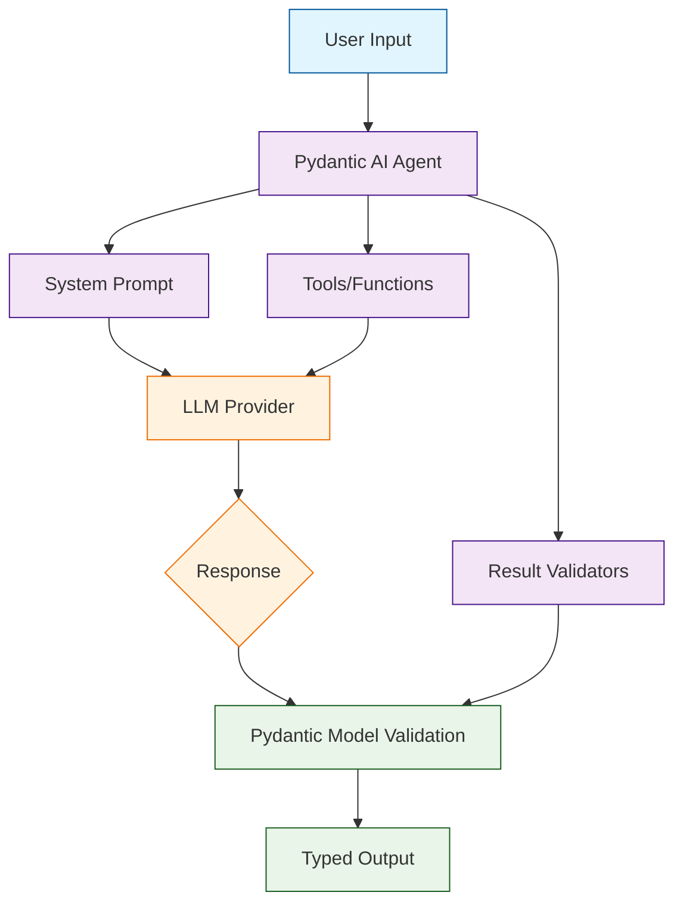

# Pydantic AI Tutorial: Type-Safe AI Agents

> Build production-ready AI agents with the elegance and type safety of Pydantic.

<div align="center">

**🔒 Type-Safe AI Development with Pydantic**

[](https://github.com/pydantic/pydantic-ai)

</div>

---

## 🎯 What is Pydantic AI?

**Pydantic AI**<sup>[View Repo](https://github.com/pydantic/pydantic-ai)</sup> is a Python agent framework designed to make it easy to build production-grade AI applications. Built by the team behind Pydantic, it brings the same philosophy of type safety, validation, and developer experience to AI agent development.

### Why Pydantic AI?

| Feature | Description |
|:--------|:------------|
| **Type Safety** | Full type hints with IDE autocompletion and error checking |
| **Structured Outputs** | Pydantic models as agent outputs with automatic validation |
| **Dependency Injection** | Clean, testable agent architectures |
| **Multi-Model Support** | OpenAI, Anthropic, Gemini, Groq, and more |
| **Streaming** | First-class streaming support for real-time responses |
| **Logfire Integration** | Built-in observability and debugging |



## Tutorial Chapters

1. **[Chapter 1: Getting Started](01-getting-started.md)** - Installation, setup, and your first Pydantic AI agent
2. **[Chapter 2: Agents & System Prompts](02-agents-prompts.md)** - Designing effective agent behavior
3. **[Chapter 3: Structured Outputs](03-structured-outputs.md)** - Using Pydantic models for typed results
4. **[Chapter 4: Tools & Functions](04-tools.md)** - Equipping agents with capabilities
5. **[Chapter 5: Dependencies & Context](05-dependencies.md)** - Dependency injection patterns
6. **[Chapter 6: Streaming Responses](06-streaming.md)** - Real-time streaming with type safety
7. **[Chapter 7: Testing & Debugging](07-testing.md)** - Testing agents and Logfire integration
8. **[Chapter 8: Production Deployment](08-production.md)** - Scaling, monitoring, and best practices

## What You'll Learn

- **Build Type-Safe Agents** with full IDE support and validation
- **Create Structured Outputs** using Pydantic models
- **Implement Clean Architectures** with dependency injection
- **Add Agent Capabilities** through typed tools and functions
- **Stream Responses** in real-time with proper typing
- **Test Agents Thoroughly** with mocking and test modes
- **Monitor Production Systems** with Logfire observability

## Prerequisites

- Python 3.9+
- Understanding of Pydantic basics
- API key for your chosen LLM provider
- Familiarity with type hints

## Quick Start

```bash
# Install Pydantic AI
pip install pydantic-ai

# Install provider-specific extras
pip install pydantic-ai[openai]     # For OpenAI
pip install pydantic-ai[anthropic]  # For Anthropic
pip install pydantic-ai[all]        # All providers
```

## Your First Agent

```python
from pydantic_ai import Agent

# Create a simple agent
agent = Agent(
    'openai:gpt-4o',
    system_prompt='You are a helpful assistant. Be concise.',
)

# Run synchronously
result = agent.run_sync('What is the capital of France?')
print(result.data)
# Paris
```

## Structured Outputs

The real power of Pydantic AI - typed outputs:

```python
from pydantic import BaseModel
from pydantic_ai import Agent

class CityInfo(BaseModel):
    """Information about a city."""
    name: str
    country: str
    population: int
    famous_for: list[str]

agent = Agent(
    'openai:gpt-4o',
    result_type=CityInfo,  # Structured output!
    system_prompt='Provide accurate city information.',
)

result = agent.run_sync('Tell me about Tokyo')

# result.data is a fully typed CityInfo instance
print(f"City: {result.data.name}")
print(f"Country: {result.data.country}")
print(f"Population: {result.data.population:,}")
print(f"Famous for: {', '.join(result.data.famous_for)}")
```

## Adding Tools

```python
from pydantic_ai import Agent, RunContext

agent = Agent(
    'openai:gpt-4o',
    system_prompt='Help users with calculations.',
)

@agent.tool
def calculate(ctx: RunContext[None], expression: str) -> float:
    """Safely evaluate a mathematical expression."""
    # In production, use a safe math parser
    allowed_chars = set('0123456789+-*/(). ')
    if set(expression) <= allowed_chars:
        return eval(expression)
    raise ValueError("Invalid expression")

@agent.tool
def convert_units(
    ctx: RunContext[None], 
    value: float, 
    from_unit: str, 
    to_unit: str
) -> float:
    """Convert between units."""
    conversions = {
        ('km', 'miles'): 0.621371,
        ('miles', 'km'): 1.60934,
        ('kg', 'lbs'): 2.20462,
        ('lbs', 'kg'): 0.453592,
    }
    factor = conversions.get((from_unit, to_unit), 1.0)
    return value * factor

result = agent.run_sync('What is 15km in miles, and then add 10 to that?')
print(result.data)
```

## Dependency Injection

Clean architecture with dependencies:

```python
from dataclasses import dataclass
from pydantic_ai import Agent, RunContext

@dataclass
class DatabaseConnection:
    """Database connection dependency."""
    connection_string: str
    
    def query(self, sql: str) -> list[dict]:
        # Execute query...
        pass

@dataclass
class UserContext:
    """User context dependency."""
    user_id: str
    permissions: list[str]

# Agent with typed dependencies
agent = Agent(
    'openai:gpt-4o',
    deps_type=tuple[DatabaseConnection, UserContext],
    system_prompt='Help users query their data.',
)

@agent.tool
def query_data(
    ctx: RunContext[tuple[DatabaseConnection, UserContext]], 
    table: str
) -> list[dict]:
    """Query data from a table."""
    db, user = ctx.deps
    if 'read' not in user.permissions:
        raise PermissionError("No read permission")
    return db.query(f"SELECT * FROM {table} WHERE user_id = '{user.user_id}'")

# Run with dependencies
db = DatabaseConnection("postgresql://...")
user = UserContext(user_id="123", permissions=["read", "write"])

result = agent.run_sync(
    'Show me my orders',
    deps=(db, user)
)
```

## Async Support

```python
import asyncio
from pydantic_ai import Agent

agent = Agent('openai:gpt-4o')

async def main():
    # Async run
    result = await agent.run('Explain async/await in Python')
    print(result.data)
    
    # Streaming
    async with agent.run_stream('Write a poem about Python') as response:
        async for chunk in response.stream():
            print(chunk, end='', flush=True)

asyncio.run(main())
```

## Supported Models

| Provider | Models | Setup |
|:---------|:-------|:------|
| **OpenAI** | GPT-4o, GPT-4-turbo, GPT-3.5 | `openai:gpt-4o` |
| **Anthropic** | Claude 3.5 Sonnet, Claude 3 Opus | `anthropic:claude-3-5-sonnet` |
| **Google** | Gemini Pro, Gemini Ultra | `google:gemini-pro` |
| **Groq** | LLaMA, Mixtral | `groq:llama-3.1-70b` |
| **Ollama** | Any local model | `ollama:llama3` |

## Learning Path

### 🟢 Beginner Track
1. Chapters 1-3: Setup, basic agents, and structured outputs
2. Build simple typed agents

### 🟡 Intermediate Track
1. Chapters 4-6: Tools, dependencies, and streaming
2. Create production-ready agent architectures

### 🔴 Advanced Track
1. Chapters 7-8: Testing, debugging, and deployment
2. Master enterprise-grade AI applications

---

**Ready to build type-safe AI agents? Let's begin with [Chapter 1: Getting Started](01-getting-started.md)!**

*Generated for [Awesome Code Docs](https://github.com/johnxie/awesome-code-docs)*
