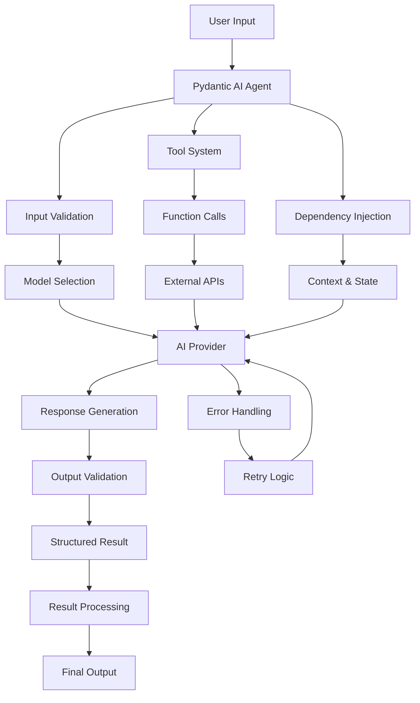

# Pydantic AI Tutorial: Type-Safe AI Agent Development

> This tutorial is AI-generated! To learn more, check out [Awesome Code Docs](https://github.com/johnxie/awesome-code-docs)

[](https://github.com/pydantic/pydantic-ai)
[](https://opensource.org/licenses/MIT)
[](https://github.com/pydantic/pydantic-ai)


Pydantic AI<sup>[View Repo](https://github.com/pydantic/pydantic-ai)</sup> is a Python library for building type-safe AI agents using Pydantic models. It provides structured outputs, runtime validation, and seamless integration with popular AI providers.

## Tutorial Chapters

1. **[Chapter 1: Getting Started](01-getting-started.md)** - Installation and basic agent creation with type safety
2. **[Chapter 2: Model Configuration](02-model-configuration.md)** - Setting up different AI providers and models
3. **[Chapter 3: Structured Outputs](03-structured-outputs.md)** - Using Pydantic models for guaranteed output structure
4. **[Chapter 4: Dependencies & Tools](04-dependencies-tools.md)** - Managing agent dependencies and tool integration
5. **[Chapter 5: Streaming & Async](05-streaming-async.md)** - Real-time responses and asynchronous operations
6. **[Chapter 6: Error Handling](06-error-handling.md)** - Robust error handling and retry mechanisms
7. **[Chapter 7: Advanced Patterns](07-advanced-patterns.md)** - Complex agent workflows and multi-step reasoning
8. **[Chapter 8: Production](08-production.md)** - Deployment, monitoring, and scaling

## What You'll Learn

- **Type Safety**: Build AI agents with guaranteed type-safe inputs and outputs
- **Structured Data**: Generate perfectly structured responses using Pydantic models
- **Provider Integration**: Connect with OpenAI, Anthropic, Google, and other providers
- **Tool Integration**: Extend agent capabilities with custom tools and functions
- **Error Handling**: Implement robust error handling and recovery mechanisms
- **Production Ready**: Deploy scalable, monitored AI agent systems

## Learning Objectives

By the end of this tutorial, you'll be able to:
- Create type-safe AI agents with validated inputs and outputs
- Configure multiple AI providers with fallback strategies
- Build complex agent workflows with structured data flow
- Implement custom tools and integrate external services
- Handle errors gracefully with retry and recovery mechanisms
- Deploy production-ready AI agent systems with monitoring

## Key Features Covered

**🔒 Type Safety:**
- ⚡ **Runtime Validation**: Pydantic models ensure type correctness at runtime
- 📋 **Structured Outputs**: Guaranteed output formats with automatic validation
- 🔍 **Input Validation**: Type-safe agent inputs with automatic parsing
- 🛡️ **Error Prevention**: Catch type errors before they cause issues

**🤖 Agent Capabilities:**
- 🔗 **Multi-Provider**: Support for OpenAI, Anthropic, Google, Groq, and more
- 🛠️ **Tool Integration**: Extend agents with custom functions and APIs
- 📊 **Streaming Support**: Real-time response streaming for better UX
- 🔄 **Async Operations**: Non-blocking operations for high performance
- 📈 **Scalability**: Built for production workloads and monitoring

## Architecture Overview



Pydantic AI combines the power of modern AI with the reliability of type systems, providing a robust framework for building production-ready AI agents.

## Prerequisites

- Python 3.8+
- Basic understanding of Pydantic and type hints
- Familiarity with async/await patterns (helpful but not required)
- Experience with AI APIs (OpenAI, Anthropic, etc.)

## Getting Started

Ready to build type-safe AI agents? Let's begin with [Chapter 1: Getting Started](01-getting-started.md)!

## Quick Start

```python
from pydantic_ai import Agent
from pydantic import BaseModel

# Define structured output
class Response(BaseModel):
    answer: str
    confidence: float

# Create type-safe agent
agent = Agent('openai:gpt-4', result_type=Response)

# Get validated response
result = agent.run_sync('What is the capital of France?')
print(f"Answer: {result.data.answer}")
print(f"Confidence: {result.data.confidence}")
```