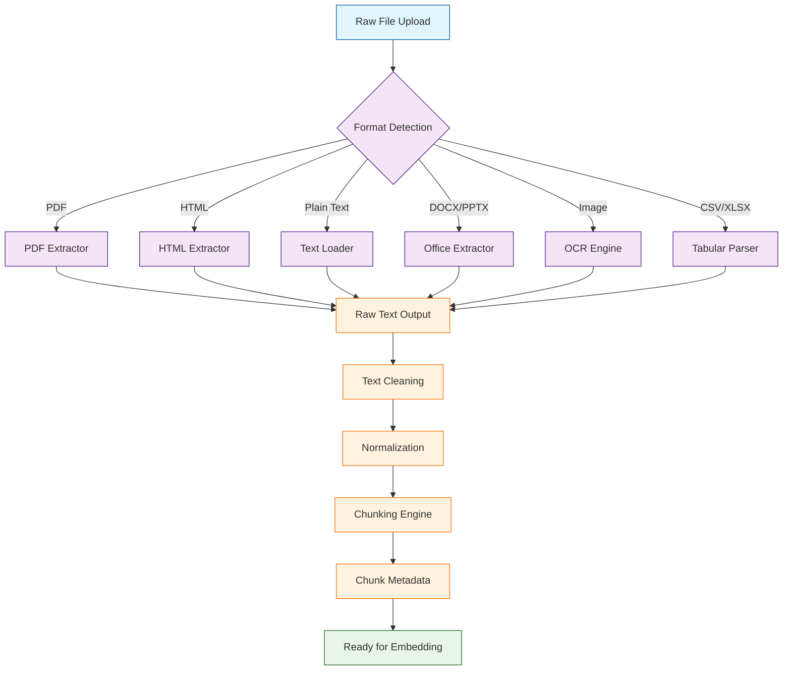

# Chapter 2: Document Processing

Welcome to **Chapter 2: Document Processing**. In this part of **Quivr Tutorial: Open-Source RAG Framework for Document Ingestion**, you will build an intuitive mental model first, then move into concrete implementation details and practical production tradeoffs.


In [Chapter 1](01-getting-started.md), you installed Quivr and uploaded your first document. But what actually happens once a file lands in the system? This chapter dives deep into the document processing pipeline -- the engine that transforms raw PDFs, HTML pages, and plain-text files into clean, structured chunks ready for embedding.

Understanding this pipeline is critical because the quality of your RAG responses depends directly on the quality of your ingested text. Garbage in, garbage out. By the end of this chapter you will know how to extract text from every supported format, clean and normalize it, split it into semantically meaningful chunks, and troubleshoot the most common ingestion problems.

## Document Processing Architecture



## Supported Format Matrix

| Format | Extensions | Extractor | OCR Support | Table Extraction | Metadata Preserved |
|--------|-----------|-----------|-------------|------------------|--------------------|
| PDF | `.pdf` | PyMuPDF / pdfplumber | Yes | Yes | Title, author, pages |
| HTML | `.html`, `.htm` | BeautifulSoup | No | Yes | Title, headings |
| Plain Text | `.txt`, `.md`, `.rst` | Built-in | No | No | Filename |
| Word | `.docx` | python-docx | No | Yes | Title, author, styles |
| PowerPoint | `.pptx` | python-pptx | No | Limited | Slide titles |
| Spreadsheet | `.csv`, `.xlsx` | pandas / openpyxl | No | Full | Sheet names, headers |
| Images | `.png`, `.jpg` | Tesseract OCR | Full | No | Dimensions, EXIF |
| Code | `.py`, `.js`, `.ts` | Built-in | No | No | Language, filename |

## Text Extraction by Format

### PDF Extraction

PDFs are the most common document type in enterprise knowledge bases, and they are also the trickiest. Quivr uses a layered extraction strategy: it first attempts direct text extraction, then falls back to OCR for scanned pages.

```python
from quivr.processing.extractors import PDFExtractor

extractor = PDFExtractor(
    ocr_enabled=True,
    ocr_language="eng",
    extract_tables=True,
    extract_images=False,
    page_range=None  # None means all pages
)

# Extract text from a PDF file
result = extractor.extract("docs/annual-report.pdf")

print(f"Pages processed: {result.page_count}")
print(f"Extraction method: {result.method}")  # 'text' or 'ocr'
print(f"Tables found: {len(result.tables)}")
print(f"Characters extracted: {len(result.text)}")

# Access per-page content
for page in result.pages:
    print(f"Page {page.number}: {len(page.text)} chars, "
          f"method={page.extraction_method}")
```

#### Handling Scanned PDFs

```python
from quivr.processing.extractors import PDFExtractor
from quivr.processing.ocr import TesseractOCR

# Configure OCR with preprocessing
ocr_engine = TesseractOCR(
    language="eng+fra",        # Multi-language support
    dpi=300,                   # Resolution for image conversion
    preprocessing={
        "deskew": True,        # Correct page rotation
        "denoise": True,       # Remove scanning noise
        "binarize": True,      # Convert to black/white
        "contrast": 1.5        # Boost contrast
    }
)

extractor = PDFExtractor(
    ocr_engine=ocr_engine,
    ocr_fallback=True,         # Use OCR only when text layer is empty
    min_text_threshold=50      # Minimum chars before triggering OCR
)

result = extractor.extract("docs/scanned-contract.pdf")

# Check quality metrics
for page in result.pages:
    print(f"Page {page.number}: confidence={page.ocr_confidence:.2f}")
    if page.ocr_confidence < 0.7:
        print(f"  WARNING: Low OCR confidence on page {page.number}")
```

### HTML Extraction

Web content requires careful extraction to separate meaningful text from navigation, footers, and boilerplate.

```python
from quivr.processing.extractors import HTMLExtractor

extractor = HTMLExtractor(
    remove_elements=["nav", "footer", "header", "script", "style"],
    preserve_headings=True,
    preserve_lists=True,
    preserve_tables=True,
    extract_links=True,
    main_content_selector="article, main, .content"  # CSS selector
)

# Extract from a local HTML file
result = extractor.extract("docs/documentation.html")
print(f"Title: {result.title}")
print(f"Headings found: {len(result.headings)}")
print(result.text[:500])

# Extract from a URL
url_result = extractor.extract_from_url(
    "https://docs.example.com/guide",
    follow_links=False,
    timeout=30
)
```

### Office Document Extraction

```python
from quivr.processing.extractors import DocxExtractor, PptxExtractor

# Word documents
docx_extractor = DocxExtractor(
    preserve_formatting=True,
    extract_comments=True,
    extract_headers_footers=False
)

docx_result = docx_extractor.extract("docs/proposal.docx")
print(f"Sections: {len(docx_result.sections)}")
print(f"Tables: {len(docx_result.tables)}")
print(f"Comments: {len(docx_result.comments)}")

# PowerPoint presentations
pptx_extractor = PptxExtractor(
    extract_notes=True,
    extract_slide_text=True,
    image_ocr=False
)

pptx_result = pptx_extractor.extract("docs/presentation.pptx")
for slide in pptx_result.slides:
    print(f"Slide {slide.number}: {slide.title}")
    print(f"  Text: {slide.text[:100]}...")
    if slide.notes:
        print(f"  Notes: {slide.notes[:100]}...")
```

## Text Cleaning Pipeline

Raw extracted text is rarely ready for embedding. The cleaning pipeline handles normalization, noise removal, and structural preservation.


### Building a Cleaning Pipeline

```python
from quivr.processing.cleaners import (
    TextCleaner,
    UnicodeNormalizer,
    WhitespaceCleaner,
    BoilerplateRemover,
    HeaderFooterRemover,
    SpecialCharHandler
)

# Compose a cleaning pipeline
cleaner = TextCleaner(steps=[
    UnicodeNormalizer(form="NFKC"),
    WhitespaceCleaner(
        collapse_newlines=True,
        max_consecutive_newlines=2,
        strip_trailing=True
    ),
    BoilerplateRemover(
        patterns=[
            r"Page \d+ of \d+",
            r"Confidential.*?Do not distribute",
            r"^\s*\d+\s*$",  # Page numbers alone on a line
        ]
    ),
    HeaderFooterRemover(
        header_lines=2,
        footer_lines=2,
        per_page=True
    ),
    SpecialCharHandler(
        replace_ligatures=True,    # fi -> fi, fl -> fl
        normalize_quotes=True,     # smart quotes -> straight
        normalize_dashes=True,     # em/en dash -> hyphen
        remove_control_chars=True
    )
])

raw_text = extractor.extract("docs/report.pdf").text
clean_text = cleaner.clean(raw_text)

print(f"Before: {len(raw_text)} chars")
print(f"After:  {len(clean_text)} chars")
print(f"Reduction: {(1 - len(clean_text)/len(raw_text))*100:.1f}%")
```

### Custom Cleaning Rules

```python
import re
from quivr.processing.cleaners import CleanerStep

class LegalDocCleaner(CleanerStep):
    """Custom cleaner for legal documents."""

    def __init__(self):
        self.patterns = [
            (r"\bSECTION\s+(\d+)", r"Section \1"),        # Normalize headings
            (r"\(\s*([a-z])\s*\)", r"(\1)"),               # Fix spacing in lists
            (r"(?<=\w)-\n(?=\w)", ""),                     # Rejoin hyphenated words
            (r"\b(WHEREAS|HEREBY|THEREOF)\b", lambda m: m.group().title()),
        ]

    def process(self, text: str) -> str:
        for pattern, replacement in self.patterns:
            text = re.sub(pattern, replacement, text)
        return text

# Add the custom cleaner to the pipeline
cleaner.add_step(LegalDocCleaner())
clean_legal = cleaner.clean(raw_legal_text)
```

## Chunking Strategies

Chunking is where most RAG pipelines succeed or fail. Too large and the chunks dilute relevant information; too small and you lose context. Quivr provides multiple chunking strategies for different use cases.

### Chunking Strategy Comparison

| Strategy | Best For | Pros | Cons |
|----------|----------|------|------|
| Fixed Size | General purpose | Simple, predictable | Cuts mid-sentence |
| Recursive Character | Most documents | Respects boundaries | Needs separator tuning |
| Sentence-Based | Articles, prose | Natural boundaries | Variable chunk sizes |
| Semantic | Technical docs | Meaning-preserving | Slower, model-dependent |
| Heading-Based | Structured docs | Section-aware | Requires headings |
| Sliding Window | Dense text | Overlapping context | More chunks, more cost |

### Fixed-Size Chunking

```python
from quivr.processing.chunkers import FixedSizeChunker

chunker = FixedSizeChunker(
    chunk_size=1000,       # Characters per chunk
    chunk_overlap=200,     # Overlap between chunks
    separator="\n"         # Preferred split point
)

chunks = chunker.split(clean_text)

print(f"Total chunks: {len(chunks)}")
for i, chunk in enumerate(chunks[:3]):
    print(f"\nChunk {i}: {len(chunk.text)} chars")
    print(f"  Start: {chunk.text[:80]}...")
    print(f"  Metadata: page={chunk.metadata.get('page')}, "
          f"position={chunk.metadata.get('position')}")
```

### Recursive Character Chunking

This is the recommended default strategy. It tries to split at paragraph boundaries first, then sentences, then words.

```python
from quivr.processing.chunkers import RecursiveChunker

chunker = RecursiveChunker(
    chunk_size=1000,
    chunk_overlap=200,
    separators=[
        "\n\n",    # Paragraph breaks (highest priority)
        "\n",      # Line breaks
        ". ",      # Sentence boundaries
        ", ",      # Clause boundaries
        " ",       # Word boundaries (last resort)
    ],
    keep_separator=True
)

chunks = chunker.split(clean_text)
print(f"Chunks: {len(chunks)}")
```

### Semantic Chunking

Semantic chunking uses embeddings to find natural topic boundaries within the text.

```python
from quivr.processing.chunkers import SemanticChunker
from sentence_transformers import SentenceTransformer

embed_model = SentenceTransformer("all-MiniLM-L6-v2")

chunker = SemanticChunker(
    embedding_model=embed_model,
    min_chunk_size=200,
    max_chunk_size=1500,
    similarity_threshold=0.75,  # Split when similarity drops below
    buffer_size=1               # Sentences to look ahead/behind
)

chunks = chunker.split(clean_text)

for i, chunk in enumerate(chunks[:5]):
    print(f"Chunk {i}: {len(chunk.text)} chars, "
          f"coherence={chunk.metadata['coherence_score']:.2f}")
```

### Heading-Based Chunking for Structured Documents

```python
from quivr.processing.chunkers import HeadingChunker

chunker = HeadingChunker(
    heading_patterns=[
        r"^#{1,3}\s+",          # Markdown headings
        r"^[A-Z][^.!?]*$",     # ALL-CAPS or Title lines
        r"^\d+\.\d*\s+\w",     # Numbered sections like "1.2 Overview"
    ],
    max_chunk_size=2000,
    include_heading_in_chunk=True,
    hierarchical_metadata=True   # Track heading nesting
)

chunks = chunker.split(clean_text)

for chunk in chunks[:3]:
    meta = chunk.metadata
    print(f"Section: {meta.get('heading', 'N/A')}")
    print(f"  Level: {meta.get('heading_level', 'N/A')}")
    print(f"  Parent: {meta.get('parent_heading', 'N/A')}")
    print(f"  Length: {len(chunk.text)} chars")
```

## Chunk Metadata and Provenance

Every chunk carries metadata that helps with retrieval filtering, citation, and debugging.

```python
from quivr.processing.chunkers import RecursiveChunker
from quivr.processing.metadata import MetadataEnricher

chunker = RecursiveChunker(chunk_size=1000, chunk_overlap=200)
enricher = MetadataEnricher()

chunks = chunker.split(clean_text)

# Enrich chunks with metadata
enriched_chunks = enricher.enrich(
    chunks=chunks,
    source_metadata={
        "filename": "annual-report.pdf",
        "source": "finance-team",
        "uploaded_by": "jane@company.com",
        "upload_date": "2024-06-15",
        "document_type": "report",
        "language": "en"
    }
)

for chunk in enriched_chunks[:2]:
    print(f"Chunk ID: {chunk.id}")
    print(f"  Text preview: {chunk.text[:80]}...")
    print(f"  Metadata:")
    for key, value in chunk.metadata.items():
        print(f"    {key}: {value}")
```

### Metadata Schema

```python
# Each chunk contains the following metadata structure
chunk_metadata = {
    # Source information
    "filename": "report.pdf",
    "source": "finance-team",
    "document_type": "report",

    # Position information
    "chunk_index": 5,
    "total_chunks": 42,
    "page_number": 3,
    "start_char": 4200,
    "end_char": 5180,

    # Content information
    "heading": "Revenue Analysis",
    "parent_heading": "Financial Summary",
    "language": "en",
    "word_count": 182,
    "has_table": False,
    "has_code": False,

    # Processing information
    "chunker": "recursive",
    "chunk_size": 1000,
    "chunk_overlap": 200,
    "cleaning_steps": ["unicode", "whitespace", "boilerplate"],
    "processed_at": "2024-06-15T10:30:00Z"
}
```

## End-to-End Ingestion Pipeline

Here is a complete pipeline that ties extraction, cleaning, and chunking together.

```python
from quivr.processing.pipeline import DocumentPipeline
from quivr.processing.extractors import PDFExtractor, HTMLExtractor
from quivr.processing.cleaners import TextCleaner, UnicodeNormalizer, WhitespaceCleaner
from quivr.processing.chunkers import RecursiveChunker
from quivr.processing.metadata import MetadataEnricher

# Build the pipeline
pipeline = DocumentPipeline(
    extractors={
        ".pdf": PDFExtractor(ocr_enabled=True),
        ".html": HTMLExtractor(remove_elements=["nav", "footer"]),
    },
    cleaner=TextCleaner(steps=[
        UnicodeNormalizer(form="NFKC"),
        WhitespaceCleaner(collapse_newlines=True),
    ]),
    chunker=RecursiveChunker(
        chunk_size=1000,
        chunk_overlap=200
    ),
    enricher=MetadataEnricher()
)

# Process a batch of files
import glob

files = glob.glob("docs/**/*.*", recursive=True)
all_chunks = []

for file_path in files:
    try:
        chunks = pipeline.process(
            file_path=file_path,
            metadata={"source": "docs-folder"}
        )
        all_chunks.extend(chunks)
        print(f"Processed {file_path}: {len(chunks)} chunks")
    except Exception as e:
        print(f"ERROR processing {file_path}: {e}")

print(f"\nTotal chunks: {len(all_chunks)}")
print(f"Total files: {len(files)}")
print(f"Avg chunks/file: {len(all_chunks)/len(files):.1f}")
```

### Pipeline with Progress Tracking

```python
from quivr.processing.pipeline import DocumentPipeline
from quivr.processing.callbacks import ProgressCallback

class IngestionMonitor(ProgressCallback):
    """Track ingestion progress and quality metrics."""

    def __init__(self):
        self.stats = {
            "files_processed": 0,
            "files_failed": 0,
            "total_chunks": 0,
            "total_chars": 0,
            "ocr_pages": 0,
            "low_quality_pages": 0
        }

    def on_file_start(self, file_path: str):
        print(f"Processing: {file_path}")

    def on_file_complete(self, file_path: str, chunks: list):
        self.stats["files_processed"] += 1
        self.stats["total_chunks"] += len(chunks)
        self.stats["total_chars"] += sum(len(c.text) for c in chunks)

    def on_file_error(self, file_path: str, error: Exception):
        self.stats["files_failed"] += 1
        print(f"  FAILED: {error}")

    def on_ocr_page(self, page_num: int, confidence: float):
        self.stats["ocr_pages"] += 1
        if confidence < 0.7:
            self.stats["low_quality_pages"] += 1

    def report(self):
        s = self.stats
        print(f"\n{'='*50}")
        print(f"Ingestion Report")
        print(f"{'='*50}")
        print(f"Files processed: {s['files_processed']}")
        print(f"Files failed:    {s['files_failed']}")
        print(f"Total chunks:    {s['total_chunks']}")
        print(f"Total chars:     {s['total_chars']:,}")
        print(f"OCR pages:       {s['ocr_pages']}")
        print(f"Low quality:     {s['low_quality_pages']}")

monitor = IngestionMonitor()
pipeline = DocumentPipeline(callbacks=[monitor])

for file_path in files:
    pipeline.process(file_path)

monitor.report()
```

## Troubleshooting Common Issues

| Problem | Cause | Solution |
|---------|-------|----------|
| Garbled text from PDF | Scanned pages without OCR | Enable `ocr_fallback=True` |
| Empty chunks generated | Short pages or heavy boilerplate | Set `min_chunk_size=100` and filter |
| Duplicate content in chunks | Excessive overlap | Reduce `chunk_overlap` to 10-20% of `chunk_size` |
| Missing tables | Extractor not configured | Set `extract_tables=True` on extractor |
| Encoding errors | Non-UTF-8 source files | Use `chardet` to detect and convert encoding |
| Slow processing on large PDFs | Page-by-page OCR | Process pages in parallel with `n_workers` |
| Heading structure lost | Plain text extraction | Use `preserve_headings=True` on extractor |

### Debugging Extraction Quality

```python
from quivr.processing.diagnostics import ExtractionAnalyzer

analyzer = ExtractionAnalyzer()

# Analyze extraction quality for a document
report = analyzer.analyze(
    file_path="docs/report.pdf",
    extracted_text=result.text,
    chunks=chunks
)

print(f"Extraction coverage: {report.coverage_pct:.1f}%")
print(f"Empty pages: {report.empty_pages}")
print(f"Average chunk quality: {report.avg_chunk_quality:.2f}")
print(f"Duplicate chunks: {report.duplicate_count}")

# Visualize chunk size distribution
report.plot_chunk_distribution()
```

## Summary

Document processing is the foundation of any RAG pipeline. In this chapter you learned how Quivr's processing engine works from end to end:

- **Format Detection** automatically routes files to the correct extractor
- **Text Extraction** handles PDF (with OCR fallback), HTML, Office, and image formats
- **Cleaning Pipelines** normalize unicode, remove boilerplate, and fix formatting
- **Chunking Strategies** range from simple fixed-size to semantic-aware splitting
- **Metadata Enrichment** tags every chunk with provenance and position information
- **Quality Monitoring** tracks extraction coverage and chunk quality metrics

## Key Takeaways

1. **Choose the right chunking strategy** -- recursive character splitting is a safe default, but semantic chunking yields better results for technical documents.
2. **Always clean before chunking** -- boilerplate and formatting noise degrade retrieval quality.
3. **Preserve metadata** -- chunk provenance is essential for citations and debugging.
4. **Monitor extraction quality** -- use the diagnostics analyzer to catch OCR failures and empty chunks early.
5. **Tune chunk size and overlap** -- start with 1000 characters and 200 overlap, then adjust based on your retrieval performance.

## Next Steps

Your documents are now extracted, cleaned, and chunked. In [Chapter 3: Vector Embeddings](03-vector-embeddings.md), you will learn how to convert these chunks into vector embeddings and store them in a vector database for fast similarity search.

---

*Built with insights from the [Quivr](https://github.com/QuivrHQ/quivr) project.*

## What Problem Does This Solve?

Most teams struggle here because the hard part is not writing more code, but deciding clear boundaries for `print`, `chunks`, `processing` so behavior stays predictable as complexity grows.

In practical terms, this chapter helps you avoid three common failures:

- coupling core logic too tightly to one implementation path
- missing the handoff boundaries between setup, execution, and validation
- shipping changes without clear rollback or observability strategy

After working through this chapter, you should be able to reason about `Chapter 2: Document Processing` as an operating subsystem inside **Quivr Tutorial: Open-Source RAG Framework for Document Ingestion**, with explicit contracts for inputs, state transitions, and outputs.

Use the implementation notes around `quivr`, `text`, `chunk` as your checklist when adapting these patterns to your own repository.

## How it Works Under the Hood

Under the hood, `Chapter 2: Document Processing` usually follows a repeatable control path:

1. **Context bootstrap**: initialize runtime config and prerequisites for `print`.
2. **Input normalization**: shape incoming data so `chunks` receives stable contracts.
3. **Core execution**: run the main logic branch and propagate intermediate state through `processing`.
4. **Policy and safety checks**: enforce limits, auth scopes, and failure boundaries.
5. **Output composition**: return canonical result payloads for downstream consumers.
6. **Operational telemetry**: emit logs/metrics needed for debugging and performance tuning.

When debugging, walk this sequence in order and confirm each stage has explicit success/failure conditions.

## Source Walkthrough

Use the following upstream sources to verify implementation details while reading this chapter:

- [View Repo](https://github.com/QuivrHQ/quivr)
  Why it matters: authoritative reference on `View Repo` (github.com).
- [AI Codebase Knowledge Builder](https://github.com/johnxie/awesome-code-docs)
  Why it matters: authoritative reference on `AI Codebase Knowledge Builder` (github.com).

Suggested trace strategy:
- search upstream code for `print` and `chunks` to map concrete implementation paths
- compare docs claims against actual runtime/config code before reusing patterns in production

## Chapter Connections

- [Tutorial Index](index.md)
- [Previous Chapter: Chapter 1: Getting Started with Quivr](01-getting-started.md)
- [Next Chapter: Chapter 3: Vector Embeddings](03-vector-embeddings.md)
- [Main Catalog](../../README.md#-tutorial-catalog)
- [A-Z Tutorial Directory](../../discoverability/tutorial-directory.md)
