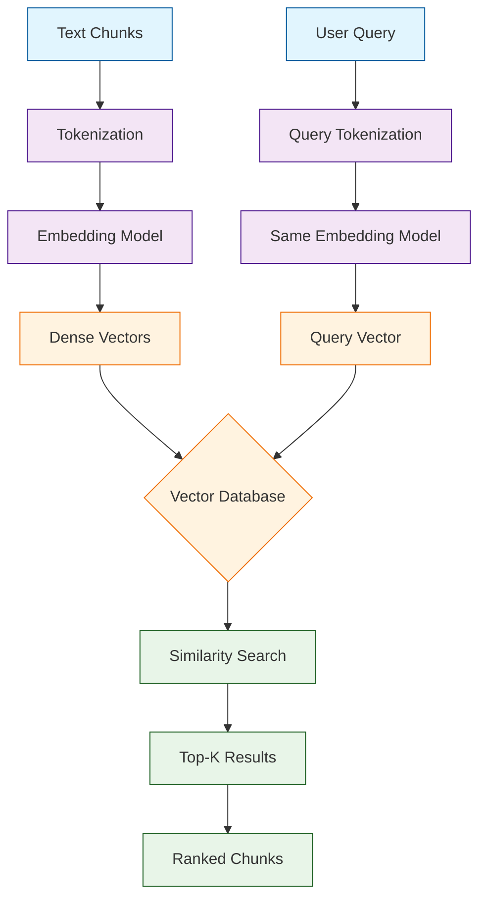
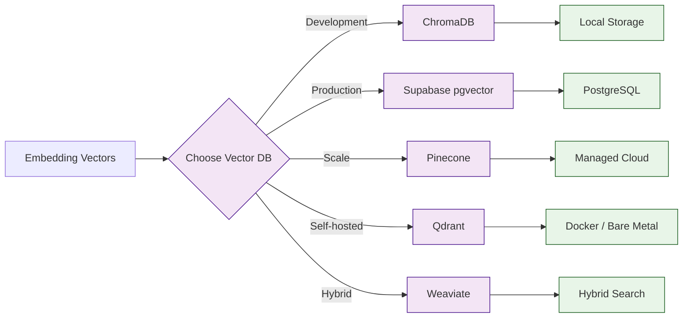
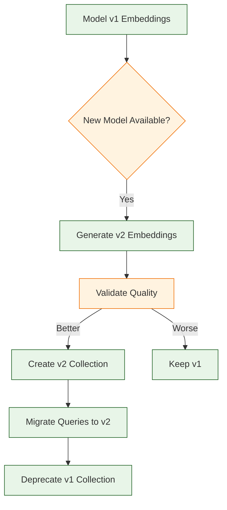

# Chapter 3: Vector Embeddings

Welcome to **Chapter 3: Vector Embeddings**. In this part of **Quivr Tutorial: Open-Source RAG Framework for Document Ingestion**, you will build an intuitive mental model first, then move into concrete implementation details and practical production tradeoffs.


In [Chapter 2](02-document-processing.md), you transformed raw documents into clean, well-structured chunks. Now those chunks need to become searchable. This is where vector embeddings come in -- the mathematical representations that let Quivr find semantically similar content even when the exact words differ.

Embeddings are the bridge between human language and machine understanding. When a user asks "What is the company's revenue growth strategy?", the system needs to find chunks about "fiscal expansion plans" and "year-over-year sales targets" even though none of those words appear in the query. This chapter covers everything you need to know about choosing, generating, storing, and optimizing vector embeddings in Quivr.

## How Vector Embeddings Work



At a high level, an embedding model converts a piece of text into a fixed-length array of floating-point numbers (typically 384 to 3072 dimensions). Texts that are semantically similar end up close together in this high-dimensional space, while unrelated texts are far apart. The distance between two vectors -- measured by cosine similarity, dot product, or Euclidean distance -- tells you how related two pieces of text are.

## Embedding Model Comparison

| Model | Provider | Dimensions | Max Tokens | Speed | Quality | Cost |
|-------|----------|-----------|------------|-------|---------|------|
| `text-embedding-3-small` | OpenAI | 1536 | 8191 | Fast | Good | $0.02/1M tokens |
| `text-embedding-3-large` | OpenAI | 3072 | 8191 | Medium | Excellent | $0.13/1M tokens |
| `all-MiniLM-L6-v2` | HuggingFace | 384 | 256 | Very Fast | Good | Free (local) |
| `all-mpnet-base-v2` | HuggingFace | 768 | 384 | Fast | Very Good | Free (local) |
| `bge-large-en-v1.5` | BAAI | 1024 | 512 | Medium | Excellent | Free (local) |
| `e5-large-v2` | Microsoft | 1024 | 512 | Medium | Excellent | Free (local) |
| `embed-english-v3.0` | Cohere | 1024 | 512 | Fast | Excellent | $0.10/1M tokens |
| `voyage-large-2` | Voyage AI | 1536 | 16000 | Medium | Excellent | $0.12/1M tokens |

### Choosing the Right Model

```python
from quivr.embeddings import EmbeddingModelSelector

selector = EmbeddingModelSelector()

# Get recommendations based on your requirements
recommendations = selector.recommend(
    corpus_size=50000,          # Number of chunks
    avg_chunk_length=500,       # Average characters per chunk
    query_language="en",
    priority="quality",         # "quality", "speed", or "cost"
    local_gpu_available=True,
    budget_per_month_usd=50
)

for rec in recommendations:
    print(f"Model: {rec.model_name}")
    print(f"  Provider: {rec.provider}")
    print(f"  Dimensions: {rec.dimensions}")
    print(f"  Est. cost: ${rec.estimated_monthly_cost:.2f}/month")
    print(f"  Est. encoding time: {rec.estimated_encoding_hours:.1f} hours")
    print(f"  Quality score: {rec.quality_score:.2f}")
    print()
```

## Generating Embeddings with OpenAI

```python
from quivr.embeddings.providers import OpenAIEmbedder
import os

embedder = OpenAIEmbedder(
    api_key=os.environ["OPENAI_API_KEY"],
    model="text-embedding-3-small",
    dimensions=1536,            # Can reduce for cost savings
    batch_size=100,             # Chunks per API call
    max_retries=3,
    timeout=60
)

# Embed a single chunk
vector = embedder.embed("What is Quivr and how does it work?")
print(f"Vector dimensions: {len(vector)}")
print(f"First 5 values: {vector[:5]}")

# Embed a batch of chunks
chunks_text = [chunk.text for chunk in chunks]
vectors = embedder.embed_batch(chunks_text)

print(f"Embedded {len(vectors)} chunks")
print(f"Vector shape: ({len(vectors)}, {len(vectors[0])})")
```

### Handling Rate Limits and Large Batches

```python
from quivr.embeddings.providers import OpenAIEmbedder
from quivr.embeddings.utils import BatchProcessor

embedder = OpenAIEmbedder(
    api_key=os.environ["OPENAI_API_KEY"],
    model="text-embedding-3-small"
)

processor = BatchProcessor(
    embedder=embedder,
    batch_size=100,
    max_concurrent=5,           # Parallel API calls
    rate_limit_rpm=3000,        # Requests per minute
    rate_limit_tpm=1000000,     # Tokens per minute
    retry_on_rate_limit=True,
    progress_bar=True
)

# Process 50,000 chunks with automatic batching and rate limiting
vectors = processor.process(chunks_text)

print(f"Total chunks embedded: {len(vectors)}")
print(f"Total tokens used: {processor.total_tokens:,}")
print(f"Total cost: ${processor.total_cost:.4f}")
print(f"Time elapsed: {processor.elapsed_time:.1f}s")
```

## Generating Embeddings Locally

For privacy-sensitive workloads or cost optimization, you can run embedding models locally.

```python
from quivr.embeddings.providers import LocalEmbedder

# Using SentenceTransformers
embedder = LocalEmbedder(
    model_name="all-MiniLM-L6-v2",
    device="cuda",              # "cuda", "cpu", or "mps" (Apple Silicon)
    normalize=True,             # L2 normalize vectors
    batch_size=64,
    show_progress=True
)

# Embed all chunks
vectors = embedder.embed_batch(chunks_text)

print(f"Model: {embedder.model_name}")
print(f"Device: {embedder.device}")
print(f"Dimensions: {embedder.dimensions}")
print(f"Chunks embedded: {len(vectors)}")
```

### GPU Memory Management

```python
from quivr.embeddings.providers import LocalEmbedder
from quivr.embeddings.utils import GPUMemoryManager

# Check available GPU memory
mem_manager = GPUMemoryManager()
print(f"GPU memory available: {mem_manager.available_gb:.1f} GB")
print(f"Recommended batch size: {mem_manager.recommended_batch_size}")

# Auto-configure based on available memory
embedder = LocalEmbedder(
    model_name="bge-large-en-v1.5",
    device="cuda",
    batch_size=mem_manager.recommended_batch_size,
    max_memory_gb=4.0           # Cap GPU memory usage
)

# Embed with memory-safe processing
vectors = embedder.embed_batch(
    chunks_text,
    clear_cache_every=1000      # Free GPU memory periodically
)
```

## Vector Database Options



### Vector Database Comparison

| Database | Type | Max Vectors | Filtering | Hybrid Search | Best For |
|----------|------|-------------|-----------|---------------|----------|
| ChromaDB | Embedded | ~1M | Basic metadata | No | Dev/prototype |
| Supabase (pgvector) | Managed | ~10M | Full SQL | No | Existing Postgres |
| Pinecone | Managed | Billions | Metadata | No | Large-scale production |
| Qdrant | Self-hosted | ~100M | Rich filtering | No | Privacy-sensitive |
| Weaviate | Self-hosted | ~100M | GraphQL | Yes (BM25+vector) | Hybrid search |
| Milvus | Self-hosted | Billions | Attribute | No | Massive scale |

### Storing Vectors in ChromaDB

ChromaDB is the default for local development and prototyping.

```python
import chromadb
from chromadb.config import Settings

# Initialize ChromaDB with persistent storage
client = chromadb.Client(Settings(
    chroma_db_impl="duckdb+parquet",
    persist_directory="./chroma_data",
    anonymized_telemetry=False
))

# Create a collection with distance metric
collection = client.get_or_create_collection(
    name="quivr-knowledge-base",
    metadata={
        "hnsw:space": "cosine",       # Distance metric
        "hnsw:construction_ef": 200,  # Index build quality
        "hnsw:search_ef": 100         # Search quality
    }
)

# Add vectors with metadata
ids = [f"chunk-{i}" for i in range(len(chunks))]
documents = [chunk.text for chunk in chunks]
metadatas = [chunk.metadata for chunk in chunks]

collection.add(
    ids=ids,
    embeddings=vectors.tolist(),
    documents=documents,
    metadatas=metadatas
)

print(f"Collection size: {collection.count()}")
```

### Storing Vectors in Supabase (pgvector)

Quivr's default production database uses Supabase with the pgvector extension.

```python
from quivr.vectorstore.supabase import SupabaseVectorStore
import os

store = SupabaseVectorStore(
    url=os.environ["SUPABASE_URL"],
    key=os.environ["SUPABASE_SERVICE_KEY"],
    table_name="vectors",
    embedding_dimensions=1536
)

# Create the table if it does not exist
store.initialize()

# Upsert vectors in batches
for i in range(0, len(chunks), 100):
    batch_chunks = chunks[i:i+100]
    batch_vectors = vectors[i:i+100]

    store.upsert(
        ids=[chunk.id for chunk in batch_chunks],
        vectors=batch_vectors.tolist(),
        documents=[chunk.text for chunk in batch_chunks],
        metadatas=[chunk.metadata for chunk in batch_chunks]
    )

print(f"Stored {len(chunks)} vectors in Supabase")
```

### Storing Vectors in Qdrant

```python
from qdrant_client import QdrantClient
from qdrant_client.models import (
    VectorParams, Distance, PointStruct,
    Filter, FieldCondition, MatchValue
)

# Connect to Qdrant
qdrant = QdrantClient(host="localhost", port=6333)

# Create collection
qdrant.create_collection(
    collection_name="quivr-docs",
    vectors_config=VectorParams(
        size=1536,
        distance=Distance.COSINE
    )
)

# Upload vectors
points = [
    PointStruct(
        id=i,
        vector=vectors[i].tolist(),
        payload={
            "text": chunks[i].text,
            "filename": chunks[i].metadata.get("filename"),
            "page": chunks[i].metadata.get("page_number"),
            "source": chunks[i].metadata.get("source")
        }
    )
    for i in range(len(chunks))
]

qdrant.upsert(
    collection_name="quivr-docs",
    points=points,
    batch_size=100
)

print(f"Uploaded {len(points)} vectors to Qdrant")
```

## Similarity Search

Once vectors are stored, you can perform similarity search to find relevant chunks.

```python
from quivr.embeddings.providers import OpenAIEmbedder

embedder = OpenAIEmbedder(
    api_key=os.environ["OPENAI_API_KEY"],
    model="text-embedding-3-small"
)

# Embed the query
query = "What is the company's revenue growth strategy?"
query_vector = embedder.embed(query)

# Search in ChromaDB
results = collection.query(
    query_embeddings=[query_vector],
    n_results=5,
    include=["documents", "metadatas", "distances"]
)

# Display results
for i, (doc, meta, dist) in enumerate(zip(
    results["documents"][0],
    results["metadatas"][0],
    results["distances"][0]
)):
    similarity = 1 - dist  # Convert distance to similarity
    print(f"\n--- Result {i+1} (similarity: {similarity:.4f}) ---")
    print(f"Source: {meta.get('filename', 'unknown')}, "
          f"Page: {meta.get('page_number', 'N/A')}")
    print(f"Text: {doc[:200]}...")
```

### Filtered Similarity Search

```python
# Search with metadata filters
results = collection.query(
    query_embeddings=[query_vector],
    n_results=5,
    where={
        "$and": [
            {"source": {"$eq": "finance-team"}},
            {"document_type": {"$eq": "report"}},
            {"language": {"$eq": "en"}}
        ]
    },
    include=["documents", "metadatas", "distances"]
)

print(f"Found {len(results['documents'][0])} filtered results")
```

## Index Optimization

### HNSW Index Tuning

The Hierarchical Navigable Small World (HNSW) index is the most common algorithm for approximate nearest neighbor search. Tuning its parameters controls the speed-accuracy tradeoff.

```python
from quivr.vectorstore.index import HNSWConfig

# Development: favor speed
dev_config = HNSWConfig(
    m=16,                       # Connections per layer
    ef_construction=100,        # Build-time search width
    ef_search=50,               # Query-time search width
    max_elements=100000
)

# Production: favor accuracy
prod_config = HNSWConfig(
    m=32,
    ef_construction=400,
    ef_search=200,
    max_elements=10000000
)
```

### HNSW Parameter Guide

| Parameter | Low Value | High Value | Effect |
|-----------|-----------|------------|--------|
| `m` | 8 | 64 | More connections = better recall, more memory |
| `ef_construction` | 50 | 500 | Higher = better index quality, slower build |
| `ef_search` | 20 | 300 | Higher = better recall, slower queries |

```python
# Benchmark different configurations
from quivr.vectorstore.benchmark import IndexBenchmark

benchmark = IndexBenchmark(
    vectors=vectors,
    queries=test_queries,
    ground_truth=true_neighbors
)

configs = [
    {"m": 16, "ef_construction": 100, "ef_search": 50},
    {"m": 32, "ef_construction": 200, "ef_search": 100},
    {"m": 32, "ef_construction": 400, "ef_search": 200},
]

for config in configs:
    result = benchmark.run(config)
    print(f"Config: m={config['m']}, ef_c={config['ef_construction']}, "
          f"ef_s={config['ef_search']}")
    print(f"  Recall@10: {result.recall_at_10:.4f}")
    print(f"  QPS: {result.queries_per_second:.0f}")
    print(f"  Index size: {result.index_size_mb:.1f} MB")
    print(f"  Build time: {result.build_time_seconds:.1f}s")
```

## Embedding Lifecycle Management

### Versioning and Migration



```python
from quivr.embeddings.lifecycle import EmbeddingMigrator

migrator = EmbeddingMigrator(
    source_collection="quivr-docs-v1",
    target_collection="quivr-docs-v2",
    source_embedder=OpenAIEmbedder(model="text-embedding-ada-002"),
    target_embedder=OpenAIEmbedder(model="text-embedding-3-small"),
    vector_store=store
)

# Re-embed all documents with the new model
migration_result = migrator.migrate(
    batch_size=500,
    validate=True,              # Run quality checks
    validation_queries=[
        "revenue growth strategy",
        "employee onboarding process",
        "security compliance requirements"
    ]
)

print(f"Migrated {migration_result.chunks_migrated} chunks")
print(f"Quality improvement: {migration_result.quality_delta:+.4f}")
print(f"Old recall@10: {migration_result.old_recall:.4f}")
print(f"New recall@10: {migration_result.new_recall:.4f}")
```

### Incremental Updates

```python
from quivr.embeddings.sync import IncrementalSync

sync = IncrementalSync(
    embedder=embedder,
    vector_store=store,
    collection_name="quivr-docs"
)

# Detect and process only changed documents
changes = sync.detect_changes(
    documents=updated_documents,
    hash_field="content_hash"
)

print(f"New documents: {changes.added}")
print(f"Modified documents: {changes.modified}")
print(f"Deleted documents: {changes.deleted}")
print(f"Unchanged documents: {changes.unchanged}")

# Apply only the changes
sync.apply(changes)

print(f"Vectors added: {changes.added}")
print(f"Vectors updated: {changes.modified}")
print(f"Vectors removed: {changes.deleted}")
```

## Cost Estimation and Optimization

```python
from quivr.embeddings.cost import CostEstimator

estimator = CostEstimator()

# Estimate embedding costs
estimate = estimator.estimate(
    num_chunks=50000,
    avg_chunk_tokens=200,
    model="text-embedding-3-small",
    include_reembedding=True,
    reembedding_frequency_months=6
)

print(f"Initial embedding cost: ${estimate.initial_cost:.2f}")
print(f"Monthly incremental cost: ${estimate.monthly_cost:.2f}")
print(f"Annual total cost: ${estimate.annual_cost:.2f}")
print(f"Storage cost (vector DB): ${estimate.storage_cost_monthly:.2f}/month")

# Compare models
comparison = estimator.compare_models(
    num_chunks=50000,
    avg_chunk_tokens=200,
    models=[
        "text-embedding-3-small",
        "text-embedding-3-large",
        "all-MiniLM-L6-v2"       # Local, free
    ]
)

for model in comparison:
    print(f"\n{model.name}:")
    print(f"  Cost: ${model.annual_cost:.2f}/year")
    print(f"  Dimensions: {model.dimensions}")
    print(f"  Storage: {model.storage_gb:.2f} GB")
```

## Troubleshooting

| Problem | Cause | Solution |
|---------|-------|----------|
| OOM during embedding | Batch size too large | Reduce `batch_size`; use `clear_cache_every` |
| Slow local encoding | No GPU / wrong device | Set `device="cuda"` or `"mps"`; verify drivers |
| Poor search quality | Wrong distance metric | Match metric to model (cosine for normalized vectors) |
| High API costs | Too many re-embeddings | Use `IncrementalSync` to skip unchanged chunks |
| Dimension mismatch | Model changed without re-embedding | Migrate all vectors when switching models |
| Rate limit errors | Too many concurrent calls | Lower `max_concurrent`; enable `retry_on_rate_limit` |

## Summary

Vector embeddings are the core search mechanism in any RAG system. In this chapter you learned:

- **How embeddings work** -- text is converted to dense vectors where semantic similarity equals geometric proximity
- **Model selection** -- trade off quality, speed, and cost across OpenAI, local, and third-party models
- **Batch processing** -- handle rate limits, GPU memory, and large corpora with automatic batching
- **Vector databases** -- ChromaDB for dev, Supabase/pgvector for production, Qdrant or Pinecone for scale
- **Index tuning** -- HNSW parameters control the recall-vs-speed tradeoff
- **Lifecycle management** -- version, migrate, and incrementally update embeddings

## Key Takeaways

1. **Use the same model for indexing and querying** -- mixing models produces meaningless similarity scores.
2. **Start with a small, fast model** like `all-MiniLM-L6-v2` for prototyping, then upgrade for production.
3. **Normalize your vectors** -- most distance metrics assume L2-normalized embeddings.
4. **Batch aggressively** -- embedding one chunk at a time is orders of magnitude slower and more expensive.
5. **Plan for re-embedding** -- model upgrades require migrating all stored vectors.

## Next Steps

Your chunks are now embedded and stored in a vector database. In [Chapter 4: Query Processing](04-query-processing.md), you will learn how to process user queries, enhance them for better retrieval, assemble prompts with retrieved context, and generate accurate, cited answers.

---

*Built with insights from the [Quivr](https://github.com/QuivrHQ/quivr) project.*

## What Problem Does This Solve?

Most teams struggle here because the hard part is not writing more code, but deciding clear boundaries for `print`, `vectors`, `quivr` so behavior stays predictable as complexity grows.

In practical terms, this chapter helps you avoid three common failures:

- coupling core logic too tightly to one implementation path
- missing the handoff boundaries between setup, execution, and validation
- shipping changes without clear rollback or observability strategy

After working through this chapter, you should be able to reason about `Chapter 3: Vector Embeddings` as an operating subsystem inside **Quivr Tutorial: Open-Source RAG Framework for Document Ingestion**, with explicit contracts for inputs, state transitions, and outputs.

Use the implementation notes around `chunks`, `embedder`, `chunk` as your checklist when adapting these patterns to your own repository.

## How it Works Under the Hood

Under the hood, `Chapter 3: Vector Embeddings` usually follows a repeatable control path:

1. **Context bootstrap**: initialize runtime config and prerequisites for `print`.
2. **Input normalization**: shape incoming data so `vectors` receives stable contracts.
3. **Core execution**: run the main logic branch and propagate intermediate state through `quivr`.
4. **Policy and safety checks**: enforce limits, auth scopes, and failure boundaries.
5. **Output composition**: return canonical result payloads for downstream consumers.
6. **Operational telemetry**: emit logs/metrics needed for debugging and performance tuning.

When debugging, walk this sequence in order and confirm each stage has explicit success/failure conditions.

## Source Walkthrough

Use the following upstream sources to verify implementation details while reading this chapter:

- [View Repo](https://github.com/QuivrHQ/quivr)
  Why it matters: authoritative reference on `View Repo` (github.com).
- [AI Codebase Knowledge Builder](https://github.com/johnxie/awesome-code-docs)
  Why it matters: authoritative reference on `AI Codebase Knowledge Builder` (github.com).

Suggested trace strategy:
- search upstream code for `print` and `vectors` to map concrete implementation paths
- compare docs claims against actual runtime/config code before reusing patterns in production

## Chapter Connections

- [Tutorial Index](index.md)
- [Previous Chapter: Chapter 2: Document Processing](02-document-processing.md)
- [Next Chapter: Chapter 4: Query Processing](04-query-processing.md)
- [Main Catalog](../../README.md#-tutorial-catalog)
- [A-Z Tutorial Directory](../../discoverability/tutorial-directory.md)
