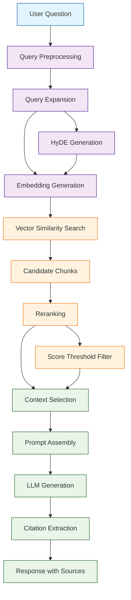
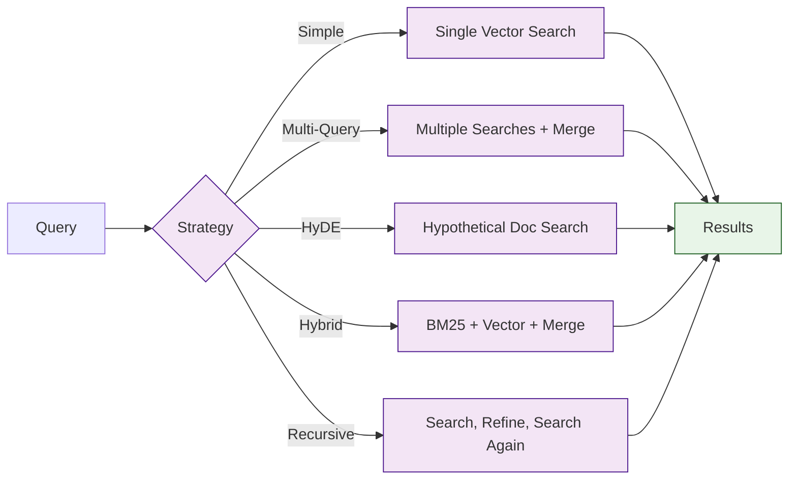

# Chapter 4: Query Processing

In [Chapter 3](03-vector-embeddings.md), you embedded your document chunks and stored them in a vector database. Now it is time to close the loop: take a user's question, retrieve the most relevant chunks, and generate an accurate, cited answer. This is where RAG delivers its value.

Query processing is more than just running a similarity search. A well-designed query pipeline normalizes the user's input, expands it with synonyms or rephrased variants, retrieves candidate chunks, reranks them for precision, assembles a prompt with the right amount of context, and finally generates a response with proper citations. This chapter walks through each stage in detail.

## Query Processing Pipeline



## Query Preprocessing

Raw user queries are messy. They contain typos, inconsistent casing, unnecessary filler words, and ambiguous references. Preprocessing cleans up the query before it reaches the retrieval engine.

```python
from quivr.query.preprocessing import QueryPreprocessor

preprocessor = QueryPreprocessor(
    lowercase=True,
    strip_punctuation=False,     # Keep question marks for intent detection
    remove_stopwords=False,      # Stopwords can carry meaning
    fix_typos=True,
    expand_abbreviations=True,
    abbreviation_map={
        "ml": "machine learning",
        "nlp": "natural language processing",
        "k8s": "kubernetes",
        "db": "database",
        "api": "application programming interface"
    }
)

raw_query = "whats the best ML model for NLP tasks??"
clean_query = preprocessor.process(raw_query)
print(f"Raw:   '{raw_query}'")
print(f"Clean: '{clean_query}'")
# Output: Clean: 'what is the best machine learning model for
#          natural language processing tasks?'
```

### Intent Detection

Understanding the type of question helps route it to the right retrieval strategy.

```python
from quivr.query.intent import IntentClassifier

classifier = IntentClassifier()

queries = [
    "What is Quivr?",
    "How do I configure the embedding model?",
    "Compare ChromaDB and Qdrant",
    "List all supported file formats",
    "Why is my query returning irrelevant results?",
    "Show me the API endpoint for document upload"
]

for query in queries:
    intent = classifier.classify(query)
    print(f"Query: {query}")
    print(f"  Intent: {intent.type}")      # factual, procedural, comparison, etc.
    print(f"  Confidence: {intent.confidence:.2f}")
    print(f"  Suggested top_k: {intent.recommended_top_k}")
    print()
```

| Intent Type | Example | Recommended top_k | Retrieval Strategy |
|-------------|---------|-------------------|--------------------|
| Factual | "What is X?" | 3-5 | Direct similarity |
| Procedural | "How do I do X?" | 5-8 | Heading-filtered search |
| Comparison | "Compare X and Y" | 8-10 | Multi-query retrieval |
| Listing | "List all X" | 10-15 | Broad retrieval + dedup |
| Troubleshooting | "Why is X failing?" | 5-8 | Error-context search |
| Code | "Show me X code" | 3-5 | Code-type filtered search |

## Query Expansion

A single query often misses relevant documents because the user's wording does not match the document's wording. Query expansion generates alternative phrasings to improve recall.

### Multi-Query Expansion

```python
from quivr.query.expansion import MultiQueryExpander

expander = MultiQueryExpander(
    llm_model="gpt-4-turbo-preview",
    num_variants=3,
    temperature=0.7
)

original = "How does access control work in Quivr?"

variants = expander.expand(original)
print(f"Original: {original}")
print(f"Variants:")
for i, v in enumerate(variants, 1):
    print(f"  {i}. {v}")

# Example output:
# 1. What authentication and authorization mechanisms does Quivr use?
# 2. How are permissions managed for knowledge bases in Quivr?
# 3. What is the role-based access control system in Quivr?
```

### HyDE (Hypothetical Document Embeddings)

HyDE generates a hypothetical answer to the query, then uses that answer's embedding for retrieval. This often produces better results than embedding the question directly.

```python
from quivr.query.expansion import HyDEExpander

hyde = HyDEExpander(
    llm_model="gpt-4-turbo-preview",
    num_hypothetical=1,
    max_tokens=200
)

query = "How does Quivr handle PDF table extraction?"

hypothetical_doc = hyde.generate(query)
print(f"Query: {query}")
print(f"Hypothetical document:\n{hypothetical_doc}")

# The hypothetical doc reads like a passage from the actual documentation,
# so its embedding is closer to real documentation chunks than the
# question embedding would be.

# Use the hypothetical document for retrieval
from quivr.embeddings.providers import OpenAIEmbedder

embedder = OpenAIEmbedder(model="text-embedding-3-small")
hyde_vector = embedder.embed(hypothetical_doc)

results = collection.query(
    query_embeddings=[hyde_vector],
    n_results=5
)
```

### Keyword Extraction for Hybrid Search

```python
from quivr.query.expansion import KeywordExtractor

extractor = KeywordExtractor(
    method="tfidf",              # "tfidf", "rake", or "llm"
    max_keywords=5,
    include_bigrams=True
)

query = "What deployment strategies does Quivr support for production?"
keywords = extractor.extract(query)

print(f"Query: {query}")
print(f"Keywords: {keywords}")
# Output: ['deployment strategies', 'production', 'Quivr', 'support', 'deploy']

# Use keywords for hybrid search (BM25 + vector)
hybrid_results = collection.query(
    query_embeddings=[query_vector],
    n_results=10,
    where_document={"$contains": keywords[0]}  # Pre-filter by keyword
)
```

## Retrieval Strategies



### Simple Vector Retrieval

```python
from quivr.query.retrieval import VectorRetriever

retriever = VectorRetriever(
    collection=collection,
    embedder=embedder,
    top_k=5,
    score_threshold=0.7          # Minimum similarity score
)

results = retriever.retrieve("How does access control work?")

for result in results:
    print(f"Score: {result.score:.4f}")
    print(f"Source: {result.metadata['filename']}")
    print(f"Text: {result.text[:150]}...")
    print()
```

### Multi-Query Retrieval

Runs multiple query variants and merges results using reciprocal rank fusion.

```python
from quivr.query.retrieval import MultiQueryRetriever

retriever = MultiQueryRetriever(
    collection=collection,
    embedder=embedder,
    expander=MultiQueryExpander(num_variants=3),
    top_k=5,
    fusion_method="reciprocal_rank",  # "reciprocal_rank" or "score_weighted"
    fusion_k=60                        # RRF constant
)

results = retriever.retrieve("How does access control work?")

print(f"Retrieved {len(results)} unique chunks from "
      f"{retriever.last_query_count} queries")

for result in results:
    print(f"  Fused score: {result.score:.4f} | {result.text[:100]}...")
```

### Hybrid Retrieval (BM25 + Vector)

```python
from quivr.query.retrieval import HybridRetriever

retriever = HybridRetriever(
    collection=collection,
    embedder=embedder,
    bm25_weight=0.3,             # Weight for keyword matching
    vector_weight=0.7,           # Weight for semantic matching
    top_k=10,
    rerank_top_k=5               # Final number of results after fusion
)

results = retriever.retrieve("HNSW index configuration parameters")

for result in results:
    print(f"Hybrid score: {result.score:.4f} "
          f"(BM25={result.bm25_score:.3f}, Vector={result.vector_score:.3f})")
    print(f"  {result.text[:120]}...")
```

## Reranking

Initial retrieval casts a wide net. Reranking uses a cross-encoder model to precisely score each query-document pair and reorder the results.

```python
from quivr.query.reranking import CrossEncoderReranker

reranker = CrossEncoderReranker(
    model_name="cross-encoder/ms-marco-MiniLM-L-6-v2",
    device="cuda",
    batch_size=32,
    top_k=5                      # Keep only top 5 after reranking
)

# Retrieve a broad set of candidates
candidates = retriever.retrieve(query, top_k=20)

# Rerank for precision
reranked = reranker.rerank(query, candidates)

print("Before reranking:")
for i, c in enumerate(candidates[:5]):
    print(f"  {i+1}. (score={c.score:.4f}) {c.text[:80]}...")

print("\nAfter reranking:")
for i, r in enumerate(reranked):
    print(f"  {i+1}. (score={r.score:.4f}) {r.text[:80]}...")
```

### Reranking Model Comparison

| Model | Size | Speed | Quality | Use Case |
|-------|------|-------|---------|----------|
| `ms-marco-MiniLM-L-6-v2` | 23M | Very fast | Good | Prototyping |
| `ms-marco-MiniLM-L-12-v2` | 33M | Fast | Better | General production |
| `bge-reranker-large` | 560M | Medium | Excellent | High-quality production |
| `cohere-rerank-v3` | API | Fast | Excellent | Managed service |
| `jina-reranker-v2` | API | Fast | Excellent | Long documents |

## Prompt Assembly

The prompt is where retrieval meets generation. A well-structured prompt tells the LLM exactly how to use the retrieved context.

```python
from quivr.query.prompts import PromptBuilder

builder = PromptBuilder(
    system_template="""You are a knowledgeable assistant that answers questions
based on the provided context. Follow these rules:
1. Only use information from the context to answer
2. If the context does not contain enough information, say so
3. Cite your sources using [Source: filename, page X] format
4. Be concise but thorough""",

    context_template="""--- Source: {filename}, Page {page} ---
{text}
""",

    question_template="""Based on the context above, answer this question:

Question: {question}

Answer:"""
)

# Build the complete prompt
prompt = builder.build(
    question=query,
    context_chunks=reranked,
    max_context_tokens=3000      # Trim to fit LLM context window
)

print(f"Prompt length: {len(prompt)} characters")
print(f"Context chunks used: {builder.last_chunks_used}")
print(f"Context tokens: {builder.last_context_tokens}")
```

### Token Budget Management

```python
from quivr.query.prompts import TokenBudgetManager

budget = TokenBudgetManager(
    model="gpt-4-turbo-preview",
    max_tokens=128000,           # Model's context window
    reserved_for_system=500,     # System prompt tokens
    reserved_for_response=1000,  # Tokens for the answer
    reserved_for_question=200    # Tokens for the question
)

# Calculate available space for context
available = budget.available_context_tokens()
print(f"Available for context: {available} tokens")

# Select chunks that fit within the budget
selected_chunks = budget.select_chunks(
    chunks=reranked,
    strategy="greedy"            # "greedy" or "knapsack"
)

print(f"Selected {len(selected_chunks)} of {len(reranked)} chunks")
print(f"Context tokens used: {budget.tokens_used}")
print(f"Budget remaining: {budget.tokens_remaining}")
```

## LLM Response Generation

```python
from quivr.query.generation import ResponseGenerator

generator = ResponseGenerator(
    model="gpt-4-turbo-preview",
    temperature=0.3,             # Lower for factual accuracy
    max_tokens=1000,
    stream=True                  # Stream tokens for real-time display
)

# Generate a response
response = generator.generate(prompt)

# Non-streaming
print(f"Answer: {response.answer}")
print(f"Tokens used: {response.usage.total_tokens}")
print(f"Latency: {response.latency_ms}ms")

# Streaming
for chunk in generator.generate_stream(prompt):
    print(chunk.text, end="", flush=True)
print()
```

### Streaming with Citations

```python
from quivr.query.generation import StreamingCitationGenerator

generator = StreamingCitationGenerator(
    model="gpt-4-turbo-preview",
    citation_format="inline"     # "inline", "footnote", or "endnote"
)

# Stream response with real-time citation tracking
stream = generator.generate_stream(prompt, context_chunks=reranked)

citations_found = []
for chunk in stream:
    print(chunk.text, end="", flush=True)
    if chunk.citations:
        citations_found.extend(chunk.citations)

print(f"\n\nCitations: {len(citations_found)}")
for cite in citations_found:
    print(f"  [{cite.index}] {cite.filename}, page {cite.page}")
```

## Conversational Query Handling

Multi-turn conversations require tracking context across questions.

```python
from quivr.query.conversation import ConversationManager

conversation = ConversationManager(
    retriever=retriever,
    generator=generator,
    max_history_turns=10,
    condense_after=5             # Summarize history after 5 turns
)

# First question
r1 = conversation.ask("What is Quivr?")
print(f"A1: {r1.answer}")

# Follow-up question (uses conversation context)
r2 = conversation.ask("How does it handle PDF files?")
print(f"A2: {r2.answer}")
# The system understands "it" refers to Quivr

# Another follow-up
r3 = conversation.ask("What about scanned documents?")
print(f"A3: {r3.answer}")
# The system understands this is about PDF/document handling in Quivr

# View conversation history
for turn in conversation.history:
    print(f"Q: {turn.question}")
    print(f"A: {turn.answer[:100]}...")
    print(f"Condensed query: {turn.standalone_query}")
    print()
```

### Query Condensation

```python
from quivr.query.conversation import QueryCondenser

condenser = QueryCondenser(
    model="gpt-4-turbo-preview"
)

# Convert a follow-up question to a standalone query
history = [
    {"role": "user", "content": "What is Quivr?"},
    {"role": "assistant", "content": "Quivr is an open-source RAG framework..."},
    {"role": "user", "content": "How does it handle PDF files?"},
    {"role": "assistant", "content": "Quivr processes PDFs using..."},
]

followup = "What about tables in those files?"

standalone = condenser.condense(followup, history)
print(f"Follow-up: {followup}")
print(f"Standalone: {standalone}")
# Output: "How does Quivr extract and handle tables from PDF files?"
```

## Evaluation and Quality Metrics

```python
from quivr.query.evaluation import RetrievalEvaluator

evaluator = RetrievalEvaluator()

# Prepare test cases
test_cases = [
    {
        "question": "How does Quivr handle access control?",
        "expected_sources": ["security-guide.pdf", "admin-manual.pdf"],
        "expected_answer_contains": ["role-based", "permissions"]
    },
    {
        "question": "What embedding models are supported?",
        "expected_sources": ["config-reference.pdf"],
        "expected_answer_contains": ["OpenAI", "sentence-transformers"]
    }
]

# Run evaluation
results = evaluator.evaluate(
    retriever=retriever,
    generator=generator,
    test_cases=test_cases
)

print(f"Retrieval Metrics:")
print(f"  Precision@5: {results.precision_at_5:.4f}")
print(f"  Recall@5: {results.recall_at_5:.4f}")
print(f"  MRR: {results.mrr:.4f}")
print(f"  NDCG@5: {results.ndcg_at_5:.4f}")

print(f"\nGeneration Metrics:")
print(f"  Answer relevance: {results.answer_relevance:.4f}")
print(f"  Faithfulness: {results.faithfulness:.4f}")
print(f"  Citation accuracy: {results.citation_accuracy:.4f}")
```

### Retrieval Quality Dashboard

| Metric | Description | Target |
|--------|-------------|--------|
| Precision@K | Fraction of retrieved docs that are relevant | > 0.7 |
| Recall@K | Fraction of relevant docs that are retrieved | > 0.8 |
| MRR | Mean Reciprocal Rank of first relevant result | > 0.7 |
| NDCG@K | Normalized Discounted Cumulative Gain | > 0.75 |
| Faithfulness | Answer grounded in retrieved context | > 0.9 |
| Citation accuracy | Citations point to correct sources | > 0.95 |

## Troubleshooting

| Problem | Cause | Solution |
|---------|-------|----------|
| Irrelevant results | Poor chunk quality or wrong model | Improve chunking; try HyDE or multi-query |
| Missing relevant docs | top_k too low or threshold too high | Increase `top_k`; lower `score_threshold` |
| Hallucinated answers | Context insufficient or temp too high | Add more context; lower `temperature` to 0.1-0.3 |
| Slow responses | Too many chunks or large context | Reduce `top_k`; trim context with token budget |
| Missing citations | Prompt does not instruct citing | Add explicit citation instructions to system prompt |
| Follow-up confusion | No conversation condensation | Enable `QueryCondenser` for multi-turn queries |
| Contradictory answers | Conflicting sources | Add date-based filtering; prioritize recent docs |

## Summary

Query processing is the brain of a RAG system. In this chapter you learned how to build a complete query pipeline:

- **Preprocessing** cleans and normalizes user queries before retrieval
- **Query Expansion** generates alternative phrasings with multi-query and HyDE techniques
- **Retrieval Strategies** range from simple vector search to hybrid BM25+vector fusion
- **Reranking** uses cross-encoder models to precisely reorder candidate chunks
- **Prompt Assembly** structures context with token budget management
- **Response Generation** produces cited answers with streaming support
- **Conversational Handling** maintains context across multi-turn queries
- **Evaluation** measures retrieval and generation quality with standard metrics

## Key Takeaways

1. **Query expansion dramatically improves recall** -- multi-query and HyDE are simple to implement and yield significant gains.
2. **Always rerank** -- initial retrieval optimizes for recall; reranking optimizes for precision.
3. **Manage your token budget** -- stuffing too much context into the prompt hurts answer quality and increases cost.
4. **Lower temperature for factual answers** -- 0.1 to 0.3 keeps the LLM grounded in the provided context.
5. **Evaluate systematically** -- track precision, recall, faithfulness, and citation accuracy to catch regressions early.

## Next Steps

You now have a complete retrieval and generation pipeline. In [Chapter 5: Knowledge Bases](05-knowledge-bases.md), you will learn how to organize documents into knowledge bases with metadata, access control, and multi-tenant isolation.

---

*Built with insights from the [Quivr](https://github.com/QuivrHQ/quivr) project.*
