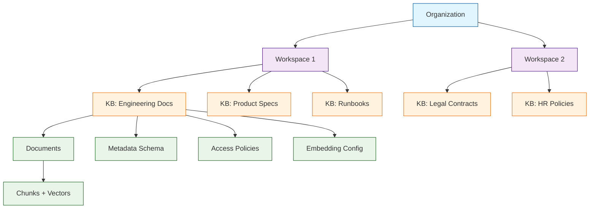
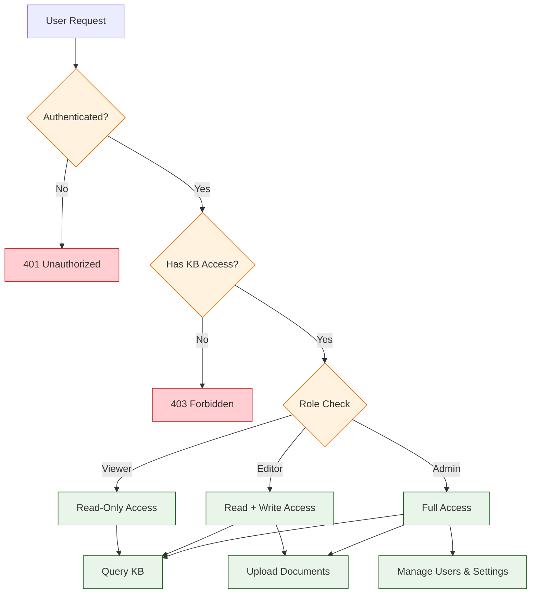
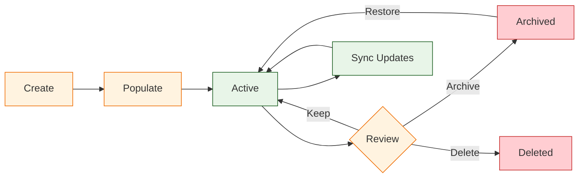

# Chapter 5: Knowledge Bases

In [Chapter 4](04-query-processing.md), you built a complete query processing pipeline that retrieves context and generates answers. But as your document collection grows beyond a handful of files, you need structure. Knowledge bases are the organizational layer that turns a pile of documents into a managed, searchable, access-controlled library.

A knowledge base in Quivr is more than a folder. It is a logical container with its own metadata schema, access policies, embedding configuration, and lifecycle rules. This chapter covers how to create, populate, manage, and govern knowledge bases for teams, projects, and multi-tenant environments.

## Knowledge Base Architecture



## Creating Knowledge Bases

### Basic Knowledge Base

```python
from quivr.knowledge import KnowledgeBaseManager

manager = KnowledgeBaseManager(
    api_url="http://localhost:8000",
    api_key="your-api-key"
)

# Create a knowledge base
kb = manager.create(
    name="Engineering Handbook",
    description="Internal engineering documentation, architecture decisions, "
                "and operational runbooks",
    tags=["engineering", "internal", "documentation"],
    metadata_schema={
        "team": {"type": "string", "required": True},
        "doc_type": {"type": "string", "enum": ["guide", "runbook", "adr", "rfc"]},
        "status": {"type": "string", "enum": ["draft", "review", "published"]},
        "owner": {"type": "string", "required": True},
        "last_reviewed": {"type": "date"}
    }
)

print(f"Knowledge base created: {kb.id}")
print(f"Name: {kb.name}")
print(f"Created at: {kb.created_at}")
```

### Knowledge Base with Custom Configuration

```python
# Create a KB with specific embedding and chunking settings
kb = manager.create(
    name="Legal Contracts",
    description="Contract library for legal review and compliance",
    embedding_config={
        "model": "text-embedding-3-large",
        "dimensions": 3072,
        "provider": "openai"
    },
    chunking_config={
        "strategy": "heading",
        "chunk_size": 1500,
        "chunk_overlap": 300,
        "heading_patterns": [
            r"^ARTICLE\s+\d+",
            r"^Section\s+\d+\.\d+",
            r"^EXHIBIT\s+[A-Z]"
        ]
    },
    retention_policy={
        "max_documents": 10000,
        "max_storage_gb": 50,
        "auto_archive_after_days": 365
    }
)
```

## Populating Knowledge Bases

### Bulk Document Upload

```python
from quivr.knowledge import DocumentUploader
import glob

uploader = DocumentUploader(
    knowledge_base_id=kb.id,
    api_url="http://localhost:8000",
    api_key="your-api-key",
    concurrent_uploads=5,
    progress_bar=True
)

# Upload all files from a directory
files = glob.glob("docs/engineering/**/*.*", recursive=True)

results = uploader.upload_batch(
    file_paths=files,
    default_metadata={
        "team": "platform",
        "status": "published",
        "owner": "eng-team@company.com"
    },
    metadata_overrides={
        "docs/engineering/runbooks/*.md": {
            "doc_type": "runbook"
        },
        "docs/engineering/adrs/*.md": {
            "doc_type": "adr"
        },
        "docs/engineering/rfcs/*.md": {
            "doc_type": "rfc"
        }
    }
)

print(f"Uploaded: {results.successful}")
print(f"Failed: {results.failed}")
print(f"Skipped (duplicate): {results.skipped}")

for error in results.errors:
    print(f"  ERROR: {error.file} - {error.message}")
```

### Incremental Sync from External Sources

```python
from quivr.knowledge.sync import SourceSync

# Sync from a Git repository
git_sync = SourceSync.from_git(
    knowledge_base_id=kb.id,
    repo_url="https://github.com/company/engineering-docs.git",
    branch="main",
    include_patterns=["docs/**/*.md", "docs/**/*.pdf"],
    exclude_patterns=["docs/drafts/**"],
    sync_interval_minutes=60
)

# Sync from Confluence
confluence_sync = SourceSync.from_confluence(
    knowledge_base_id=kb.id,
    base_url="https://company.atlassian.net",
    space_key="ENG",
    api_token="your-confluence-token",
    include_labels=["published", "approved"],
    sync_interval_minutes=120
)

# Sync from Google Drive
drive_sync = SourceSync.from_google_drive(
    knowledge_base_id=kb.id,
    folder_id="1AbCdEfGhIjKlMnOpQrStUvWxYz",
    credentials_path="credentials.json",
    file_types=["pdf", "docx", "txt"],
    sync_interval_minutes=180
)

# Run sync
sync_result = git_sync.sync()
print(f"Added: {sync_result.added}")
print(f"Updated: {sync_result.updated}")
print(f"Deleted: {sync_result.deleted}")
```

## Metadata Management

### Querying with Metadata Filters

```python
from quivr.knowledge import KnowledgeBaseQuery

query = KnowledgeBaseQuery(
    knowledge_base_id=kb.id,
    api_url="http://localhost:8000",
    api_key="your-api-key"
)

# Search within specific document types
results = query.search(
    question="How do we handle database migrations?",
    filters={
        "doc_type": {"$in": ["runbook", "guide"]},
        "status": "published",
        "team": "platform"
    },
    top_k=5
)

for result in results:
    print(f"[{result.metadata['doc_type']}] {result.metadata.get('title', 'Untitled')}")
    print(f"  Score: {result.score:.4f}")
    print(f"  Owner: {result.metadata['owner']}")
    print(f"  Text: {result.text[:120]}...")
    print()
```

### Metadata Analytics

```python
from quivr.knowledge import KnowledgeBaseAnalytics

analytics = KnowledgeBaseAnalytics(kb.id)

# Get document distribution
distribution = analytics.get_distribution()

print("Documents by type:")
for doc_type, count in distribution.by_field("doc_type").items():
    print(f"  {doc_type}: {count}")

print("\nDocuments by team:")
for team, count in distribution.by_field("team").items():
    print(f"  {team}: {count}")

print("\nDocuments by status:")
for status, count in distribution.by_field("status").items():
    print(f"  {status}: {count}")

# Identify stale documents
stale = analytics.find_stale_documents(
    days_since_review=180,
    status="published"
)

print(f"\nStale documents (not reviewed in 180 days): {len(stale)}")
for doc in stale[:5]:
    print(f"  {doc.filename} - last reviewed: {doc.metadata['last_reviewed']}")
```

## Access Control



### Role-Based Access Control

```python
from quivr.knowledge.access import AccessManager, Role

access = AccessManager(kb.id)

# Add users with specific roles
access.grant(
    user_email="alice@company.com",
    role=Role.ADMIN
)

access.grant(
    user_email="bob@company.com",
    role=Role.EDITOR
)

access.grant(
    user_email="charlie@company.com",
    role=Role.VIEWER
)

# Grant access to a team
access.grant_team(
    team_id="engineering",
    role=Role.VIEWER
)

# List current permissions
permissions = access.list_permissions()
for perm in permissions:
    print(f"{perm.principal}: {perm.role.value}")
```

### Role Permission Matrix

| Permission | Viewer | Editor | Admin |
|-----------|--------|--------|-------|
| Query knowledge base | Yes | Yes | Yes |
| View documents | Yes | Yes | Yes |
| Upload documents | No | Yes | Yes |
| Delete documents | No | Yes | Yes |
| Edit metadata | No | Yes | Yes |
| Manage access | No | No | Yes |
| Configure KB settings | No | No | Yes |
| Delete knowledge base | No | No | Yes |
| View analytics | Yes | Yes | Yes |
| Export data | No | Yes | Yes |

### API Key Scoping

```python
from quivr.knowledge.access import APIKeyManager

key_manager = APIKeyManager()

# Create a scoped API key for a specific KB
read_key = key_manager.create(
    name="dashboard-read-key",
    knowledge_bases=[kb.id],
    permissions=["query", "view"],
    rate_limit_rpm=100,
    expires_in_days=90
)

print(f"API Key: {read_key.key}")
print(f"Scoped to: {read_key.knowledge_bases}")
print(f"Permissions: {read_key.permissions}")
print(f"Expires: {read_key.expires_at}")

# Create a write key for CI/CD ingestion
write_key = key_manager.create(
    name="ci-cd-ingest-key",
    knowledge_bases=[kb.id],
    permissions=["upload", "delete"],
    rate_limit_rpm=50,
    ip_whitelist=["10.0.0.0/8"],
    expires_in_days=30
)
```

## Multi-Tenant Knowledge Bases

For SaaS applications, Quivr supports full tenant isolation at the knowledge base level.

```python
from quivr.knowledge.multitenancy import TenantManager

tenant_mgr = TenantManager()

# Create tenant-isolated knowledge bases
for tenant in ["acme-corp", "globex-inc", "initech"]:
    tenant_kb = tenant_mgr.create_tenant_kb(
        tenant_id=tenant,
        kb_name=f"{tenant}-docs",
        isolation_level="collection",  # "collection", "database", or "schema"
        resource_limits={
            "max_documents": 5000,
            "max_storage_gb": 10,
            "max_queries_per_hour": 1000,
            "max_embedding_tokens_per_day": 500000
        }
    )
    print(f"Created KB for {tenant}: {tenant_kb.id}")
```

### Tenant Isolation Levels

| Level | Isolation | Performance | Cost | Best For |
|-------|-----------|-------------|------|----------|
| Collection | Separate vector collections | Good | Low | Small tenants |
| Schema | Separate DB schemas | Better | Medium | Medium tenants |
| Database | Separate databases | Best | High | Enterprise tenants |

```python
# Query within tenant context
from quivr.knowledge.multitenancy import TenantContext

with TenantContext(tenant_id="acme-corp"):
    # All operations are scoped to acme-corp
    results = query.search(
        question="What is the deployment process?",
        top_k=5
    )
    # Only searches acme-corp documents
    # No risk of cross-tenant data leakage
```

## Knowledge Base Lifecycle



### Document Lifecycle Operations

```python
from quivr.knowledge import KnowledgeBaseManager

manager = KnowledgeBaseManager(api_url="http://localhost:8000", api_key="key")

# List all knowledge bases
all_kbs = manager.list(
    status="active",
    sort_by="updated_at",
    order="desc"
)

for kb in all_kbs:
    stats = manager.get_stats(kb.id)
    print(f"{kb.name}:")
    print(f"  Documents: {stats.document_count}")
    print(f"  Chunks: {stats.chunk_count}")
    print(f"  Storage: {stats.storage_mb:.1f} MB")
    print(f"  Last updated: {stats.last_updated}")
    print(f"  Queries (30d): {stats.queries_last_30d}")

# Archive a knowledge base
manager.archive(
    kb_id=old_kb.id,
    reason="Project completed",
    retain_vectors=False         # Free storage by removing vectors
)

# Duplicate a knowledge base (for testing or branching)
copy = manager.duplicate(
    source_kb_id=kb.id,
    new_name="Engineering Handbook (Staging)",
    include_documents=True,
    include_vectors=True,
    include_permissions=False
)

print(f"Duplicated to: {copy.id}")
```

### Document Versioning

```python
from quivr.knowledge.versioning import DocumentVersionManager

versioner = DocumentVersionManager(kb.id)

# Upload a new version of a document
new_version = versioner.upload_version(
    document_id=doc.id,
    file_path="docs/updated-runbook.md",
    change_description="Updated deployment steps for v2.0",
    author="alice@company.com"
)

print(f"Version: {new_version.version_number}")
print(f"Previous version: {new_version.previous_version}")

# List version history
history = versioner.get_history(doc.id)
for version in history:
    print(f"v{version.version_number}: {version.change_description} "
          f"({version.created_at}) by {version.author}")

# Roll back to a previous version
versioner.rollback(
    document_id=doc.id,
    target_version=2,
    re_embed=True               # Re-embed the rolled-back content
)
```

## Cross-Knowledge-Base Search

Sometimes answers span multiple knowledge bases. Quivr supports federated search across multiple KBs.

```python
from quivr.knowledge.search import FederatedSearch

search = FederatedSearch(
    knowledge_bases=[
        {"id": eng_kb.id, "weight": 1.0},
        {"id": product_kb.id, "weight": 0.8},
        {"id": runbook_kb.id, "weight": 1.2}   # Boost runbooks
    ],
    embedder=embedder,
    fusion_method="weighted_reciprocal_rank"
)

results = search.query(
    question="How do we handle service outages?",
    top_k=10,
    deduplicate=True,            # Remove duplicate content across KBs
    min_score=0.6
)

for result in results:
    print(f"[{result.knowledge_base_name}] Score: {result.score:.4f}")
    print(f"  Source: {result.metadata['filename']}")
    print(f"  Text: {result.text[:150]}...")
    print()
```

## Troubleshooting

| Problem | Cause | Solution |
|---------|-------|----------|
| Cross-tenant data leakage | Shared collection without filtering | Use tenant-specific collections or strict `where` filters |
| Stale search results | Documents updated without re-embedding | Enable auto-sync with `IncrementalSync` |
| Permission denied errors | Incorrect role assignment | Verify user roles with `access.list_permissions()` |
| Slow cross-KB search | Too many knowledge bases in federation | Limit federation to 3-5 most relevant KBs |
| Duplicate documents | Same file uploaded to multiple KBs | Enable deduplication with content hashing |
| Missing metadata | Documents uploaded without required fields | Enforce `metadata_schema` with required fields |
| Storage limits reached | Too many vectors or documents | Archive old KBs; set `retention_policy` |

## Summary

Knowledge bases provide the organizational structure that makes RAG systems practical at scale. In this chapter you learned:

- **Knowledge Base Creation** with custom metadata schemas, embedding configs, and retention policies
- **Bulk Population** from local files, Git repos, Confluence, and Google Drive
- **Metadata Management** for filtering, analytics, and staleness detection
- **Access Control** with role-based permissions, API key scoping, and team grants
- **Multi-Tenancy** with collection, schema, and database isolation levels
- **Lifecycle Management** including archiving, duplication, and document versioning
- **Federated Search** across multiple knowledge bases with weighted fusion

## Key Takeaways

1. **Define a metadata schema upfront** -- retroactively adding required fields to thousands of documents is painful.
2. **Use the right isolation level** -- collection-level works for most cases; database-level for strict compliance requirements.
3. **Automate sync from source systems** -- manual uploads do not scale and drift out of date quickly.
4. **Scope API keys tightly** -- give each integration the minimum permissions it needs.
5. **Monitor for staleness** -- set up alerts for documents not reviewed within your SLA period.

## Next Steps

Your knowledge bases are organized and governed. In [Chapter 6: Integration APIs](06-integration-apis.md), you will learn how to expose Quivr's capabilities to external applications through REST APIs, webhooks, and SDKs.

---

*Built with insights from the [Quivr](https://github.com/QuivrHQ/quivr) project.*
