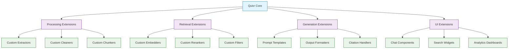
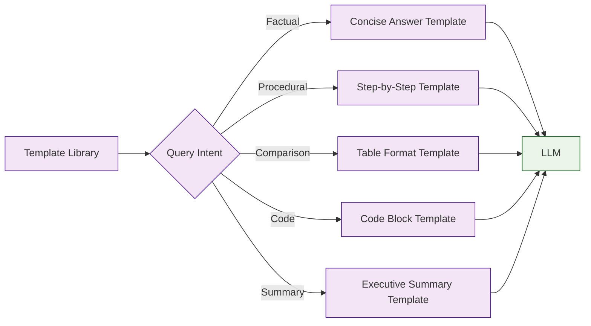
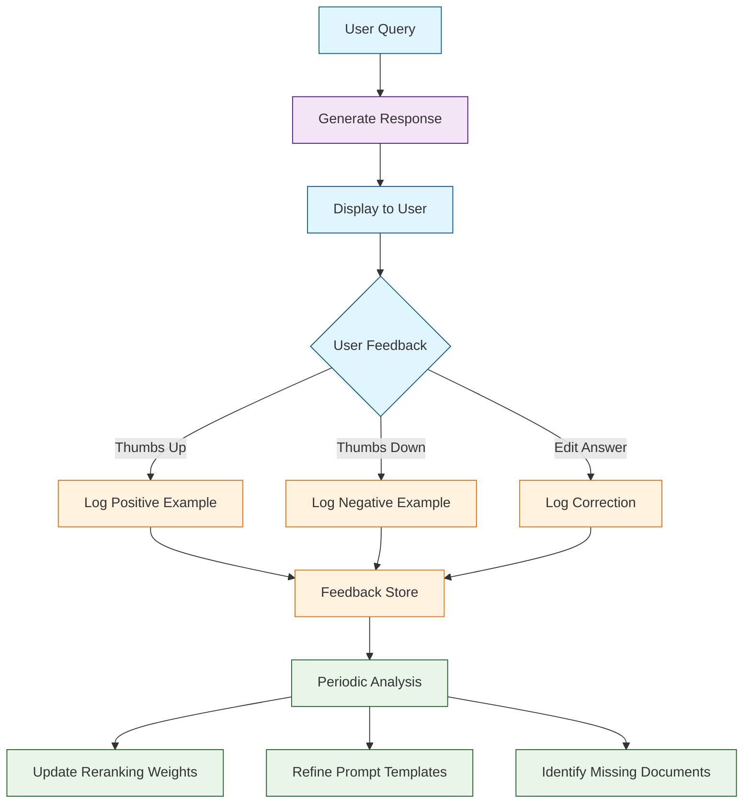

# Chapter 7: Customization

In [Chapter 6](06-integration-apis.md), you connected Quivr to external applications through APIs and webhooks. Now it is time to make Quivr truly yours. The default pipeline works well for general use cases, but real-world projects demand customization -- domain-specific preprocessing, specialized reranking, tailored prompt engineering, and branded user interfaces.

This chapter shows you how to extend every layer of the Quivr stack: custom document processors, pluggable embedding and reranking models, configurable prompt templates, feedback-driven learning loops, and frontend customization for chat and search interfaces.

## Quivr Extension Architecture



## Custom Document Processors

### Building a Custom Extractor

When your documents have a unique format that built-in extractors cannot handle, you can write your own.

```python
from quivr.processing.extractors import BaseExtractor, ExtractionResult
from typing import Optional
import json

class JSONLExtractor(BaseExtractor):
    """Custom extractor for JSON Lines files (one JSON object per line)."""

    supported_extensions = [".jsonl", ".ndjson"]

    def __init__(self, text_fields: list[str], metadata_fields: list[str] = None):
        self.text_fields = text_fields
        self.metadata_fields = metadata_fields or []

    def extract(self, file_path: str) -> ExtractionResult:
        documents = []
        metadata_list = []

        with open(file_path, "r", encoding="utf-8") as f:
            for line_num, line in enumerate(f, 1):
                if not line.strip():
                    continue
                try:
                    record = json.loads(line)

                    # Extract text from specified fields
                    text_parts = []
                    for field in self.text_fields:
                        value = record.get(field, "")
                        if value:
                            text_parts.append(str(value))

                    text = "\n\n".join(text_parts)

                    # Extract metadata
                    meta = {"line_number": line_num}
                    for field in self.metadata_fields:
                        if field in record:
                            meta[field] = record[field]

                    documents.append(text)
                    metadata_list.append(meta)

                except json.JSONDecodeError as e:
                    self.logger.warning(
                        f"Invalid JSON on line {line_num}: {e}"
                    )

        return ExtractionResult(
            text="\n\n---\n\n".join(documents),
            page_count=len(documents),
            metadata={"format": "jsonl", "record_count": len(documents)},
            per_page_metadata=metadata_list
        )

# Register the custom extractor
from quivr.processing.pipeline import DocumentPipeline

pipeline = DocumentPipeline()
pipeline.register_extractor(
    extensions=[".jsonl", ".ndjson"],
    extractor=JSONLExtractor(
        text_fields=["title", "body", "description"],
        metadata_fields=["id", "author", "created_at", "category"]
    )
)
```

### Custom Cleaner for Domain-Specific Content

```python
from quivr.processing.cleaners import CleanerStep
import re

class MedicalDocCleaner(CleanerStep):
    """Clean medical documents: normalize drug names, expand abbreviations,
    preserve dosage information."""

    ABBREVIATIONS = {
        "pt": "patient",
        "dx": "diagnosis",
        "tx": "treatment",
        "rx": "prescription",
        "hx": "history",
        "sx": "symptoms",
        "po": "by mouth",
        "iv": "intravenous",
        "im": "intramuscular",
        "bid": "twice daily",
        "tid": "three times daily",
        "qid": "four times daily",
        "prn": "as needed",
    }

    def __init__(self, expand_abbreviations: bool = True,
                 preserve_dosages: bool = True):
        self.expand_abbreviations = expand_abbreviations
        self.preserve_dosages = preserve_dosages

    def process(self, text: str) -> str:
        if self.expand_abbreviations:
            for abbr, full in self.ABBREVIATIONS.items():
                # Match abbreviation as whole word (case insensitive)
                pattern = rf"\b{re.escape(abbr)}\b"
                text = re.sub(
                    pattern,
                    f"{full} ({abbr})",
                    text,
                    flags=re.IGNORECASE
                )

        if self.preserve_dosages:
            # Normalize dosage formats: "500mg" -> "500 mg"
            text = re.sub(
                r"(\d+)\s*(mg|ml|mcg|g|kg|units?|iu)\b",
                r"\1 \2",
                text,
                flags=re.IGNORECASE
            )

        # Remove redundant whitespace around slashes in ratios
        text = re.sub(r"\s*/\s*", "/", text)

        return text

# Use in a pipeline
from quivr.processing.cleaners import TextCleaner, UnicodeNormalizer

medical_cleaner = TextCleaner(steps=[
    UnicodeNormalizer(form="NFKC"),
    MedicalDocCleaner(
        expand_abbreviations=True,
        preserve_dosages=True
    )
])
```

### Custom Chunker for Structured Data

```python
from quivr.processing.chunkers import BaseChunker, Chunk
from typing import List

class FAQChunker(BaseChunker):
    """Chunk FAQ-style documents into question-answer pairs."""

    def __init__(self, question_patterns: list[str] = None,
                 include_question_in_chunk: bool = True):
        self.question_patterns = question_patterns or [
            r"^Q:\s*",
            r"^\*\*Q:\*\*\s*",
            r"^#{1,3}\s+",
            r"^\d+\.\s+.*\?\s*$"
        ]
        self.include_question = include_question_in_chunk
        self._compiled = [re.compile(p, re.MULTILINE) for p in self.question_patterns]

    def split(self, text: str) -> List[Chunk]:
        chunks = []
        lines = text.split("\n")
        current_question = None
        current_answer_lines = []

        for line in lines:
            is_question = any(p.match(line) for p in self._compiled)

            if is_question:
                # Save previous Q&A pair
                if current_question and current_answer_lines:
                    answer = "\n".join(current_answer_lines).strip()
                    if self.include_question:
                        chunk_text = f"{current_question}\n\n{answer}"
                    else:
                        chunk_text = answer

                    chunks.append(Chunk(
                        text=chunk_text,
                        metadata={
                            "question": current_question,
                            "chunk_type": "faq",
                            "chunk_index": len(chunks)
                        }
                    ))

                current_question = line.strip()
                current_answer_lines = []
            else:
                current_answer_lines.append(line)

        # Save last Q&A pair
        if current_question and current_answer_lines:
            answer = "\n".join(current_answer_lines).strip()
            chunk_text = f"{current_question}\n\n{answer}" if self.include_question else answer
            chunks.append(Chunk(
                text=chunk_text,
                metadata={
                    "question": current_question,
                    "chunk_type": "faq",
                    "chunk_index": len(chunks)
                }
            ))

        return chunks

# Usage
faq_chunker = FAQChunker(
    question_patterns=[
        r"^#{2}\s+.*\?",      # ## How does X work?
        r"^Q:\s+",             # Q: How does X work?
    ]
)
chunks = faq_chunker.split(faq_text)
for chunk in chunks:
    print(f"Q: {chunk.metadata['question']}")
    print(f"A: {chunk.text[:100]}...")
    print()
```

## Custom Embedding Models

### Wrapping a Custom Model

```python
from quivr.embeddings.providers import BaseEmbedder
from typing import List
import numpy as np

class CustomEmbedder(BaseEmbedder):
    """Wrap any embedding model to work with Quivr."""

    def __init__(self, model_path: str, device: str = "cpu"):
        from transformers import AutoModel, AutoTokenizer
        import torch

        self.device = torch.device(device)
        self.tokenizer = AutoTokenizer.from_pretrained(model_path)
        self.model = AutoModel.from_pretrained(model_path).to(self.device)
        self.model.eval()

    @property
    def dimensions(self) -> int:
        return self.model.config.hidden_size

    def embed(self, text: str) -> List[float]:
        return self.embed_batch([text])[0]

    def embed_batch(self, texts: List[str]) -> List[List[float]]:
        import torch

        encoded = self.tokenizer(
            texts,
            padding=True,
            truncation=True,
            max_length=512,
            return_tensors="pt"
        ).to(self.device)

        with torch.no_grad():
            outputs = self.model(**encoded)
            # Mean pooling over token embeddings
            mask = encoded["attention_mask"].unsqueeze(-1)
            embeddings = (outputs.last_hidden_state * mask).sum(1) / mask.sum(1)

            # L2 normalize
            embeddings = torch.nn.functional.normalize(embeddings, p=2, dim=1)

        return embeddings.cpu().numpy().tolist()

# Use the custom embedder
embedder = CustomEmbedder(
    model_path="BAAI/bge-base-en-v1.5",
    device="cuda"
)

vectors = embedder.embed_batch(["Hello world", "How are you?"])
print(f"Dimensions: {embedder.dimensions}")
print(f"Vectors: {len(vectors)}")
```

### Multi-Model Embedding Strategy

```python
from quivr.embeddings.strategies import MultiModelEmbedder

# Use different embedding models for different content types
multi_embedder = MultiModelEmbedder(
    strategies={
        "code": {
            "model": "microsoft/codebert-base",
            "device": "cuda",
            "filter": lambda chunk: chunk.metadata.get("has_code", False)
        },
        "technical": {
            "model": "BAAI/bge-large-en-v1.5",
            "device": "cuda",
            "filter": lambda chunk: chunk.metadata.get("doc_type") in
                      ["api_docs", "architecture", "runbook"]
        },
        "default": {
            "model": "all-MiniLM-L6-v2",
            "device": "cpu",
            "filter": lambda chunk: True  # Catch-all
        }
    }
)

# Embed chunks with automatic model selection
vectors = multi_embedder.embed_chunks(chunks)

for chunk, vector in zip(chunks, vectors):
    model_used = multi_embedder.get_model_used(chunk)
    print(f"Chunk: {chunk.text[:50]}... -> Model: {model_used}")
```

## Custom Reranking

### Building a Domain-Specific Reranker

```python
from quivr.query.reranking import BaseReranker, RankedResult
from typing import List

class RecencyBoostReranker(BaseReranker):
    """Reranker that boosts recent documents based on their date metadata."""

    def __init__(self, base_reranker: BaseReranker,
                 date_field: str = "updated_at",
                 recency_weight: float = 0.2,
                 decay_days: int = 365):
        self.base_reranker = base_reranker
        self.date_field = date_field
        self.recency_weight = recency_weight
        self.decay_days = decay_days

    def rerank(self, query: str, candidates: List[RankedResult]) -> List[RankedResult]:
        from datetime import datetime, timezone

        # First, apply base reranking
        reranked = self.base_reranker.rerank(query, candidates)

        # Then boost scores based on recency
        now = datetime.now(timezone.utc)

        for result in reranked:
            date_str = result.metadata.get(self.date_field)
            if date_str:
                doc_date = datetime.fromisoformat(date_str)
                days_old = (now - doc_date).days
                recency_score = max(0, 1 - (days_old / self.decay_days))
            else:
                recency_score = 0.5  # Neutral for undated docs

            # Blend base score with recency
            result.score = (
                (1 - self.recency_weight) * result.score +
                self.recency_weight * recency_score
            )

        # Re-sort by blended score
        reranked.sort(key=lambda r: r.score, reverse=True)
        return reranked

# Usage
from quivr.query.reranking import CrossEncoderReranker

base = CrossEncoderReranker(model_name="cross-encoder/ms-marco-MiniLM-L-6-v2")
reranker = RecencyBoostReranker(
    base_reranker=base,
    date_field="last_reviewed",
    recency_weight=0.3,
    decay_days=180
)

results = reranker.rerank(query, candidates)
```

### Ensemble Reranker

Combine multiple reranking signals for better precision.

```python
from quivr.query.reranking import EnsembleReranker, CrossEncoderReranker

ensemble = EnsembleReranker(
    rerankers=[
        {
            "reranker": CrossEncoderReranker(
                model_name="cross-encoder/ms-marco-MiniLM-L-6-v2"
            ),
            "weight": 0.5,
            "name": "relevance"
        },
        {
            "reranker": RecencyBoostReranker(
                base_reranker=CrossEncoderReranker(
                    model_name="cross-encoder/ms-marco-MiniLM-L-6-v2"
                ),
                recency_weight=1.0    # Pure recency signal
            ),
            "weight": 0.2,
            "name": "recency"
        },
        {
            "reranker": MetadataReranker(
                boost_fields={
                    "doc_type": {"runbook": 1.2, "guide": 1.1, "rfc": 0.9},
                    "status": {"published": 1.0, "draft": 0.5}
                }
            ),
            "weight": 0.3,
            "name": "metadata"
        }
    ],
    fusion_method="weighted_sum",     # "weighted_sum" or "reciprocal_rank"
    top_k=5
)

final_results = ensemble.rerank(query, candidates)

for r in final_results:
    print(f"Score: {r.score:.4f} "
          f"(relevance={r.component_scores['relevance']:.3f}, "
          f"recency={r.component_scores['recency']:.3f}, "
          f"metadata={r.component_scores['metadata']:.3f})")
    print(f"  {r.text[:100]}...")
```

## Prompt Engineering

### Custom Prompt Templates



```python
from quivr.query.prompts import PromptTemplate, PromptRouter

# Define templates for different query types
factual_template = PromptTemplate(
    name="factual",
    system="""You are a precise assistant. Answer the question using ONLY
the provided context. If the answer is not in the context, say
"I don't have enough information to answer that."
Cite sources using [Source: filename] format.""",
    user="""Context:
{context}

Question: {question}

Provide a clear, direct answer:"""
)

procedural_template = PromptTemplate(
    name="procedural",
    system="""You are a helpful technical assistant. Provide step-by-step
instructions based on the context. Number each step. Include code
examples where relevant. Cite sources.""",
    user="""Context:
{context}

Question: {question}

Provide step-by-step instructions:"""
)

comparison_template = PromptTemplate(
    name="comparison",
    system="""You are an analytical assistant. Compare the items mentioned
in the question using information from the context. Present your
comparison in a structured format with pros/cons or a table.
Cite sources.""",
    user="""Context:
{context}

Question: {question}

Provide a detailed comparison:"""
)

code_template = PromptTemplate(
    name="code",
    system="""You are a coding assistant. Provide working code examples
based on the context. Include comments explaining key parts.
If the context contains code snippets, adapt them to answer the
question. Always specify the programming language.""",
    user="""Context:
{context}

Question: {question}

Provide code with explanation:"""
)

# Route queries to the appropriate template
router = PromptRouter(
    templates={
        "factual": factual_template,
        "procedural": procedural_template,
        "comparison": comparison_template,
        "code": code_template
    },
    default="factual",
    intent_classifier=IntentClassifier()
)

# Automatically select the right template
prompt = router.build(
    question="How do I configure custom embedding models?",
    context_chunks=retrieved_chunks
)

print(f"Selected template: {router.last_template_used}")
```

### Dynamic Prompt Construction

```python
from quivr.query.prompts import DynamicPromptBuilder

builder = DynamicPromptBuilder(
    base_system="""You are a knowledgeable assistant for {organization_name}.
Answer questions using the provided context from the {kb_name} knowledge base.
{custom_instructions}""",

    context_header="## Reference Documents\n",
    context_separator="\n---\n",

    context_item_template="""### {filename} (Page {page}, Relevance: {score:.0%})
{text}""",

    question_template="""## Question
{question}

## Answer
Provide a thorough answer based on the reference documents above.
{format_instructions}"""
)

# Build with runtime parameters
prompt = builder.build(
    question="What is our SLA for API uptime?",
    context_chunks=reranked_chunks,
    variables={
        "organization_name": "Acme Corp",
        "kb_name": "Engineering Handbook",
        "custom_instructions": "Always include the specific SLA numbers.",
        "format_instructions": "Format any percentages to two decimal places."
    },
    max_context_tokens=4000
)
```

## Feedback and Learning Loops



### Implementing Feedback Collection

```python
from quivr.feedback import FeedbackCollector, FeedbackType

collector = FeedbackCollector(
    storage="database",          # "database", "file", or "api"
    connection_url="postgresql://localhost/quivr"
)

# Record positive feedback
collector.record(
    query_id="q-12345",
    feedback_type=FeedbackType.POSITIVE,
    knowledge_base_id="kb-eng",
    query="How do we deploy to staging?",
    answer="To deploy to staging, follow these steps...",
    sources=["deployment-guide.md"],
    user_id="alice@company.com"
)

# Record negative feedback with details
collector.record(
    query_id="q-12346",
    feedback_type=FeedbackType.NEGATIVE,
    knowledge_base_id="kb-eng",
    query="What is our password policy?",
    answer="The password policy requires...",
    sources=["security-guide.md"],
    user_id="bob@company.com",
    details={
        "reason": "outdated",
        "comment": "This policy was updated last month. "
                   "The new minimum is 14 characters.",
        "correct_answer": "Passwords must be at least 14 characters..."
    }
)

# Record an answer correction
collector.record(
    query_id="q-12347",
    feedback_type=FeedbackType.CORRECTION,
    knowledge_base_id="kb-eng",
    query="What port does the API run on?",
    answer="The API runs on port 3000.",
    corrected_answer="The API runs on port 8000. Port 3000 is the frontend.",
    user_id="charlie@company.com"
)
```

### Analyzing Feedback for Improvements

```python
from quivr.feedback import FeedbackAnalyzer

analyzer = FeedbackAnalyzer(
    collector=collector,
    period_days=30
)

report = analyzer.generate_report(knowledge_base_id="kb-eng")

print(f"Feedback Summary (last 30 days):")
print(f"  Total queries with feedback: {report.total}")
print(f"  Positive: {report.positive} ({report.positive_rate:.1%})")
print(f"  Negative: {report.negative} ({report.negative_rate:.1%})")
print(f"  Corrections: {report.corrections}")

print(f"\nMost common negative feedback reasons:")
for reason, count in report.negative_reasons.items():
    print(f"  {reason}: {count}")

print(f"\nDocuments most often cited in negative feedback:")
for doc, count in report.problematic_documents[:5]:
    print(f"  {doc}: {count} negative citations")

print(f"\nQueries with no relevant results:")
for query in report.zero_result_queries[:5]:
    print(f"  '{query}'")
```

## Frontend Customization

### Custom Chat Interface Configuration

```python
from quivr.ui.config import ChatConfig

chat_config = ChatConfig(
    title="Engineering Knowledge Assistant",
    subtitle="Ask questions about our engineering documentation",
    placeholder="What would you like to know?",
    welcome_message="Hello! I can help you find information from our "
                    "engineering docs, runbooks, and architecture decisions.",
    suggested_questions=[
        "How do I deploy to production?",
        "What is our incident response process?",
        "Explain our microservice architecture",
        "What are the coding standards for Python?"
    ],
    theme={
        "primary_color": "#1a73e8",
        "background_color": "#ffffff",
        "text_color": "#202124",
        "font_family": "Inter, sans-serif",
        "border_radius": "8px",
        "max_width": "800px"
    },
    features={
        "show_sources": True,
        "show_confidence": True,
        "allow_feedback": True,
        "allow_copy": True,
        "show_suggested_questions": True,
        "enable_voice_input": False,
        "markdown_rendering": True,
        "code_highlighting": True,
        "dark_mode_toggle": True
    }
)
```

### Custom Source Display Component

```python
from quivr.ui.components import SourceCard

class EnhancedSourceCard(SourceCard):
    """Custom source display with document previews and quick actions."""

    def render(self, source):
        return {
            "type": "source_card",
            "filename": source.filename,
            "page": source.page,
            "score": source.score,
            "score_label": self._score_label(source.score),
            "preview": source.text[:200],
            "doc_type_icon": self._get_icon(source.metadata.get("doc_type")),
            "actions": [
                {"label": "View full document", "url": source.document_url},
                {"label": "Copy citation", "action": "copy_citation"},
                {"label": "Open in editor", "url": source.edit_url}
            ],
            "badges": self._build_badges(source)
        }

    def _score_label(self, score: float) -> str:
        if score >= 0.9:
            return "Highly relevant"
        elif score >= 0.7:
            return "Relevant"
        elif score >= 0.5:
            return "Somewhat relevant"
        return "Low relevance"

    def _get_icon(self, doc_type: str) -> str:
        icons = {
            "runbook": "terminal",
            "guide": "book",
            "adr": "git-branch",
            "rfc": "file-text",
            "api_docs": "code"
        }
        return icons.get(doc_type, "file")

    def _build_badges(self, source) -> list:
        badges = []
        if source.metadata.get("status") == "draft":
            badges.append({"text": "Draft", "color": "yellow"})
        if source.metadata.get("doc_type"):
            badges.append({
                "text": source.metadata["doc_type"].upper(),
                "color": "blue"
            })
        return badges
```

## Plugin System

### Creating a Quivr Plugin

```python
from quivr.plugins import QuivrPlugin, hook

class AuditLogPlugin(QuivrPlugin):
    """Plugin that logs all queries and responses for compliance."""

    name = "audit-log"
    version = "1.0.0"

    def __init__(self, log_path: str = "audit.log"):
        self.log_path = log_path

    @hook("before_query")
    def log_query(self, query: str, knowledge_base_id: str,
                  user_id: str, **kwargs):
        """Log incoming queries before processing."""
        import json
        from datetime import datetime

        entry = {
            "timestamp": datetime.utcnow().isoformat(),
            "event": "query",
            "user_id": user_id,
            "knowledge_base_id": knowledge_base_id,
            "query": query
        }

        with open(self.log_path, "a") as f:
            f.write(json.dumps(entry) + "\n")

    @hook("after_query")
    def log_response(self, query: str, response, latency_ms: float,
                     user_id: str, **kwargs):
        """Log responses after generation."""
        import json
        from datetime import datetime

        entry = {
            "timestamp": datetime.utcnow().isoformat(),
            "event": "response",
            "user_id": user_id,
            "query": query,
            "answer_length": len(response.answer),
            "source_count": len(response.sources),
            "latency_ms": latency_ms,
            "model": response.model
        }

        with open(self.log_path, "a") as f:
            f.write(json.dumps(entry) + "\n")

    @hook("on_error")
    def log_error(self, error: Exception, context: dict, **kwargs):
        """Log errors for debugging."""
        import json, traceback
        from datetime import datetime

        entry = {
            "timestamp": datetime.utcnow().isoformat(),
            "event": "error",
            "error_type": type(error).__name__,
            "error_message": str(error),
            "traceback": traceback.format_exc(),
            "context": context
        }

        with open(self.log_path, "a") as f:
            f.write(json.dumps(entry) + "\n")

# Register the plugin
from quivr.plugins import PluginManager

manager = PluginManager()
manager.register(AuditLogPlugin(log_path="/var/log/quivr/audit.log"))
```

### Plugin Lifecycle Hooks

| Hook | Trigger | Use Cases |
|------|---------|-----------|
| `before_ingest` | Before document processing | Validation, virus scan, format check |
| `after_ingest` | After document is embedded | Notifications, cache invalidation |
| `before_query` | Before retrieval starts | Audit logging, query rewriting |
| `after_retrieval` | After chunks are retrieved | Custom filtering, A/B testing |
| `before_generation` | Before LLM is called | Prompt injection detection |
| `after_query` | After response is generated | Logging, analytics, feedback |
| `on_error` | When any error occurs | Error tracking, alerting |
| `on_feedback` | When user provides feedback | Learning loop triggers |

## Troubleshooting

| Problem | Cause | Solution |
|---------|-------|----------|
| Custom extractor not triggered | Extension not registered | Verify `register_extractor()` with correct extensions |
| Cleaner corrupts text | Regex too aggressive | Test patterns on sample data; add unit tests |
| Custom embedder dimension mismatch | Model outputs different size | Set `dimensions` property correctly; verify with test embed |
| Reranker too slow | Model too large for hardware | Use smaller cross-encoder; batch inputs |
| Prompt template too long | Too many context chunks | Enforce `max_context_tokens` in builder |
| Plugin not firing | Hook name misspelled | Check against hook names in lifecycle table |
| Feedback not recorded | Database connection issue | Verify `connection_url`; check write permissions |

## Summary

Customization is what turns a generic RAG tool into your organization's knowledge system. In this chapter you learned:

- **Custom Extractors** for domain-specific file formats like JSONL and proprietary formats
- **Custom Cleaners** for specialized text normalization (medical, legal, financial)
- **Custom Chunkers** for structured content like FAQs and Q&A pairs
- **Custom Embedders** wrapping any HuggingFace model with the Quivr interface
- **Custom Rerankers** that blend relevance with recency, metadata, and business rules
- **Prompt Engineering** with intent-routed templates and dynamic variable injection
- **Feedback Loops** that collect user feedback and drive continuous improvement
- **Plugin System** with lifecycle hooks for audit logging, validation, and analytics

## Key Takeaways

1. **Start with the default pipeline** -- customize only the components that matter for your use case.
2. **Test custom components in isolation** -- unit test extractors, cleaners, and chunkers before plugging them in.
3. **Use ensemble reranking** -- combining multiple signals (relevance, recency, metadata) beats any single reranker.
4. **Route prompts by intent** -- a "how-to" question needs a different template than a "what is" question.
5. **Close the feedback loop** -- user feedback is the most valuable signal for improving your RAG system over time.

## Next Steps

Your Quivr instance is now fully customized for your domain. In [Chapter 8: Production Deployment](08-production-deployment.md), you will learn how to deploy, scale, monitor, and operate Quivr in a production environment.

---

*Built with insights from the [Quivr](https://github.com/QuivrHQ/quivr) project.*
