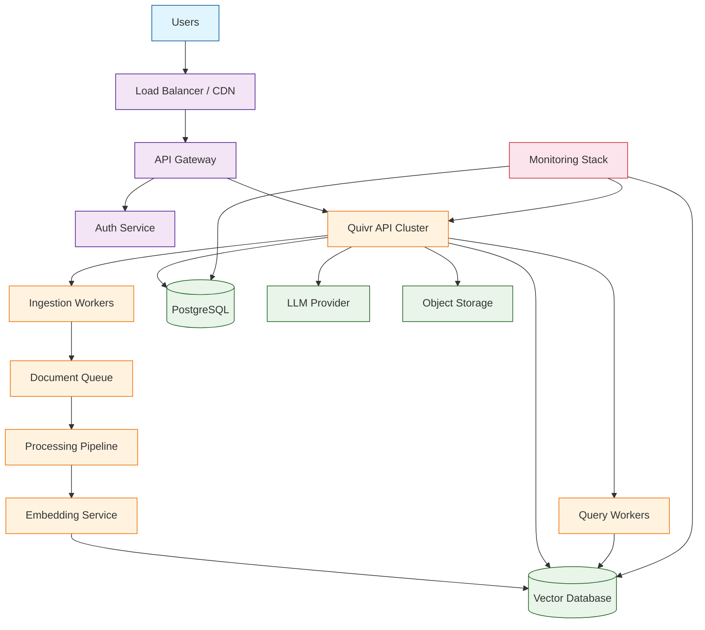
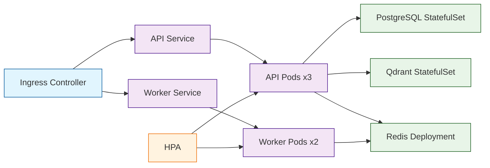
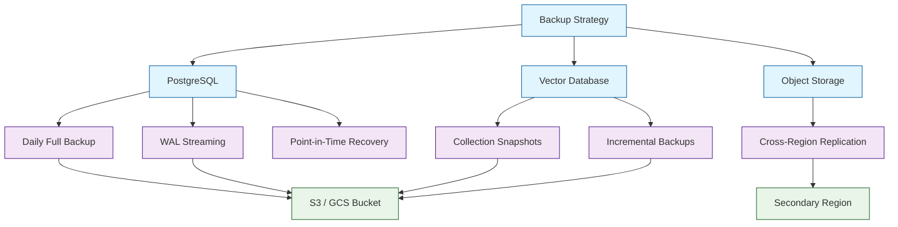

# Chapter 8: Production Deployment

Welcome to **Chapter 8: Production Deployment**. In this part of **Quivr Tutorial: Open-Source RAG Framework for Document Ingestion**, you will build an intuitive mental model first, then move into concrete implementation details and practical production tradeoffs.


In [Chapter 7](07-customization.md), you customized Quivr with domain-specific processors, rerankers, prompts, and plugins. Now it is time to take everything to production. A development setup running on localhost is fine for experimentation, but serving real users at scale requires proper containerization, infrastructure design, security hardening, monitoring, and cost management.

This chapter covers the complete journey from a single Docker container to a production-grade deployment: infrastructure architecture, Docker and Kubernetes configurations, database and vector store scaling, security hardening, observability, performance tuning, backup strategies, and a comprehensive go-live checklist.

## Production Architecture



## Docker Deployment

### Production Docker Compose

```yaml
# docker-compose.prod.yml
version: "3.8"

services:
  api:
    image: quivrhq/quivr-api:${QUIVR_VERSION:-latest}
    restart: always
    ports:
      - "8000:8000"
    env_file: .env.production
    environment:
      - WORKERS=4
      - MAX_REQUESTS=1000
      - MAX_REQUESTS_JITTER=50
      - TIMEOUT=120
      - GRACEFUL_TIMEOUT=30
    depends_on:
      db:
        condition: service_healthy
      vectordb:
        condition: service_healthy
      redis:
        condition: service_healthy
    deploy:
      resources:
        limits:
          cpus: "4"
          memory: 8G
        reservations:
          cpus: "2"
          memory: 4G
    healthcheck:
      test: ["CMD", "curl", "-f", "http://localhost:8000/health"]
      interval: 30s
      timeout: 10s
      retries: 3
      start_period: 40s
    volumes:
      - upload_tmp:/tmp/uploads
    networks:
      - quivr-net

  worker:
    image: quivrhq/quivr-worker:${QUIVR_VERSION:-latest}
    restart: always
    env_file: .env.production
    environment:
      - CELERY_CONCURRENCY=4
      - CELERY_MAX_TASKS_PER_CHILD=100
    depends_on:
      - api
      - redis
    deploy:
      replicas: 2
      resources:
        limits:
          cpus: "4"
          memory: 8G
    networks:
      - quivr-net

  db:
    image: postgres:15-alpine
    restart: always
    environment:
      POSTGRES_DB: quivr
      POSTGRES_USER: ${DB_USER}
      POSTGRES_PASSWORD: ${DB_PASSWORD}
    volumes:
      - postgres_data:/var/lib/postgresql/data
      - ./init.sql:/docker-entrypoint-initdb.d/init.sql
    healthcheck:
      test: ["CMD-SHELL", "pg_isready -U ${DB_USER}"]
      interval: 10s
      timeout: 5s
      retries: 5
    deploy:
      resources:
        limits:
          cpus: "2"
          memory: 4G
    networks:
      - quivr-net

  vectordb:
    image: qdrant/qdrant:v1.7.4
    restart: always
    volumes:
      - qdrant_data:/qdrant/storage
    environment:
      - QDRANT__SERVICE__GRPC_PORT=6334
      - QDRANT__SERVICE__HTTP_PORT=6333
      - QDRANT__STORAGE__STORAGE_PATH=/qdrant/storage
      - QDRANT__STORAGE__OPTIMIZERS__INDEXING_THRESHOLD=20000
    healthcheck:
      test: ["CMD", "curl", "-f", "http://localhost:6333/healthz"]
      interval: 10s
      timeout: 5s
      retries: 5
    deploy:
      resources:
        limits:
          cpus: "4"
          memory: 16G
        reservations:
          memory: 8G
    networks:
      - quivr-net

  redis:
    image: redis:7-alpine
    restart: always
    command: redis-server --maxmemory 1gb --maxmemory-policy allkeys-lru
    volumes:
      - redis_data:/data
    healthcheck:
      test: ["CMD", "redis-cli", "ping"]
      interval: 10s
      timeout: 5s
      retries: 5
    networks:
      - quivr-net

  nginx:
    image: nginx:alpine
    restart: always
    ports:
      - "443:443"
      - "80:80"
    volumes:
      - ./nginx.conf:/etc/nginx/nginx.conf:ro
      - ./certs:/etc/nginx/certs:ro
    depends_on:
      - api
    networks:
      - quivr-net

volumes:
  postgres_data:
  qdrant_data:
  redis_data:
  upload_tmp:

networks:
  quivr-net:
    driver: bridge
```

### Production Environment Variables

```python
# .env.production configuration reference
production_config = {
    # Database
    "DB_HOST": "db",
    "DB_PORT": "5432",
    "DB_NAME": "quivr",
    "DB_USER": "quivr_app",
    "DB_PASSWORD": "use-a-secret-manager",  # Never hardcode
    "DB_POOL_SIZE": "20",
    "DB_MAX_OVERFLOW": "10",

    # Vector Database
    "VECTOR_DB_HOST": "vectordb",
    "VECTOR_DB_PORT": "6333",
    "VECTOR_DB_COLLECTION": "quivr-production",

    # Redis
    "REDIS_URL": "redis://redis:6379/0",
    "CELERY_BROKER_URL": "redis://redis:6379/1",

    # LLM Provider
    "OPENAI_API_KEY": "use-a-secret-manager",
    "LLM_MODEL": "gpt-4-turbo-preview",
    "LLM_TEMPERATURE": "0.3",
    "LLM_MAX_TOKENS": "1000",

    # Embedding
    "EMBEDDING_MODEL": "text-embedding-3-small",
    "EMBEDDING_DIMENSIONS": "1536",
    "EMBEDDING_BATCH_SIZE": "100",

    # Security
    "SECRET_KEY": "use-a-secret-manager",
    "CORS_ORIGINS": "https://app.yourcompany.com",
    "MAX_UPLOAD_SIZE_MB": "25",
    "RATE_LIMIT_RPM": "100",

    # Observability
    "LOG_LEVEL": "INFO",
    "LOG_FORMAT": "json",
    "SENTRY_DSN": "https://your-sentry-dsn",
    "PROMETHEUS_ENABLED": "true",
}
```

## Kubernetes Deployment

For larger-scale deployments, Kubernetes provides auto-scaling, rolling updates, and self-healing.



### Kubernetes API Deployment

```yaml
# k8s/api-deployment.yaml
apiVersion: apps/v1
kind: Deployment
metadata:
  name: quivr-api
  labels:
    app: quivr
    component: api
spec:
  replicas: 3
  strategy:
    type: RollingUpdate
    rollingUpdate:
      maxSurge: 1
      maxUnavailable: 0
  selector:
    matchLabels:
      app: quivr
      component: api
  template:
    metadata:
      labels:
        app: quivr
        component: api
    spec:
      containers:
        - name: api
          image: quivrhq/quivr-api:1.0.0
          ports:
            - containerPort: 8000
          envFrom:
            - secretRef:
                name: quivr-secrets
            - configMapRef:
                name: quivr-config
          resources:
            requests:
              cpu: "1"
              memory: "2Gi"
            limits:
              cpu: "4"
              memory: "8Gi"
          readinessProbe:
            httpGet:
              path: /health
              port: 8000
            initialDelaySeconds: 15
            periodSeconds: 10
          livenessProbe:
            httpGet:
              path: /health
              port: 8000
            initialDelaySeconds: 30
            periodSeconds: 30
          volumeMounts:
            - name: tmp-uploads
              mountPath: /tmp/uploads
      volumes:
        - name: tmp-uploads
          emptyDir:
            sizeLimit: 5Gi
---
apiVersion: autoscaling/v2
kind: HorizontalPodAutoscaler
metadata:
  name: quivr-api-hpa
spec:
  scaleTargetRef:
    apiVersion: apps/v1
    kind: Deployment
    name: quivr-api
  minReplicas: 2
  maxReplicas: 10
  metrics:
    - type: Resource
      resource:
        name: cpu
        target:
          type: Utilization
          averageUtilization: 70
    - type: Resource
      resource:
        name: memory
        target:
          type: Utilization
          averageUtilization: 80
```

## Security Hardening

### Security Configuration

```python
from quivr.security import SecurityConfig

security = SecurityConfig(
    # TLS / HTTPS
    tls_enabled=True,
    tls_cert_path="/etc/ssl/certs/quivr.crt",
    tls_key_path="/etc/ssl/private/quivr.key",
    min_tls_version="1.2",

    # Authentication
    auth_provider="oauth2",          # "api_key", "oauth2", "saml"
    oauth2_issuer="https://auth.yourcompany.com",
    oauth2_audience="quivr-api",
    token_expiry_minutes=60,

    # Authorization
    default_role="viewer",
    enforce_kb_permissions=True,

    # Input validation
    max_upload_size_mb=25,
    allowed_file_types=[".pdf", ".txt", ".md", ".docx", ".html"],
    max_query_length=1000,
    sanitize_inputs=True,

    # Rate limiting
    rate_limit_per_user_rpm=60,
    rate_limit_per_key_rpm=100,
    rate_limit_burst=10,

    # Data protection
    encrypt_at_rest=True,
    encrypt_vectors=False,           # Performance tradeoff
    pii_detection_enabled=True,
    audit_log_enabled=True
)
```

### Security Checklist

| Category | Requirement | Priority |
|----------|-------------|----------|
| Transport | TLS 1.2+ for all connections | Critical |
| Authentication | OAuth2 / SAML for users | Critical |
| Authentication | Scoped API keys with expiration | Critical |
| Authorization | RBAC on all knowledge bases | High |
| Input Validation | File type and size limits | High |
| Input Validation | Query length limits | Medium |
| Data Protection | Encryption at rest for databases | High |
| Data Protection | PII detection and masking | Medium |
| Rate Limiting | Per-user and per-key limits | High |
| Audit | Structured audit logs for all operations | High |
| Network | Internal services not exposed publicly | Critical |
| Secrets | All credentials in secret manager | Critical |
| Dependencies | Regular vulnerability scanning | Medium |

### Nginx Reverse Proxy Configuration

```python
# Generate nginx configuration for Quivr
nginx_config = """
upstream quivr_api {
    least_conn;
    server api:8000;
}

server {
    listen 443 ssl http2;
    server_name api.yourcompany.com;

    ssl_certificate     /etc/nginx/certs/fullchain.pem;
    ssl_certificate_key /etc/nginx/certs/privkey.pem;
    ssl_protocols       TLSv1.2 TLSv1.3;
    ssl_ciphers         HIGH:!aNULL:!MD5;

    # Security headers
    add_header Strict-Transport-Security "max-age=31536000" always;
    add_header X-Content-Type-Options "nosniff" always;
    add_header X-Frame-Options "DENY" always;
    add_header X-XSS-Protection "1; mode=block" always;

    # Rate limiting
    limit_req_zone $binary_remote_addr zone=api:10m rate=10r/s;
    limit_req zone=api burst=20 nodelay;

    # Upload size limit
    client_max_body_size 25m;

    location /api/ {
        proxy_pass http://quivr_api;
        proxy_set_header Host $host;
        proxy_set_header X-Real-IP $remote_addr;
        proxy_set_header X-Forwarded-For $proxy_add_x_forwarded_for;
        proxy_set_header X-Forwarded-Proto $scheme;

        # Streaming support
        proxy_buffering off;
        proxy_cache off;
        proxy_read_timeout 300s;
    }

    location /health {
        proxy_pass http://quivr_api/health;
        access_log off;
    }
}

server {
    listen 80;
    server_name api.yourcompany.com;
    return 301 https://$host$request_uri;
}
"""
```

## Observability

### Metrics with Prometheus

```python
from quivr.monitoring.metrics import QuivrMetrics

metrics = QuivrMetrics(
    namespace="quivr",
    port=9090
)

# Key metrics exposed automatically
exposed_metrics = {
    # Ingestion metrics
    "quivr_ingestion_total": "Total documents ingested",
    "quivr_ingestion_errors_total": "Total ingestion errors",
    "quivr_ingestion_duration_seconds": "Document processing time",
    "quivr_chunks_created_total": "Total chunks created",

    # Query metrics
    "quivr_queries_total": "Total queries processed",
    "quivr_query_duration_seconds": "End-to-end query latency",
    "quivr_retrieval_duration_seconds": "Vector search latency",
    "quivr_generation_duration_seconds": "LLM generation latency",
    "quivr_query_results_count": "Number of results returned",

    # Resource metrics
    "quivr_active_connections": "Current active connections",
    "quivr_queue_depth": "Ingestion queue depth",
    "quivr_vector_count": "Total vectors stored",
    "quivr_storage_bytes": "Total storage used",

    # LLM metrics
    "quivr_llm_tokens_total": "Total LLM tokens consumed",
    "quivr_llm_cost_dollars": "Estimated LLM cost",
    "quivr_embedding_tokens_total": "Total embedding tokens",
}
```

### Structured Logging

```python
from quivr.monitoring.logging import configure_logging
import structlog

configure_logging(
    level="INFO",
    format="json",
    output="stdout",
    include_fields=[
        "timestamp", "level", "message",
        "request_id", "user_id", "kb_id",
        "latency_ms", "status_code"
    ]
)

logger = structlog.get_logger()

# Example structured log entries
logger.info(
    "query_completed",
    request_id="req-abc123",
    user_id="alice@company.com",
    kb_id="kb-eng",
    query="How do we deploy?",
    latency_ms=1250,
    retrieval_ms=200,
    generation_ms=1000,
    results_count=5,
    tokens_used=1500,
    model="gpt-4-turbo-preview"
)

logger.warning(
    "slow_query",
    request_id="req-def456",
    latency_ms=5000,
    threshold_ms=3000,
    query="complex multi-part question..."
)

logger.error(
    "ingestion_failed",
    filename="corrupt-file.pdf",
    error_type="ExtractionError",
    error_message="PDF file is corrupted or password-protected",
    stack_trace="..."
)
```

### Alerting Rules

```python
# Prometheus alerting rules
alerting_rules = {
    "QuivrHighErrorRate": {
        "expr": "rate(quivr_queries_total{status='error'}[5m]) / "
                "rate(quivr_queries_total[5m]) > 0.05",
        "for": "5m",
        "severity": "critical",
        "summary": "Query error rate exceeds 5%"
    },
    "QuivrSlowQueries": {
        "expr": "histogram_quantile(0.95, "
                "quivr_query_duration_seconds_bucket) > 5",
        "for": "10m",
        "severity": "warning",
        "summary": "P95 query latency exceeds 5 seconds"
    },
    "QuivrQueueBacklog": {
        "expr": "quivr_queue_depth > 1000",
        "for": "15m",
        "severity": "warning",
        "summary": "Ingestion queue depth exceeds 1000"
    },
    "QuivrStorageHigh": {
        "expr": "quivr_storage_bytes / quivr_storage_limit_bytes > 0.85",
        "for": "30m",
        "severity": "warning",
        "summary": "Storage usage exceeds 85%"
    },
    "QuivrVectorDBDown": {
        "expr": "up{job='qdrant'} == 0",
        "for": "1m",
        "severity": "critical",
        "summary": "Vector database is unreachable"
    },
    "QuivrLLMCostSpike": {
        "expr": "increase(quivr_llm_cost_dollars[1h]) > 50",
        "for": "5m",
        "severity": "warning",
        "summary": "LLM cost spike: >$50 in the last hour"
    }
}
```

## Performance Tuning

### Performance Optimization Guide

| Component | Parameter | Default | Production | Impact |
|-----------|-----------|---------|------------|--------|
| API Workers | `WORKERS` | 1 | 2-4 per CPU | Throughput |
| DB Pool | `DB_POOL_SIZE` | 5 | 20 | Connection throughput |
| Embedding Batch | `EMBEDDING_BATCH_SIZE` | 32 | 100 | Ingestion speed |
| Vector Index | `hnsw:ef_search` | 50 | 100-200 | Search accuracy |
| Vector Index | `hnsw:m` | 16 | 32 | Recall vs memory |
| Redis | `maxmemory` | 256mb | 1-4gb | Cache hit rate |
| Query | `top_k` | 10 | 5-8 | Latency vs recall |
| Upload | `MAX_UPLOAD_SIZE_MB` | 100 | 25 | Security / memory |
| Celery | `CELERY_CONCURRENCY` | 2 | 4-8 | Ingestion throughput |

### Connection Pooling and Caching

```python
from quivr.performance import PerformanceConfig

perf = PerformanceConfig(
    # Database connection pool
    db_pool_size=20,
    db_max_overflow=10,
    db_pool_timeout=30,
    db_pool_recycle=3600,

    # Redis caching
    cache_enabled=True,
    cache_ttl_seconds=3600,
    cache_max_size_mb=1024,
    cache_strategy="lru",

    # Embedding cache (avoid re-embedding same text)
    embedding_cache_enabled=True,
    embedding_cache_ttl_hours=168,    # 7 days

    # Query result cache
    query_cache_enabled=True,
    query_cache_ttl_seconds=300,      # 5 minutes
    query_cache_max_entries=10000,

    # Connection reuse
    http_keep_alive=True,
    http_connection_pool_size=100,
    llm_connection_pool_size=20
)
```

### Load Testing

```python
from quivr.testing import LoadTest

load_test = LoadTest(
    base_url="https://api.yourcompany.com",
    api_key="load-test-key"
)

# Configure test scenarios
scenarios = [
    {
        "name": "steady_state",
        "queries_per_second": 10,
        "duration_seconds": 300,
        "query_distribution": {
            "simple": 0.6,       # Simple factual queries
            "complex": 0.3,      # Multi-part queries
            "streaming": 0.1     # Streaming queries
        }
    },
    {
        "name": "peak_load",
        "queries_per_second": 50,
        "duration_seconds": 120,
        "ramp_up_seconds": 30
    },
    {
        "name": "ingestion_load",
        "uploads_per_minute": 100,
        "duration_seconds": 600,
        "file_size_range_kb": [10, 5000]
    }
]

# Run the test
results = load_test.run(scenarios)

for scenario in results:
    print(f"\n{'='*50}")
    print(f"Scenario: {scenario.name}")
    print(f"{'='*50}")
    print(f"Total requests: {scenario.total_requests}")
    print(f"Successful: {scenario.successful} ({scenario.success_rate:.1%})")
    print(f"P50 latency: {scenario.p50_ms:.0f}ms")
    print(f"P95 latency: {scenario.p95_ms:.0f}ms")
    print(f"P99 latency: {scenario.p99_ms:.0f}ms")
    print(f"Max latency: {scenario.max_ms:.0f}ms")
    print(f"Throughput: {scenario.rps:.1f} req/s")
    print(f"Error rate: {scenario.error_rate:.2%}")
```

## Backup and Recovery



### Backup Configuration

```python
from quivr.ops.backup import BackupManager

backup = BackupManager(
    storage_backend="s3",
    bucket="quivr-backups",
    region="us-east-1",
    encryption=True
)

# Schedule automated backups
backup.schedule(
    components={
        "postgresql": {
            "method": "pg_dump",
            "schedule": "0 2 * * *",      # Daily at 2 AM
            "retention_days": 30,
            "wal_archiving": True          # Continuous WAL shipping
        },
        "vector_db": {
            "method": "snapshot",
            "schedule": "0 3 * * *",      # Daily at 3 AM
            "retention_days": 14
        },
        "config": {
            "method": "file_copy",
            "schedule": "0 1 * * 0",      # Weekly on Sunday
            "retention_days": 90,
            "include": [".env.production", "nginx.conf", "docker-compose.prod.yml"]
        }
    }
)

# Manual backup
result = backup.run_now(component="postgresql")
print(f"Backup completed: {result.filename}")
print(f"Size: {result.size_mb:.1f} MB")
print(f"Duration: {result.duration_seconds:.1f}s")
print(f"Location: {result.storage_path}")
```

### Disaster Recovery

```python
from quivr.ops.recovery import RecoveryManager

recovery = RecoveryManager(
    backup_storage="s3://quivr-backups"
)

# List available backups
backups = recovery.list_backups(
    component="postgresql",
    limit=10
)

for b in backups:
    print(f"{b.timestamp}: {b.filename} ({b.size_mb:.1f} MB)")

# Restore from a specific backup
restore_result = recovery.restore(
    component="postgresql",
    backup_id=backups[0].id,
    target_database="quivr_restored",
    verify_integrity=True
)

print(f"Restore status: {restore_result.status}")
print(f"Tables restored: {restore_result.tables_count}")
print(f"Rows restored: {restore_result.rows_count:,}")
print(f"Duration: {restore_result.duration_seconds:.1f}s")

# Point-in-time recovery
pitr_result = recovery.point_in_time_restore(
    component="postgresql",
    target_time="2024-06-15T14:30:00Z",
    target_database="quivr_pitr"
)
```

## Cost Management

### Cost Breakdown and Optimization

| Cost Category | Typical Range | Optimization Strategy |
|---------------|---------------|----------------------|
| LLM API calls | 40-60% of total | Cache responses; use smaller models for simple queries |
| Embedding API | 10-20% of total | Cache embeddings; use local models; incremental sync |
| Vector DB hosting | 10-15% of total | Optimize index params; archive old collections |
| Compute (API/Workers) | 10-20% of total | Auto-scale; right-size instances |
| Database hosting | 5-10% of total | Connection pooling; query optimization |
| Object storage | 1-5% of total | Lifecycle policies; compress uploads |

```python
from quivr.ops.cost import CostDashboard

dashboard = CostDashboard(
    openai_api_key="your-key",
    cloud_provider="aws",
    aws_account_id="123456789"
)

# Get cost breakdown for the last 30 days
report = dashboard.generate_report(period_days=30)

print(f"Total cost: ${report.total_cost:.2f}")
print(f"\nBreakdown:")
print(f"  LLM API:      ${report.llm_cost:.2f} ({report.llm_pct:.0f}%)")
print(f"  Embeddings:   ${report.embedding_cost:.2f} ({report.embedding_pct:.0f}%)")
print(f"  Compute:      ${report.compute_cost:.2f} ({report.compute_pct:.0f}%)")
print(f"  Storage:       ${report.storage_cost:.2f} ({report.storage_pct:.0f}%)")
print(f"  Database:      ${report.database_cost:.2f} ({report.database_pct:.0f}%)")

print(f"\nOptimization suggestions:")
for suggestion in report.suggestions:
    print(f"  - {suggestion.description}")
    print(f"    Estimated savings: ${suggestion.monthly_savings:.2f}/month")
```

## Go-Live Checklist

### Pre-Launch Verification

```python
from quivr.ops.preflight import PreflightChecker

checker = PreflightChecker(
    api_url="https://api.yourcompany.com",
    api_key="admin-key"
)

results = checker.run_all()

for check in results:
    status = "PASS" if check.passed else "FAIL"
    print(f"[{status}] {check.name}: {check.message}")
```

### Comprehensive Checklist

| Category | Item | Status |
|----------|------|--------|
| **Infrastructure** | | |
| | TLS certificates installed and auto-renewed | Required |
| | DNS records configured | Required |
| | Load balancer health checks active | Required |
| | Auto-scaling policies configured | Recommended |
| **Security** | | |
| | All secrets in secret manager (not env files) | Required |
| | API keys scoped and rotated | Required |
| | CORS origins restricted to production domains | Required |
| | Rate limiting enabled per user/key | Required |
| | WAF rules configured (if public-facing) | Recommended |
| | Vulnerability scan completed | Required |
| **Data** | | |
| | Database backups scheduled and tested | Required |
| | Vector database snapshots scheduled | Required |
| | Point-in-time recovery tested | Recommended |
| | Data retention policies configured | Required |
| **Observability** | | |
| | Structured logging to centralized system | Required |
| | Prometheus metrics exposed | Required |
| | Grafana dashboards configured | Recommended |
| | Alert rules for error rate, latency, storage | Required |
| | Error tracking (Sentry) configured | Recommended |
| **Performance** | | |
| | Load test completed at 2x expected traffic | Required |
| | P95 latency under 3 seconds | Required |
| | Database connection pooling configured | Required |
| | Caching layer (Redis) configured | Recommended |
| **Operations** | | |
| | Runbook for common incidents documented | Required |
| | On-call rotation established | Recommended |
| | Rollback procedure tested | Required |
| | Deployment pipeline (CI/CD) configured | Required |

## Troubleshooting

| Problem | Cause | Solution |
|---------|-------|----------|
| Slow queries under load | Insufficient API workers | Increase `WORKERS`; add pod replicas |
| Memory pressure on vector DB | Index too large for RAM | Increase memory limit; enable disk-based index |
| Ingestion queue growing | Workers cannot keep up | Add worker replicas; increase `CELERY_CONCURRENCY` |
| 502 Bad Gateway | API pod crashed or restarting | Check pod logs; increase resource limits |
| Database connection exhausted | Pool size too small | Increase `DB_POOL_SIZE`; check for connection leaks |
| High LLM costs | No caching; unnecessary re-queries | Enable query cache; reduce `max_tokens` |
| Backup failures | Insufficient storage or permissions | Check S3 bucket permissions; clean old backups |
| Certificate expiration | Auto-renewal not configured | Use certbot with auto-renewal; set alerts |

## Summary

Production deployment transforms Quivr from a development tool into an enterprise service. In this chapter you learned:

- **Docker Compose** configuration for production with health checks, resource limits, and networking
- **Kubernetes** deployment with auto-scaling, rolling updates, and pod management
- **Security Hardening** with TLS, OAuth2, RBAC, rate limiting, and input validation
- **Observability** with Prometheus metrics, structured logging, and alerting rules
- **Performance Tuning** with connection pooling, caching, index optimization, and load testing
- **Backup and Recovery** with automated backups, WAL streaming, and point-in-time recovery
- **Cost Management** with breakdown analysis and optimization strategies
- **Go-Live Checklist** covering infrastructure, security, data, observability, and operations

## Key Takeaways

1. **Start with Docker Compose, graduate to Kubernetes** -- Docker Compose handles most deployments; Kubernetes is for auto-scaling and multi-region.
2. **Security is not optional** -- TLS, scoped API keys, rate limiting, and audit logging are table stakes for production.
3. **Monitor everything** -- you cannot optimize what you cannot measure. Track latency, error rates, costs, and queue depths.
4. **Test your backups** -- a backup that has never been restored is not a backup. Run recovery drills quarterly.
5. **Plan for cost growth** -- LLM costs scale with usage. Cache aggressively and use the smallest model that meets your quality bar.

---

*Built with insights from the [Quivr](https://github.com/QuivrHQ/quivr) project.*

## What Problem Does This Solve?

Most teams struggle here because the hard part is not writing more code, but deciding clear boundaries for `quivr`, `print`, `name` so behavior stays predictable as complexity grows.

In practical terms, this chapter helps you avoid three common failures:

- coupling core logic too tightly to one implementation path
- missing the handoff boundaries between setup, execution, and validation
- shipping changes without clear rollback or observability strategy

After working through this chapter, you should be able to reason about `Chapter 8: Production Deployment` as an operating subsystem inside **Quivr Tutorial: Open-Source RAG Framework for Document Ingestion**, with explicit contracts for inputs, state transitions, and outputs.

Use the implementation notes around `report`, `classDef`, `fill` as your checklist when adapting these patterns to your own repository.

## How it Works Under the Hood

Under the hood, `Chapter 8: Production Deployment` usually follows a repeatable control path:

1. **Context bootstrap**: initialize runtime config and prerequisites for `quivr`.
2. **Input normalization**: shape incoming data so `print` receives stable contracts.
3. **Core execution**: run the main logic branch and propagate intermediate state through `name`.
4. **Policy and safety checks**: enforce limits, auth scopes, and failure boundaries.
5. **Output composition**: return canonical result payloads for downstream consumers.
6. **Operational telemetry**: emit logs/metrics needed for debugging and performance tuning.

When debugging, walk this sequence in order and confirm each stage has explicit success/failure conditions.

## Source Walkthrough

Use the following upstream sources to verify implementation details while reading this chapter:

- [View Repo](https://github.com/QuivrHQ/quivr)
  Why it matters: authoritative reference on `View Repo` (github.com).
- [AI Codebase Knowledge Builder](https://github.com/johnxie/awesome-code-docs)
  Why it matters: authoritative reference on `AI Codebase Knowledge Builder` (github.com).

Suggested trace strategy:
- search upstream code for `quivr` and `print` to map concrete implementation paths
- compare docs claims against actual runtime/config code before reusing patterns in production

## Chapter Connections

- [Tutorial Index](index.md)
- [Previous Chapter: Chapter 7: Customization](07-customization.md)
- [Main Catalog](../../README.md#-tutorial-catalog)
- [A-Z Tutorial Directory](../../discoverability/tutorial-directory.md)
