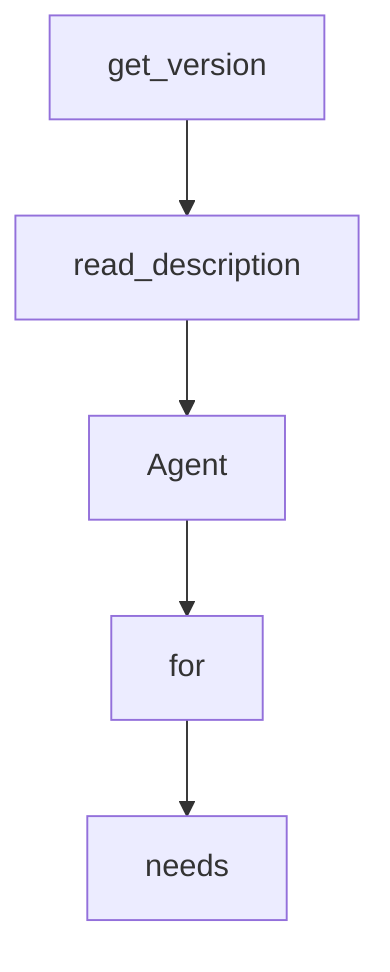

# Chapter 1: Getting Started

Welcome to **Chapter 1: Getting Started**. In this part of **Qwen-Agent Tutorial: Tool-Enabled Agent Framework with MCP, RAG, and Multi-Modal Workflows**, you will build an intuitive mental model first, then move into concrete implementation details and practical production tradeoffs.


This chapter gets Qwen-Agent installed with a first runnable baseline.

## Learning Goals

- install package with appropriate extras
- run initial assistant workflow
- configure baseline API key/model access
- validate first interactive outputs

## Quick Setup

```bash
pip install -U "qwen-agent[gui,rag,code_interpreter,mcp]"
```

## Source References

- [Install Guide](https://qwenlm.github.io/Qwen-Agent/en/guide/get_started/install/)
- [Quickstart Guide](https://qwenlm.github.io/Qwen-Agent/en/guide/get_started/quickstart/)
- [Qwen-Agent README](https://github.com/QwenLM/Qwen-Agent/blob/main/README.md)

## Summary

You now have a working Qwen-Agent baseline.

Next: [Chapter 2: Framework Architecture and Core Modules](02-framework-architecture-and-core-modules.md)

## Source Code Walkthrough

### `setup.py`

The `get_version` function in [`setup.py`](https://github.com/QwenLM/Qwen-Agent/blob/HEAD/setup.py) handles a key part of this chapter's functionality:

```py


def get_version() -> str:
    with open('qwen_agent/__init__.py', encoding='utf-8') as f:
        version = re.search(
            r'^__version__\s*=\s*[\'"]([^\'"]*)[\'"]',
            f.read(),
            re.MULTILINE,
        ).group(1)
    return version


def read_description() -> str:
    with open('README.md', 'r', encoding='UTF-8') as f:
        long_description = f.read()
    return long_description


# To update the package at PyPI:
# ```bash
# python setup.py sdist bdist_wheel
# twine upload dist/*
# ```
setup(
    name='qwen-agent',
    version=get_version(),
    author='Qwen Team',
    author_email='tujianhong.tjh@alibaba-inc.com',
    description='Qwen-Agent: Enhancing LLMs with Agent Workflows, RAG, Function Calling, and Code Interpreter.',
    long_description=read_description(),
    long_description_content_type='text/markdown',
    keywords=['LLM', 'Agent', 'Function Calling', 'RAG', 'Code Interpreter'],
```

This function is important because it defines how Qwen-Agent Tutorial: Tool-Enabled Agent Framework with MCP, RAG, and Multi-Modal Workflows implements the patterns covered in this chapter.

### `setup.py`

The `read_description` function in [`setup.py`](https://github.com/QwenLM/Qwen-Agent/blob/HEAD/setup.py) handles a key part of this chapter's functionality:

```py


def read_description() -> str:
    with open('README.md', 'r', encoding='UTF-8') as f:
        long_description = f.read()
    return long_description


# To update the package at PyPI:
# ```bash
# python setup.py sdist bdist_wheel
# twine upload dist/*
# ```
setup(
    name='qwen-agent',
    version=get_version(),
    author='Qwen Team',
    author_email='tujianhong.tjh@alibaba-inc.com',
    description='Qwen-Agent: Enhancing LLMs with Agent Workflows, RAG, Function Calling, and Code Interpreter.',
    long_description=read_description(),
    long_description_content_type='text/markdown',
    keywords=['LLM', 'Agent', 'Function Calling', 'RAG', 'Code Interpreter'],
    packages=find_packages(exclude=['examples', 'examples.*', 'qwen_server', 'qwen_server.*']),
    package_data={
        'qwen_agent': [
            'utils/qwen.tiktoken', 'tools/resource/*.ttf', 'tools/resource/*.py', 'gui/assets/*.css',
            'gui/assets/*.jpeg'
        ],
    },

    # Minimal dependencies for Function Calling:
    install_requires=[
```

This function is important because it defines how Qwen-Agent Tutorial: Tool-Enabled Agent Framework with MCP, RAG, and Multi-Modal Workflows implements the patterns covered in this chapter.

### `qwen_agent/agent.py`

The `Agent` class in [`qwen_agent/agent.py`](https://github.com/QwenLM/Qwen-Agent/blob/HEAD/qwen_agent/agent.py) handles a key part of this chapter's functionality:

```py


class Agent(ABC):
    """A base class for Agent.

    An agent can receive messages and provide response by LLM or Tools.
    Different agents have distinct workflows for processing messages and generating responses in the `_run` method.
    """

    def __init__(self,
                 function_list: Optional[List[Union[str, Dict, BaseTool]]] = None,
                 llm: Optional[Union[dict, BaseChatModel]] = None,
                 system_message: Optional[str] = DEFAULT_SYSTEM_MESSAGE,
                 name: Optional[str] = None,
                 description: Optional[str] = None,
                 **kwargs):
        """Initialization the agent.

        Args:
            function_list: One list of tool name, tool configuration or Tool object,
              such as 'code_interpreter', {'name': 'code_interpreter', 'timeout': 10}, or CodeInterpreter().
            llm: The LLM model configuration or LLM model object.
              Set the configuration as {'model': '', 'api_key': '', 'model_server': ''}.
            system_message: The specified system message for LLM chat.
            name: The name of this agent.
            description: The description of this agent, which will be used for multi_agent.
        """
        if isinstance(llm, dict):
            self.llm = get_chat_model(llm)
        else:
            self.llm = llm
        self.extra_generate_cfg: dict = {}
```

This class is important because it defines how Qwen-Agent Tutorial: Tool-Enabled Agent Framework with MCP, RAG, and Multi-Modal Workflows implements the patterns covered in this chapter.

### `qwen_agent/agent.py`

The `for` class in [`qwen_agent/agent.py`](https://github.com/QwenLM/Qwen-Agent/blob/HEAD/qwen_agent/agent.py) handles a key part of this chapter's functionality:

```py
# distributed under the License is distributed on an "AS IS" BASIS,
# WITHOUT WARRANTIES OR CONDITIONS OF ANY KIND, either express or implied.
# See the License for the specific language governing permissions and
# limitations under the License.

import copy
import json
import traceback
from abc import ABC, abstractmethod
from typing import Dict, Iterator, List, Optional, Tuple, Union

from qwen_agent.llm import get_chat_model
from qwen_agent.llm.base import BaseChatModel
from qwen_agent.llm.schema import CONTENT, DEFAULT_SYSTEM_MESSAGE, ROLE, SYSTEM, ContentItem, Message
from qwen_agent.log import logger
from qwen_agent.tools import TOOL_REGISTRY, BaseTool, MCPManager
from qwen_agent.tools.base import ToolServiceError
from qwen_agent.tools.simple_doc_parser import DocParserError
from qwen_agent.utils.utils import has_chinese_messages, merge_generate_cfgs


class Agent(ABC):
    """A base class for Agent.

    An agent can receive messages and provide response by LLM or Tools.
    Different agents have distinct workflows for processing messages and generating responses in the `_run` method.
    """

    def __init__(self,
                 function_list: Optional[List[Union[str, Dict, BaseTool]]] = None,
                 llm: Optional[Union[dict, BaseChatModel]] = None,
                 system_message: Optional[str] = DEFAULT_SYSTEM_MESSAGE,
```

This class is important because it defines how Qwen-Agent Tutorial: Tool-Enabled Agent Framework with MCP, RAG, and Multi-Modal Workflows implements the patterns covered in this chapter.


## How These Components Connect


