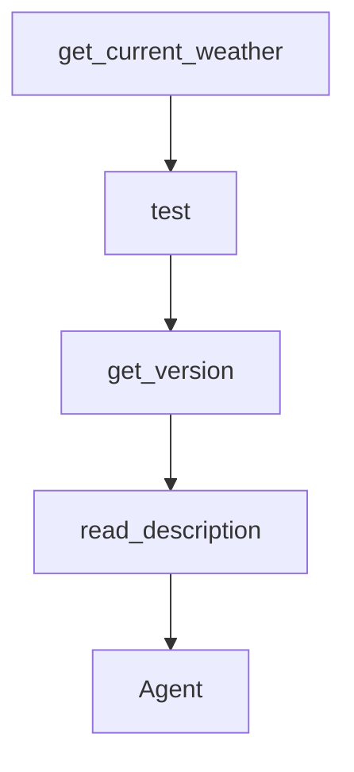

# Chapter 1: Getting Started

Welcome to **Chapter 1: Getting Started**. In this part of **Qwen-Agent Tutorial: Tool-Enabled Agent Framework with MCP, RAG, and Multi-Modal Workflows**, you will build an intuitive mental model first, then move into concrete implementation details and practical production tradeoffs.


This chapter gets Qwen-Agent installed with a first runnable baseline.

## Learning Goals

- install package with appropriate extras
- run initial assistant workflow
- configure baseline API key/model access
- validate first interactive outputs

## Quick Setup

```bash
pip install -U "qwen-agent[gui,rag,code_interpreter,mcp]"
```

## Source References

- [Install Guide](https://qwenlm.github.io/Qwen-Agent/en/guide/get_started/install/)
- [Quickstart Guide](https://qwenlm.github.io/Qwen-Agent/en/guide/get_started/quickstart/)
- [Qwen-Agent README](https://github.com/QwenLM/Qwen-Agent/blob/main/README.md)

## Summary

You now have a working Qwen-Agent baseline.

Next: [Chapter 2: Framework Architecture and Core Modules](02-framework-architecture-and-core-modules.md)

## Depth Expansion Playbook

## Source Code Walkthrough

### `examples/function_calling.py`

The `get_current_weather` function in [`examples/function_calling.py`](https://github.com/QwenLM/Qwen-Agent/blob/HEAD/examples/function_calling.py) handles a key part of this chapter's functionality:

```py
# Example dummy function hard coded to return the same weather
# In production, this could be your backend API or an external API
def get_current_weather(location, unit='fahrenheit'):
    """Get the current weather in a given location"""
    if 'tokyo' in location.lower():
        return json.dumps({'location': 'Tokyo', 'temperature': '10', 'unit': 'celsius'})
    elif 'san francisco' in location.lower():
        return json.dumps({'location': 'San Francisco', 'temperature': '72', 'unit': 'fahrenheit'})
    elif 'paris' in location.lower():
        return json.dumps({'location': 'Paris', 'temperature': '22', 'unit': 'celsius'})
    else:
        return json.dumps({'location': location, 'temperature': 'unknown'})


def test(fncall_prompt_type: str = 'qwen'):
    llm = get_chat_model({
        # Use the model service provided by DashScope:
        'model': 'qwen-plus-latest',
        'model_server': 'dashscope',
        'api_key': os.getenv('DASHSCOPE_API_KEY'),
        'generate_cfg': {
            'fncall_prompt_type': fncall_prompt_type
        },

        # Use the OpenAI-compatible model service provided by DashScope:
        # 'model': 'qwen2.5-72b-instruct',
        # 'model_server': 'https://dashscope.aliyuncs.com/compatible-mode/v1',
        # 'api_key': os.getenv('DASHSCOPE_API_KEY'),

        # Use the model service provided by Together.AI:
        # 'model': 'Qwen/qwen2.5-7b-instruct',
        # 'model_server': 'https://api.together.xyz',  # api_base
```

This function is important because it defines how Qwen-Agent Tutorial: Tool-Enabled Agent Framework with MCP, RAG, and Multi-Modal Workflows implements the patterns covered in this chapter.

### `examples/function_calling.py`

The `test` function in [`examples/function_calling.py`](https://github.com/QwenLM/Qwen-Agent/blob/HEAD/examples/function_calling.py) handles a key part of this chapter's functionality:

```py


def test(fncall_prompt_type: str = 'qwen'):
    llm = get_chat_model({
        # Use the model service provided by DashScope:
        'model': 'qwen-plus-latest',
        'model_server': 'dashscope',
        'api_key': os.getenv('DASHSCOPE_API_KEY'),
        'generate_cfg': {
            'fncall_prompt_type': fncall_prompt_type
        },

        # Use the OpenAI-compatible model service provided by DashScope:
        # 'model': 'qwen2.5-72b-instruct',
        # 'model_server': 'https://dashscope.aliyuncs.com/compatible-mode/v1',
        # 'api_key': os.getenv('DASHSCOPE_API_KEY'),

        # Use the model service provided by Together.AI:
        # 'model': 'Qwen/qwen2.5-7b-instruct',
        # 'model_server': 'https://api.together.xyz',  # api_base
        # 'api_key': os.getenv('TOGETHER_API_KEY'),

        # Use your own model service compatible with OpenAI API:
        # 'model': 'Qwen/qwen2.5-7b-instruct',
        # 'model_server': 'http://localhost:8000/v1',  # api_base
        # 'api_key': 'EMPTY',
    })

    # Step 1: send the conversation and available functions to the model
    messages = [{'role': 'user', 'content': "What's the weather like in San Francisco?"}]
    functions = [{
        'name': 'get_current_weather',
```

This function is important because it defines how Qwen-Agent Tutorial: Tool-Enabled Agent Framework with MCP, RAG, and Multi-Modal Workflows implements the patterns covered in this chapter.

### `setup.py`

The `get_version` function in [`setup.py`](https://github.com/QwenLM/Qwen-Agent/blob/HEAD/setup.py) handles a key part of this chapter's functionality:

```py


def get_version() -> str:
    with open('qwen_agent/__init__.py', encoding='utf-8') as f:
        version = re.search(
            r'^__version__\s*=\s*[\'"]([^\'"]*)[\'"]',
            f.read(),
            re.MULTILINE,
        ).group(1)
    return version


def read_description() -> str:
    with open('README.md', 'r', encoding='UTF-8') as f:
        long_description = f.read()
    return long_description


# To update the package at PyPI:
# ```bash
# python setup.py sdist bdist_wheel
# twine upload dist/*
# ```
setup(
    name='qwen-agent',
    version=get_version(),
    author='Qwen Team',
    author_email='tujianhong.tjh@alibaba-inc.com',
    description='Qwen-Agent: Enhancing LLMs with Agent Workflows, RAG, Function Calling, and Code Interpreter.',
    long_description=read_description(),
    long_description_content_type='text/markdown',
    keywords=['LLM', 'Agent', 'Function Calling', 'RAG', 'Code Interpreter'],
```

This function is important because it defines how Qwen-Agent Tutorial: Tool-Enabled Agent Framework with MCP, RAG, and Multi-Modal Workflows implements the patterns covered in this chapter.

### `setup.py`

The `read_description` function in [`setup.py`](https://github.com/QwenLM/Qwen-Agent/blob/HEAD/setup.py) handles a key part of this chapter's functionality:

```py


def read_description() -> str:
    with open('README.md', 'r', encoding='UTF-8') as f:
        long_description = f.read()
    return long_description


# To update the package at PyPI:
# ```bash
# python setup.py sdist bdist_wheel
# twine upload dist/*
# ```
setup(
    name='qwen-agent',
    version=get_version(),
    author='Qwen Team',
    author_email='tujianhong.tjh@alibaba-inc.com',
    description='Qwen-Agent: Enhancing LLMs with Agent Workflows, RAG, Function Calling, and Code Interpreter.',
    long_description=read_description(),
    long_description_content_type='text/markdown',
    keywords=['LLM', 'Agent', 'Function Calling', 'RAG', 'Code Interpreter'],
    packages=find_packages(exclude=['examples', 'examples.*', 'qwen_server', 'qwen_server.*']),
    package_data={
        'qwen_agent': [
            'utils/qwen.tiktoken', 'tools/resource/*.ttf', 'tools/resource/*.py', 'gui/assets/*.css',
            'gui/assets/*.jpeg'
        ],
    },

    # Minimal dependencies for Function Calling:
    install_requires=[
```

This function is important because it defines how Qwen-Agent Tutorial: Tool-Enabled Agent Framework with MCP, RAG, and Multi-Modal Workflows implements the patterns covered in this chapter.


## How These Components Connect


