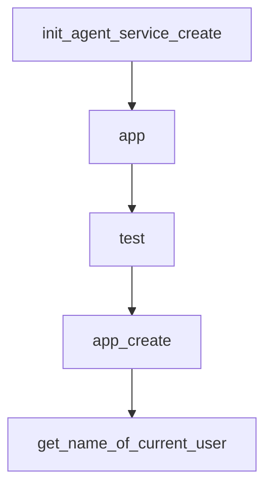

# Chapter 2: Framework Architecture and Core Modules

Welcome to **Chapter 2: Framework Architecture and Core Modules**. In this part of **Qwen-Agent Tutorial: Tool-Enabled Agent Framework with MCP, RAG, and Multi-Modal Workflows**, you will build an intuitive mental model first, then move into concrete implementation details and practical production tradeoffs.


This chapter explains the internal framework layers and extension surfaces.

## Learning Goals

- understand agent, llm, tool, and context module boundaries
- identify extension points for custom agents/tools
- map high-level assistants to low-level primitives
- reason about framework composition for real applications

## Core Module Areas

- agent orchestration
- llm wrappers and generation config
- tools/function calling interfaces
- context/memory and retrieval layers

## Source References

- [Core Modules: Agent](https://qwenlm.github.io/Qwen-Agent/en/guide/core_moduls/agent/)
- [Core Modules: LLM](https://qwenlm.github.io/Qwen-Agent/en/guide/core_moduls/llm/)
- [Core Modules: Tool](https://qwenlm.github.io/Qwen-Agent/en/guide/core_moduls/tool/)

## Summary

You now have a reliable mental model for Qwen-Agent framework internals.

Next: [Chapter 3: Model Service and Runtime Strategy](03-model-service-and-runtime-strategy.md)

## Depth Expansion Playbook

## Source Code Walkthrough

### `examples/group_chat_demo.py`

The `init_agent_service_create` function in [`examples/group_chat_demo.py`](https://github.com/QwenLM/Qwen-Agent/blob/HEAD/examples/group_chat_demo.py) handles a key part of this chapter's functionality:

```py


def init_agent_service_create():
    llm_cfg = {'model': 'qwen-max'}
    bot = GroupChatCreator(llm=llm_cfg)
    return bot


# =========================================================
# Below is the gradio service: front-end and back-end logic
# =========================================================

app_global_para = {
    'messages': [],
    'messages_create': [],
    'is_first_upload': False,
    'uploaded_file': '',
    'user_interrupt': True
}

# Initialized group chat configuration
CFGS = {
    'background':
        '一个陌生人互帮互助群聊',
    'agents': [
        {
            'name': '小塘',
            'description': '一个勤劳的打工人，每天沉迷工作，日渐消瘦。（这是一个真实用户）',
            'is_human': True  # mark this as a real person
        },
        {
            'name': '甄嬛',
```

This function is important because it defines how Qwen-Agent Tutorial: Tool-Enabled Agent Framework with MCP, RAG, and Multi-Modal Workflows implements the patterns covered in this chapter.

### `examples/group_chat_demo.py`

The `app` function in [`examples/group_chat_demo.py`](https://github.com/QwenLM/Qwen-Agent/blob/HEAD/examples/group_chat_demo.py) handles a key part of this chapter's functionality:

```py
#    http://www.apache.org/licenses/LICENSE-2.0
# 
# Unless required by applicable law or agreed to in writing, software
# distributed under the License is distributed on an "AS IS" BASIS,
# WITHOUT WARRANTIES OR CONDITIONS OF ANY KIND, either express or implied.
# See the License for the specific language governing permissions and
# limitations under the License.

"""A group chat gradio demo"""
import json

import json5

from qwen_agent.agents import GroupChat, GroupChatCreator
from qwen_agent.agents.user_agent import PENDING_USER_INPUT
from qwen_agent.gui.gradio_dep import gr, mgr, ms
from qwen_agent.llm.schema import ContentItem, Message


def init_agent_service(cfgs):
    llm_cfg = {'model': 'qwen-max'}
    bot = GroupChat(agents=cfgs, llm=llm_cfg)
    return bot


def init_agent_service_create():
    llm_cfg = {'model': 'qwen-max'}
    bot = GroupChatCreator(llm=llm_cfg)
    return bot


# =========================================================
```

This function is important because it defines how Qwen-Agent Tutorial: Tool-Enabled Agent Framework with MCP, RAG, and Multi-Modal Workflows implements the patterns covered in this chapter.

### `examples/group_chat_demo.py`

The `test` function in [`examples/group_chat_demo.py`](https://github.com/QwenLM/Qwen-Agent/blob/HEAD/examples/group_chat_demo.py) handles a key part of this chapter's functionality:

```py


def test():
    app(cfgs=CFGS)


def app_create(history, now_cfgs):
    now_cfgs = json5.loads(now_cfgs)
    if not history:
        yield history, json.dumps(now_cfgs, indent=4, ensure_ascii=False)
    else:

        if len(history) == 1:
            new_cfgs = {'background': '', 'agents': []}
            # The first time to create grouchat
            exist_cfgs = now_cfgs['agents']
            for cfg in exist_cfgs:
                if 'is_human' in cfg and cfg['is_human']:
                    new_cfgs['agents'].append(cfg)
        else:
            new_cfgs = now_cfgs
        app_global_para['messages_create'].append(Message('user', history[-1][0].text))
        response = []
        try:
            agent = init_agent_service_create()
            for response in agent.run(messages=app_global_para['messages_create']):
                display_content = ''
                for rsp in response:
                    if rsp.name == 'role_config':
                        cfg = json5.loads(rsp.content)
                        old_pos = -1
                        for i, x in enumerate(new_cfgs['agents']):
```

This function is important because it defines how Qwen-Agent Tutorial: Tool-Enabled Agent Framework with MCP, RAG, and Multi-Modal Workflows implements the patterns covered in this chapter.

### `examples/group_chat_demo.py`

The `app_create` function in [`examples/group_chat_demo.py`](https://github.com/QwenLM/Qwen-Agent/blob/HEAD/examples/group_chat_demo.py) handles a key part of this chapter's functionality:

```py


def app_create(history, now_cfgs):
    now_cfgs = json5.loads(now_cfgs)
    if not history:
        yield history, json.dumps(now_cfgs, indent=4, ensure_ascii=False)
    else:

        if len(history) == 1:
            new_cfgs = {'background': '', 'agents': []}
            # The first time to create grouchat
            exist_cfgs = now_cfgs['agents']
            for cfg in exist_cfgs:
                if 'is_human' in cfg and cfg['is_human']:
                    new_cfgs['agents'].append(cfg)
        else:
            new_cfgs = now_cfgs
        app_global_para['messages_create'].append(Message('user', history[-1][0].text))
        response = []
        try:
            agent = init_agent_service_create()
            for response in agent.run(messages=app_global_para['messages_create']):
                display_content = ''
                for rsp in response:
                    if rsp.name == 'role_config':
                        cfg = json5.loads(rsp.content)
                        old_pos = -1
                        for i, x in enumerate(new_cfgs['agents']):
                            if x['name'] == cfg['name']:
                                old_pos = i
                                break
                        if old_pos > -1:
```

This function is important because it defines how Qwen-Agent Tutorial: Tool-Enabled Agent Framework with MCP, RAG, and Multi-Modal Workflows implements the patterns covered in this chapter.


## How These Components Connect


