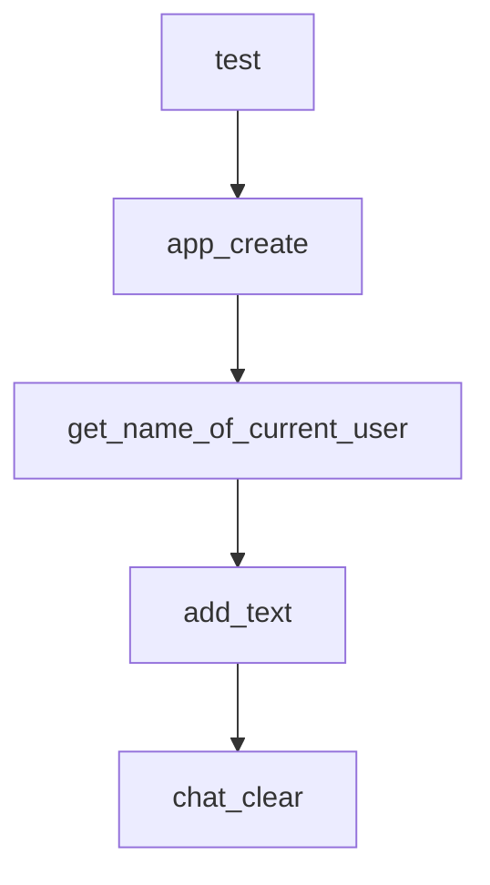

# Chapter 2: Framework Architecture and Core Modules

Welcome to **Chapter 2: Framework Architecture and Core Modules**. In this part of **Qwen-Agent Tutorial: Tool-Enabled Agent Framework with MCP, RAG, and Multi-Modal Workflows**, you will build an intuitive mental model first, then move into concrete implementation details and practical production tradeoffs.


This chapter explains the internal framework layers and extension surfaces.

## Learning Goals

- understand agent, llm, tool, and context module boundaries
- identify extension points for custom agents/tools
- map high-level assistants to low-level primitives
- reason about framework composition for real applications

## Core Module Areas

- agent orchestration
- llm wrappers and generation config
- tools/function calling interfaces
- context/memory and retrieval layers

## Source References

- [Core Modules: Agent](https://qwenlm.github.io/Qwen-Agent/en/guide/core_moduls/agent/)
- [Core Modules: LLM](https://qwenlm.github.io/Qwen-Agent/en/guide/core_moduls/llm/)
- [Core Modules: Tool](https://qwenlm.github.io/Qwen-Agent/en/guide/core_moduls/tool/)

## Summary

You now have a reliable mental model for Qwen-Agent framework internals.

Next: [Chapter 3: Model Service and Runtime Strategy](03-model-service-and-runtime-strategy.md)

## Source Code Walkthrough

### `examples/group_chat_demo.py`

The `test` function in [`examples/group_chat_demo.py`](https://github.com/QwenLM/Qwen-Agent/blob/HEAD/examples/group_chat_demo.py) handles a key part of this chapter's functionality:

```py


def test():
    app(cfgs=CFGS)


def app_create(history, now_cfgs):
    now_cfgs = json5.loads(now_cfgs)
    if not history:
        yield history, json.dumps(now_cfgs, indent=4, ensure_ascii=False)
    else:

        if len(history) == 1:
            new_cfgs = {'background': '', 'agents': []}
            # The first time to create grouchat
            exist_cfgs = now_cfgs['agents']
            for cfg in exist_cfgs:
                if 'is_human' in cfg and cfg['is_human']:
                    new_cfgs['agents'].append(cfg)
        else:
            new_cfgs = now_cfgs
        app_global_para['messages_create'].append(Message('user', history[-1][0].text))
        response = []
        try:
            agent = init_agent_service_create()
            for response in agent.run(messages=app_global_para['messages_create']):
                display_content = ''
                for rsp in response:
                    if rsp.name == 'role_config':
                        cfg = json5.loads(rsp.content)
                        old_pos = -1
                        for i, x in enumerate(new_cfgs['agents']):
```

This function is important because it defines how Qwen-Agent Tutorial: Tool-Enabled Agent Framework with MCP, RAG, and Multi-Modal Workflows implements the patterns covered in this chapter.

### `examples/group_chat_demo.py`

The `app_create` function in [`examples/group_chat_demo.py`](https://github.com/QwenLM/Qwen-Agent/blob/HEAD/examples/group_chat_demo.py) handles a key part of this chapter's functionality:

```py


def app_create(history, now_cfgs):
    now_cfgs = json5.loads(now_cfgs)
    if not history:
        yield history, json.dumps(now_cfgs, indent=4, ensure_ascii=False)
    else:

        if len(history) == 1:
            new_cfgs = {'background': '', 'agents': []}
            # The first time to create grouchat
            exist_cfgs = now_cfgs['agents']
            for cfg in exist_cfgs:
                if 'is_human' in cfg and cfg['is_human']:
                    new_cfgs['agents'].append(cfg)
        else:
            new_cfgs = now_cfgs
        app_global_para['messages_create'].append(Message('user', history[-1][0].text))
        response = []
        try:
            agent = init_agent_service_create()
            for response in agent.run(messages=app_global_para['messages_create']):
                display_content = ''
                for rsp in response:
                    if rsp.name == 'role_config':
                        cfg = json5.loads(rsp.content)
                        old_pos = -1
                        for i, x in enumerate(new_cfgs['agents']):
                            if x['name'] == cfg['name']:
                                old_pos = i
                                break
                        if old_pos > -1:
```

This function is important because it defines how Qwen-Agent Tutorial: Tool-Enabled Agent Framework with MCP, RAG, and Multi-Modal Workflows implements the patterns covered in this chapter.

### `examples/group_chat_demo.py`

The `get_name_of_current_user` function in [`examples/group_chat_demo.py`](https://github.com/QwenLM/Qwen-Agent/blob/HEAD/examples/group_chat_demo.py) handles a key part of this chapter's functionality:

```py


def get_name_of_current_user(cfgs):
    for agent in cfgs['agents']:
        if 'is_human' in agent and agent['is_human']:
            return agent['name']
    return 'user'


def add_text(text, cfgs):
    app_global_para['user_interrupt'] = True
    content = [ContentItem(text=text)]
    if app_global_para['uploaded_file'] and app_global_para['is_first_upload']:
        app_global_para['is_first_upload'] = False  # only send file when first upload
        content.append(ContentItem(file=app_global_para['uploaded_file']))
    app_global_para['messages'].append(
        Message('user', content=content, name=get_name_of_current_user(json5.loads(cfgs))))

    return _get_display_history_from_message(), None


def chat_clear():
    app_global_para['messages'] = []
    return None


def chat_clear_create():
    app_global_para['messages_create'] = []
    return None, None


def add_file(file):
```

This function is important because it defines how Qwen-Agent Tutorial: Tool-Enabled Agent Framework with MCP, RAG, and Multi-Modal Workflows implements the patterns covered in this chapter.

### `examples/group_chat_demo.py`

The `add_text` function in [`examples/group_chat_demo.py`](https://github.com/QwenLM/Qwen-Agent/blob/HEAD/examples/group_chat_demo.py) handles a key part of this chapter's functionality:

```py


def add_text(text, cfgs):
    app_global_para['user_interrupt'] = True
    content = [ContentItem(text=text)]
    if app_global_para['uploaded_file'] and app_global_para['is_first_upload']:
        app_global_para['is_first_upload'] = False  # only send file when first upload
        content.append(ContentItem(file=app_global_para['uploaded_file']))
    app_global_para['messages'].append(
        Message('user', content=content, name=get_name_of_current_user(json5.loads(cfgs))))

    return _get_display_history_from_message(), None


def chat_clear():
    app_global_para['messages'] = []
    return None


def chat_clear_create():
    app_global_para['messages_create'] = []
    return None, None


def add_file(file):
    app_global_para['uploaded_file'] = file.name
    app_global_para['is_first_upload'] = True
    return file.name


def add_text_create(history, text):
    history = history + [(text, None)]
```

This function is important because it defines how Qwen-Agent Tutorial: Tool-Enabled Agent Framework with MCP, RAG, and Multi-Modal Workflows implements the patterns covered in this chapter.


## How These Components Connect


