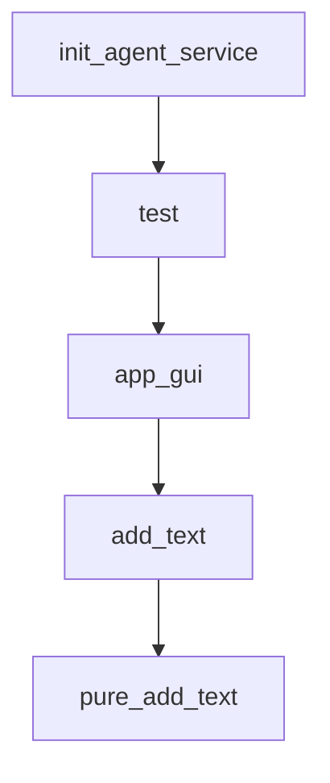

# Chapter 3: Model Service and Runtime Strategy

Welcome to **Chapter 3: Model Service and Runtime Strategy**. In this part of **Qwen-Agent Tutorial: Tool-Enabled Agent Framework with MCP, RAG, and Multi-Modal Workflows**, you will build an intuitive mental model first, then move into concrete implementation details and practical production tradeoffs.


This chapter covers model-serving choices and runtime tradeoffs.

## Learning Goals

- choose DashScope or self-hosted OpenAI-compatible backends
- configure model parser modes appropriately
- align runtime choice with throughput and cost constraints
- avoid parser/config mismatches in tool-calling flows

## Runtime Strategy Notes

- DashScope for managed-service simplicity
- vLLM/SGLang paths for self-hosted performance control
- parser mode must align with model family and deployment mode

## Source References

- [Quickstart: Model Service Prep](https://qwenlm.github.io/Qwen-Agent/en/guide/get_started/quickstart/)
- [Qwen-Agent Configuration Guide](https://qwenlm.github.io/Qwen-Agent/en/guide/get_started/configuration/)
- [Qwen-Agent README Runtime Notes](https://github.com/QwenLM/Qwen-Agent/blob/main/README.md)

## Summary

You now can pick model service and parser strategies with fewer integration surprises.

Next: [Chapter 4: Tool Calling and MCP Integration](04-tool-calling-and-mcp-integration.md)

## Depth Expansion Playbook

## Source Code Walkthrough

### `examples/qwen2vl_assistant_tooluse.py`

The `init_agent_service` function in [`examples/qwen2vl_assistant_tooluse.py`](https://github.com/QwenLM/Qwen-Agent/blob/HEAD/examples/qwen2vl_assistant_tooluse.py) handles a key part of this chapter's functionality:

```py


def init_agent_service():
    llm_cfg_vl = {
        # Using Qwen2-VL deployed at any openai-compatible service such as vLLM:
        # 'model_type': 'qwenvl_oai',
        # 'model': 'Qwen2-VL-7B-Instruct',
        # 'model_server': 'http://localhost:8000/v1',  # api_base
        # 'api_key': 'EMPTY',

        # Using Qwen2-VL provided by Alibaba Cloud DashScope's openai-compatible service:
        # 'model_type': 'qwenvl_oai',
        # 'model': 'qwen-vl-max-0809',
        # 'model_server': 'https://dashscope.aliyuncs.com/compatible-mode/v1',
        # 'api_key': os.getenv('DASHSCOPE_API_KEY'),

        # Using Qwen2-VL provided by Alibaba Cloud DashScope:
        'model_type': 'qwenvl_dashscope',
        'model': 'qwen-vl-max-0809',
        'api_key': os.getenv('DASHSCOPE_API_KEY'),
        'generate_cfg': {
            'max_retries': 10,
            'fncall_prompt_type': 'qwen'
        }
    }

    tools = [
        'crop_and_resize',
        'code_interpreter',
    ]  # code_interpreter is a built-in tool in Qwen-Agent

    # API tools
```

This function is important because it defines how Qwen-Agent Tutorial: Tool-Enabled Agent Framework with MCP, RAG, and Multi-Modal Workflows implements the patterns covered in this chapter.

### `examples/qwen2vl_assistant_tooluse.py`

The `test` function in [`examples/qwen2vl_assistant_tooluse.py`](https://github.com/QwenLM/Qwen-Agent/blob/HEAD/examples/qwen2vl_assistant_tooluse.py) handles a key part of this chapter's functionality:

```py


def test():
    # Define the agent
    bot = init_agent_service()

    # Chat
    messages = [{
        'role':
            'user',
        'content': [
            {
                'image': os.path.abspath(os.path.join(ROOT_RESOURCE, 'screenshot_with_plot.jpeg'))
            },
            {
                'text': '调用工具放大右边的表格'
            },
        ],
    }]

    for response in bot.run(messages=messages):
        print('bot response:', response)


def app_gui():
    # Define the agent
    bot = init_agent_service()

    WebUI(bot).run()


if __name__ == '__main__':
```

This function is important because it defines how Qwen-Agent Tutorial: Tool-Enabled Agent Framework with MCP, RAG, and Multi-Modal Workflows implements the patterns covered in this chapter.

### `examples/qwen2vl_assistant_tooluse.py`

The `app_gui` function in [`examples/qwen2vl_assistant_tooluse.py`](https://github.com/QwenLM/Qwen-Agent/blob/HEAD/examples/qwen2vl_assistant_tooluse.py) handles a key part of this chapter's functionality:

```py


def app_gui():
    # Define the agent
    bot = init_agent_service()

    WebUI(bot).run()


if __name__ == '__main__':
    test()
    # app_gui()

```

This function is important because it defines how Qwen-Agent Tutorial: Tool-Enabled Agent Framework with MCP, RAG, and Multi-Modal Workflows implements the patterns covered in this chapter.

### `qwen_server/workstation_server.py`

The `add_text` function in [`qwen_server/workstation_server.py`](https://github.com/QwenLM/Qwen-Agent/blob/HEAD/qwen_server/workstation_server.py) handles a key part of this chapter's functionality:

```py


def add_text(history, text):
    history = history + [(text, None)]
    app_global_para['last_turn_msg_id'] = []
    return history, gr.update(value='', interactive=False)


def pure_add_text(history, text):
    history = history + [(text, None)]
    app_global_para['pure_last_turn_msg_id'] = []
    return history, gr.update(value='', interactive=False)


def rm_text(history):
    if not history:
        gr.Warning('No input content!')
    elif not history[-1][1]:
        return history, gr.update(value='', interactive=False)
    else:
        history = history[:-1] + [(history[-1][0].text, None)]
        return history, gr.update(value='', interactive=False)


def chat_clear():
    app_global_para['messages'] = []
    return None, None


def chat_clear_pure():
    app_global_para['pure_messages'] = []
    return []
```

This function is important because it defines how Qwen-Agent Tutorial: Tool-Enabled Agent Framework with MCP, RAG, and Multi-Modal Workflows implements the patterns covered in this chapter.


## How These Components Connect


