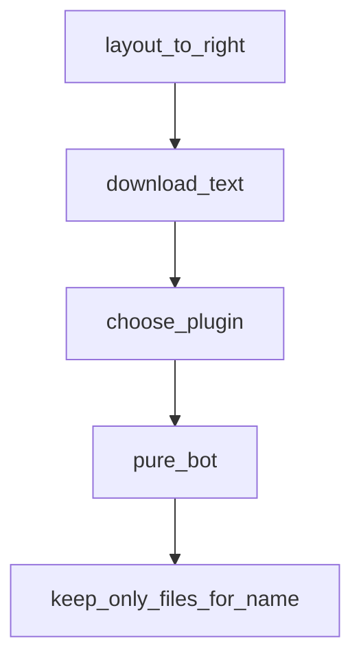

# Chapter 4: Tool Calling and MCP Integration

Welcome to **Chapter 4: Tool Calling and MCP Integration**. In this part of **Qwen-Agent Tutorial: Tool-Enabled Agent Framework with MCP, RAG, and Multi-Modal Workflows**, you will build an intuitive mental model first, then move into concrete implementation details and practical production tradeoffs.


This chapter explains capability expansion through tools and MCP services.

## Learning Goals

- implement function-calling and custom tool patterns
- configure MCP servers for external tool access
- secure filesystem/database boundaries in MCP configs
- test MCP workflows with deterministic examples

## Integration Strategy

- start from known-good MCP configuration blocks
- add only required servers and permissions
- verify tool outputs with integration scripts before production use

## Source References

- [Core Modules: MCP](https://qwenlm.github.io/Qwen-Agent/en/guide/core_moduls/mcp/)
- [MCP SQLite Example](https://github.com/QwenLM/Qwen-Agent/blob/main/examples/assistant_mcp_sqlite_bot.py)
- [Function Calling Example](https://github.com/QwenLM/Qwen-Agent/blob/main/examples/function_calling.py)

## Summary

You now have a practical model for tool + MCP integration in Qwen-Agent.

Next: [Chapter 5: Memory, RAG, and Long-Context Workflows](05-memory-rag-and-long-context-workflows.md)

## Depth Expansion Playbook

## Source Code Walkthrough

### `qwen_server/workstation_server.py`

The `layout_to_right` function in [`qwen_server/workstation_server.py`](https://github.com/QwenLM/Qwen-Agent/blob/HEAD/qwen_server/workstation_server.py) handles a key part of this chapter's functionality:

```py


def layout_to_right(text):
    return text, text


def download_text(text):
    now = datetime.datetime.now()
    current_time = now.strftime('%Y-%m-%d_%H-%M-%S')
    filename = f'file_{current_time}.md'
    save_path = os.path.join(server_config.path.download_root, filename)
    try:
        save_text_to_file(save_path, text)
        gr.Info(f'Saved to {save_path}')
    except Exception as ex:
        gr.Error(f'Failed to save this file.\n {str(ex)}')


def choose_plugin(chosen_plugin):
    if chosen_plugin == CI_OPTION:
        gr.Info('Code execution is NOT sandboxed. Do NOT ask Qwen to perform dangerous tasks.')
    if chosen_plugin == CI_OPTION or chosen_plugin == DOC_OPTION:
        return gr.update(interactive=True), None
    else:
        return gr.update(interactive=False), None


def pure_bot(history):
    if not history:
        yield history
    else:
        history[-1][1] = ''
```

This function is important because it defines how Qwen-Agent Tutorial: Tool-Enabled Agent Framework with MCP, RAG, and Multi-Modal Workflows implements the patterns covered in this chapter.

### `qwen_server/workstation_server.py`

The `download_text` function in [`qwen_server/workstation_server.py`](https://github.com/QwenLM/Qwen-Agent/blob/HEAD/qwen_server/workstation_server.py) handles a key part of this chapter's functionality:

```py


def download_text(text):
    now = datetime.datetime.now()
    current_time = now.strftime('%Y-%m-%d_%H-%M-%S')
    filename = f'file_{current_time}.md'
    save_path = os.path.join(server_config.path.download_root, filename)
    try:
        save_text_to_file(save_path, text)
        gr.Info(f'Saved to {save_path}')
    except Exception as ex:
        gr.Error(f'Failed to save this file.\n {str(ex)}')


def choose_plugin(chosen_plugin):
    if chosen_plugin == CI_OPTION:
        gr.Info('Code execution is NOT sandboxed. Do NOT ask Qwen to perform dangerous tasks.')
    if chosen_plugin == CI_OPTION or chosen_plugin == DOC_OPTION:
        return gr.update(interactive=True), None
    else:
        return gr.update(interactive=False), None


def pure_bot(history):
    if not history:
        yield history
    else:
        history[-1][1] = ''
        message = [{'role': 'user', 'content': history[-1][0].text, 'name': 'pure_chat_user'}]
        try:
            llm = get_chat_model(llm_config)
            response = llm.chat(messages=app_global_para['pure_messages'] + message)
```

This function is important because it defines how Qwen-Agent Tutorial: Tool-Enabled Agent Framework with MCP, RAG, and Multi-Modal Workflows implements the patterns covered in this chapter.

### `qwen_server/workstation_server.py`

The `choose_plugin` function in [`qwen_server/workstation_server.py`](https://github.com/QwenLM/Qwen-Agent/blob/HEAD/qwen_server/workstation_server.py) handles a key part of this chapter's functionality:

```py


def choose_plugin(chosen_plugin):
    if chosen_plugin == CI_OPTION:
        gr.Info('Code execution is NOT sandboxed. Do NOT ask Qwen to perform dangerous tasks.')
    if chosen_plugin == CI_OPTION or chosen_plugin == DOC_OPTION:
        return gr.update(interactive=True), None
    else:
        return gr.update(interactive=False), None


def pure_bot(history):
    if not history:
        yield history
    else:
        history[-1][1] = ''
        message = [{'role': 'user', 'content': history[-1][0].text, 'name': 'pure_chat_user'}]
        try:
            llm = get_chat_model(llm_config)
            response = llm.chat(messages=app_global_para['pure_messages'] + message)
            rsp = []
            for rsp in response:
                if rsp:
                    history[-1][1] = rsp[-1]['content']
                    yield history

            # Record the conversation history when the conversation succeeds
            app_global_para['pure_last_turn_msg_id'].append(len(app_global_para['pure_messages']))
            app_global_para['pure_messages'].extend(message)  # New user message
            app_global_para['pure_last_turn_msg_id'].append(len(app_global_para['pure_messages']))
            app_global_para['pure_messages'].extend(rsp)  # The response

```

This function is important because it defines how Qwen-Agent Tutorial: Tool-Enabled Agent Framework with MCP, RAG, and Multi-Modal Workflows implements the patterns covered in this chapter.

### `qwen_server/workstation_server.py`

The `pure_bot` function in [`qwen_server/workstation_server.py`](https://github.com/QwenLM/Qwen-Agent/blob/HEAD/qwen_server/workstation_server.py) handles a key part of this chapter's functionality:

```py


def pure_bot(history):
    if not history:
        yield history
    else:
        history[-1][1] = ''
        message = [{'role': 'user', 'content': history[-1][0].text, 'name': 'pure_chat_user'}]
        try:
            llm = get_chat_model(llm_config)
            response = llm.chat(messages=app_global_para['pure_messages'] + message)
            rsp = []
            for rsp in response:
                if rsp:
                    history[-1][1] = rsp[-1]['content']
                    yield history

            # Record the conversation history when the conversation succeeds
            app_global_para['pure_last_turn_msg_id'].append(len(app_global_para['pure_messages']))
            app_global_para['pure_messages'].extend(message)  # New user message
            app_global_para['pure_last_turn_msg_id'].append(len(app_global_para['pure_messages']))
            app_global_para['pure_messages'].extend(rsp)  # The response

        except ModelServiceError as ex:
            history[-1][1] = str(ex)
            yield history
        except Exception as ex:
            raise ValueError(ex)


def keep_only_files_for_name(messages, name):
    new_messages = []
```

This function is important because it defines how Qwen-Agent Tutorial: Tool-Enabled Agent Framework with MCP, RAG, and Multi-Modal Workflows implements the patterns covered in this chapter.


## How These Components Connect


