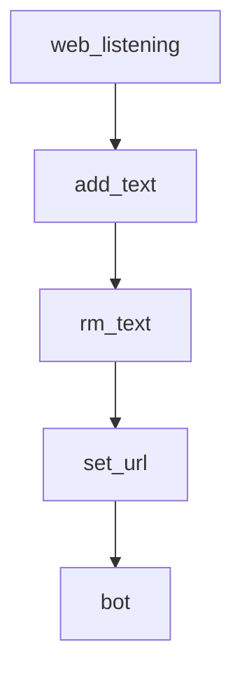

# Chapter 5: Memory, RAG, and Long-Context Workflows

Welcome to **Chapter 5: Memory, RAG, and Long-Context Workflows**. In this part of **Qwen-Agent Tutorial: Tool-Enabled Agent Framework with MCP, RAG, and Multi-Modal Workflows**, you will build an intuitive mental model first, then move into concrete implementation details and practical production tradeoffs.


This chapter covers knowledge-heavy workflows requiring retrieval and long-context handling.

## Learning Goals

- apply RAG patterns for large document tasks
- choose between fast and higher-cost long-context approaches
- combine retrieval with tool reasoning effectively
- validate output quality on document-intensive tasks

## Workflow Guidance

- start with efficient RAG pipelines for scale
- escalate to more expensive agentic flows when needed
- track recall and citation quality in evaluation loops

## Source References

- [Core Modules: RAG](https://qwenlm.github.io/Qwen-Agent/en/guide/core_moduls/rag/)
- [RAG Example](https://github.com/QwenLM/Qwen-Agent/blob/main/examples/assistant_rag.py)
- [Parallel Doc QA Example](https://github.com/QwenLM/Qwen-Agent/blob/main/examples/parallel_doc_qa.py)

## Summary

You now can design Qwen-Agent workflows for high-context and document-heavy workloads.

Next: [Chapter 6: Application Patterns and Safety Boundaries](06-application-patterns-and-safety-boundaries.md)

## Source Code Walkthrough

### `qwen_server/database_server.py`

The `web_listening` function in [`qwen_server/database_server.py`](https://github.com/QwenLM/Qwen-Agent/blob/HEAD/qwen_server/database_server.py) handles a key part of this chapter's functionality:

```py

@app.post('/endpoint')
async def web_listening(request: Request):
    data = await request.json()
    msg_type = data['task']

    if msg_type == 'change_checkbox':
        rsp = change_checkbox_state(data['ckid'])
    elif msg_type == 'cache':
        cache_obj = multiprocessing.Process(target=cache_page, kwargs=data)
        cache_obj.start()
        # rsp = cache_data(data, cache_file)
        rsp = 'caching'
    elif msg_type == 'pop_url':
        # What a misleading name! pop_url actually means add_url. pop is referring to the pop_up ui.
        rsp = update_pop_url(data['url'])
    else:
        raise NotImplementedError

    return JSONResponse(content=rsp)


if __name__ == '__main__':
    uvicorn.run(app='database_server:app',
                host=server_config.server.server_host,
                port=server_config.server.fast_api_port)

```

This function is important because it defines how Qwen-Agent Tutorial: Tool-Enabled Agent Framework with MCP, RAG, and Multi-Modal Workflows implements the patterns covered in this chapter.

### `qwen_server/assistant_server.py`

The `add_text` function in [`qwen_server/assistant_server.py`](https://github.com/QwenLM/Qwen-Agent/blob/HEAD/qwen_server/assistant_server.py) handles a key part of this chapter's functionality:

```py


def add_text(history, text):
    history = history + [(text, None)]
    return history, gr.update(value='', interactive=False)


def rm_text(history):
    if not history:
        gr.Warning('No input content!')
    elif not history[-1][1]:
        return history, gr.update(value='', interactive=False)
    else:
        history = history[:-1] + [(history[-1][0], None)]
        return history, gr.update(value='', interactive=False)


def set_url():
    lines = []
    if not os.path.exists(cache_file_popup_url):
        # Only able to remind the situation of first browsing failure
        gr.Error('Oops, it seems that the page cannot be opened due to network issues.')

    for line in jsonlines.open(cache_file_popup_url):
        lines.append(line)
    logger.info('The current access page is: ' + lines[-1]['url'])
    return lines[-1]['url']


def bot(history):
    page_url = set_url()
    if not history:
```

This function is important because it defines how Qwen-Agent Tutorial: Tool-Enabled Agent Framework with MCP, RAG, and Multi-Modal Workflows implements the patterns covered in this chapter.

### `qwen_server/assistant_server.py`

The `rm_text` function in [`qwen_server/assistant_server.py`](https://github.com/QwenLM/Qwen-Agent/blob/HEAD/qwen_server/assistant_server.py) handles a key part of this chapter's functionality:

```py


def rm_text(history):
    if not history:
        gr.Warning('No input content!')
    elif not history[-1][1]:
        return history, gr.update(value='', interactive=False)
    else:
        history = history[:-1] + [(history[-1][0], None)]
        return history, gr.update(value='', interactive=False)


def set_url():
    lines = []
    if not os.path.exists(cache_file_popup_url):
        # Only able to remind the situation of first browsing failure
        gr.Error('Oops, it seems that the page cannot be opened due to network issues.')

    for line in jsonlines.open(cache_file_popup_url):
        lines.append(line)
    logger.info('The current access page is: ' + lines[-1]['url'])
    return lines[-1]['url']


def bot(history):
    page_url = set_url()
    if not history:
        yield history
    else:
        messages = [{'role': 'user', 'content': [{'text': history[-1][0]}, {'file': page_url}]}]
        history[-1][1] = ''
        try:
```

This function is important because it defines how Qwen-Agent Tutorial: Tool-Enabled Agent Framework with MCP, RAG, and Multi-Modal Workflows implements the patterns covered in this chapter.

### `qwen_server/assistant_server.py`

The `set_url` function in [`qwen_server/assistant_server.py`](https://github.com/QwenLM/Qwen-Agent/blob/HEAD/qwen_server/assistant_server.py) handles a key part of this chapter's functionality:

```py


def set_url():
    lines = []
    if not os.path.exists(cache_file_popup_url):
        # Only able to remind the situation of first browsing failure
        gr.Error('Oops, it seems that the page cannot be opened due to network issues.')

    for line in jsonlines.open(cache_file_popup_url):
        lines.append(line)
    logger.info('The current access page is: ' + lines[-1]['url'])
    return lines[-1]['url']


def bot(history):
    page_url = set_url()
    if not history:
        yield history
    else:
        messages = [{'role': 'user', 'content': [{'text': history[-1][0]}, {'file': page_url}]}]
        history[-1][1] = ''
        try:
            response = assistant.run(messages=messages, max_ref_token=server_config.server.max_ref_token)
            for rsp in response:
                if rsp:
                    history[-1][1] = rsp[-1]['content']
                    yield history
        except ModelServiceError as ex:
            history[-1][1] = str(ex)
            yield history
        except Exception as ex:
            raise ValueError(ex)
```

This function is important because it defines how Qwen-Agent Tutorial: Tool-Enabled Agent Framework with MCP, RAG, and Multi-Modal Workflows implements the patterns covered in this chapter.


## How These Components Connect


