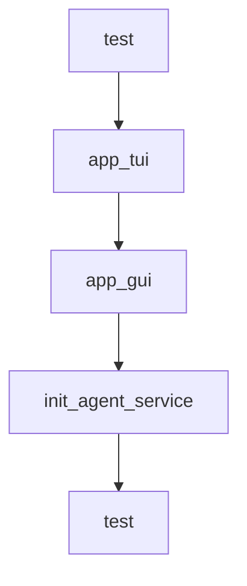

# Chapter 5: Memory, RAG, and Long-Context Workflows

Welcome to **Chapter 5: Memory, RAG, and Long-Context Workflows**. In this part of **Qwen-Agent Tutorial: Tool-Enabled Agent Framework with MCP, RAG, and Multi-Modal Workflows**, you will build an intuitive mental model first, then move into concrete implementation details and practical production tradeoffs.


This chapter covers knowledge-heavy workflows requiring retrieval and long-context handling.

## Learning Goals

- apply RAG patterns for large document tasks
- choose between fast and higher-cost long-context approaches
- combine retrieval with tool reasoning effectively
- validate output quality on document-intensive tasks

## Workflow Guidance

- start with efficient RAG pipelines for scale
- escalate to more expensive agentic flows when needed
- track recall and citation quality in evaluation loops

## Source References

- [Core Modules: RAG](https://qwenlm.github.io/Qwen-Agent/en/guide/core_moduls/rag/)
- [RAG Example](https://github.com/QwenLM/Qwen-Agent/blob/main/examples/assistant_rag.py)
- [Parallel Doc QA Example](https://github.com/QwenLM/Qwen-Agent/blob/main/examples/parallel_doc_qa.py)

## Summary

You now can design Qwen-Agent workflows for high-context and document-heavy workloads.

Next: [Chapter 6: Application Patterns and Safety Boundaries](06-application-patterns-and-safety-boundaries.md)

## Depth Expansion Playbook

## Source Code Walkthrough

### `examples/assistant_qwen3.5.py`

The `test` function in [`examples/assistant_qwen3.5.py`](https://github.com/QwenLM/Qwen-Agent/blob/HEAD/examples/assistant_qwen3.5.py) handles a key part of this chapter's functionality:

```py


def test(query: str = 'What time is it?'):
    # Define the agent
    bot = init_agent_service()

    # Chat
    messages = [{'role': 'user', 'content': query}]
    response_plain_text = ''
    for response in bot.run(messages=messages):
        response_plain_text = typewriter_print(response, response_plain_text)


def app_tui():
    # Define the agent
    bot = init_agent_service()

    # Chat
    messages = []
    while True:
        query = input('user question: ')
        messages.append({'role': 'user', 'content': query})
        response = []
        response_plain_text = ''
        for response in bot.run(messages=messages):
            response_plain_text = typewriter_print(response, response_plain_text)
        messages.extend(response)


def app_gui():
    # Define the agent
    bot = init_agent_service()
```

This function is important because it defines how Qwen-Agent Tutorial: Tool-Enabled Agent Framework with MCP, RAG, and Multi-Modal Workflows implements the patterns covered in this chapter.

### `examples/assistant_qwen3.5.py`

The `app_tui` function in [`examples/assistant_qwen3.5.py`](https://github.com/QwenLM/Qwen-Agent/blob/HEAD/examples/assistant_qwen3.5.py) handles a key part of this chapter's functionality:

```py


def app_tui():
    # Define the agent
    bot = init_agent_service()

    # Chat
    messages = []
    while True:
        query = input('user question: ')
        messages.append({'role': 'user', 'content': query})
        response = []
        response_plain_text = ''
        for response in bot.run(messages=messages):
            response_plain_text = typewriter_print(response, response_plain_text)
        messages.extend(response)


def app_gui():
    # Define the agent
    bot = init_agent_service()
    chatbot_config = {
        'prompt.suggestions': [
            'Help me organize my desktop.',
            'Develop a dog website and save it on the desktop',
        ]
    }
    WebUI(
        bot,
        chatbot_config=chatbot_config,
    ).run()

```

This function is important because it defines how Qwen-Agent Tutorial: Tool-Enabled Agent Framework with MCP, RAG, and Multi-Modal Workflows implements the patterns covered in this chapter.

### `examples/assistant_qwen3.5.py`

The `app_gui` function in [`examples/assistant_qwen3.5.py`](https://github.com/QwenLM/Qwen-Agent/blob/HEAD/examples/assistant_qwen3.5.py) handles a key part of this chapter's functionality:

```py


def app_gui():
    # Define the agent
    bot = init_agent_service()
    chatbot_config = {
        'prompt.suggestions': [
            'Help me organize my desktop.',
            'Develop a dog website and save it on the desktop',
        ]
    }
    WebUI(
        bot,
        chatbot_config=chatbot_config,
    ).run()


if __name__ == '__main__':
    # test()
    # app_tui()
    app_gui()

```

This function is important because it defines how Qwen-Agent Tutorial: Tool-Enabled Agent Framework with MCP, RAG, and Multi-Modal Workflows implements the patterns covered in this chapter.

### `examples/assistant_qwen3_coder.py`

The `init_agent_service` function in [`examples/assistant_qwen3_coder.py`](https://github.com/QwenLM/Qwen-Agent/blob/HEAD/examples/assistant_qwen3_coder.py) handles a key part of this chapter's functionality:

```py


def init_agent_service():
    llm_cfg = {
        # Use the model service provided by DashScope:
        'model': 'qwen3-coder-480b-a35b-instruct',
        'model_type': 'qwen_dashscope',
        'generate_cfg': {
            # Using the API's native tool call interface
            'use_raw_api': True,
            'max_input_tokens': 200000
        },
    }
    # llm_cfg = {
    #     # Use the OpenAI-compatible model service provided by DashScope:
    #     'model': 'qwen3-coder-480b-a35b-instruct',
    #     'model_server': 'https://dashscope.aliyuncs.com/compatible-mode/v1',
    #     'api_key': os.getenv('DASHSCOPE_API_KEY'),
    #     'generate_cfg': {
    #         # Using the API's native tool call interface
    #         'use_raw_api': True,
    #         'max_input_tokens': 200000
    #     },
    # }

    tools = [
        {
            'mcpServers': {  # You can specify the MCP configuration file
                'time': {
                    'command': 'uvx',
                    'args': ['mcp-server-time', '--local-timezone=Asia/Shanghai']
                },
```

This function is important because it defines how Qwen-Agent Tutorial: Tool-Enabled Agent Framework with MCP, RAG, and Multi-Modal Workflows implements the patterns covered in this chapter.


## How These Components Connect


