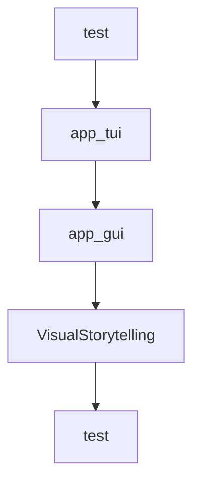

# Chapter 6: Application Patterns and Safety Boundaries

Welcome to **Chapter 6: Application Patterns and Safety Boundaries**. In this part of **Qwen-Agent Tutorial: Tool-Enabled Agent Framework with MCP, RAG, and Multi-Modal Workflows**, you will build an intuitive mental model first, then move into concrete implementation details and practical production tradeoffs.


This chapter maps application-level patterns and operational caveats.

## Learning Goals

- explore app patterns like BrowserQwen and code-interpreter flows
- identify safe vs unsafe execution assumptions
- define environment boundaries for production use
- document risk controls for tool-executing agents

## Safety Notes

- code-interpreter workflows need sandbox hardening
- browser and external-tool integrations need explicit trust boundaries
- production use requires stronger controls than local demos

## Source References

- [BrowserQwen Documentation](https://github.com/QwenLM/Qwen-Agent/blob/main/browser_qwen.md)
- [Assistant Qwen3 Coder Example](https://github.com/QwenLM/Qwen-Agent/blob/main/examples/assistant_qwen3_coder.py)
- [Qwen-Agent README: Disclaimer](https://github.com/QwenLM/Qwen-Agent/blob/main/README.md)

## Summary

You now have a safer application-design lens for Qwen-Agent deployments.

Next: [Chapter 7: Benchmarking and DeepPlanning Evaluation](07-benchmarking-and-deepplanning-evaluation.md)

## Source Code Walkthrough

### `examples/assistant_qwen3.5.py`

The `test` function in [`examples/assistant_qwen3.5.py`](https://github.com/QwenLM/Qwen-Agent/blob/HEAD/examples/assistant_qwen3.5.py) handles a key part of this chapter's functionality:

```py


def test(query: str = 'What time is it?'):
    # Define the agent
    bot = init_agent_service()

    # Chat
    messages = [{'role': 'user', 'content': query}]
    response_plain_text = ''
    for response in bot.run(messages=messages):
        response_plain_text = typewriter_print(response, response_plain_text)


def app_tui():
    # Define the agent
    bot = init_agent_service()

    # Chat
    messages = []
    while True:
        query = input('user question: ')
        messages.append({'role': 'user', 'content': query})
        response = []
        response_plain_text = ''
        for response in bot.run(messages=messages):
            response_plain_text = typewriter_print(response, response_plain_text)
        messages.extend(response)


def app_gui():
    # Define the agent
    bot = init_agent_service()
```

This function is important because it defines how Qwen-Agent Tutorial: Tool-Enabled Agent Framework with MCP, RAG, and Multi-Modal Workflows implements the patterns covered in this chapter.

### `examples/assistant_qwen3.5.py`

The `app_tui` function in [`examples/assistant_qwen3.5.py`](https://github.com/QwenLM/Qwen-Agent/blob/HEAD/examples/assistant_qwen3.5.py) handles a key part of this chapter's functionality:

```py


def app_tui():
    # Define the agent
    bot = init_agent_service()

    # Chat
    messages = []
    while True:
        query = input('user question: ')
        messages.append({'role': 'user', 'content': query})
        response = []
        response_plain_text = ''
        for response in bot.run(messages=messages):
            response_plain_text = typewriter_print(response, response_plain_text)
        messages.extend(response)


def app_gui():
    # Define the agent
    bot = init_agent_service()
    chatbot_config = {
        'prompt.suggestions': [
            'Help me organize my desktop.',
            'Develop a dog website and save it on the desktop',
        ]
    }
    WebUI(
        bot,
        chatbot_config=chatbot_config,
    ).run()

```

This function is important because it defines how Qwen-Agent Tutorial: Tool-Enabled Agent Framework with MCP, RAG, and Multi-Modal Workflows implements the patterns covered in this chapter.

### `examples/assistant_qwen3.5.py`

The `app_gui` function in [`examples/assistant_qwen3.5.py`](https://github.com/QwenLM/Qwen-Agent/blob/HEAD/examples/assistant_qwen3.5.py) handles a key part of this chapter's functionality:

```py


def app_gui():
    # Define the agent
    bot = init_agent_service()
    chatbot_config = {
        'prompt.suggestions': [
            'Help me organize my desktop.',
            'Develop a dog website and save it on the desktop',
        ]
    }
    WebUI(
        bot,
        chatbot_config=chatbot_config,
    ).run()


if __name__ == '__main__':
    # test()
    # app_tui()
    app_gui()

```

This function is important because it defines how Qwen-Agent Tutorial: Tool-Enabled Agent Framework with MCP, RAG, and Multi-Modal Workflows implements the patterns covered in this chapter.

### `examples/visual_storytelling.py`

The `VisualStorytelling` class in [`examples/visual_storytelling.py`](https://github.com/QwenLM/Qwen-Agent/blob/HEAD/examples/visual_storytelling.py) handles a key part of this chapter's functionality:

```py


class VisualStorytelling(Agent):
    """Customize an agent for writing story from pictures"""

    def __init__(self,
                 function_list: Optional[List[Union[str, Dict, BaseTool]]] = None,
                 llm: Optional[Union[Dict, BaseChatModel]] = None):
        super().__init__(llm=llm)

        # Nest one vl assistant for image understanding
        self.image_agent = Assistant(llm={'model': 'qwen-vl-max'})

        # Nest one assistant for article writing
        self.writing_agent = Assistant(llm=self.llm,
                                       function_list=function_list,
                                       system_message='你扮演一个想象力丰富的学生，你需要先理解图片内容，根据描述图片信息以后，' +
                                       '参考知识库中教你的写作技巧，发挥你的想象力，写一篇800字的记叙文',
                                       files=['https://www.jianshu.com/p/cdf82ff33ef8'])

    def _run(self, messages: List[Message], lang: str = 'zh', **kwargs) -> Iterator[List[Message]]:
        """Define the workflow"""

        assert isinstance(messages[-1]['content'], list)
        assert any([item.image for item in messages[-1]['content']]), 'This agent requires input of images'

        # Image understanding
        new_messages = copy.deepcopy(messages)
        new_messages[-1]['content'].append(ContentItem(text='请详细描述这张图片的所有细节内容'))
        response = []
        for rsp in self.image_agent.run(new_messages):
            yield response + rsp
```

This class is important because it defines how Qwen-Agent Tutorial: Tool-Enabled Agent Framework with MCP, RAG, and Multi-Modal Workflows implements the patterns covered in this chapter.


## How These Components Connect


