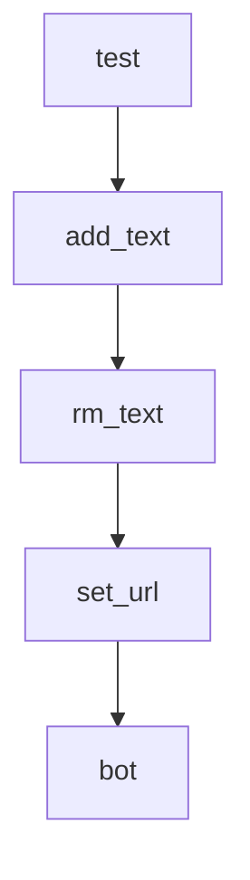

# Chapter 6: Application Patterns and Safety Boundaries

Welcome to **Chapter 6: Application Patterns and Safety Boundaries**. In this part of **Qwen-Agent Tutorial: Tool-Enabled Agent Framework with MCP, RAG, and Multi-Modal Workflows**, you will build an intuitive mental model first, then move into concrete implementation details and practical production tradeoffs.


This chapter maps application-level patterns and operational caveats.

## Learning Goals

- explore app patterns like BrowserQwen and code-interpreter flows
- identify safe vs unsafe execution assumptions
- define environment boundaries for production use
- document risk controls for tool-executing agents

## Safety Notes

- code-interpreter workflows need sandbox hardening
- browser and external-tool integrations need explicit trust boundaries
- production use requires stronger controls than local demos

## Source References

- [BrowserQwen Documentation](https://github.com/QwenLM/Qwen-Agent/blob/main/browser_qwen.md)
- [Assistant Qwen3 Coder Example](https://github.com/QwenLM/Qwen-Agent/blob/main/examples/assistant_qwen3_coder.py)
- [Qwen-Agent README: Disclaimer](https://github.com/QwenLM/Qwen-Agent/blob/main/README.md)

## Summary

You now have a safer application-design lens for Qwen-Agent deployments.

Next: [Chapter 7: Benchmarking and DeepPlanning Evaluation](07-benchmarking-and-deepplanning-evaluation.md)

## Depth Expansion Playbook

## Source Code Walkthrough

### `examples/qwen2vl_function_calling.py`

The `test` function in [`examples/qwen2vl_function_calling.py`](https://github.com/QwenLM/Qwen-Agent/blob/HEAD/examples/qwen2vl_function_calling.py) handles a key part of this chapter's functionality:

```py


def test():
    # Config for the model
    llm_cfg_oai = {
        # Using Qwen2-VL deployed at any openai-compatible service such as vLLM:
        # 'model_type': 'qwenvl_oai',
        # 'model': 'Qwen2-VL-7B-Instruct',
        # 'model_server': 'http://localhost:8000/v1',  # api_base
        # 'api_key': 'EMPTY',

        # Using Qwen2-VL provided by Alibaba Cloud DashScope's openai-compatible service:
        # 'model_type': 'qwenvl_oai',
        # 'model': 'qwen-vl-max-0809',
        # 'model_server': 'https://dashscope.aliyuncs.com/compatible-mode/v1',
        # 'api_key': os.getenv('DASHSCOPE_API_KEY'),

        # Using Qwen2-VL provided by Alibaba Cloud DashScope:
        'model_type': 'qwenvl_dashscope',
        'model': 'qwen-vl-max-0809',
        'api_key': os.getenv('DASHSCOPE_API_KEY'),
        'generate_cfg': {
            'max_retries': 10,
            'fncall_prompt_type': 'qwen'
        }
    }
    llm = get_chat_model(llm_cfg_oai)

    # Initial conversation
    messages = [{
        'role':
            'user',
```

This function is important because it defines how Qwen-Agent Tutorial: Tool-Enabled Agent Framework with MCP, RAG, and Multi-Modal Workflows implements the patterns covered in this chapter.

### `qwen_server/assistant_server.py`

The `add_text` function in [`qwen_server/assistant_server.py`](https://github.com/QwenLM/Qwen-Agent/blob/HEAD/qwen_server/assistant_server.py) handles a key part of this chapter's functionality:

```py


def add_text(history, text):
    history = history + [(text, None)]
    return history, gr.update(value='', interactive=False)


def rm_text(history):
    if not history:
        gr.Warning('No input content!')
    elif not history[-1][1]:
        return history, gr.update(value='', interactive=False)
    else:
        history = history[:-1] + [(history[-1][0], None)]
        return history, gr.update(value='', interactive=False)


def set_url():
    lines = []
    if not os.path.exists(cache_file_popup_url):
        # Only able to remind the situation of first browsing failure
        gr.Error('Oops, it seems that the page cannot be opened due to network issues.')

    for line in jsonlines.open(cache_file_popup_url):
        lines.append(line)
    logger.info('The current access page is: ' + lines[-1]['url'])
    return lines[-1]['url']


def bot(history):
    page_url = set_url()
    if not history:
```

This function is important because it defines how Qwen-Agent Tutorial: Tool-Enabled Agent Framework with MCP, RAG, and Multi-Modal Workflows implements the patterns covered in this chapter.

### `qwen_server/assistant_server.py`

The `rm_text` function in [`qwen_server/assistant_server.py`](https://github.com/QwenLM/Qwen-Agent/blob/HEAD/qwen_server/assistant_server.py) handles a key part of this chapter's functionality:

```py


def rm_text(history):
    if not history:
        gr.Warning('No input content!')
    elif not history[-1][1]:
        return history, gr.update(value='', interactive=False)
    else:
        history = history[:-1] + [(history[-1][0], None)]
        return history, gr.update(value='', interactive=False)


def set_url():
    lines = []
    if not os.path.exists(cache_file_popup_url):
        # Only able to remind the situation of first browsing failure
        gr.Error('Oops, it seems that the page cannot be opened due to network issues.')

    for line in jsonlines.open(cache_file_popup_url):
        lines.append(line)
    logger.info('The current access page is: ' + lines[-1]['url'])
    return lines[-1]['url']


def bot(history):
    page_url = set_url()
    if not history:
        yield history
    else:
        messages = [{'role': 'user', 'content': [{'text': history[-1][0]}, {'file': page_url}]}]
        history[-1][1] = ''
        try:
```

This function is important because it defines how Qwen-Agent Tutorial: Tool-Enabled Agent Framework with MCP, RAG, and Multi-Modal Workflows implements the patterns covered in this chapter.

### `qwen_server/assistant_server.py`

The `set_url` function in [`qwen_server/assistant_server.py`](https://github.com/QwenLM/Qwen-Agent/blob/HEAD/qwen_server/assistant_server.py) handles a key part of this chapter's functionality:

```py


def set_url():
    lines = []
    if not os.path.exists(cache_file_popup_url):
        # Only able to remind the situation of first browsing failure
        gr.Error('Oops, it seems that the page cannot be opened due to network issues.')

    for line in jsonlines.open(cache_file_popup_url):
        lines.append(line)
    logger.info('The current access page is: ' + lines[-1]['url'])
    return lines[-1]['url']


def bot(history):
    page_url = set_url()
    if not history:
        yield history
    else:
        messages = [{'role': 'user', 'content': [{'text': history[-1][0]}, {'file': page_url}]}]
        history[-1][1] = ''
        try:
            response = assistant.run(messages=messages, max_ref_token=server_config.server.max_ref_token)
            for rsp in response:
                if rsp:
                    history[-1][1] = rsp[-1]['content']
                    yield history
        except ModelServiceError as ex:
            history[-1][1] = str(ex)
            yield history
        except Exception as ex:
            raise ValueError(ex)
```

This function is important because it defines how Qwen-Agent Tutorial: Tool-Enabled Agent Framework with MCP, RAG, and Multi-Modal Workflows implements the patterns covered in this chapter.


## How These Components Connect


