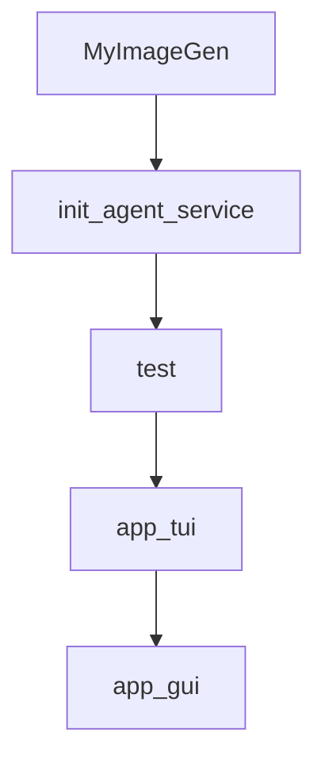

# Chapter 7: Benchmarking and DeepPlanning Evaluation

Welcome to **Chapter 7: Benchmarking and DeepPlanning Evaluation**. In this part of **Qwen-Agent Tutorial: Tool-Enabled Agent Framework with MCP, RAG, and Multi-Modal Workflows**, you will build an intuitive mental model first, then move into concrete implementation details and practical production tradeoffs.


This chapter focuses on long-horizon planning benchmarks and evaluation quality.

## Learning Goals

- understand DeepPlanning benchmark design goals
- evaluate long-horizon planning behavior and constraints
- track local vs global planning failures
- use benchmark insights to guide model/tool improvements

## Evaluation Priorities

- assess proactive information acquisition
- verify local constraint satisfaction
- verify global optimization under budget/time constraints

## Source References

- [DeepPlanning Benchmark](https://qwenlm.github.io/Qwen-Agent/en/benchmarks/deepplanning/)
- [DeepPlanning Code](https://github.com/QwenLM/Qwen-Agent/tree/main/benchmark/deepplanning)
- [Qwen-Agent Benchmarks Index](https://qwenlm.github.io/Qwen-Agent/en/benchmarks/)

## Summary

You now have a benchmark-driven evaluation model for long-horizon Qwen-Agent tasks.

Next: [Chapter 8: Contribution Workflow and Production Governance](08-contribution-workflow-and-production-governance.md)

## Depth Expansion Playbook

## Source Code Walkthrough

### `examples/assistant_add_custom_tool.py`

The `MyImageGen` class in [`examples/assistant_add_custom_tool.py`](https://github.com/QwenLM/Qwen-Agent/blob/HEAD/examples/assistant_add_custom_tool.py) handles a key part of this chapter's functionality:

```py
# Add a custom tool named my_image_gen：
@register_tool('my_image_gen')
class MyImageGen(BaseTool):
    description = 'AI painting (image generation) service, input text description, and return the image URL drawn based on text information.'
    parameters = [{
        'name': 'prompt',
        'type': 'string',
        'description': 'Detailed description of the desired image content, in English',
        'required': True,
    }]

    def call(self, params: str, **kwargs) -> str:
        prompt = json5.loads(params)['prompt']
        prompt = urllib.parse.quote(prompt)
        return json.dumps(
            {'image_url': f'https://image.pollinations.ai/prompt/{prompt}'},
            ensure_ascii=False,
        )


def init_agent_service():
    llm_cfg = {'model': 'qwen-max'}
    system = ("According to the user's request, you first draw a picture and then automatically "
              'run code to download the picture and select an image operation from the given document '
              'to process the image')

    tools = [
        'my_image_gen',
        'code_interpreter',
    ]  # code_interpreter is a built-in tool in Qwen-Agent
    bot = Assistant(
        llm=llm_cfg,
```

This class is important because it defines how Qwen-Agent Tutorial: Tool-Enabled Agent Framework with MCP, RAG, and Multi-Modal Workflows implements the patterns covered in this chapter.

### `examples/assistant_add_custom_tool.py`

The `init_agent_service` function in [`examples/assistant_add_custom_tool.py`](https://github.com/QwenLM/Qwen-Agent/blob/HEAD/examples/assistant_add_custom_tool.py) handles a key part of this chapter's functionality:

```py


def init_agent_service():
    llm_cfg = {'model': 'qwen-max'}
    system = ("According to the user's request, you first draw a picture and then automatically "
              'run code to download the picture and select an image operation from the given document '
              'to process the image')

    tools = [
        'my_image_gen',
        'code_interpreter',
    ]  # code_interpreter is a built-in tool in Qwen-Agent
    bot = Assistant(
        llm=llm_cfg,
        name='AI painting',
        description='AI painting service',
        system_message=system,
        function_list=tools,
        files=[os.path.join(ROOT_RESOURCE, 'doc.pdf')],
    )

    return bot


def test(query: str = 'draw a dog'):
    # Define the agent
    bot = init_agent_service()

    # Chat
    messages = [{'role': 'user', 'content': query}]
    for response in bot.run(messages=messages):
        print('bot response:', response)
```

This function is important because it defines how Qwen-Agent Tutorial: Tool-Enabled Agent Framework with MCP, RAG, and Multi-Modal Workflows implements the patterns covered in this chapter.

### `examples/assistant_add_custom_tool.py`

The `test` function in [`examples/assistant_add_custom_tool.py`](https://github.com/QwenLM/Qwen-Agent/blob/HEAD/examples/assistant_add_custom_tool.py) handles a key part of this chapter's functionality:

```py


def test(query: str = 'draw a dog'):
    # Define the agent
    bot = init_agent_service()

    # Chat
    messages = [{'role': 'user', 'content': query}]
    for response in bot.run(messages=messages):
        print('bot response:', response)


def app_tui():
    # Define the agent
    bot = init_agent_service()

    # Chat
    messages = []
    while True:
        query = input('user question: ')
        messages.append({'role': 'user', 'content': query})
        response = []
        for response in bot.run(messages=messages):
            print('bot response:', response)
        messages.extend(response)


def app_gui():
    # Define the agent
    bot = init_agent_service()
    chatbot_config = {
        'prompt.suggestions': [
```

This function is important because it defines how Qwen-Agent Tutorial: Tool-Enabled Agent Framework with MCP, RAG, and Multi-Modal Workflows implements the patterns covered in this chapter.

### `examples/assistant_add_custom_tool.py`

The `app_tui` function in [`examples/assistant_add_custom_tool.py`](https://github.com/QwenLM/Qwen-Agent/blob/HEAD/examples/assistant_add_custom_tool.py) handles a key part of this chapter's functionality:

```py


def app_tui():
    # Define the agent
    bot = init_agent_service()

    # Chat
    messages = []
    while True:
        query = input('user question: ')
        messages.append({'role': 'user', 'content': query})
        response = []
        for response in bot.run(messages=messages):
            print('bot response:', response)
        messages.extend(response)


def app_gui():
    # Define the agent
    bot = init_agent_service()
    chatbot_config = {
        'prompt.suggestions': [
            '画一只猫的图片',
            '画一只可爱的小腊肠狗',
            '画一幅风景画，有湖有山有树',
        ]
    }
    WebUI(
        bot,
        chatbot_config=chatbot_config,
    ).run()

```

This function is important because it defines how Qwen-Agent Tutorial: Tool-Enabled Agent Framework with MCP, RAG, and Multi-Modal Workflows implements the patterns covered in this chapter.


## How These Components Connect


