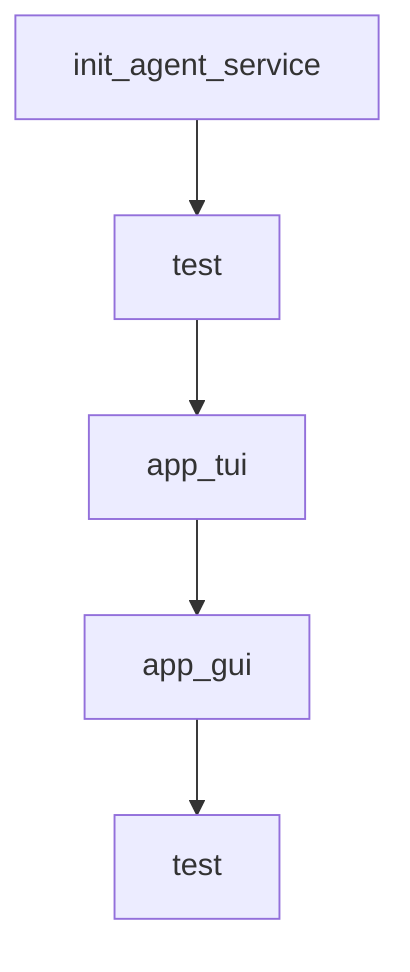

# Chapter 7: Benchmarking and DeepPlanning Evaluation

Welcome to **Chapter 7: Benchmarking and DeepPlanning Evaluation**. In this part of **Qwen-Agent Tutorial: Tool-Enabled Agent Framework with MCP, RAG, and Multi-Modal Workflows**, you will build an intuitive mental model first, then move into concrete implementation details and practical production tradeoffs.


This chapter focuses on long-horizon planning benchmarks and evaluation quality.

## Learning Goals

- understand DeepPlanning benchmark design goals
- evaluate long-horizon planning behavior and constraints
- track local vs global planning failures
- use benchmark insights to guide model/tool improvements

## Evaluation Priorities

- assess proactive information acquisition
- verify local constraint satisfaction
- verify global optimization under budget/time constraints

## Source References

- [DeepPlanning Benchmark](https://qwenlm.github.io/Qwen-Agent/en/benchmarks/deepplanning/)
- [DeepPlanning Code](https://github.com/QwenLM/Qwen-Agent/tree/main/benchmark/deepplanning)
- [Qwen-Agent Benchmarks Index](https://qwenlm.github.io/Qwen-Agent/en/benchmarks/)

## Summary

You now have a benchmark-driven evaluation model for long-horizon Qwen-Agent tasks.

Next: [Chapter 8: Contribution Workflow and Production Governance](08-contribution-workflow-and-production-governance.md)

## Source Code Walkthrough

### `examples/multi_agent_router.py`

The `init_agent_service` function in [`examples/multi_agent_router.py`](https://github.com/QwenLM/Qwen-Agent/blob/HEAD/examples/multi_agent_router.py) handles a key part of this chapter's functionality:

```py


def init_agent_service():
    # settings
    llm_cfg = {'model': 'qwen-max'}
    llm_cfg_vl = {'model': 'qwen-vl-max'}
    tools = ['image_gen', 'code_interpreter']

    # Define a vl agent
    bot_vl = Assistant(llm=llm_cfg_vl, name='多模态助手', description='可以理解图像内容。')

    # Define a tool agent
    bot_tool = ReActChat(
        llm=llm_cfg,
        name='工具助手',
        description='可以使用画图工具和运行代码来解决问题',
        function_list=tools,
    )

    # Define a router (simultaneously serving as a text agent)
    bot = Router(
        llm=llm_cfg,
        agents=[bot_vl, bot_tool],
    )
    return bot


def test(
        query: str = 'hello',
        image: str = 'https://dashscope.oss-cn-beijing.aliyuncs.com/images/dog_and_girl.jpeg',
        file: Optional[str] = os.path.join(ROOT_RESOURCE, 'poem.pdf'),
):
```

This function is important because it defines how Qwen-Agent Tutorial: Tool-Enabled Agent Framework with MCP, RAG, and Multi-Modal Workflows implements the patterns covered in this chapter.

### `examples/multi_agent_router.py`

The `test` function in [`examples/multi_agent_router.py`](https://github.com/QwenLM/Qwen-Agent/blob/HEAD/examples/multi_agent_router.py) handles a key part of this chapter's functionality:

```py


def test(
        query: str = 'hello',
        image: str = 'https://dashscope.oss-cn-beijing.aliyuncs.com/images/dog_and_girl.jpeg',
        file: Optional[str] = os.path.join(ROOT_RESOURCE, 'poem.pdf'),
):
    # Define the agent
    bot = init_agent_service()

    # Chat
    messages = []

    if not image and not file:
        messages.append({'role': 'user', 'content': query})
    else:
        messages.append({'role': 'user', 'content': [{'text': query}]})
        if image:
            messages[-1]['content'].append({'image': image})
        if file:
            messages[-1]['content'].append({'file': file})

    for response in bot.run(messages):
        print('bot response:', response)


def app_tui():
    # Define the agent
    bot = init_agent_service()

    # Chat
    messages = []
```

This function is important because it defines how Qwen-Agent Tutorial: Tool-Enabled Agent Framework with MCP, RAG, and Multi-Modal Workflows implements the patterns covered in this chapter.

### `examples/multi_agent_router.py`

The `app_tui` function in [`examples/multi_agent_router.py`](https://github.com/QwenLM/Qwen-Agent/blob/HEAD/examples/multi_agent_router.py) handles a key part of this chapter's functionality:

```py


def app_tui():
    # Define the agent
    bot = init_agent_service()

    # Chat
    messages = []
    while True:
        query = input('user question: ')
        # Image example: https://dashscope.oss-cn-beijing.aliyuncs.com/images/dog_and_girl.jpeg
        image = input('image url (press enter if no image): ')
        # File example: resource/poem.pdf
        file = input('file url (press enter if no file): ').strip()
        if not query:
            print('user question cannot be empty！')
            continue
        if not image and not file:
            messages.append({'role': 'user', 'content': query})
        else:
            messages.append({'role': 'user', 'content': [{'text': query}]})
            if image:
                messages[-1]['content'].append({'image': image})
            if file:
                messages[-1]['content'].append({'file': file})

        response = []
        for response in bot.run(messages):
            print('bot response:', response)
        messages.extend(response)


```

This function is important because it defines how Qwen-Agent Tutorial: Tool-Enabled Agent Framework with MCP, RAG, and Multi-Modal Workflows implements the patterns covered in this chapter.

### `examples/multi_agent_router.py`

The `app_gui` function in [`examples/multi_agent_router.py`](https://github.com/QwenLM/Qwen-Agent/blob/HEAD/examples/multi_agent_router.py) handles a key part of this chapter's functionality:

```py


def app_gui():
    bot = init_agent_service()
    chatbot_config = {
        'verbose': True,
    }
    WebUI(bot, chatbot_config=chatbot_config).run()


if __name__ == '__main__':
    # test()
    # app_tui()
    app_gui()

```

This function is important because it defines how Qwen-Agent Tutorial: Tool-Enabled Agent Framework with MCP, RAG, and Multi-Modal Workflows implements the patterns covered in this chapter.


## How These Components Connect


