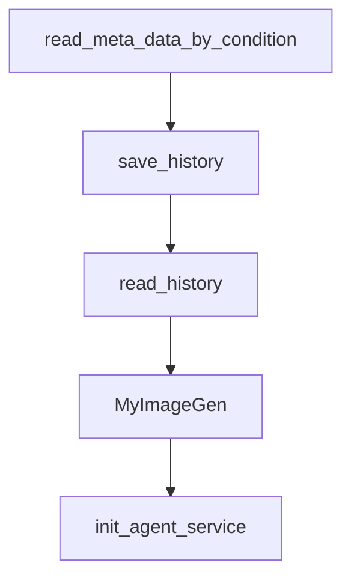

# Chapter 8: Contribution Workflow and Production Governance

Welcome to **Chapter 8: Contribution Workflow and Production Governance**. In this part of **Qwen-Agent Tutorial: Tool-Enabled Agent Framework with MCP, RAG, and Multi-Modal Workflows**, you will build an intuitive mental model first, then move into concrete implementation details and practical production tradeoffs.


This chapter closes with contribution strategy and team governance patterns.

## Learning Goals

- contribute examples and framework improvements responsibly
- maintain docs/tests along with behavior changes
- enforce secure defaults in deployment playbooks
- preserve observability and auditability in production setups

## Governance Checklist

- review tool and MCP scopes before rollout
- pin model/config versions per environment
- maintain run logs and evaluation evidence
- include security review for sandboxed execution components

## Source References

- [Qwen-Agent Repository](https://github.com/QwenLM/Qwen-Agent)
- [Qwen-Agent Issues](https://github.com/QwenLM/Qwen-Agent/issues)
- [Qwen-Agent Documentation](https://qwenlm.github.io/Qwen-Agent/en/)
- [Qwen Chat](https://chat.qwen.ai/)

## Summary

You now have a complete Qwen-Agent path from first setup to production governance.

Next tutorial: [Mini-SWE-Agent Tutorial](../mini-swe-agent-tutorial/)

## Source Code Walkthrough

### `qwen_server/utils.py`

The `read_meta_data_by_condition` function in [`qwen_server/utils.py`](https://github.com/QwenLM/Qwen-Agent/blob/HEAD/qwen_server/utils.py) handles a key part of this chapter's functionality:

```py


def read_meta_data_by_condition(meta_file: str, **kwargs):
    if os.path.exists(meta_file):
        with open(meta_file, 'r', encoding='utf-8') as file:
            meta_info = json.load(file)
    else:
        meta_info = {}
        return []

    if 'url' in kwargs:
        if kwargs['url'] in meta_info:
            return meta_info[kwargs['url']]
        else:
            return ''

    records = meta_info.values()

    if 'time_limit' in kwargs:
        filter_records = []
        for x in records:
            if kwargs['time_limit'][0] <= x['time'] <= kwargs['time_limit'][1]:
                filter_records.append(x)
        records = filter_records
    if 'checked' in kwargs:
        filter_records = []
        for x in records:
            if x['checked']:
                filter_records.append(x)
        records = filter_records

    return records
```

This function is important because it defines how Qwen-Agent Tutorial: Tool-Enabled Agent Framework with MCP, RAG, and Multi-Modal Workflows implements the patterns covered in this chapter.

### `qwen_server/utils.py`

The `save_history` function in [`qwen_server/utils.py`](https://github.com/QwenLM/Qwen-Agent/blob/HEAD/qwen_server/utils.py) handles a key part of this chapter's functionality:

```py


def save_history(history, url, history_dir):
    history = history or []
    history_file = os.path.join(history_dir, get_basename_from_url(url) + '.json')
    if not os.path.exists(history_dir):
        os.makedirs(history_dir)
    with open(history_file, 'w', encoding='utf-8') as file:
        json.dump(history, file, indent=4)


def read_history(url, history_dir):
    history_file = os.path.join(history_dir, get_basename_from_url(url) + '.json')
    if os.path.exists(history_file):
        with open(history_file, 'r', encoding='utf-8') as file:
            data = json.load(file)
            if data:
                return data
            else:
                return []
    return []

```

This function is important because it defines how Qwen-Agent Tutorial: Tool-Enabled Agent Framework with MCP, RAG, and Multi-Modal Workflows implements the patterns covered in this chapter.

### `qwen_server/utils.py`

The `read_history` function in [`qwen_server/utils.py`](https://github.com/QwenLM/Qwen-Agent/blob/HEAD/qwen_server/utils.py) handles a key part of this chapter's functionality:

```py


def read_history(url, history_dir):
    history_file = os.path.join(history_dir, get_basename_from_url(url) + '.json')
    if os.path.exists(history_file):
        with open(history_file, 'r', encoding='utf-8') as file:
            data = json.load(file)
            if data:
                return data
            else:
                return []
    return []

```

This function is important because it defines how Qwen-Agent Tutorial: Tool-Enabled Agent Framework with MCP, RAG, and Multi-Modal Workflows implements the patterns covered in this chapter.

### `examples/assistant_add_custom_tool.py`

The `MyImageGen` class in [`examples/assistant_add_custom_tool.py`](https://github.com/QwenLM/Qwen-Agent/blob/HEAD/examples/assistant_add_custom_tool.py) handles a key part of this chapter's functionality:

```py
# Add a custom tool named my_image_gen：
@register_tool('my_image_gen')
class MyImageGen(BaseTool):
    description = 'AI painting (image generation) service, input text description, and return the image URL drawn based on text information.'
    parameters = [{
        'name': 'prompt',
        'type': 'string',
        'description': 'Detailed description of the desired image content, in English',
        'required': True,
    }]

    def call(self, params: str, **kwargs) -> str:
        prompt = json5.loads(params)['prompt']
        prompt = urllib.parse.quote(prompt)
        return json.dumps(
            {'image_url': f'https://image.pollinations.ai/prompt/{prompt}'},
            ensure_ascii=False,
        )


def init_agent_service():
    llm_cfg = {'model': 'qwen-max'}
    system = ("According to the user's request, you first draw a picture and then automatically "
              'run code to download the picture and select an image operation from the given document '
              'to process the image')

    tools = [
        'my_image_gen',
        'code_interpreter',
    ]  # code_interpreter is a built-in tool in Qwen-Agent
    bot = Assistant(
        llm=llm_cfg,
```

This class is important because it defines how Qwen-Agent Tutorial: Tool-Enabled Agent Framework with MCP, RAG, and Multi-Modal Workflows implements the patterns covered in this chapter.


## How These Components Connect


