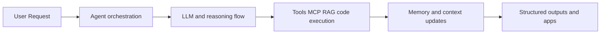

# Qwen-Agent Tutorial: Tool-Enabled Agent Framework with MCP, RAG, and Multi-Modal Workflows

> Learn how to use `QwenLM/Qwen-Agent` to build production-capable agents with function calling, MCP integration, memory/RAG patterns, and benchmark-aware planning workflows.

## Why This Track Matters

Qwen-Agent combines practical framework primitives with broad application patterns (tool calling, MCP, code interpreter, and RAG), making it a strong foundation for advanced agent applications.

This track focuses on:

- launching a first Qwen-Agent workflow quickly
- understanding core framework modules and extension points
- integrating MCP and tool-calling patterns safely
- applying benchmark and operational practices for production use

## Current Snapshot (Verified February 12, 2026)

- repository: [`QwenLM/Qwen-Agent`](https://github.com/QwenLM/Qwen-Agent)
- stars: about **13.3k**
- latest release: [`v0.0.26`](https://github.com/QwenLM/Qwen-Agent/releases/tag/v0.0.26)
- recent activity: updates on **February 3, 2026**
- project positioning: agent framework for Qwen ecosystem with tool, MCP, and planning capabilities

## Mental Model

## Chapter Guide

| Chapter | Key Question | Outcome |
|:--------|:-------------|:--------|
| [01 - Getting Started](01-getting-started.md) | How do I install and run Qwen-Agent quickly? | Working baseline |
| [02 - Framework Architecture and Core Modules](02-framework-architecture-and-core-modules.md) | How are agents, models, tools, and context structured? | Strong architecture model |
| [03 - Model Service and Runtime Strategy](03-model-service-and-runtime-strategy.md) | How do I choose DashScope vs self-hosted runtime paths? | Better deployment decisions |
| [04 - Tool Calling and MCP Integration](04-tool-calling-and-mcp-integration.md) | How do I integrate external capabilities safely? | Reliable integration baseline |
| [05 - Memory, RAG, and Long-Context Workflows](05-memory-rag-and-long-context-workflows.md) | How do I support document-heavy and recall-heavy tasks? | Better retrieval strategy |
| [06 - Application Patterns and Safety Boundaries](06-application-patterns-and-safety-boundaries.md) | How do BrowserQwen and code interpreter patterns apply? | App-level design clarity |
| [07 - Benchmarking and DeepPlanning Evaluation](07-benchmarking-and-deepplanning-evaluation.md) | How do I evaluate long-horizon planning quality? | Evaluation discipline |
| [08 - Contribution Workflow and Production Governance](08-contribution-workflow-and-production-governance.md) | How do teams operate and extend Qwen-Agent responsibly? | Governance runbook |

## What You Will Learn

- how to build and run Qwen-Agent applications with tool integration
- how to choose model-serving and parser strategies across runtimes
- how to apply MCP/RAG patterns safely and effectively
- how to evaluate and govern Qwen-Agent workflows in production-like settings

## Source References

- [Qwen-Agent Repository](https://github.com/QwenLM/Qwen-Agent)
- [Qwen-Agent README](https://github.com/QwenLM/Qwen-Agent/blob/main/README.md)
- [Qwen-Agent Docs](https://qwenlm.github.io/Qwen-Agent/en/)
- [Qwen-Agent Guide](https://qwenlm.github.io/Qwen-Agent/en/guide/)
- [DeepPlanning Benchmark Page](https://qwenlm.github.io/Qwen-Agent/en/benchmarks/deepplanning/)

## Related Tutorials

- [Mini-SWE-Agent Tutorial](../mini-swe-agent-tutorial/)
- [SWE-agent Tutorial](../swe-agent-tutorial/)
- [MCP Servers Tutorial](../mcp-servers-tutorial/)
- [LangGraph Tutorial](../langgraph-tutorial/)

---

Start with [Chapter 1: Getting Started](01-getting-started.md).
