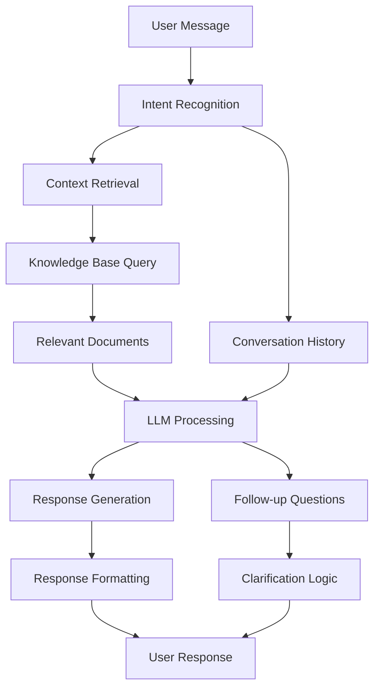

# Chapter 6: Chatbot Development

Welcome to **Chapter 6: Chatbot Development**. In this part of **RAGFlow Tutorial: Complete Guide to Open-Source RAG Engine**, you will build an intuitive mental model first, then move into concrete implementation details and practical production tradeoffs.


> Build intelligent conversational interfaces that leverage your document knowledge bases.

## 🎯 Overview

This chapter focuses on creating sophisticated chatbots using RAGFlow's conversational AI capabilities. You'll learn to build chatbots that can engage in natural conversations while providing accurate, context-aware responses based on your documents.

## 💬 Chatbot Architecture

### Core Components



### Chatbot Types

#### 1. **Document Q&A Bot**
- Focused on answering questions from documents
- High accuracy, factual responses
- Best for: Knowledge bases, documentation

#### 2. **Conversational Assistant**
- Natural conversation flow
- Context awareness across turns
- Best for: Customer support, research assistance

#### 3. **Task-Oriented Bot**
- Goal-directed conversations
- Structured information collection
- Best for: Forms, workflows, guided processes

## 🛠️ Creating Your First Chatbot

### Step 1: Define Chatbot Requirements

```json
{
  "name": "TechDocs Assistant",
  "description": "Answers questions about technical documentation",
  "knowledge_base": "technical_docs_kb",
  "personality": "helpful_technical_expert",
  "capabilities": [
    "answer_questions",
    "provide_examples",
    "suggest_resources",
    "clarify_ambiguities"
  ]
}
```

### Step 2: Configure Chatbot Settings

```yaml
# chatbot_config.yml
chatbot:
  name: "TechDocs Assistant"
  model: "gpt-4o"
  temperature: 0.1
  max_tokens: 1000
  system_prompt: |
    You are a technical documentation assistant. Answer questions
    based on the provided documentation context. Be accurate,
    helpful, and provide examples when relevant.

  knowledge_base:
    id: "technical_docs_kb"
    retrieval_strategy: "hybrid"
    top_k: 5
    score_threshold: 0.7

  conversation:
    max_history: 10
    context_window: 4096
    memory_enabled: true
```

### Step 3: Implement Chatbot Logic

```python
from ragflow import Chatbot, KnowledgeBase

class TechDocsChatbot(Chatbot):
    def __init__(self, kb_id):
        super().__init__()
        self.knowledge_base = KnowledgeBase.get(kb_id)

    def process_message(self, message, context):
        # Retrieve relevant documents
        docs = self.knowledge_base.search(
            query=message,
            top_k=5,
            filters={"category": "technical"}
        )

        # Generate response with context
        context_str = self._format_context(docs)
        prompt = self._build_prompt(message, context_str, context)

        response = self.llm.generate(prompt)

        return {
            "response": response,
            "sources": [doc.id for doc in docs],
            "confidence": self._calculate_confidence(docs)
        }

    def _format_context(self, documents):
        """Format retrieved documents for LLM context"""
        context_parts = []
        for doc in documents:
            context_parts.append(f"Document: {doc.title}\n{doc.content[:500]}...")
        return "\n\n".join(context_parts)

    def _build_prompt(self, message, context, chat_history):
        """Build the complete prompt for the LLM"""
        return f"""You are a technical documentation assistant.

Context from documentation:
{context}

Previous conversation:
{chat_history}

User question: {message}

Provide a helpful, accurate answer based on the documentation context."""

    def _calculate_confidence(self, documents):
        """Calculate response confidence based on document relevance"""
        if not documents:
            return 0.0

        avg_score = sum(doc.score for doc in documents) / len(documents)
        return min(avg_score, 1.0)
```

## 🎨 Advanced Chatbot Features

### Multi-Turn Conversations

```python
class ConversationalChatbot(Chatbot):
    def __init__(self):
        self.conversation_memory = []
        self.max_memory = 10

    def chat(self, message):
        # Add user message to memory
        self.conversation_memory.append({"role": "user", "content": message})

        # Retrieve context
        context = self._get_relevant_context(message)

        # Generate response
        response = self._generate_response(message, context)

        # Add assistant response to memory
        self.conversation_memory.append({"role": "assistant", "content": response})

        # Trim memory if needed
        if len(self.conversation_memory) > self.max_memory:
            self.conversation_memory = self.conversation_memory[-self.max_memory:]

        return response

    def _get_relevant_context(self, message):
        """Get context from conversation history and knowledge base"""
        # Check if question references previous conversation
        conversation_context = self._extract_conversation_references(message)

        # Search knowledge base
        kb_results = self.knowledge_base.search(message)

        return {
            "conversation": conversation_context,
            "documents": kb_results
        }

    def _extract_conversation_references(self, message):
        """Extract references to previous conversation"""
        references = []
        for entry in self.conversation_memory[-5:]:  # Last 5 exchanges
            if any(word in entry["content"].lower() for word in message.lower().split()):
                references.append(entry)

        return references
```

### Context-Aware Responses

```python
class ContextAwareChatbot(Chatbot):
    def __init__(self):
        self.user_context = {}
        self.session_context = {}

    def process_with_context(self, message, user_id, session_id):
        # Update user context
        self.user_context[user_id] = self._update_user_profile(message, user_id)

        # Update session context
        self.session_context[session_id] = self._update_session_context(message, session_id)

        # Generate contextual response
        context = {
            "user": self.user_context[user_id],
            "session": self.session_context[session_id],
            "knowledge": self._get_knowledge_context(message)
        }

        return self._generate_contextual_response(message, context)

    def _update_user_profile(self, message, user_id):
        """Update user profile based on message content"""
        profile = self.user_context.get(user_id, {})

        # Extract user preferences, expertise level, etc.
        if "beginner" in message.lower():
            profile["skill_level"] = "beginner"
        elif "expert" in message.lower():
            profile["skill_level"] = "expert"

        # Track topics of interest
        topics = self._extract_topics(message)
        profile["interests"] = profile.get("interests", set()) | topics

        return profile

    def _update_session_context(self, message, session_id):
        """Update session-specific context"""
        context = self.session_context.get(session_id, {
            "start_time": datetime.now(),
            "message_count": 0,
            "topics_discussed": set()
        })

        context["message_count"] += 1
        context["last_message_time"] = datetime.now()
        context["topics_discussed"].update(self._extract_topics(message))

        return context
```

## 🎯 Specialized Chatbot Types

### Technical Documentation Bot

```python
class TechDocsBot(Chatbot):
    def __init__(self, kb_id):
        super().__init__()
        self.kb = KnowledgeBase.get(kb_id)
        self.specialized_responses = {
            "error": self._handle_error_questions,
            "installation": self._handle_installation_questions,
            "configuration": self._handle_config_questions,
            "api": self._handle_api_questions
        }

    def respond(self, message):
        # Classify question type
        question_type = self._classify_question(message)

        # Use specialized handler
        if question_type in self.specialized_responses:
            return self.specialized_responses[question_type](message)
        else:
            return self._general_response(message)

    def _classify_question(self, message):
        """Classify the type of technical question"""
        message_lower = message.lower()

        if any(word in message_lower for word in ["error", "bug", "issue", "problem"]):
            return "error"
        elif any(word in message_lower for word in ["install", "setup", "deploy"]):
            return "installation"
        elif any(word in message_lower for word in ["config", "setting", "parameter"]):
            return "configuration"
        elif any(word in message_lower for word in ["api", "endpoint", "function"]):
            return "api"

        return "general"

    def _handle_error_questions(self, message):
        """Specialized error handling response"""
        # Search for error-related documentation
        error_docs = self.kb.search(message, filters={"type": "troubleshooting"})

        if error_docs:
            return f"Based on our documentation, here's how to resolve this error:\n\n{error_docs[0].content}"
        else:
            return "I couldn't find specific error documentation. Let me search more broadly..."

    def _handle_installation_questions(self, message):
        """Installation guide response"""
        install_docs = self.kb.search(message, filters={"category": "installation"})

        response = "Here's the installation guide:\n\n"
        for doc in install_docs[:3]:  # Top 3 results
            response += f"## {doc.title}\n{doc.content[:300]}...\n\n"

        return response
```

### Customer Support Bot

```python
class SupportBot(Chatbot):
    def __init__(self):
        self.ticket_system = TicketSystem()
        self.knowledge_base = SupportKB()

    def handle_support_query(self, message, user_info):
        # Classify support issue
        issue_type = self._classify_issue(message)

        # Search knowledge base
        solutions = self.knowledge_base.search(message, filters={"type": issue_type})

        if solutions and solutions[0].confidence > 0.8:
            # Provide self-service solution
            return self._format_solution_response(solutions[0])
        else:
            # Escalate to human support
            ticket = self.ticket_system.create_ticket(message, user_info)
            return self._format_escalation_response(ticket)

    def _classify_issue(self, message):
        """Classify customer support issues"""
        # Use ML model or rule-based classification
        return "technical_issue"  # Placeholder

    def _format_solution_response(self, solution):
        """Format self-service solution"""
        return f"""I found a solution for your issue:

**{solution.title}**

{solution.content}

If this doesn't resolve your issue, you can create a support ticket."""

    def _format_escalation_response(self, ticket):
        """Format escalation response"""
        return f"""I've created a support ticket for you (#{ticket.id}).

Our support team will respond within 24 hours. In the meantime, you can:

1. Check our FAQ: {ticket.faq_link}
2. View ticket status: {ticket.status_link}

Ticket details: {ticket.description}"""
```

## 🎨 Customizing Chatbot Personality

### Personality Configuration

```json
{
  "personality": {
    "tone": "professional_helpful",
    "formality": "semi_formal",
    "verbosity": "concise",
    "humor": "minimal",
    "empathy": "high"
  },
  "response_templates": {
    "greeting": "Hello! I'm here to help you with {topic}.",
    "clarification": "Could you please provide more details about {aspect}?",
    "confirmation": "Great! I've noted that {information}.",
    "follow_up": "Is there anything else I can help you with?"
  }
}
```

### Dynamic Personality Adjustment

```python
class AdaptivePersonalityBot(Chatbot):
    def __init__(self):
        self.personality_states = {
            "professional": {"formality": 0.9, "verbosity": 0.6},
            "casual": {"formality": 0.3, "verbosity": 0.8},
            "technical": {"formality": 0.7, "verbosity": 0.9}
        }
        self.current_personality = "professional"

    def adapt_personality(self, message, user_profile):
        """Adapt personality based on user and context"""
        # Analyze message sentiment
        sentiment = self._analyze_sentiment(message)

        # Consider user expertise
        expertise = user_profile.get("expertise_level", "intermediate")

        # Adjust personality
        if sentiment < 0.3:  # Frustrated user
            self.current_personality = "empathetic"
        elif expertise == "expert":
            self.current_personality = "technical"
        elif expertise == "beginner":
            self.current_personality = "patient_explanatory"

        return self.personality_states[self.current_personality]

    def generate_response(self, message, context):
        personality = self.adapt_personality(message, context["user"])
        prompt = self._build_personality_prompt(message, personality)

        return self.llm.generate(prompt)
```

## 📊 Analytics & Monitoring

### Chatbot Performance Metrics

```python
class ChatbotAnalytics:
    def __init__(self):
        self.metrics = {
            "total_conversations": 0,
            "average_response_time": 0,
            "user_satisfaction": 0,
            "resolution_rate": 0,
            "escalation_rate": 0
        }

    def track_interaction(self, interaction):
        """Track a chatbot interaction"""
        self.metrics["total_conversations"] += 1

        # Update response time
        response_time = interaction["response_time"]
        self.metrics["average_response_time"] = (
            self.metrics["average_response_time"] + response_time
        ) / 2

        # Track resolution
        if interaction["resolved"]:
            self.metrics["resolution_rate"] += 1

    def generate_report(self):
        """Generate performance report"""
        return {
            "period": "last_30_days",
            "metrics": self.metrics,
            "insights": self._generate_insights(),
            "recommendations": self._generate_recommendations()
        }
```

### User Experience Optimization

```python
class UXOptimizer:
    def __init__(self, chatbot):
        self.chatbot = chatbot
        self.user_feedback = []
        self.response_patterns = {}

    def collect_feedback(self, interaction, rating):
        """Collect user feedback"""
        self.user_feedback.append({
            "interaction": interaction,
            "rating": rating,
            "timestamp": datetime.now()
        })

    def analyze_patterns(self):
        """Analyze successful response patterns"""
        high_rated = [f for f in self.user_feedback if f["rating"] >= 4]

        for feedback in high_rated:
            pattern = self._extract_pattern(feedback["interaction"])
            self.response_patterns[pattern] = self.response_patterns.get(pattern, 0) + 1

    def optimize_responses(self):
        """Optimize chatbot responses based on feedback"""
        top_patterns = sorted(
            self.response_patterns.items(),
            key=lambda x: x[1],
            reverse=True
        )[:5]

        # Adjust chatbot behavior based on successful patterns
        for pattern, frequency in top_patterns:
            self.chatbot.add_response_pattern(pattern, frequency)
```

## 🚀 Deployment & Scaling

### Chatbot API Endpoints

```python
from fastapi import FastAPI, HTTPException
from pydantic import BaseModel

app = FastAPI()

class ChatRequest(BaseModel):
    message: str
    user_id: str
    session_id: str
    context: dict = {}

class ChatResponse(BaseModel):
    response: str
    sources: list = []
    confidence: float = 0.0
    suggestions: list = []

@app.post("/chat", response_model=ChatResponse)
async def chat_endpoint(request: ChatRequest):
    try:
        result = await chatbot.process_message(
            message=request.message,
            user_id=request.user_id,
            session_id=request.session_id,
            context=request.context
        )

        return ChatResponse(**result)

    except Exception as e:
        raise HTTPException(status_code=500, detail=str(e))

@app.get("/health")
async def health_check():
    return {"status": "healthy", "timestamp": datetime.now()}
```

### Load Balancing & Scaling

```yaml
# docker-compose.scaled.yml
version: '3.8'
services:
  chatbot_api:
    build: .
    deploy:
      replicas: 3
      resources:
        limits:
          cpus: '1.0'
          memory: 1G
    depends_on:
      - redis
      - ragflow

  redis:
    image: redis:7-alpine
    deploy:
      replicas: 1

  load_balancer:
    image: nginx:alpine
    ports:
      - "80:80"
    volumes:
      - ./nginx.conf:/etc/nginx/nginx.conf
```

## 🎯 Best Practices

### Response Quality

1. **Always provide sources** for factual information
2. **Use confidence scores** to indicate reliability
3. **Offer clarifications** when uncertain
4. **Maintain conversation context** across turns
5. **Handle edge cases** gracefully

### User Experience

1. **Keep responses concise** but informative
2. **Use natural language** patterns
3. **Provide actionable next steps**
4. **Offer multiple response formats** (text, structured, etc.)
5. **Include progress indicators** for long operations

### Performance Optimization

1. **Cache frequent queries** and responses
2. **Implement rate limiting** to prevent abuse
3. **Use async processing** for long-running tasks
4. **Monitor resource usage** and scale accordingly
5. **Optimize knowledge base queries** for speed

## 📈 Next Steps

With your chatbot developed, you're ready to:

- **[Chapter 7: Advanced Features](07-advanced-features.md)** - Explore advanced RAGFlow capabilities
- **[Chapter 8: Production Deployment](08-production-deployment.md)** - Deploy chatbots at scale

---

**Ready to explore advanced features? Continue to [Chapter 7: Advanced Features](07-advanced-features.md)!** 🚀

## What Problem Does This Solve?

Most teams struggle here because the hard part is not writing more code, but deciding clear boundaries for `self`, `message`, `context` so behavior stays predictable as complexity grows.

In practical terms, this chapter helps you avoid three common failures:

- coupling core logic too tightly to one implementation path
- missing the handoff boundaries between setup, execution, and validation
- shipping changes without clear rollback or observability strategy

After working through this chapter, you should be able to reason about `Chapter 6: Chatbot Development` as an operating subsystem inside **RAGFlow Tutorial: Complete Guide to Open-Source RAG Engine**, with explicit contracts for inputs, state transitions, and outputs.

Use the implementation notes around `response`, `user`, `__init__` as your checklist when adapting these patterns to your own repository.

## How it Works Under the Hood

Under the hood, `Chapter 6: Chatbot Development` usually follows a repeatable control path:

1. **Context bootstrap**: initialize runtime config and prerequisites for `self`.
2. **Input normalization**: shape incoming data so `message` receives stable contracts.
3. **Core execution**: run the main logic branch and propagate intermediate state through `context`.
4. **Policy and safety checks**: enforce limits, auth scopes, and failure boundaries.
5. **Output composition**: return canonical result payloads for downstream consumers.
6. **Operational telemetry**: emit logs/metrics needed for debugging and performance tuning.

When debugging, walk this sequence in order and confirm each stage has explicit success/failure conditions.

## Source Walkthrough

Use the following upstream sources to verify implementation details while reading this chapter:

- [GitHub Repository](https://github.com/infiniflow/ragflow)
  Why it matters: authoritative reference on `GitHub Repository` (github.com).
- [AI Codebase Knowledge Builder](https://github.com/johnxie/awesome-code-docs)
  Why it matters: authoritative reference on `AI Codebase Knowledge Builder` (github.com).

Suggested trace strategy:
- search upstream code for `self` and `message` to map concrete implementation paths
- compare docs claims against actual runtime/config code before reusing patterns in production

## Chapter Connections

- [Tutorial Index](index.md)
- [Previous Chapter: Chapter 5: LLM Integration & Configuration](05-llm-integration.md)
- [Next Chapter: Chapter 7: Advanced Features](07-advanced-features.md)
- [Main Catalog](../../README.md#-tutorial-catalog)
- [A-Z Tutorial Directory](../../discoverability/tutorial-directory.md)
