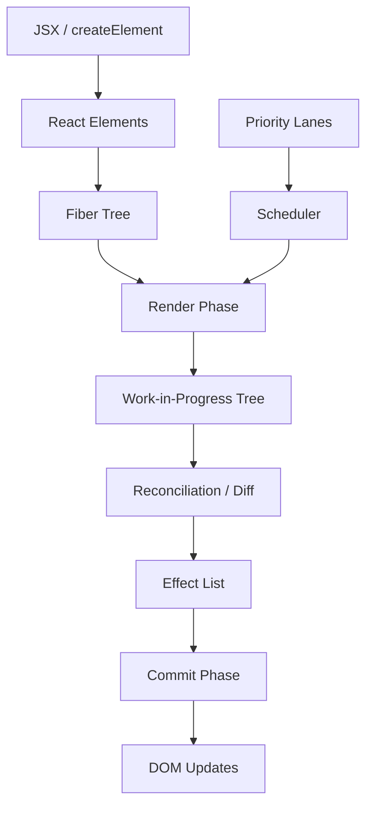

# React Fiber Internals

> Deep dive into React's reconciliation algorithm, the Fiber architecture that powers modern React applications.

[](https://github.com/facebook/react)
[](https://opensource.org/licenses/MIT)
[](https://github.com/facebook/react)


## What You'll Learn

This tutorial provides a comprehensive exploration of React Fiber, the reimplementation of React's core algorithm introduced in React 16. Understanding Fiber helps you write more performant React applications and debug complex rendering issues.

```
┌─────────────────────────────────────────────────────────────────┐
│                    React Fiber Architecture                      │
├─────────────────────────────────────────────────────────────────┤
│                                                                 │
│  ┌─────────────────────────────────────────────────────────┐   │
│  │                  React Elements                          │   │
│  │        (Your JSX → React.createElement)                  │   │
│  └───────────────────────┬─────────────────────────────────┘   │
│                          │                                      │
│                          ▼                                      │
│  ┌─────────────────────────────────────────────────────────┐   │
│  │                   Fiber Tree                             │   │
│  │   ┌─────────┐                                           │   │
│  │   │FiberRoot│                                           │   │
│  │   └────┬────┘                                           │   │
│  │        │                                                 │   │
│  │   ┌────▼────┐    ┌─────────┐    ┌─────────┐            │   │
│  │   │HostRoot │───▶│  App    │───▶│ Header  │            │   │
│  │   └─────────┘    └────┬────┘    └─────────┘            │   │
│  │                       │                                  │   │
│  │                  ┌────▼────┐    ┌─────────┐            │   │
│  │                  │  Main   │───▶│ Footer  │            │   │
│  │                  └─────────┘    └─────────┘            │   │
│  └─────────────────────────────────────────────────────────┘   │
│                          │                                      │
│                          ▼                                      │
│  ┌─────────────────────────────────────────────────────────┐   │
│  │                  Reconciliation                          │   │
│  │     (Diffing current tree vs work-in-progress)          │   │
│  └───────────────────────┬─────────────────────────────────┘   │
│                          │                                      │
│                          ▼                                      │
│  ┌─────────────────────────────────────────────────────────┐   │
│  │                  Commit Phase                            │   │
│  │            (Apply changes to DOM)                        │   │
│  └─────────────────────────────────────────────────────────┘   │
│                                                                 │
└─────────────────────────────────────────────────────────────────┘
```



## Prerequisites

- Solid understanding of React fundamentals
- Familiarity with JavaScript and the DOM
- Basic understanding of data structures (trees, linked lists)

## Tutorial Chapters

### [Chapter 1: Introduction to Fiber](01-introduction.md)
Why React needed Fiber, the problems it solves, and how it differs from the Stack reconciler.

### [Chapter 2: Fiber Data Structure](02-fiber-structure.md)
Deep dive into the Fiber node structure, its properties, and how the tree is organized.

### [Chapter 3: Render Phase](03-render-phase.md)
Understanding the render phase: beginWork, completeWork, and how the work-in-progress tree is built.

### [Chapter 4: Commit Phase](04-commit-phase.md)
How React commits changes to the DOM, effect lists, and the three commit sub-phases.

### [Chapter 5: Scheduling & Priorities](05-scheduling.md)
React's scheduler, priority lanes, time slicing, and interruptible rendering.

### [Chapter 6: Hooks Implementation](06-hooks.md)
How hooks work under the hood, the hooks linked list, and update queues.

### [Chapter 7: Concurrent Features](07-concurrent.md)
Concurrent rendering, Suspense, transitions, and the future of React.

### [Chapter 8: Debugging & Profiling](08-debugging.md)
Tools and techniques for debugging Fiber, React DevTools, and performance profiling.

## Key Concepts

| Concept | Description |
|---------|-------------|
| **Fiber** | A JavaScript object representing a unit of work |
| **Reconciliation** | The algorithm for diffing two trees |
| **Render Phase** | Builds the work-in-progress tree (interruptible) |
| **Commit Phase** | Applies changes to the DOM (synchronous) |
| **Lanes** | Priority system for scheduling updates |
| **Double Buffering** | Current tree and work-in-progress tree |

## Why Learn Fiber?

1. **Debug Complex Issues**: Understand why components re-render
2. **Performance Optimization**: Write code that works with React, not against it
3. **Interview Preparation**: Deep React knowledge is highly valued
4. **Contribute to React**: Foundation for understanding the codebase
5. **Build Better Apps**: Make informed architectural decisions

---

**Ready to begin?** [Start with Chapter 1: Introduction to Fiber](01-introduction.md)

*Generated for [Awesome Code Docs](https://github.com/johnxie/awesome-code-docs)*

## Navigation & Backlinks

- [Start Here: Chapter 1: Introduction to Fiber](01-introduction.md)
- [Back to Main Catalog](../../README.md#-tutorial-catalog)
- [Browse A-Z Tutorial Directory](../../discoverability/tutorial-directory.md)
- [Search by Intent](../../discoverability/query-hub.md)
- [Explore Category Hubs](../../README.md#category-hubs)

## Full Chapter Map

1. [Chapter 1: Introduction to Fiber](01-introduction.md)
2. [Chapter 2: Fiber Data Structure](02-fiber-structure.md)
3. [Chapter 3: Render Phase](03-render-phase.md)
4. [Chapter 4: Commit Phase](04-commit-phase.md)
5. [Chapter 5: Scheduling and Lanes](05-scheduling.md)
6. [Chapter 6: Hooks Implementation](06-hooks.md)
7. [Chapter 7: Concurrent Features](07-concurrent.md)
8. [Chapter 8: Debugging and Profiling](08-debugging.md)

## Source References

- [Awesome Code Docs](https://github.com/johnxie/awesome-code-docs)

*Generated by [AI Codebase Knowledge Builder](https://github.com/The-Pocket/Tutorial-Codebase-Knowledge)*
