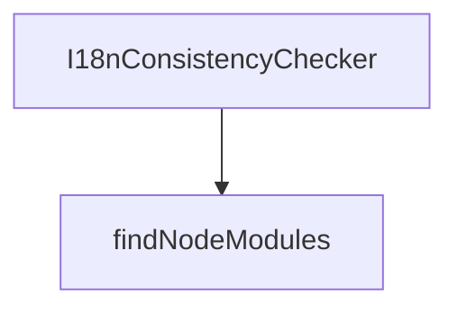

# Chapter 1: Getting Started

Welcome to **Chapter 1: Getting Started**. In this part of **Refly Tutorial: Build Deterministic Agent Skills and Ship Them Across APIs and Claude Code**, you will build an intuitive mental model first, then move into concrete implementation details and practical production tradeoffs.


This chapter establishes a local Refly baseline for experimentation and integration.

## Learning Goals

- install runtime prerequisites for local development
- run middleware and application services
- verify baseline web/API availability
- identify fastest path for first workflow execution

## Local Dev Bootstrap

```bash
docker compose -f deploy/docker/docker-compose.middleware.yml -p refly up -d
corepack enable
pnpm install
pnpm copy-env:develop
pnpm build
pnpm dev
```

## First Validation Checklist

- middleware containers are healthy
- web app is reachable at `http://localhost:5173`
- API responds after startup
- you can create and run a simple workflow

## Source References

- [README Quick Start](https://github.com/refly-ai/refly/blob/main/README.md#quick-start)
- [Contributing: Developing API and Web](https://github.com/refly-ai/refly/blob/main/CONTRIBUTING.md#developing-api-and-web)

## Summary

You now have a baseline local environment for running Refly workflows.

Next: [Chapter 2: Architecture and Component Topology](02-architecture-and-component-topology.md)

## Depth Expansion Playbook

## Source Code Walkthrough

### `scripts/check-i18n-consistency.js`

The `I18nConsistencyChecker` class in [`scripts/check-i18n-consistency.js`](https://github.com/refly-ai/refly/blob/HEAD/scripts/check-i18n-consistency.js) handles a key part of this chapter's functionality:

```js
};

class I18nConsistencyChecker {
  constructor() {
    this.errors = [];
    this.warnings = [];
    this.stats = {
      totalKeys: 0,
      checkedFiles: 0,
      languages: 2,
      missingTranslations: 0,
      extraTranslations: 0,
    };
  }

  /**
   * extract translation keys from TypeScript translation files
   */
  extractTranslationKeys(filePath) {
    try {
      const content = fs.readFileSync(filePath, 'utf8');

      // match const translations = { ... } pattern
      const translationMatch = content.match(
        /const translations = ({[\s\S]*?});?\s*export default translations/,
      );
      if (!translationMatch) {
        throw new Error(`failed to parse translation object: ${filePath}`);
      }

      // clean and preprocess translation object string
      let translationStr = translationMatch[1];
```

This class is important because it defines how Refly Tutorial: Build Deterministic Agent Skills and Ship Them Across APIs and Claude Code implements the patterns covered in this chapter.

### `scripts/cleanup-node-modules.js`

The `findNodeModules` function in [`scripts/cleanup-node-modules.js`](https://github.com/refly-ai/refly/blob/HEAD/scripts/cleanup-node-modules.js) handles a key part of this chapter's functionality:

```js
 * @param {string[]} nodeModulesPaths - Array to collect found paths
 */
function findNodeModules(dir, nodeModulesPaths = []) {
  try {
    const items = fs.readdirSync(dir, { withFileTypes: true });

    for (const item of items) {
      if (item.isDirectory()) {
        const fullPath = path.join(dir, item.name);

        if (item.name === 'node_modules') {
          nodeModulesPaths.push(fullPath);
          console.log(`Found: ${fullPath}`);
        } else {
          // Skip common directories that shouldn't contain node_modules we want to delete
          const skipDirs = ['.git', '.turbo', 'dist', 'build', 'coverage', '.next', '.nuxt'];
          if (!skipDirs.includes(item.name)) {
            findNodeModules(fullPath, nodeModulesPaths);
          }
        }
      }
    }
  } catch (error) {
    // Skip directories we can't read (permission issues, etc.)
    console.warn(`Warning: Could not read directory ${dir}: ${error.message}`);
  }

  return nodeModulesPaths;
}

/**
 * Delete a directory recursively
```

This function is important because it defines how Refly Tutorial: Build Deterministic Agent Skills and Ship Them Across APIs and Claude Code implements the patterns covered in this chapter.


## How These Components Connect


