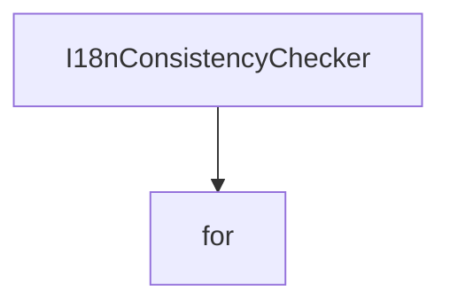

# Chapter 1: Getting Started

Welcome to **Chapter 1: Getting Started**. In this part of **Refly Tutorial: Build Deterministic Agent Skills and Ship Them Across APIs and Claude Code**, you will build an intuitive mental model first, then move into concrete implementation details and practical production tradeoffs.


This chapter establishes a local Refly baseline for experimentation and integration.

## Learning Goals

- install runtime prerequisites for local development
- run middleware and application services
- verify baseline web/API availability
- identify fastest path for first workflow execution

## Local Dev Bootstrap

```bash
docker compose -f deploy/docker/docker-compose.middleware.yml -p refly up -d
corepack enable
pnpm install
pnpm copy-env:develop
pnpm build
pnpm dev
```

## First Validation Checklist

- middleware containers are healthy
- web app is reachable at `http://localhost:5173`
- API responds after startup
- you can create and run a simple workflow

## Source References

- [README Quick Start](https://github.com/refly-ai/refly/blob/main/README.md#quick-start)
- [Contributing: Developing API and Web](https://github.com/refly-ai/refly/blob/main/CONTRIBUTING.md#developing-api-and-web)

## Summary

You now have a baseline local environment for running Refly workflows.

Next: [Chapter 2: Architecture and Component Topology](02-architecture-and-component-topology.md)

## Source Code Walkthrough

### `scripts/check-i18n-consistency.js`

The `I18nConsistencyChecker` class in [`scripts/check-i18n-consistency.js`](https://github.com/refly-ai/refly/blob/HEAD/scripts/check-i18n-consistency.js) handles a key part of this chapter's functionality:

```js
};

class I18nConsistencyChecker {
  constructor() {
    this.errors = [];
    this.warnings = [];
    this.stats = {
      totalKeys: 0,
      checkedFiles: 0,
      languages: 2,
      missingTranslations: 0,
      extraTranslations: 0,
    };
  }

  /**
   * extract translation keys from TypeScript translation files
   */
  extractTranslationKeys(filePath) {
    try {
      const content = fs.readFileSync(filePath, 'utf8');

      // match const translations = { ... } pattern
      const translationMatch = content.match(
        /const translations = ({[\s\S]*?});?\s*export default translations/,
      );
      if (!translationMatch) {
        throw new Error(`failed to parse translation object: ${filePath}`);
      }

      // clean and preprocess translation object string
      let translationStr = translationMatch[1];
```

This class is important because it defines how Refly Tutorial: Build Deterministic Agent Skills and Ship Them Across APIs and Claude Code implements the patterns covered in this chapter.

### `config/provider-catalog.json`

The `for` interface in [`config/provider-catalog.json`](https://github.com/refly-ai/refly/blob/HEAD/config/provider-catalog.json) handles a key part of this chapter's functionality:

```json
      "baseUrl": "https://api.siliconflow.cn/v1",
      "description": {
        "en": "SiliconFlow provides a one-stop cloud service platform with high-performance inference for top-tier large language and embedding models.",
        "zh-CN": "SiliconFlow 提供一站式云服务平台，为顶级大语言模型和嵌入模型提供高性能推理服务。"
      },
      "categories": ["llm", "embedding"],
      "documentation": "https://docs.siliconflow.cn/",
      "icon": "https://static.refly.ai/icons/providers/siliconflow.png"
    },
    {
      "name": "litellm",
      "providerKey": "openai",
      "baseUrl": "https://litellm.powerformer.net/v1",
      "description": {
        "en": "LiteLLM is a lightweight library to simplify LLM completion and embedding calls, providing a consistent interface for over 100 LLMs.",
        "zh-CN": "LiteLLM 是一个轻量级库，用于简化 LLM 的补全和嵌入调用，为 100 多个 LLM 提供一致的接口。"
      },
      "categories": ["llm", "embedding"],
      "documentation": "https://docs.litellm.ai/",
      "icon": "https://static.refly.ai/icons/providers/litellm.png"
    },
    {
      "name": "七牛云AI",
      "providerKey": "openai",
      "baseUrl": "https://api.qnaigc.com/v1",
      "description": {
        "en": "Qiniu AI provides efficient, stable, and secure model inference services, supporting mainstream open-source large models.",
        "zh-CN": "七牛云AI 提供高效、稳定、安全的模型推理服务，支持主流开源大模型。"
      },
      "categories": ["llm"],
      "documentation": "https://developer.qiniu.com/aitokenapi",
      "icon": "https://static.refly.ai/icons/providers/qiniu.png"
```

This interface is important because it defines how Refly Tutorial: Build Deterministic Agent Skills and Ship Them Across APIs and Claude Code implements the patterns covered in this chapter.


## How These Components Connect


