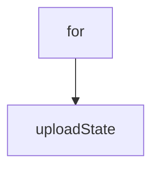

# Chapter 2: Architecture and Component Topology

Welcome to **Chapter 2: Architecture and Component Topology**. In this part of **Refly Tutorial: Build Deterministic Agent Skills and Ship Them Across APIs and Claude Code**, you will build an intuitive mental model first, then move into concrete implementation details and practical production tradeoffs.


This chapter maps Refly's monorepo into runtime responsibilities.

## Learning Goals

- identify the role of `apps/api`, `apps/web`, and shared packages
- understand where skill logic and workflow orchestration live
- trace how shared types/utilities reduce drift across surfaces
- decide where to customize first for your use case

## Core Topology

| Layer | Key Paths | Primary Responsibility |
|:------|:----------|:-----------------------|
| API backend | `apps/api/` | workflow execution, skills, tool integrations |
| web app | `apps/web/` | visual builder and runtime interaction UX |
| CLI | `packages/cli/` | deterministic command-line orchestration |
| skill runtime libs | `packages/skill-template/`, `packages/providers/` | reusable execution and provider abstractions |
| shared foundations | `packages/common-types/`, `packages/stores/`, `packages/utils/` | cross-surface consistency |

## Source References

- [Contributing: Code Structure](https://github.com/refly-ai/refly/blob/main/CONTRIBUTING.md#code-structure)
- [Repository Tree](https://github.com/refly-ai/refly)

## Summary

You now understand the architectural boundaries and extension points in Refly.

Next: [Chapter 3: Workflow Construction and Deterministic Runtime](03-workflow-construction-and-deterministic-runtime.md)

## Source Code Walkthrough

### `config/provider-catalog.json`

The `for` interface in [`config/provider-catalog.json`](https://github.com/refly-ai/refly/blob/HEAD/config/provider-catalog.json) handles a key part of this chapter's functionality:

```json
      "baseUrl": "https://api.siliconflow.cn/v1",
      "description": {
        "en": "SiliconFlow provides a one-stop cloud service platform with high-performance inference for top-tier large language and embedding models.",
        "zh-CN": "SiliconFlow 提供一站式云服务平台，为顶级大语言模型和嵌入模型提供高性能推理服务。"
      },
      "categories": ["llm", "embedding"],
      "documentation": "https://docs.siliconflow.cn/",
      "icon": "https://static.refly.ai/icons/providers/siliconflow.png"
    },
    {
      "name": "litellm",
      "providerKey": "openai",
      "baseUrl": "https://litellm.powerformer.net/v1",
      "description": {
        "en": "LiteLLM is a lightweight library to simplify LLM completion and embedding calls, providing a consistent interface for over 100 LLMs.",
        "zh-CN": "LiteLLM 是一个轻量级库，用于简化 LLM 的补全和嵌入调用，为 100 多个 LLM 提供一致的接口。"
      },
      "categories": ["llm", "embedding"],
      "documentation": "https://docs.litellm.ai/",
      "icon": "https://static.refly.ai/icons/providers/litellm.png"
    },
    {
      "name": "七牛云AI",
      "providerKey": "openai",
      "baseUrl": "https://api.qnaigc.com/v1",
      "description": {
        "en": "Qiniu AI provides efficient, stable, and secure model inference services, supporting mainstream open-source large models.",
        "zh-CN": "七牛云AI 提供高效、稳定、安全的模型推理服务，支持主流开源大模型。"
      },
      "categories": ["llm"],
      "documentation": "https://developer.qiniu.com/aitokenapi",
      "icon": "https://static.refly.ai/icons/providers/qiniu.png"
```

This interface is important because it defines how Refly Tutorial: Build Deterministic Agent Skills and Ship Them Across APIs and Claude Code implements the patterns covered in this chapter.

### `scripts/upload-config.js`

The `uploadState` function in [`scripts/upload-config.js`](https://github.com/refly-ai/refly/blob/HEAD/scripts/upload-config.js) handles a key part of this chapter's functionality:

```js
import { Client as MinioClient } from 'minio';

async function uploadState(sourceFile, targetPath) {
  const minioClient = new MinioClient({
    endPoint: process.env.MINIO_EXTERNAL_ENDPOINT,
    port: Number.parseInt(process.env.MINIO_EXTERNAL_PORT || '443'),
    useSSL: process.env.MINIO_EXTERNAL_USE_SSL === 'true',
    accessKey: process.env.MINIO_EXTERNAL_ACCESS_KEY,
    secretKey: process.env.MINIO_EXTERNAL_SECRET_KEY,
  });

  const metaData = {
    'Content-Type': 'application/json',
  };
  await minioClient.fPutObject(process.env.MINIO_EXTERNAL_BUCKET, targetPath, sourceFile, metaData);
}

async function main() {
  // upload mcp catalog
  await uploadState('config/mcp-catalog.json', 'mcp-config/mcp-catalog.json');

  await uploadState('config/provider-catalog.json', 'mcp-config/provider-catalog.json');
}

main();

```

This function is important because it defines how Refly Tutorial: Build Deterministic Agent Skills and Ship Them Across APIs and Claude Code implements the patterns covered in this chapter.


## How These Components Connect


