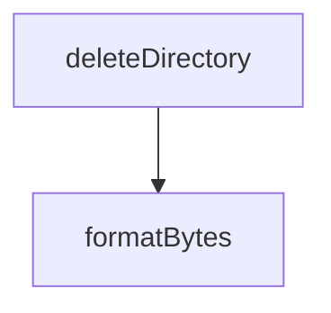

# Chapter 2: Architecture and Component Topology

Welcome to **Chapter 2: Architecture and Component Topology**. In this part of **Refly Tutorial: Build Deterministic Agent Skills and Ship Them Across APIs and Claude Code**, you will build an intuitive mental model first, then move into concrete implementation details and practical production tradeoffs.


This chapter maps Refly's monorepo into runtime responsibilities.

## Learning Goals

- identify the role of `apps/api`, `apps/web`, and shared packages
- understand where skill logic and workflow orchestration live
- trace how shared types/utilities reduce drift across surfaces
- decide where to customize first for your use case

## Core Topology

| Layer | Key Paths | Primary Responsibility |
|:------|:----------|:-----------------------|
| API backend | `apps/api/` | workflow execution, skills, tool integrations |
| web app | `apps/web/` | visual builder and runtime interaction UX |
| CLI | `packages/cli/` | deterministic command-line orchestration |
| skill runtime libs | `packages/skill-template/`, `packages/providers/` | reusable execution and provider abstractions |
| shared foundations | `packages/common-types/`, `packages/stores/`, `packages/utils/` | cross-surface consistency |

## Source References

- [Contributing: Code Structure](https://github.com/refly-ai/refly/blob/main/CONTRIBUTING.md#code-structure)
- [Repository Tree](https://github.com/refly-ai/refly)

## Summary

You now understand the architectural boundaries and extension points in Refly.

Next: [Chapter 3: Workflow Construction and Deterministic Runtime](03-workflow-construction-and-deterministic-runtime.md)

## Depth Expansion Playbook

## Source Code Walkthrough

### `scripts/cleanup-node-modules.js`

The `deleteDirectory` function in [`scripts/cleanup-node-modules.js`](https://github.com/refly-ai/refly/blob/HEAD/scripts/cleanup-node-modules.js) handles a key part of this chapter's functionality:

```js
 * @param {string} dirPath - Path to directory to delete
 */
function deleteDirectory(dirPath) {
  try {
    fs.rmSync(dirPath, { recursive: true, force: true });
    console.log(`✅ Deleted: ${dirPath}`);
    return true;
  } catch (error) {
    console.error(`❌ Failed to delete ${dirPath}: ${error.message}`);
    return false;
  }
}

/**
 * Get human-readable file size
 * @param {number} bytes - Size in bytes
 */
function formatBytes(bytes) {
  if (bytes === 0) return '0 Bytes';
  const k = 1024;
  const sizes = ['Bytes', 'KB', 'MB', 'GB'];
  const i = Math.floor(Math.log(bytes) / Math.log(k));
  return `${Number.parseFloat((bytes / k ** i).toFixed(2))} ${sizes[i]}`;
}

/**
 * Calculate directory size
 * @param {string} dirPath - Path to directory
 */
function getDirectorySize(dirPath) {
  let totalSize = 0;

```

This function is important because it defines how Refly Tutorial: Build Deterministic Agent Skills and Ship Them Across APIs and Claude Code implements the patterns covered in this chapter.

### `scripts/cleanup-node-modules.js`

The `formatBytes` function in [`scripts/cleanup-node-modules.js`](https://github.com/refly-ai/refly/blob/HEAD/scripts/cleanup-node-modules.js) handles a key part of this chapter's functionality:

```js
 * @param {number} bytes - Size in bytes
 */
function formatBytes(bytes) {
  if (bytes === 0) return '0 Bytes';
  const k = 1024;
  const sizes = ['Bytes', 'KB', 'MB', 'GB'];
  const i = Math.floor(Math.log(bytes) / Math.log(k));
  return `${Number.parseFloat((bytes / k ** i).toFixed(2))} ${sizes[i]}`;
}

/**
 * Calculate directory size
 * @param {string} dirPath - Path to directory
 */
function getDirectorySize(dirPath) {
  let totalSize = 0;

  try {
    const items = fs.readdirSync(dirPath, { withFileTypes: true });

    for (const item of items) {
      const fullPath = path.join(dirPath, item.name);

      if (item.isDirectory()) {
        totalSize += getDirectorySize(fullPath);
      } else {
        try {
          const stats = fs.statSync(fullPath);
          totalSize += stats.size;
        } catch (_error) {
          // Skip files we can't stat
        }
```

This function is important because it defines how Refly Tutorial: Build Deterministic Agent Skills and Ship Them Across APIs and Claude Code implements the patterns covered in this chapter.


## How These Components Connect


