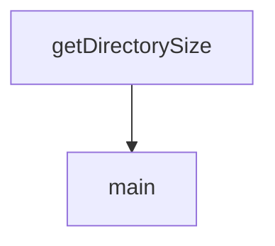

# Chapter 3: Workflow Construction and Deterministic Runtime

Welcome to **Chapter 3: Workflow Construction and Deterministic Runtime**. In this part of **Refly Tutorial: Build Deterministic Agent Skills and Ship Them Across APIs and Claude Code**, you will build an intuitive mental model first, then move into concrete implementation details and practical production tradeoffs.


This chapter focuses on constructing workflows that remain stable under real operational pressure.

## Learning Goals

- build workflows from intent while preserving deterministic behavior
- validate graph logic before execution
- use state transitions to avoid accidental invalid runs
- design workflows for recovery and reuse

## Builder-Oriented Loop

1. start workflow construction (visual or CLI builder)
2. define nodes, dependencies, and variable contracts
3. validate structure before commit/run
4. run with explicit input and inspect status/output
5. iterate with small deltas and versioned changes

## Determinism Signals

| Signal | Why It Matters |
|:-------|:---------------|
| DAG validation | prevents cycle-based runtime failures |
| explicit state transitions | reduces partial/invalid commits |
| JSON-first outputs | improves machine readability and automation |
| versioned skills | enables safe reuse and rollback |

## Source References

- [README: Core Capabilities](https://github.com/refly-ai/refly/blob/main/README.md#core-capabilities)
- [README: Create Your First Workflow](https://github.com/refly-ai/refly/blob/main/README.md#create-your-first-workflow)
- [CLI README](https://github.com/refly-ai/refly/blob/main/packages/cli/README.md)

## Summary

You now have a practical pattern for building stable workflows and iterating safely.

Next: [Chapter 4: API and Webhook Integrations](04-api-and-webhook-integrations.md)

## Depth Expansion Playbook

## Source Code Walkthrough

### `scripts/cleanup-node-modules.js`

The `getDirectorySize` function in [`scripts/cleanup-node-modules.js`](https://github.com/refly-ai/refly/blob/HEAD/scripts/cleanup-node-modules.js) handles a key part of this chapter's functionality:

```js
 * @param {string} dirPath - Path to directory
 */
function getDirectorySize(dirPath) {
  let totalSize = 0;

  try {
    const items = fs.readdirSync(dirPath, { withFileTypes: true });

    for (const item of items) {
      const fullPath = path.join(dirPath, item.name);

      if (item.isDirectory()) {
        totalSize += getDirectorySize(fullPath);
      } else {
        try {
          const stats = fs.statSync(fullPath);
          totalSize += stats.size;
        } catch (_error) {
          // Skip files we can't stat
        }
      }
    }
  } catch (_error) {
    // Skip directories we can't read
  }

  return totalSize;
}

async function main() {
  console.log('🔍 Searching for node_modules directories...\n');

```

This function is important because it defines how Refly Tutorial: Build Deterministic Agent Skills and Ship Them Across APIs and Claude Code implements the patterns covered in this chapter.

### `scripts/cleanup-node-modules.js`

The `main` function in [`scripts/cleanup-node-modules.js`](https://github.com/refly-ai/refly/blob/HEAD/scripts/cleanup-node-modules.js) handles a key part of this chapter's functionality:

```js
}

async function main() {
  console.log('🔍 Searching for node_modules directories...\n');

  const startTime = Date.now();
  const rootDir = process.cwd();

  // Find all node_modules directories
  const nodeModulesPaths = findNodeModules(rootDir);

  if (nodeModulesPaths.length === 0) {
    console.log('✨ No node_modules directories found!');
    return;
  }

  console.log(`\n📊 Found ${nodeModulesPaths.length} node_modules directories`);

  // Calculate total size before deletion
  let totalSize = 0;
  console.log('\n📏 Calculating sizes...');
  for (const dirPath of nodeModulesPaths) {
    const size = getDirectorySize(dirPath);
    totalSize += size;
    console.log(`  ${path.relative(rootDir, dirPath)}: ${formatBytes(size)}`);
  }

  console.log(`\n💾 Total size to be freed: ${formatBytes(totalSize)}`);
  console.log('\n🗑️  Starting deletion...\n');

  // Delete all found node_modules directories
  let deletedCount = 0;
```

This function is important because it defines how Refly Tutorial: Build Deterministic Agent Skills and Ship Them Across APIs and Claude Code implements the patterns covered in this chapter.


## How These Components Connect


