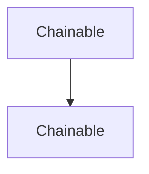

# Chapter 4: API and Webhook Integrations

Welcome to **Chapter 4: API and Webhook Integrations**. In this part of **Refly Tutorial: Build Deterministic Agent Skills and Ship Them Across APIs and Claude Code**, you will build an intuitive mental model first, then move into concrete implementation details and practical production tradeoffs.


This chapter covers the two primary operational integration surfaces for Refly workflows.

## Learning Goals

- authenticate and call workflow APIs correctly
- track execution state and retrieve outputs reliably
- enable webhook-driven triggers with variable payloads
- choose API vs webhook based on control requirements

## API Integration Pattern

| Step | Endpoint Family | Outcome |
|:-----|:----------------|:--------|
| trigger run | `POST /openapi/workflow/{canvasId}/run` | receive execution ID |
| check status | `GET /openapi/workflow/{executionId}/status` | monitor state transitions |
| fetch output | `GET /openapi/workflow/{executionId}/output` | collect artifacts/results |
| abort if needed | `POST /openapi/workflow/{executionId}/abort` | controlled interruption |

## Webhook Usage Pattern

- enable webhook from workflow integration settings
- send `variables` payloads as JSON body
- use file upload API first when passing file variables
- monitor run history for runtime validation

## Source References

- [OpenAPI Guide](https://github.com/refly-ai/refly/blob/main/docs/en/guide/api/openapi.md)
- [Webhook Guide](https://github.com/refly-ai/refly/blob/main/docs/en/guide/api/webhook.md)
- [README: API Integration Use Case](https://github.com/refly-ai/refly/blob/main/README.md#use-case-1-api-integration)

## Summary

You now have a production-style pattern for calling and monitoring Refly workflows programmatically.

Next: [Chapter 5: Refly CLI and Claude Code Skill Export](05-refly-cli-and-claude-code-skill-export.md)

## Source Code Walkthrough

### `cypress/support/commands.ts`

The `Chainable` interface in [`cypress/support/commands.ts`](https://github.com/refly-ai/refly/blob/HEAD/cypress/support/commands.ts) handles a key part of this chapter's functionality:

```ts
// declare global {
//   namespace Cypress {
//     interface Chainable {
//       login(email: string, password: string): Chainable<void>
//       drag(subject: string, options?: Partial<TypeOptions>): Chainable<Element>
//       dismiss(subject: string, options?: Partial<TypeOptions>): Chainable<Element>
//       visit(originalFn: CommandOriginalFn, url: string, options: Partial<VisitOptions>): Chainable<Element>
//     }
//   }
// }

declare namespace Cypress {
  interface Chainable {
    /**
     * Execute SQL query through Docker container
     * @param query - SQL query to execute
     * @example
     * cy.execSQL('SELECT * FROM users')
     */
    execSQL(query: string): Chainable<string>;
    /**
     * Login to the app
     * @param email - Email to login with
     * @param password - Password to login with
     * @example
     * cy.login('test@example.com', 'testPassword123')
     */
    login(email: string, password: string): Chainable<void>;
  }
}

Cypress.Commands.add('execSQL', (query: string) => {
```

This interface is important because it defines how Refly Tutorial: Build Deterministic Agent Skills and Ship Them Across APIs and Claude Code implements the patterns covered in this chapter.

### `cypress/support/commands.ts`

The `Chainable` interface in [`cypress/support/commands.ts`](https://github.com/refly-ai/refly/blob/HEAD/cypress/support/commands.ts) handles a key part of this chapter's functionality:

```ts
// declare global {
//   namespace Cypress {
//     interface Chainable {
//       login(email: string, password: string): Chainable<void>
//       drag(subject: string, options?: Partial<TypeOptions>): Chainable<Element>
//       dismiss(subject: string, options?: Partial<TypeOptions>): Chainable<Element>
//       visit(originalFn: CommandOriginalFn, url: string, options: Partial<VisitOptions>): Chainable<Element>
//     }
//   }
// }

declare namespace Cypress {
  interface Chainable {
    /**
     * Execute SQL query through Docker container
     * @param query - SQL query to execute
     * @example
     * cy.execSQL('SELECT * FROM users')
     */
    execSQL(query: string): Chainable<string>;
    /**
     * Login to the app
     * @param email - Email to login with
     * @param password - Password to login with
     * @example
     * cy.login('test@example.com', 'testPassword123')
     */
    login(email: string, password: string): Chainable<void>;
  }
}

Cypress.Commands.add('execSQL', (query: string) => {
```

This interface is important because it defines how Refly Tutorial: Build Deterministic Agent Skills and Ship Them Across APIs and Claude Code implements the patterns covered in this chapter.


## How These Components Connect


