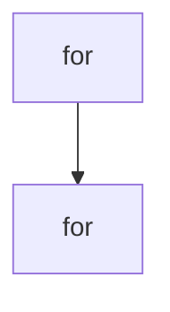

# Chapter 4: API and Webhook Integrations

Welcome to **Chapter 4: API and Webhook Integrations**. In this part of **Refly Tutorial: Build Deterministic Agent Skills and Ship Them Across APIs and Claude Code**, you will build an intuitive mental model first, then move into concrete implementation details and practical production tradeoffs.


This chapter covers the two primary operational integration surfaces for Refly workflows.

## Learning Goals

- authenticate and call workflow APIs correctly
- track execution state and retrieve outputs reliably
- enable webhook-driven triggers with variable payloads
- choose API vs webhook based on control requirements

## API Integration Pattern

| Step | Endpoint Family | Outcome |
|:-----|:----------------|:--------|
| trigger run | `POST /openapi/workflow/{canvasId}/run` | receive execution ID |
| check status | `GET /openapi/workflow/{executionId}/status` | monitor state transitions |
| fetch output | `GET /openapi/workflow/{executionId}/output` | collect artifacts/results |
| abort if needed | `POST /openapi/workflow/{executionId}/abort` | controlled interruption |

## Webhook Usage Pattern

- enable webhook from workflow integration settings
- send `variables` payloads as JSON body
- use file upload API first when passing file variables
- monitor run history for runtime validation

## Source References

- [OpenAPI Guide](https://github.com/refly-ai/refly/blob/main/docs/en/guide/api/openapi.md)
- [Webhook Guide](https://github.com/refly-ai/refly/blob/main/docs/en/guide/api/webhook.md)
- [README: API Integration Use Case](https://github.com/refly-ai/refly/blob/main/README.md#use-case-1-api-integration)

## Summary

You now have a production-style pattern for calling and monitoring Refly workflows programmatically.

Next: [Chapter 5: Refly CLI and Claude Code Skill Export](05-refly-cli-and-claude-code-skill-export.md)

## Depth Expansion Playbook

## Source Code Walkthrough

### `config/provider-catalog.json`

The `for` interface in [`config/provider-catalog.json`](https://github.com/refly-ai/refly/blob/HEAD/config/provider-catalog.json) handles a key part of this chapter's functionality:

```json
      "baseUrl": "https://api.siliconflow.cn/v1",
      "description": {
        "en": "SiliconFlow provides a one-stop cloud service platform with high-performance inference for top-tier large language and embedding models.",
        "zh-CN": "SiliconFlow 提供一站式云服务平台，为顶级大语言模型和嵌入模型提供高性能推理服务。"
      },
      "categories": ["llm", "embedding"],
      "documentation": "https://docs.siliconflow.cn/",
      "icon": "https://static.refly.ai/icons/providers/siliconflow.png"
    },
    {
      "name": "litellm",
      "providerKey": "openai",
      "baseUrl": "https://litellm.powerformer.net/v1",
      "description": {
        "en": "LiteLLM is a lightweight library to simplify LLM completion and embedding calls, providing a consistent interface for over 100 LLMs.",
        "zh-CN": "LiteLLM 是一个轻量级库，用于简化 LLM 的补全和嵌入调用，为 100 多个 LLM 提供一致的接口。"
      },
      "categories": ["llm", "embedding"],
      "documentation": "https://docs.litellm.ai/",
      "icon": "https://static.refly.ai/icons/providers/litellm.png"
    },
    {
      "name": "七牛云AI",
      "providerKey": "openai",
      "baseUrl": "https://api.qnaigc.com/v1",
      "description": {
        "en": "Qiniu AI provides efficient, stable, and secure model inference services, supporting mainstream open-source large models.",
        "zh-CN": "七牛云AI 提供高效、稳定、安全的模型推理服务，支持主流开源大模型。"
      },
      "categories": ["llm"],
      "documentation": "https://developer.qiniu.com/aitokenapi",
      "icon": "https://static.refly.ai/icons/providers/qiniu.png"
```

This interface is important because it defines how Refly Tutorial: Build Deterministic Agent Skills and Ship Them Across APIs and Claude Code implements the patterns covered in this chapter.

### `config/provider-catalog.json`

The `for` interface in [`config/provider-catalog.json`](https://github.com/refly-ai/refly/blob/HEAD/config/provider-catalog.json) handles a key part of this chapter's functionality:

```json
      "baseUrl": "https://api.siliconflow.cn/v1",
      "description": {
        "en": "SiliconFlow provides a one-stop cloud service platform with high-performance inference for top-tier large language and embedding models.",
        "zh-CN": "SiliconFlow 提供一站式云服务平台，为顶级大语言模型和嵌入模型提供高性能推理服务。"
      },
      "categories": ["llm", "embedding"],
      "documentation": "https://docs.siliconflow.cn/",
      "icon": "https://static.refly.ai/icons/providers/siliconflow.png"
    },
    {
      "name": "litellm",
      "providerKey": "openai",
      "baseUrl": "https://litellm.powerformer.net/v1",
      "description": {
        "en": "LiteLLM is a lightweight library to simplify LLM completion and embedding calls, providing a consistent interface for over 100 LLMs.",
        "zh-CN": "LiteLLM 是一个轻量级库，用于简化 LLM 的补全和嵌入调用，为 100 多个 LLM 提供一致的接口。"
      },
      "categories": ["llm", "embedding"],
      "documentation": "https://docs.litellm.ai/",
      "icon": "https://static.refly.ai/icons/providers/litellm.png"
    },
    {
      "name": "七牛云AI",
      "providerKey": "openai",
      "baseUrl": "https://api.qnaigc.com/v1",
      "description": {
        "en": "Qiniu AI provides efficient, stable, and secure model inference services, supporting mainstream open-source large models.",
        "zh-CN": "七牛云AI 提供高效、稳定、安全的模型推理服务，支持主流开源大模型。"
      },
      "categories": ["llm"],
      "documentation": "https://developer.qiniu.com/aitokenapi",
      "icon": "https://static.refly.ai/icons/providers/qiniu.png"
```

This interface is important because it defines how Refly Tutorial: Build Deterministic Agent Skills and Ship Them Across APIs and Claude Code implements the patterns covered in this chapter.


## How These Components Connect


