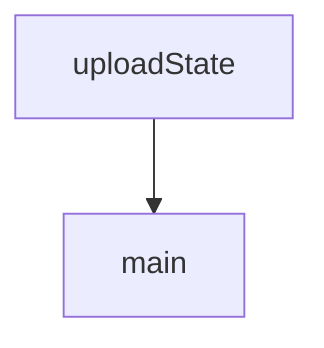

# Chapter 5: Refly CLI and Claude Code Skill Export

Welcome to **Chapter 5: Refly CLI and Claude Code Skill Export**. In this part of **Refly Tutorial: Build Deterministic Agent Skills and Ship Them Across APIs and Claude Code**, you will build an intuitive mental model first, then move into concrete implementation details and practical production tradeoffs.


This chapter explains how to use the CLI for deterministic workflow operations and how Refly skills connect to Claude Code contexts.

## Learning Goals

- run builder/validation/commit loops from terminal
- use structured CLI output for automation chains
- export/install skills for Claude Code-oriented workflows
- keep orchestration reproducible across environments

## High-Value CLI Flow

```bash
npm install -g @refly/cli
refly init
refly login
refly builder start --name "my-workflow"
refly builder validate
refly builder commit
refly workflow run <workflowId>
```

## Claude Code-Oriented Skill Path

- `refly init` installs skill references into Claude directories
- skill operations can be managed with `refly skill ...` commands
- exported skills can be used in Claude Code and other MCP-capable contexts

## Source References

- [Refly CLI README](https://github.com/refly-ai/refly/blob/main/packages/cli/README.md)
- [CLI Skill Reference](https://github.com/refly-ai/refly/blob/main/packages/cli/skill/SKILL.md)
- [README: Skills for Claude Code](https://github.com/refly-ai/refly/blob/main/README.md#use-case-3-skills-for-claude-code)

## Summary

You now have a deterministic CLI path for building, validating, and exporting workflow capabilities.

Next: [Chapter 6: Observability, Deployment, and Operations](06-observability-deployment-and-operations.md)

## Depth Expansion Playbook

## Source Code Walkthrough

### `scripts/upload-config.js`

The `uploadState` function in [`scripts/upload-config.js`](https://github.com/refly-ai/refly/blob/HEAD/scripts/upload-config.js) handles a key part of this chapter's functionality:

```js
import { Client as MinioClient } from 'minio';

async function uploadState(sourceFile, targetPath) {
  const minioClient = new MinioClient({
    endPoint: process.env.MINIO_EXTERNAL_ENDPOINT,
    port: Number.parseInt(process.env.MINIO_EXTERNAL_PORT || '443'),
    useSSL: process.env.MINIO_EXTERNAL_USE_SSL === 'true',
    accessKey: process.env.MINIO_EXTERNAL_ACCESS_KEY,
    secretKey: process.env.MINIO_EXTERNAL_SECRET_KEY,
  });

  const metaData = {
    'Content-Type': 'application/json',
  };
  await minioClient.fPutObject(process.env.MINIO_EXTERNAL_BUCKET, targetPath, sourceFile, metaData);
}

async function main() {
  // upload mcp catalog
  await uploadState('config/mcp-catalog.json', 'mcp-config/mcp-catalog.json');

  await uploadState('config/provider-catalog.json', 'mcp-config/provider-catalog.json');
}

main();

```

This function is important because it defines how Refly Tutorial: Build Deterministic Agent Skills and Ship Them Across APIs and Claude Code implements the patterns covered in this chapter.

### `scripts/upload-config.js`

The `main` function in [`scripts/upload-config.js`](https://github.com/refly-ai/refly/blob/HEAD/scripts/upload-config.js) handles a key part of this chapter's functionality:

```js
}

async function main() {
  // upload mcp catalog
  await uploadState('config/mcp-catalog.json', 'mcp-config/mcp-catalog.json');

  await uploadState('config/provider-catalog.json', 'mcp-config/provider-catalog.json');
}

main();

```

This function is important because it defines how Refly Tutorial: Build Deterministic Agent Skills and Ship Them Across APIs and Claude Code implements the patterns covered in this chapter.


## How These Components Connect


