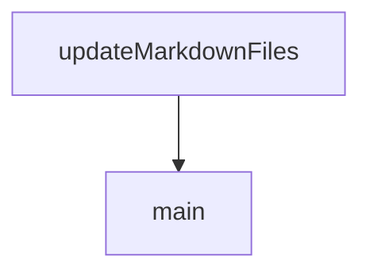

# Chapter 6: Observability, Deployment, and Operations

Welcome to **Chapter 6: Observability, Deployment, and Operations**. In this part of **Refly Tutorial: Build Deterministic Agent Skills and Ship Them Across APIs and Claude Code**, you will build an intuitive mental model first, then move into concrete implementation details and practical production tradeoffs.


This chapter covers operating Refly with visibility into metrics, traces, logs, and deployment surfaces.

## Learning Goals

- run local observability stack for deeper runtime debugging
- correlate workflow behavior across traces, logs, and metrics
- understand deployment artifacts for self-hosted operations
- establish operational baselines before scaling usage

## Operations Building Blocks

| Domain | Key Assets |
|:-------|:-----------|
| deployment | `deploy/docker/docker-compose*.yml` |
| runtime telemetry | `deploy/docker/trace/` stack (Grafana, Prometheus, Tempo, Loki) |
| API verification | OpenAPI status/output endpoints |
| workload stability | middleware health + execution history |

## Trace Stack Quick Start

```bash
cd deploy/docker/trace
docker-compose up -d
```

Then verify data flow in Grafana and API checks before diagnosing workflow-level behavior.

## Source References

- [Trace Stack README](https://github.com/refly-ai/refly/blob/main/deploy/docker/trace/README.md)
- [Docker Deployment Assets](https://github.com/refly-ai/refly/tree/main/deploy/docker)
- [OpenAPI Guide](https://github.com/refly-ai/refly/blob/main/docs/en/guide/api/openapi.md)

## Summary

You now have a baseline operational model for running Refly beyond local experimentation.

Next: [Chapter 7: Troubleshooting, Safety, and Cost Controls](07-troubleshooting-safety-and-cost-controls.md)

## Source Code Walkthrough

### `docs/scripts/convert-webp.js`

The `updateMarkdownFiles` function in [`docs/scripts/convert-webp.js`](https://github.com/refly-ai/refly/blob/HEAD/docs/scripts/convert-webp.js) handles a key part of this chapter's functionality:

```js
}

async function updateMarkdownFiles() {
  try {
    const markdownFiles = await findMarkdownFiles(rootDir);
    console.log(`Found ${markdownFiles.length} Markdown files to update`);

    for (const file of markdownFiles) {
      let content = await fs.readFile(file, 'utf-8');
      let modified = false;

      // Replace image links in Markdown
      // This regex matches Markdown image syntax: 
      const regex = /!\[([^\]]*)\]\(([^)]+)\)/g;

      content = content.replace(regex, (match, alt, imagePath) => {
        // Normalize the path to handle different formats
        const normalizedPath = imagePath.trim();

        // Check if this image is in our map
        for (const [originalPath, webpPath] of imageMap.entries()) {
          if (normalizedPath.includes(originalPath)) {
            modified = true;
            return ``;
          }
        }

        // If no match found, return the original
        return match;
      });

      // Also handle HTML img tags
```

This function is important because it defines how Refly Tutorial: Build Deterministic Agent Skills and Ship Them Across APIs and Claude Code implements the patterns covered in this chapter.

### `docs/scripts/convert-webp.js`

The `main` function in [`docs/scripts/convert-webp.js`](https://github.com/refly-ai/refly/blob/HEAD/docs/scripts/convert-webp.js) handles a key part of this chapter's functionality:

```js
}

async function main() {
  console.log('Starting image conversion and Markdown update process...');

  await convertImagesToWebp();
  await updateMarkdownFiles();

  console.log('Process completed successfully!');
}

main().catch((error) => {
  console.error('An error occurred:', error);
  process.exit(1);
});

```

This function is important because it defines how Refly Tutorial: Build Deterministic Agent Skills and Ship Them Across APIs and Claude Code implements the patterns covered in this chapter.


## How These Components Connect


