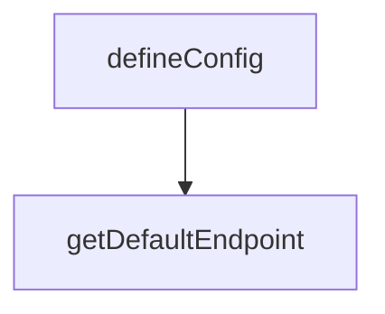

# Chapter 7: Troubleshooting, Safety, and Cost Controls

Welcome to **Chapter 7: Troubleshooting, Safety, and Cost Controls**. In this part of **Refly Tutorial: Build Deterministic Agent Skills and Ship Them Across APIs and Claude Code**, you will build an intuitive mental model first, then move into concrete implementation details and practical production tradeoffs.


This chapter provides pragmatic recovery and guardrail practices for production usage.

## Learning Goals

- triage common failure modes across API, webhook, and runtime
- enforce safe key handling and permission boundaries
- reduce wasted runs through validation-first execution
- keep costs and failure blast radius under control

## Common Failure Patterns

| Symptom | Likely Cause | First Fix |
|:--------|:-------------|:----------|
| unauthorized API calls | invalid or missing API key | rotate/reconfigure auth header |
| webhook not triggering | webhook disabled or invalid URL | re-enable webhook and verify endpoint |
| run fails mid-execution | invalid variables or dependent service issues | validate input schema and service health |
| high token/runtime cost | oversized workflow scope | split into smaller composable skills |

## Safety Baselines

- keep API keys out of logs and committed files
- test changes in constrained environments before broad rollout
- prefer deterministic, validated workflows over opaque one-shot prompts
- retain run history and telemetry for postmortem analysis

## Source References

- [OpenAPI Error and Endpoint Details](https://github.com/refly-ai/refly/blob/main/docs/en/guide/api/openapi.md)
- [Webhook Guide](https://github.com/refly-ai/refly/blob/main/docs/en/guide/api/webhook.md)
- [Contributing Guide](https://github.com/refly-ai/refly/blob/main/CONTRIBUTING.md)

## Summary

You now have a practical troubleshooting and safety playbook for Refly operations.

Next: [Chapter 8: Contribution Workflow and Governance](08-contribution-workflow-and-governance.md)

## Depth Expansion Playbook

## Source Code Walkthrough

### `apps/web/tailwind.config.ts`

The `defineConfig` function in [`apps/web/tailwind.config.ts`](https://github.com/refly-ai/refly/blob/HEAD/apps/web/tailwind.config.ts) handles a key part of this chapter's functionality:

```ts
});

export function defineConfig(): Config {
  return {
    darkMode: 'class',
    plugins: [AntdOverwritePlugin],
    corePlugins: {
      preflight: false,
    },
    content,
    theme: {
      extend: {
        gridTemplateColumns: {
          // Custom grid columns for avatar wall
          '13': 'repeat(13, minmax(0, 1fr))',
          '14': 'repeat(14, minmax(0, 1fr))',
          '15': 'repeat(15, minmax(0, 1fr))',
          '16': 'repeat(16, minmax(0, 1fr))',
        },
        fontFamily: {
          inter: ['Inter', 'sans-serif'],
          'architects-daughter': ['"Architects Daughter"', 'sans-serif'],
        },
        fontSize: {
          xs: ['12px', '20px'],
          sm: ['14px', '22px'],
          base: ['16px', '24px'],
          lg: ['18px', '28px'],
          xl: ['20px', '30px'],
          '2xl': ['24px', '36px'],
        },
        animation: {
```

This function is important because it defines how Refly Tutorial: Build Deterministic Agent Skills and Ship Them Across APIs and Claude Code implements the patterns covered in this chapter.

### `packages/cli/tsup.config.ts`

The `getDefaultEndpoint` function in [`packages/cli/tsup.config.ts`](https://github.com/refly-ai/refly/blob/HEAD/packages/cli/tsup.config.ts) handles a key part of this chapter's functionality:

```ts

// Determine the default API endpoint based on build environment
function getDefaultEndpoint(): string {
  if (customEndpoint) return customEndpoint;
  return ENV_CONFIG[buildEnv]?.apiEndpoint ?? ENV_CONFIG.production.apiEndpoint;
}

// Determine the default Web URL based on build environment
function getDefaultWebUrl(): string {
  if (customWebUrl) return customWebUrl;
  if (customEndpoint) return customEndpoint; // Assume same domain if only endpoint specified
  return ENV_CONFIG[buildEnv]?.webUrl ?? ENV_CONFIG.production.webUrl;
}

// Determine the npm tag based on build environment
function getNpmTag(): string {
  return ENV_CONFIG[buildEnv]?.npmTag ?? 'latest';
}

const defaultEndpoint = getDefaultEndpoint();
const defaultWebUrl = getDefaultWebUrl();
const npmTag = getNpmTag();

console.log(`[tsup] Building CLI for environment: ${buildEnv}`);
console.log(`[tsup] CLI version: ${cliVersion}`);
console.log(`[tsup] NPM tag: ${npmTag}`);
console.log(`[tsup] Default API endpoint: ${defaultEndpoint}`);
console.log(`[tsup] Default Web URL: ${defaultWebUrl}`);

export default defineConfig({
  entry: {
    'bin/refly': 'src/bin/refly.ts',
```

This function is important because it defines how Refly Tutorial: Build Deterministic Agent Skills and Ship Them Across APIs and Claude Code implements the patterns covered in this chapter.


## How These Components Connect


