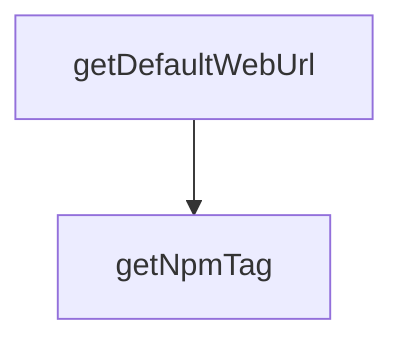

# Chapter 8: Contribution Workflow and Governance

Welcome to **Chapter 8: Contribution Workflow and Governance**. In this part of **Refly Tutorial: Build Deterministic Agent Skills and Ship Them Across APIs and Claude Code**, you will build an intuitive mental model first, then move into concrete implementation details and practical production tradeoffs.


This chapter covers contribution expectations and governance norms for sustainable ecosystem growth.

## Learning Goals

- align contributions with issue-first collaboration
- understand priority and ownership expectations
- prepare high-quality PRs with tests and docs
- improve contributor velocity while reducing maintainer load

## Contribution Workflow

1. find or open an issue before larger feature work
2. align scope and direction with maintainers
3. develop with clear module boundaries and validation
4. submit PRs with documentation and verification evidence

## Governance Priorities

- production reliability over novelty
- deterministic behavior and transparent operations
- reusable skills over one-off prompt artifacts
- clear docs and onboarding for community contributors

## Source References

- [Contributing Guide](https://github.com/refly-ai/refly/blob/main/CONTRIBUTING.md)
- [Code of Conduct](https://github.com/refly-ai/refly/blob/main/.github/CODE_OF_CONDUCT.md)
- [README](https://github.com/refly-ai/refly/blob/main/README.md)

## Summary

You now have an end-to-end operating model for deploying, integrating, and contributing to Refly.

Next steps:

- run one full workflow via API and webhook to compare behavior
- export and test one skill in your Claude Code environment
- contribute one focused improvement with docs and validation notes

## Depth Expansion Playbook

## Source Code Walkthrough

### `packages/cli/tsup.config.ts`

The `getDefaultWebUrl` function in [`packages/cli/tsup.config.ts`](https://github.com/refly-ai/refly/blob/HEAD/packages/cli/tsup.config.ts) handles a key part of this chapter's functionality:

```ts

// Determine the default Web URL based on build environment
function getDefaultWebUrl(): string {
  if (customWebUrl) return customWebUrl;
  if (customEndpoint) return customEndpoint; // Assume same domain if only endpoint specified
  return ENV_CONFIG[buildEnv]?.webUrl ?? ENV_CONFIG.production.webUrl;
}

// Determine the npm tag based on build environment
function getNpmTag(): string {
  return ENV_CONFIG[buildEnv]?.npmTag ?? 'latest';
}

const defaultEndpoint = getDefaultEndpoint();
const defaultWebUrl = getDefaultWebUrl();
const npmTag = getNpmTag();

console.log(`[tsup] Building CLI for environment: ${buildEnv}`);
console.log(`[tsup] CLI version: ${cliVersion}`);
console.log(`[tsup] NPM tag: ${npmTag}`);
console.log(`[tsup] Default API endpoint: ${defaultEndpoint}`);
console.log(`[tsup] Default Web URL: ${defaultWebUrl}`);

export default defineConfig({
  entry: {
    'bin/refly': 'src/bin/refly.ts',
    index: 'src/index.ts',
  },
  format: ['cjs'],
  target: 'node18',
  clean: true,
  dts: true,
```

This function is important because it defines how Refly Tutorial: Build Deterministic Agent Skills and Ship Them Across APIs and Claude Code implements the patterns covered in this chapter.

### `packages/cli/tsup.config.ts`

The `getNpmTag` function in [`packages/cli/tsup.config.ts`](https://github.com/refly-ai/refly/blob/HEAD/packages/cli/tsup.config.ts) handles a key part of this chapter's functionality:

```ts

// Determine the npm tag based on build environment
function getNpmTag(): string {
  return ENV_CONFIG[buildEnv]?.npmTag ?? 'latest';
}

const defaultEndpoint = getDefaultEndpoint();
const defaultWebUrl = getDefaultWebUrl();
const npmTag = getNpmTag();

console.log(`[tsup] Building CLI for environment: ${buildEnv}`);
console.log(`[tsup] CLI version: ${cliVersion}`);
console.log(`[tsup] NPM tag: ${npmTag}`);
console.log(`[tsup] Default API endpoint: ${defaultEndpoint}`);
console.log(`[tsup] Default Web URL: ${defaultWebUrl}`);

export default defineConfig({
  entry: {
    'bin/refly': 'src/bin/refly.ts',
    index: 'src/index.ts',
  },
  format: ['cjs'],
  target: 'node18',
  clean: true,
  dts: true,
  sourcemap: true,
  splitting: false,
  shims: true,
  banner: {
    js: '#!/usr/bin/env node',
  },
  noExternal: ['commander', 'zod', 'open'],
```

This function is important because it defines how Refly Tutorial: Build Deterministic Agent Skills and Ship Them Across APIs and Claude Code implements the patterns covered in this chapter.


## How These Components Connect


