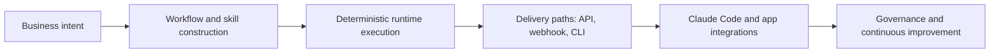

# Refly Tutorial: Build Deterministic Agent Skills and Ship Them Across APIs and Claude Code

> Learn how to use `refly-ai/refly` to turn vibe workflows into reusable, versioned agent skills that can run via API, webhook, and CLI integrations.

## Why This Track Matters

`refly` represents a fast-moving direction in agentic tooling: converting ad-hoc workflow logic into governed, reusable capability assets.

This track focuses on:

- deploying and running Refly with a reliable local baseline
- understanding the architecture behind skills, workflow runtime, and delivery paths
- integrating through API, webhook, and CLI for real production usage
- operating and contributing with stronger governance and observability

## Current Snapshot (auto-updated)

- repository: [`refly-ai/refly`](https://github.com/refly-ai/refly)
- stars: about **6.6k**
- latest release: [`v1.1.0`](https://github.com/refly-ai/refly/releases/tag/v1.1.0)
- recent activity: updates on **February 11, 2026**
- project positioning: open-source agent skills builder with workflow runtime + multi-channel export

## Mental Model

## Chapter Guide

| Chapter | Key Question | Outcome |
|:--------|:-------------|:--------|
| [01 - Getting Started](01-getting-started.md) | How do I get Refly running quickly? | Working local baseline |
| [02 - Architecture and Component Topology](02-architecture-and-component-topology.md) | How are API, web, and packages organized? | System-level understanding |
| [03 - Workflow Construction and Deterministic Runtime](03-workflow-construction-and-deterministic-runtime.md) | How do I build reliable executable workflows? | Better workflow design |
| [04 - API and Webhook Integrations](04-api-and-webhook-integrations.md) | How do I integrate Refly into external systems? | Production-ready integration path |
| [05 - Refly CLI and Claude Code Skill Export](05-refly-cli-and-claude-code-skill-export.md) | How does CLI-driven workflow orchestration work? | Repeatable automation interface |
| [06 - Observability, Deployment, and Operations](06-observability-deployment-and-operations.md) | How do I operate Refly beyond a demo? | Operational runbook baseline |
| [07 - Troubleshooting, Safety, and Cost Controls](07-troubleshooting-safety-and-cost-controls.md) | How do I debug failures and reduce risk? | Reliability and guardrail playbook |
| [08 - Contribution Workflow and Governance](08-contribution-workflow-and-governance.md) | How do teams contribute effectively? | Contributor readiness |

## What You Will Learn

- how to build and run deterministic workflows in Refly
- how to connect Refly to APIs, webhooks, and agent runtimes
- how to use CLI workflows for structured automation and debugging
- how to operate and evolve Refly in team or production contexts

## Source References

- [Refly Repository](https://github.com/refly-ai/refly)
- [README](https://github.com/refly-ai/refly/blob/main/README.md)
- [API Guide (OpenAPI)](https://github.com/refly-ai/refly/blob/main/docs/en/guide/api/openapi.md)
- [Webhook Guide](https://github.com/refly-ai/refly/blob/main/docs/en/guide/api/webhook.md)
- [Contributing Guide](https://github.com/refly-ai/refly/blob/main/CONTRIBUTING.md)

## Related Tutorials

- [Dyad Tutorial](../dyad-tutorial/)
- [Bolt.diy Tutorial](../bolt-diy-tutorial/)
- [n8n AI Tutorial](../n8n-ai-tutorial/)
- [OpenCode Tutorial](../opencode-tutorial/)

---

Start with [Chapter 1: Getting Started](01-getting-started.md).

## Navigation & Backlinks

- [Start Here: Chapter 1: Getting Started](01-getting-started.md)
- [Back to Main Catalog](../../README.md#-tutorial-catalog)
- [Browse A-Z Tutorial Directory](../../discoverability/tutorial-directory.md)
- [Search by Intent](../../discoverability/query-hub.md)
- [Explore Category Hubs](../../README.md#category-hubs)

## Full Chapter Map

1. [Chapter 1: Getting Started](01-getting-started.md)
2. [Chapter 2: Architecture and Component Topology](02-architecture-and-component-topology.md)
3. [Chapter 3: Workflow Construction and Deterministic Runtime](03-workflow-construction-and-deterministic-runtime.md)
4. [Chapter 4: API and Webhook Integrations](04-api-and-webhook-integrations.md)
5. [Chapter 5: Refly CLI and Claude Code Skill Export](05-refly-cli-and-claude-code-skill-export.md)
6. [Chapter 6: Observability, Deployment, and Operations](06-observability-deployment-and-operations.md)
7. [Chapter 7: Troubleshooting, Safety, and Cost Controls](07-troubleshooting-safety-and-cost-controls.md)
8. [Chapter 8: Contribution Workflow and Governance](08-contribution-workflow-and-governance.md)

*Generated by [AI Codebase Knowledge Builder](https://github.com/The-Pocket/Tutorial-Codebase-Knowledge)*
