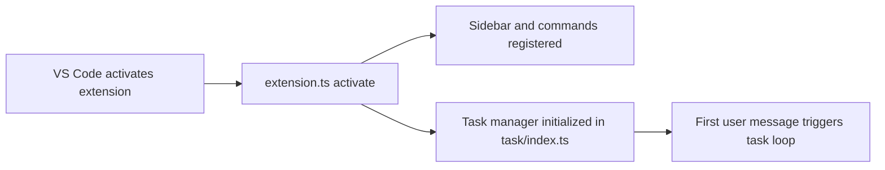

# Chapter 1: Getting Started

Welcome to **Chapter 1: Getting Started**. In this part of **Roo Code Tutorial: Run an AI Dev Team in Your Editor**, you will build an intuitive mental model first, then move into concrete implementation details and practical production tradeoffs.


This chapter establishes a stable Roo Code baseline in a VS Code-compatible workflow.

## Objectives

By the end, you will have:

1. Roo Code installed and running
2. one provider configured successfully
3. a deterministic first task completed
4. a minimum approval policy for safe usage

## Prerequisites

| Requirement | Why It Matters |
|:------------|:---------------|
| VS Code-compatible editor | Roo Code extension runtime |
| API credentials for at least one provider | model-backed execution |
| sandbox repository | low-risk calibration environment |
| canonical lint/test command | repeatable validation signal |

## Installation Paths

### Marketplace install

Install Roo Code from the VS Code marketplace and reload the editor.

### VSIX install (team/internal path)

Roo Code repository docs include VSIX build/install flows.

Typical dev workflow commands:

```bash
git clone https://github.com/RooCodeInc/Roo-Code.git
cd Roo-Code
pnpm install
pnpm install:vsix
```

Alternative manual VSIX flow:

```bash
pnpm vsix
code --install-extension bin/roo-cline-<version>.vsix
```

## Provider Setup

Start with one known-good provider/model pair. Add more only after first task reliability is proven.

Initial policy:

- approvals enabled for file edits and commands
- no broad automation modes during first-day onboarding
- explicit task summaries required

## First Task Prompt

```text
Analyze src/services/session.ts,
refactor one function for readability without changing behavior,
run the target test command,
and summarize changed files and validation output.
```

Success criteria:

- proposed patch is reviewable
- expected file scope is respected
- command output is captured
- summary maps changes to results

## Baseline Safety Defaults

Set and document:

- default mode for routine coding tasks
- approval threshold for mutating commands
- required validation command for each task class
- rollback expectation for risky changes

## First-Run Checklist

| Area | Check | Pass Signal |
|:-----|:------|:------------|
| Install | extension loads correctly | Roo interface opens without errors |
| Provider | model call succeeds | initial task response is actionable |
| Edit flow | diffs are visible before apply | review step works consistently |
| Command flow | test/lint command executes | output attached to task result |
| Summary | results are clear and complete | reviewer can understand outcome quickly |

## Common Startup Issues

### Provider mismatch

- confirm selected provider and key are aligned
- reduce to one provider first

### Unstable task outputs

- tighten task scope to one file/module
- include explicit non-goals
- require final summary format

### Command confusion

- specify exact command in prompt
- avoid ambiguous phrasing like "run checks"

## Chapter Summary

You now have Roo Code running with:

- installation complete
- provider baseline validated
- deterministic first task executed
- initial safety policy in place

Next: [Chapter 2: Modes and Task Design](02-modes-and-task-design.md)

## Source Code Walkthrough

Use the following upstream sources to verify getting started and initial setup details while reading this chapter:

- [`src/extension.ts`](https://github.com/RooCodeInc/Roo-Code/blob/HEAD/src/extension.ts) — the VS Code extension entry point that registers commands, activates the Roo Code sidebar, initializes the task manager, and sets up MCP server connections on first load.
- [`src/core/task/index.ts`](https://github.com/RooCodeInc/Roo-Code/blob/HEAD/src/core/task/index.ts) — the task manager that drives Roo Code's core loop: receiving user messages, dispatching to the model, handling tool approvals, and managing the conversation lifecycle.

Suggested trace strategy:
- read `src/extension.ts` `activate()` function to understand the full initialization sequence when Roo Code first loads
- trace `src/core/task/index.ts` constructor and `initiateTaskLoop` to understand how a first task invocation is structured
- check `src/shared/ExtensionMessage.ts` for the message types exchanged between the extension and webview during setup

## How These Components Connect


