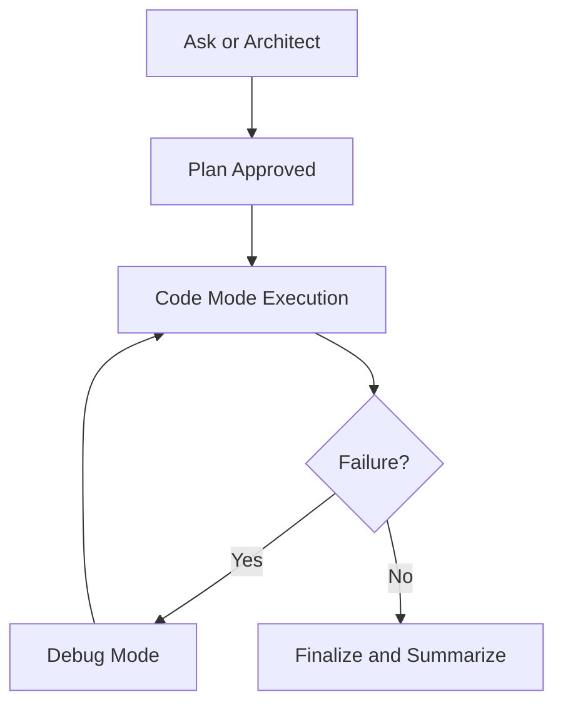

# Chapter 2: Modes and Task Design

Roo Code's mode system is its core quality-control mechanism. This chapter shows how to choose and sequence modes deliberately.

## Mode Landscape

Roo documentation and project materials cover modes including:

- Code
- Ask
- Architect
- Debug
- Orchestrator
- Custom modes (team-specific)

## Mode Selection Matrix

| Mode | Best For | Avoid Using It For |
|:-----|:---------|:-------------------|
| Ask | quick understanding and codebase questions | large multi-file implementation |
| Architect | decomposition, design proposals, migration planning | immediate low-level patching |
| Code | implementation and scoped refactors | broad strategy decisions |
| Debug | reproduction and root-cause loops | greenfield architecture |
| Orchestrator | coordinating multi-step tasks | low-complexity one-file edits |
| Custom | team/domain workflows | unvalidated generic tasks |

## Mode Transition Pattern



This prevents premature implementation.

## Task Contract Template

Use the same structure in every mode:

```text
Goal:
Mode:
Allowed files:
Forbidden changes:
Validation command:
Definition of done:
```

Mode selection should be explicit in the prompt.

## Designing Custom Modes

Use custom modes when you need repeated domain behavior such as:

- backend API triage
- migration planning
- documentation enforcement
- release note synthesis

Custom mode quality improves when you define:

- narrow responsibilities
- required output format
- prohibited actions
- mandatory validation steps

## Common Mode Anti-Patterns

- using Code mode for unresolved architecture tasks
- running Debug mode without reproducible failing evidence
- switching modes mid-task without preserving constraints
- one custom mode trying to do everything

## Team Mode Policy

Define a simple team policy table:

| Task Class | Allowed Mode(s) | Required Validation |
|:-----------|:----------------|:--------------------|
| bugfix | Debug -> Code | failing + passing test |
| feature | Architect -> Code | unit + integration check |
| refactor | Code | regression-focused tests |
| doc updates | Ask/Custom | link and formatting checks |

This reduces random mode usage.

## Chapter Summary

You now have a mode-driven execution framework that supports:

- deliberate mode choice
- safer transitions between planning and implementation
- reusable custom-mode behavior for teams

Next: [Chapter 3: File and Command Operations](03-file-and-command-operations.md)
