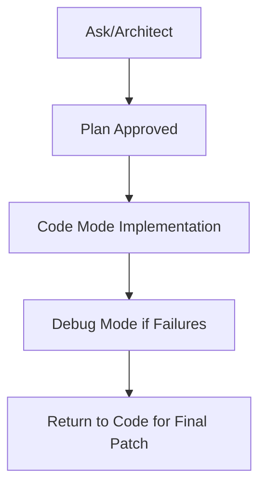

# Chapter 2: Modes and Task Design

Roo Code's mode system is central to quality control and operator intent.

## Mode Decision Map

| Mode | Best Use |
|:-----|:---------|
| Code | implementation and focused edits |
| Architect | planning, decomposition, migration design |
| Ask | fast understanding and scoped Q&A |
| Debug | reproduction, root cause, and fix loops |
| Custom | team-specific domain workflows |

## Mode-Aware Task Contract

Each task should specify:

- target mode and why
- file/module scope
- definition of done
- validation command
- explicit non-goals

## Transition Pattern

## Anti-Patterns

- using one mode for every task category
- asking for implementation without success criteria
- mixing broad redesign and hotfix work in one run

## Summary

You can now select Roo modes deliberately and define tasks that reduce drift.

Next: [Chapter 3: File and Command Operations](03-file-and-command-operations.md)
