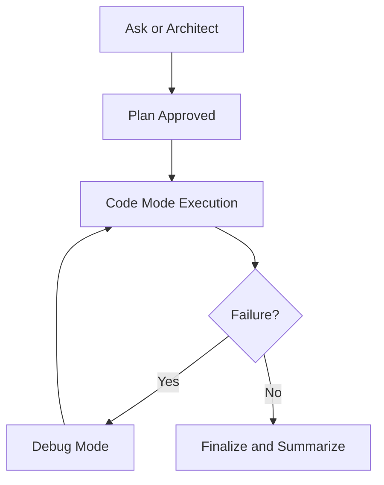
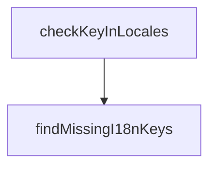

# Chapter 2: Modes and Task Design

Welcome to **Chapter 2: Modes and Task Design**. In this part of **Roo Code Tutorial: Run an AI Dev Team in Your Editor**, you will build an intuitive mental model first, then move into concrete implementation details and practical production tradeoffs.


Roo Code's mode system is its core quality-control mechanism. This chapter shows how to choose and sequence modes deliberately.

## Mode Landscape

Roo documentation and project materials cover modes including:

- Code
- Ask
- Architect
- Debug
- Orchestrator
- Custom modes (team-specific)

## Mode Selection Matrix

| Mode | Best For | Avoid Using It For |
|:-----|:---------|:-------------------|
| Ask | quick understanding and codebase questions | large multi-file implementation |
| Architect | decomposition, design proposals, migration planning | immediate low-level patching |
| Code | implementation and scoped refactors | broad strategy decisions |
| Debug | reproduction and root-cause loops | greenfield architecture |
| Orchestrator | coordinating multi-step tasks | low-complexity one-file edits |
| Custom | team/domain workflows | unvalidated generic tasks |

## Mode Transition Pattern


```mermaid
flowchart TD
    A[Ask or Architect] --> B[Plan Approved]
    B --> C[Code Mode Execution]
    C --> D{Failure?}
    D -- Yes --> E[Debug Mode]
    E --> C
    D -- No --> F[Finalize and Summarize]
```

This prevents premature implementation.

## Task Contract Template

Use the same structure in every mode:

```text
Goal:
Mode:
Allowed files:
Forbidden changes:
Validation command:
Definition of done:
```

Mode selection should be explicit in the prompt.

## Designing Custom Modes

Use custom modes when you need repeated domain behavior such as:

- backend API triage
- migration planning
- documentation enforcement
- release note synthesis

Custom mode quality improves when you define:

- narrow responsibilities
- required output format
- prohibited actions
- mandatory validation steps

## Common Mode Anti-Patterns

- using Code mode for unresolved architecture tasks
- running Debug mode without reproducible failing evidence
- switching modes mid-task without preserving constraints
- one custom mode trying to do everything

## Team Mode Policy

Define a simple team policy table:

| Task Class | Allowed Mode(s) | Required Validation |
|:-----------|:----------------|:--------------------|
| bugfix | Debug -> Code | failing + passing test |
| feature | Architect -> Code | unit + integration check |
| refactor | Code | regression-focused tests |
| doc updates | Ask/Custom | link and formatting checks |

This reduces random mode usage.

## Chapter Summary

You now have a mode-driven execution framework that supports:

- deliberate mode choice
- safer transitions between planning and implementation
- reusable custom-mode behavior for teams

Next: [Chapter 3: File and Command Operations](03-file-and-command-operations.md)

## Depth Expansion Playbook

## Source Code Walkthrough

### `scripts/find-missing-i18n-key.js`

The `checkKeyInLocales` function in [`scripts/find-missing-i18n-key.js`](https://github.com/RooCodeInc/Roo-Code/blob/HEAD/scripts/find-missing-i18n-key.js) handles a key part of this chapter's functionality:

```js

// Check if the key exists in all language files, return a list of missing language files
function checkKeyInLocales(key, localeDirs, localesDir) {
	const [file, ...pathParts] = key.split(":")
	const jsonPath = pathParts.join(".")

	const missingLocales = []

	localeDirs.forEach((locale) => {
		const filePath = path.join(localesDir, locale, `${file}.json`)
		if (!fs.existsSync(filePath)) {
			missingLocales.push(`${locale}/${file}.json`)
			return
		}

		const json = JSON.parse(fs.readFileSync(filePath, "utf8"))
		if (getValueByPath(json, jsonPath) === undefined) {
			missingLocales.push(`${locale}/${file}.json`)
		}
	})

	return missingLocales
}

// Recursively traverse the directory
function findMissingI18nKeys() {
	const results = []

	function walk(dir, baseDir, localeDirs, localesDir) {
		const files = fs.readdirSync(dir)

		for (const file of files) {
```

This function is important because it defines how Roo Code Tutorial: Run an AI Dev Team in Your Editor implements the patterns covered in this chapter.

### `scripts/find-missing-i18n-key.js`

The `findMissingI18nKeys` function in [`scripts/find-missing-i18n-key.js`](https://github.com/RooCodeInc/Roo-Code/blob/HEAD/scripts/find-missing-i18n-key.js) handles a key part of this chapter's functionality:

```js

// Recursively traverse the directory
function findMissingI18nKeys() {
	const results = []

	function walk(dir, baseDir, localeDirs, localesDir) {
		const files = fs.readdirSync(dir)

		for (const file of files) {
			const filePath = path.join(dir, file)
			const stat = fs.statSync(filePath)

			// Exclude test files and __mocks__ directory
			if (filePath.includes(".test.") || filePath.includes("__mocks__")) continue

			if (stat.isDirectory()) {
				walk(filePath, baseDir, localeDirs, localesDir) // Recursively traverse subdirectories
			} else if (stat.isFile() && [".ts", ".tsx", ".js", ".jsx"].includes(path.extname(filePath))) {
				const content = fs.readFileSync(filePath, "utf8")

				// Match all i18n keys
				for (const pattern of i18nPatterns) {
					let match
					while ((match = pattern.exec(content)) !== null) {
						const key = match[1]
						const missingLocales = checkKeyInLocales(key, localeDirs, localesDir)
						if (missingLocales.length > 0) {
							results.push({
								key,
								missingLocales,
								file: path.relative(baseDir, filePath),
							})
```

This function is important because it defines how Roo Code Tutorial: Run an AI Dev Team in Your Editor implements the patterns covered in this chapter.


## How These Components Connect


```mermaid
flowchart TD
    A[checkKeyInLocales]
    B[findMissingI18nKeys]
    A --> B
```
