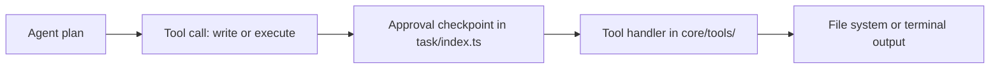

# Chapter 3: File and Command Operations

Welcome to **Chapter 3: File and Command Operations**. In this part of **Roo Code Tutorial: Run an AI Dev Team in Your Editor**, you will build an intuitive mental model first, then move into concrete implementation details and practical production tradeoffs.


This chapter covers the most common and risky Roo Code actions: patching files and executing commands.

## The Controlled Loop

1. propose patch
2. inspect diff
3. approve/reject
4. run validation command
5. summarize evidence

## Diff Review Checklist

| Dimension | Key Question |
|:----------|:-------------|
| Scope | only intended files changed? |
| Correctness | logic aligns with task objective? |
| Risk | config/auth/security impacts introduced? |
| Compatibility | public interfaces still safe? |
| Validation | command evidence supports acceptance? |

## Command Execution Governance

### Baseline policy

- read-only commands can be broadly approved
- mutating commands require explicit confirmation
- destructive commands should be denylisted by default
- execution should stay inside repo scope

### Recommended command catalog

Document canonical commands per repository:

```text
lint: pnpm lint
test: pnpm test
test:target: pnpm test -- <module>
build: pnpm build
```

This avoids trial-and-error shell behavior.

## Practical Patch Sizing Rules

- one subsystem per iteration
- avoid unrelated formatting churn
- reject broad patch bundles with mixed objectives
- require summary per accepted patch

## Failure Recovery Pattern

When command fails after patch:

1. classify error (syntax, missing import, test regression, environment)
2. patch only implicated area
3. rerun targeted command first
4. escalate to broader checks after targeted pass

## High-Risk Paths

Apply stricter review to:

- auth and permissions
- deployment and CI configuration
- secret and environment loaders
- billing and usage enforcement

## Evidence Format Standard

For each accepted iteration, capture:

- files changed
- commands executed
- command outcomes
- residual risks or TODOs

This improves handoff and incident response.

## Chapter Summary

You now have a governance model for Roo edit/command loops:

- bounded patching
- safe command execution
- deterministic validation
- audit-friendly evidence capture

Next: [Chapter 4: Context and Indexing](04-context-and-indexing.md)

## Source Code Walkthrough

Use the following upstream sources to verify file and command operation implementation details while reading this chapter:

- [`src/core/tools/`](https://github.com/RooCodeInc/Roo-Code/blob/HEAD/src/core/tools/) — contains the tool handler implementations for file read/write, command execution, diff application, and search operations that drive Roo Code's file and terminal interaction model.
- [`src/core/task/index.ts`](https://github.com/RooCodeInc/Roo-Code/blob/HEAD/src/core/task/index.ts) — manages the task execution lifecycle including approval checkpoints before file writes and terminal commands are executed.

Suggested trace strategy:
- browse `src/core/tools/` to find handlers like `write_to_file`, `execute_command`, and `apply_diff`
- trace approval flow in `src/core/task/index.ts` to see where human confirmation is requested before destructive operations
- check `src/shared/tool-groups.ts` for tool grouping that controls which tools are available in each mode

## How These Components Connect


