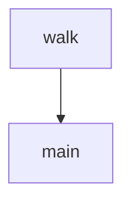

# Chapter 3: File and Command Operations

Welcome to **Chapter 3: File and Command Operations**. In this part of **Roo Code Tutorial: Run an AI Dev Team in Your Editor**, you will build an intuitive mental model first, then move into concrete implementation details and practical production tradeoffs.


This chapter covers the most common and risky Roo Code actions: patching files and executing commands.

## The Controlled Loop

1. propose patch
2. inspect diff
3. approve/reject
4. run validation command
5. summarize evidence

## Diff Review Checklist

| Dimension | Key Question |
|:----------|:-------------|
| Scope | only intended files changed? |
| Correctness | logic aligns with task objective? |
| Risk | config/auth/security impacts introduced? |
| Compatibility | public interfaces still safe? |
| Validation | command evidence supports acceptance? |

## Command Execution Governance

### Baseline policy

- read-only commands can be broadly approved
- mutating commands require explicit confirmation
- destructive commands should be denylisted by default
- execution should stay inside repo scope

### Recommended command catalog

Document canonical commands per repository:

```text
lint: pnpm lint
test: pnpm test
test:target: pnpm test -- <module>
build: pnpm build
```

This avoids trial-and-error shell behavior.

## Practical Patch Sizing Rules

- one subsystem per iteration
- avoid unrelated formatting churn
- reject broad patch bundles with mixed objectives
- require summary per accepted patch

## Failure Recovery Pattern

When command fails after patch:

1. classify error (syntax, missing import, test regression, environment)
2. patch only implicated area
3. rerun targeted command first
4. escalate to broader checks after targeted pass

## High-Risk Paths

Apply stricter review to:

- auth and permissions
- deployment and CI configuration
- secret and environment loaders
- billing and usage enforcement

## Evidence Format Standard

For each accepted iteration, capture:

- files changed
- commands executed
- command outcomes
- residual risks or TODOs

This improves handoff and incident response.

## Chapter Summary

You now have a governance model for Roo edit/command loops:

- bounded patching
- safe command execution
- deterministic validation
- audit-friendly evidence capture

Next: [Chapter 4: Context and Indexing](04-context-and-indexing.md)

## Depth Expansion Playbook

## Source Code Walkthrough

### `scripts/find-missing-i18n-key.js`

The `walk` function in [`scripts/find-missing-i18n-key.js`](https://github.com/RooCodeInc/Roo-Code/blob/HEAD/scripts/find-missing-i18n-key.js) handles a key part of this chapter's functionality:

```js
	const results = []

	function walk(dir, baseDir, localeDirs, localesDir) {
		const files = fs.readdirSync(dir)

		for (const file of files) {
			const filePath = path.join(dir, file)
			const stat = fs.statSync(filePath)

			// Exclude test files and __mocks__ directory
			if (filePath.includes(".test.") || filePath.includes("__mocks__")) continue

			if (stat.isDirectory()) {
				walk(filePath, baseDir, localeDirs, localesDir) // Recursively traverse subdirectories
			} else if (stat.isFile() && [".ts", ".tsx", ".js", ".jsx"].includes(path.extname(filePath))) {
				const content = fs.readFileSync(filePath, "utf8")

				// Match all i18n keys
				for (const pattern of i18nPatterns) {
					let match
					while ((match = pattern.exec(content)) !== null) {
						const key = match[1]
						const missingLocales = checkKeyInLocales(key, localeDirs, localesDir)
						if (missingLocales.length > 0) {
							results.push({
								key,
								missingLocales,
								file: path.relative(baseDir, filePath),
							})
						}
					}
				}
```

This function is important because it defines how Roo Code Tutorial: Run an AI Dev Team in Your Editor implements the patterns covered in this chapter.

### `scripts/find-missing-i18n-key.js`

The `main` function in [`scripts/find-missing-i18n-key.js`](https://github.com/RooCodeInc/Roo-Code/blob/HEAD/scripts/find-missing-i18n-key.js) handles a key part of this chapter's functionality:

```js

// Execute and output the results
function main() {
	try {
		if (args.locale) {
			// Check if the specified locale exists in any of the locales directories
			const localeExists = Object.values(DIRS).some((config) => {
				const localeDirs = getLocaleDirs(config.localesDir)
				return localeDirs.includes(args.locale)
			})

			if (!localeExists) {
				console.error(`Error: Language '${args.locale}' not found in any locales directory`)
				process.exit(1)
			}
		}

		const missingKeys = findMissingI18nKeys()

		if (missingKeys.length === 0) {
			console.log("\n✅ All i18n keys are present!")
			return
		}

		console.log("\nMissing i18n keys:\n")
		missingKeys.forEach(({ key, missingLocales, file }) => {
			console.log(`File: ${file}`)
			console.log(`Key: ${key}`)
			console.log("Missing in:")
			missingLocales.forEach((file) => console.log(`  - ${file}`))
			console.log("-------------------")
		})
```

This function is important because it defines how Roo Code Tutorial: Run an AI Dev Team in Your Editor implements the patterns covered in this chapter.


## How These Components Connect


