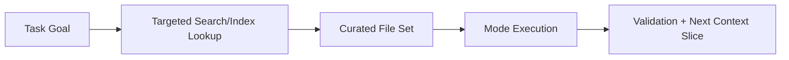

# Chapter 4: Context and Indexing

Large-repo reliability depends on disciplined context selection and retrieval quality.

## Context Budget Strategy

- include only files relevant to the active decision
- attach exact logs/errors instead of broad narratives
- split large work into smaller context-bounded tasks

## Retrieval Pipeline

## Governance Controls

| Control | Benefit |
|:--------|:--------|
| explicit include lists | lower token waste |
| relevance-first retrieval | better grounding |
| context refresh checkpoints | less stale-assumption risk |

## Summary

You can now treat context as a managed resource for quality, speed, and cost.

Next: [Chapter 5: Checkpoints and Recovery](05-checkpoints-and-recovery.md)
