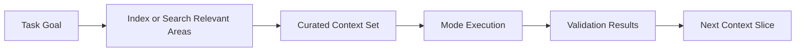
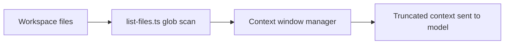

# Chapter 4: Context and Indexing

Welcome to **Chapter 4: Context and Indexing**. In this part of **Roo Code Tutorial: Run an AI Dev Team in Your Editor**, you will build an intuitive mental model first, then move into concrete implementation details and practical production tradeoffs.

In large repositories, quality depends on context precision. This chapter covers how to manage context and indexing strategy in Roo workflows.

## Core Principle

Relevance beats volume.

Passing too much context increases token cost and decreases reasoning quality.

## Context Pipeline

```mermaid
flowchart LR
    A[Task Goal] --> B[Index or Search Relevant Areas]
    B --> C[Curated Context Set]
    C --> D[Mode Execution]
    D --> E[Validation Results]
    E --> F[Next Context Slice]
```

## Context Slicing Strategy

| Situation | Recommended Slice |
|:----------|:------------------|
| single bugfix | one module + failing tests/logs |
| feature iteration | active files + adjacent interfaces |
| migration | architecture map + staged module batches |
| production incident | runtime logs + impacted service paths |

## Indexing Practical Guidance

Use indexing/search to discover candidates, then manually constrain final context set.

Good pattern:

1. broad discovery
2. narrow target selection
3. bounded execution
4. evidence-driven expansion if needed

## Context Mentions and Grounding

Roo docs include context and tool usage surfaces. Regardless of mechanism, include:

- exact files
- concrete errors/logs
- expected behavior
- validation command

This prevents speculative edits.

## Cost and Latency Impact

Context discipline improves:

- response latency
- token spend
- patch accuracy
- reviewer confidence

Treat context selection as an engineering activity, not a UI action.

## Failure Patterns

### Over-contexting

Symptom: unrelated edits and slow loops.

Fix: remove low-relevance files and enforce explicit scope.

### Under-contexting

Symptom: shallow fixes that ignore true root cause.

Fix: add targeted interface/dependency files and concrete error traces.

### Stale context between mode changes

Symptom: mode transitions lose constraints.

Fix: include concise state summary when switching modes.

## Chapter Summary

You now have a context/indexing model for large repos:

- discover broadly, execute narrowly
- tie context to validation evidence
- maintain continuity across mode transitions

Next: [Chapter 5: Checkpoints and Recovery](05-checkpoints-and-recovery.md)

## Source Code Walkthrough

Use the following upstream sources to verify context and indexing implementation details while reading this chapter:

- [`src/services/glob/list-files.ts`](https://github.com/RooCodeInc/Roo-Code/blob/HEAD/src/services/glob/list-files.ts) — implements repository file listing and glob filtering used to build the file tree that Roo Code sends to the model as workspace context.
- [`src/core/context-management/`](https://github.com/RooCodeInc/Roo-Code/blob/HEAD/src/core/context-management/) — contains context window management utilities that truncate, slice, and prioritize messages to stay within model token limits.

Suggested trace strategy:
- trace how `list-files.ts` builds file manifests that feed into context window construction
- review context-management utilities to understand truncation strategies when context grows large
- look at `src/shared/context-window-utils.ts` for token-limit calculations applied before each request

## How These Components Connect

```mermaid
flowchart LR
    A[Workspace files] --> B[list-files.ts glob scan]
    B --> C[Context window manager]
    C --> D[Truncated context sent to model]
```
