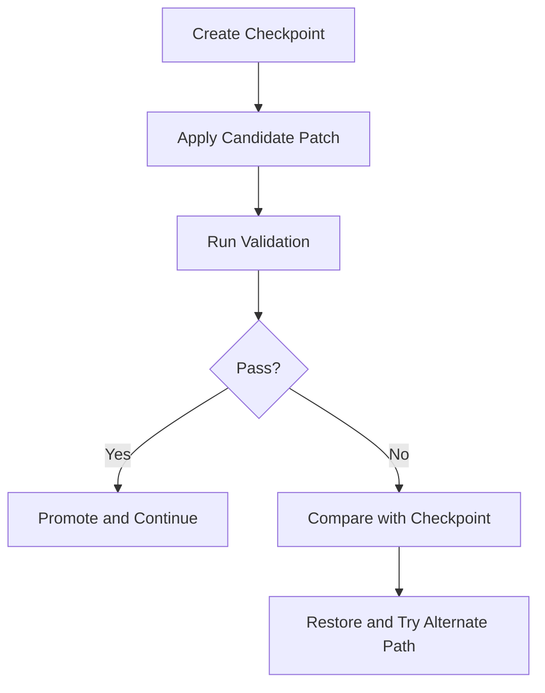

# Chapter 5: Checkpoints and Recovery

Checkpoints are essential for safe experimentation. This chapter explains when to checkpoint, how to compare states, and how to recover cleanly.

## Why Checkpoints Matter

Agentic workflows increase iteration speed. Without snapshot discipline, rollback cost rises sharply when output quality drops.

Checkpoints let you:

- test alternative fixes quickly
- compare patch strategies
- recover without manual cleanup

## Checkpoint Lifecycle

## When to Checkpoint

| Scenario | Why It Is Required |
|:---------|:-------------------|
| multi-file refactor | rollback blast radius is high |
| dependency updates | hidden compatibility risks |
| config/security changes | potential environment-wide impact |
| uncertain root cause | likely need for competing fix paths |

## Recovery Rules

1. annotate checkpoint intent
2. run validation after every restore
3. keep winning and rejected strategy notes
4. avoid chaining too many unlabelled checkpoints

## Compare Strategy

When comparing checkpoint vs current state, inspect:

- changed file count
- high-risk file involvement
- validation command outcomes
- complexity/readability differences

Choose the path with better evidence, not just fewer lines changed.

## Team Workflow Pattern

For collaborative usage:

- checkpoint before risky branch of work
- share short rationale in task summary
- commit only after post-restore validation pass
- archive key decision notes for later incidents

## Common Pitfalls

- checkpointing too late (after risky edits)
- restoring without revalidation
- no explanation of why restore occurred
- treating restore as failure instead of control mechanism

## Chapter Summary

You now have a checkpoint-driven reliability model:

- proactive snapshot timing
- evidence-based compare/restore decisions
- cleaner recovery during high-velocity iteration

Next: [Chapter 6: MCP and Tool Extensions](06-mcp-and-tool-extensions.md)
