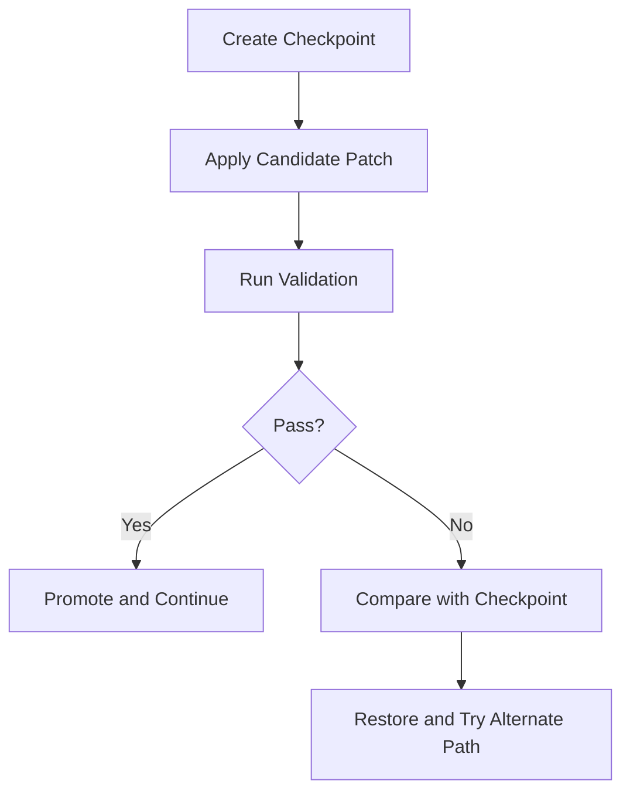
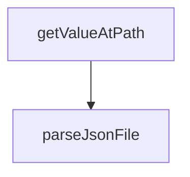

# Chapter 5: Checkpoints and Recovery

Welcome to **Chapter 5: Checkpoints and Recovery**. In this part of **Roo Code Tutorial: Run an AI Dev Team in Your Editor**, you will build an intuitive mental model first, then move into concrete implementation details and practical production tradeoffs.


Checkpoints are essential for safe experimentation. This chapter explains when to checkpoint, how to compare states, and how to recover cleanly.

## Why Checkpoints Matter

Agentic workflows increase iteration speed. Without snapshot discipline, rollback cost rises sharply when output quality drops.

Checkpoints let you:

- test alternative fixes quickly
- compare patch strategies
- recover without manual cleanup

## Checkpoint Lifecycle


```mermaid
flowchart TD
    A[Create Checkpoint] --> B[Apply Candidate Patch]
    B --> C[Run Validation]
    C --> D{Pass?}
    D -- Yes --> E[Promote and Continue]
    D -- No --> F[Compare with Checkpoint]
    F --> G[Restore and Try Alternate Path]
```

## When to Checkpoint

| Scenario | Why It Is Required |
|:---------|:-------------------|
| multi-file refactor | rollback blast radius is high |
| dependency updates | hidden compatibility risks |
| config/security changes | potential environment-wide impact |
| uncertain root cause | likely need for competing fix paths |

## Recovery Rules

1. annotate checkpoint intent
2. run validation after every restore
3. keep winning and rejected strategy notes
4. avoid chaining too many unlabelled checkpoints

## Compare Strategy

When comparing checkpoint vs current state, inspect:

- changed file count
- high-risk file involvement
- validation command outcomes
- complexity/readability differences

Choose the path with better evidence, not just fewer lines changed.

## Team Workflow Pattern

For collaborative usage:

- checkpoint before risky branch of work
- share short rationale in task summary
- commit only after post-restore validation pass
- archive key decision notes for later incidents

## Common Pitfalls

- checkpointing too late (after risky edits)
- restoring without revalidation
- no explanation of why restore occurred
- treating restore as failure instead of control mechanism

## Chapter Summary

You now have a checkpoint-driven reliability model:

- proactive snapshot timing
- evidence-based compare/restore decisions
- cleaner recovery during high-velocity iteration

Next: [Chapter 6: MCP and Tool Extensions](06-mcp-and-tool-extensions.md)

## Depth Expansion Playbook

## Source Code Walkthrough

### `scripts/find-missing-translations.js`

The `getValueAtPath` function in [`scripts/find-missing-translations.js`](https://github.com/RooCodeInc/Roo-Code/blob/HEAD/scripts/find-missing-translations.js) handles a key part of this chapter's functionality:

```js

// Get value at a dotted path in an object
function getValueAtPath(obj, path) {
	const parts = path.split(".")
	let current = obj

	for (const part of parts) {
		if (current === undefined || current === null) {
			return undefined
		}
		current = current[part]
	}

	return current
}

// Shared utility to safely parse JSON files with error handling
async function parseJsonFile(filePath) {
	try {
		const content = await readFile(filePath, "utf8")
		return JSON.parse(content)
	} catch (error) {
		if (error.code === "ENOENT") {
			return null // File doesn't exist
		}
		throw new Error(`Error parsing JSON file '${filePath}': ${error.message}`)
	}
}

// Validate that a JSON object has a flat structure (no nested objects)
function validateFlatStructure(obj, filePath) {
	for (const [key, value] of Object.entries(obj)) {
```

This function is important because it defines how Roo Code Tutorial: Run an AI Dev Team in Your Editor implements the patterns covered in this chapter.

### `scripts/find-missing-translations.js`

The `parseJsonFile` function in [`scripts/find-missing-translations.js`](https://github.com/RooCodeInc/Roo-Code/blob/HEAD/scripts/find-missing-translations.js) handles a key part of this chapter's functionality:

```js

// Shared utility to safely parse JSON files with error handling
async function parseJsonFile(filePath) {
	try {
		const content = await readFile(filePath, "utf8")
		return JSON.parse(content)
	} catch (error) {
		if (error.code === "ENOENT") {
			return null // File doesn't exist
		}
		throw new Error(`Error parsing JSON file '${filePath}': ${error.message}`)
	}
}

// Validate that a JSON object has a flat structure (no nested objects)
function validateFlatStructure(obj, filePath) {
	for (const [key, value] of Object.entries(obj)) {
		if (typeof value === "object" && value !== null) {
			console.error(`Error: ${filePath} should be a flat JSON structure. Found nested object at key '${key}'`)
			process.exit(1)
		}
	}
}

// Function to check translations for a specific area
async function checkAreaTranslations(area) {
	const LOCALES_DIR = LOCALES_DIRS[area]

	// Get all locale directories (or filter to the specified locale)
	const dirContents = await readdir(LOCALES_DIR)
	const allLocales = await Promise.all(
		dirContents.map(async (item) => {
```

This function is important because it defines how Roo Code Tutorial: Run an AI Dev Team in Your Editor implements the patterns covered in this chapter.


## How These Components Connect


```mermaid
flowchart TD
    A[getValueAtPath]
    B[parseJsonFile]
    A --> B
```
