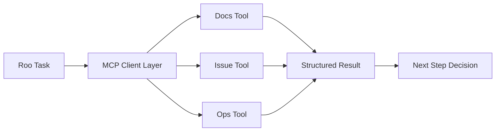

# Chapter 6: MCP and Tool Extensions

Roo Code becomes a platform interface when connected to external tools. This chapter defines a safe rollout model for MCP and custom tool extensions.

## Typical Integration Domains

- issue and incident systems
- internal docs and knowledge APIs
- deployment and CI systems
- cloud and observability controls

## MCP Integration Model

## Tool Contract Requirements

| Contract Area | Requirement |
|:--------------|:------------|
| inputs | strict schema and validation |
| outputs | deterministic structured response |
| side effects | explicit read-only vs mutating |
| errors | actionable machine-readable categories |
| runtime | timeout and retry bounds |

Loose tool contracts create unreliable agent behavior.

## Rollout Stages

1. start with read-only tools
2. verify output quality in real workflows
3. add mutating tools with explicit approvals
4. log all mutating calls
5. disable or remove noisy tools quickly

## Security Baseline

- least-privilege tokens per tool
- environment-separated credentials
- audit logs for mutating operations
- emergency disable switch for unstable tools

## Common Failure Patterns

- one tool doing too many unrelated actions
- vague or unstructured error responses
- implicit side effects not declared in contract
- retries with no maximum bound

## Readiness Checklist

- schema contracts are documented
- side effects are explicit
- auth scopes are minimal
- timeout/retry behavior is tested
- approval policy is aligned with risk level

## Chapter Summary

You now have a practical extension strategy for Roo Code:

- MCP-first integration model
- staged risk-based rollout
- secure credential and audit boundaries

Next: [Chapter 7: Profiles and Team Standards](07-profiles-and-team-standards.md)
